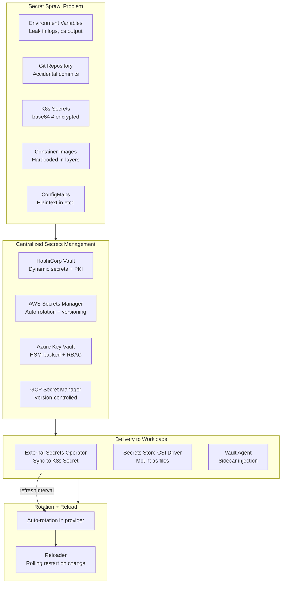
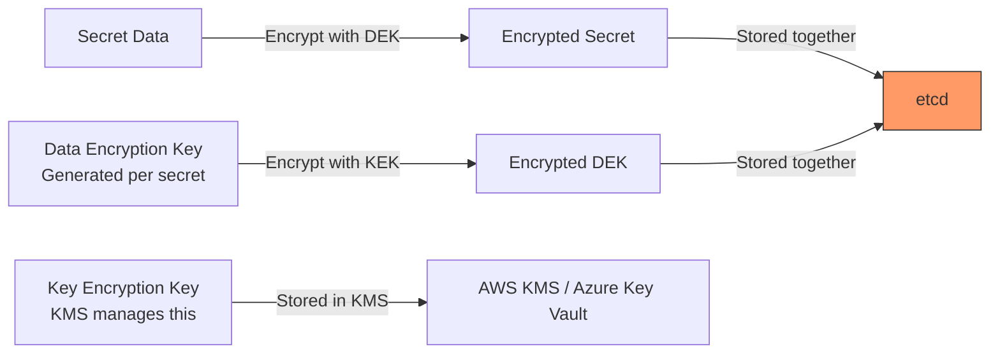
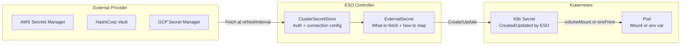
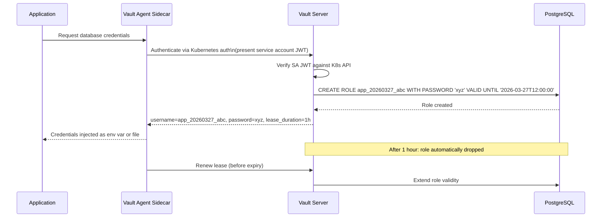
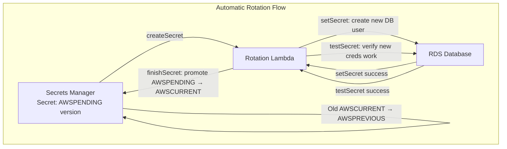
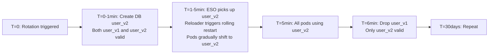

# Secrets Management

## Table of Contents

- [Overview](#overview)
- [The Secret Sprawl Problem](#the-secret-sprawl-problem)
  - [Kubernetes Secrets: base64 is NOT Encryption](#kubernetes-secrets-base64-is-not-encryption)
  - [Detecting Secret Sprawl](#detecting-secret-sprawl)
- [Kubernetes Secrets Encryption at Rest](#kubernetes-secrets-encryption-at-rest)
  - [EncryptionConfiguration](#encryptionconfiguration)
  - [KMS Provider: Envelope Encryption](#kms-provider-envelope-encryption)
- [External Secrets Operator (ESO)](#external-secrets-operator-eso)
- [HashiCorp Vault: Dynamic Secrets](#hashicorp-vault-dynamic-secrets)
- [AWS Secrets Manager: Automatic Rotation](#aws-secrets-manager-automatic-rotation)
- [CSI Driver: Mount Secrets as Files](#csi-driver-mount-secrets-as-files)
- [Secret Rotation Patterns](#secret-rotation-patterns)
  - [Pattern 1: Provider Rotation + ESO Refresh + Reloader](#pattern-1-provider-rotation-eso-refresh-reloader)
  - [Pattern 2: Dual Credentials (Zero-Downtime)](#pattern-2-dual-credentials-zero-downtime)
  - [Pattern 3: File Watcher (No Restart Required)](#pattern-3-file-watcher-no-restart-required)
- [GitOps + Secrets](#gitops-secrets)
- [Real-World Production Scenario](#real-world-production-scenario)
  - [Database Password Rotation Caused Outage: ESO + Reloader Solution](#database-password-rotation-caused-outage-eso-reloader-solution)
- [Failure Modes](#failure-modes)
- [Debugging Guide](#debugging-guide)
- [Security Considerations](#security-considerations)
- [Interview Questions](#interview-questions)
  - [Basic](#basic)
  - [Intermediate](#intermediate)
  - [Advanced / Staff Level](#advanced-staff-level)

---

## Overview

Secret sprawl is the uncontrolled proliferation of credentials across an organization's systems — hardcoded in source code, stored as plaintext environment variables, embedded in container images, and exposed as base64-encoded Kubernetes Secrets in etcd. The consequences: a single git repository breach exposes production database passwords, a misconfigured S3 bucket leaks API keys, an etcd backup contains every secret in the cluster. The solution is centralized secrets management with automated rotation, least-privilege access, and audit logging — implemented in a way that does not require application changes every time a credential rotates.



---

## The Secret Sprawl Problem

### Kubernetes Secrets: base64 is NOT Encryption

```bash
# "Creating a secret" in Kubernetes
kubectl create secret generic db-creds \
  --from-literal=password=supersecretpassword

# What's actually stored in etcd:
kubectl get secret db-creds -o yaml
# Output:
# data:
#   password: c3VwZXJzZWNyZXRwYXNzd29yZA==
# ^ This is base64("supersecretpassword") — decodable by anyone with etcd access

echo "c3VwZXJzZWNyZXRwYXNzd29yZA==" | base64 -d
# supersecretpassword
```

By default, Kubernetes Secrets are stored in etcd **unencrypted**. Anyone with etcd access (a compromised etcd backup, an overprivileged API server credential) can read all secrets in the cluster.

### Detecting Secret Sprawl

```bash
# Scan git history for secrets
git log --all --full-history -- "*.env" "*.yaml" "*.json"
gitleaks detect --source . --log-level warn

# Scan container image layers for embedded secrets
trivy image --scanners secret myapp:v1.2.3

# Find Kubernetes Secrets with weak values
kubectl get secrets -A -o json | \
  jq '.items[] | {name: .metadata.name, ns: .metadata.namespace, keys: (.data | keys)}'
```

---

## Kubernetes Secrets Encryption at Rest

### EncryptionConfiguration

Configure the API server to encrypt secrets in etcd before storage:

```yaml
# /etc/kubernetes/encryption/config.yaml
apiVersion: apiserver.config.k8s.io/v1
kind: EncryptionConfiguration
resources:
  - resources:
      - secrets
    providers:
      # Preferred: AES-GCM (authenticated encryption, 256-bit)
      - aescbc:
          keys:
            - name: key1
              secret: <base64-encoded-32-byte-key>
      # Fallback: identity (unencrypted, for decrypting legacy secrets during migration)
      - identity: {}
```

**Limitation:** The encryption key is stored on the API server node — etcd is protected, but node compromise still exposes the key. For production, use the **KMS provider**.

### KMS Provider: Envelope Encryption

```yaml
# EncryptionConfiguration with AWS KMS (via kms-plugin)
providers:
  - kms:
      name: aws-kms
      endpoint: unix:///var/run/kmsplugin/kms.sock
      cachesize: 1000
      timeout: 3s
  - identity: {}
```

**Envelope encryption mechanism:**


Even if etcd is compromised, decryption requires calling the KMS — which is controlled by IAM and has its own audit log.

---

## External Secrets Operator (ESO)

ESO synchronizes secrets from external providers into native Kubernetes Secrets, enabling GitOps-safe secret management.



**Complete AWS Secrets Manager setup:**
```yaml
# ClusterSecretStore: platform team creates once per cluster
apiVersion: external-secrets.io/v1beta1
kind: ClusterSecretStore
metadata:
  name: aws-secrets-manager
spec:
  provider:
    aws:
      service: SecretsManager
      region: us-east-1
      # IRSA: no static credentials. ESO controller pod has the IAM role annotation.
      # IAM role requires: secretsmanager:GetSecretValue, secretsmanager:DescribeSecret
---
# ExternalSecret: application team creates per namespace
apiVersion: external-secrets.io/v1beta1
kind: ExternalSecret
metadata:
  name: payments-db-secret
  namespace: payments
spec:
  refreshInterval: 30m          # Re-sync every 30 minutes
  secretStoreRef:
    name: aws-secrets-manager
    kind: ClusterSecretStore
  target:
    name: payments-db-creds     # K8s Secret name
    creationPolicy: Owner       # ESO owns and garbage-collects this Secret
    deletionPolicy: Retain      # Don't delete K8s Secret if ExternalSecret is deleted
    template:
      engineVersion: v2
      data:
        DATABASE_URL: "postgresql://{{ .username }}:{{ .password }}@{{ .host }}:5432/payments"
  data:
    - secretKey: username
      remoteRef:
        key: prod/payments/database
        property: username
    - secretKey: password
      remoteRef:
        key: prod/payments/database
        property: password
    - secretKey: host
      remoteRef:
        key: prod/payments/database
        property: host
```

**ESO provider comparison:**
| Provider | Dynamic Secrets | Auto-rotation | Best For |
|---|---|---|---|
| AWS Secrets Manager | No (static secrets) | Yes (Lambda-based) | AWS workloads, automatic rotation |
| HashiCorp Vault | Yes (database, PKI) | Yes (leases + renewal) | Complex secrets, dynamic credentials |
| GCP Secret Manager | No | Manual rotation | GCP workloads |
| Azure Key Vault | No (keys are dynamic) | Yes (certificates) | Azure workloads, HSM keys |

---

## HashiCorp Vault: Dynamic Secrets

Vault's killer feature: dynamic secrets. Instead of a static database password shared among all services, Vault generates a unique, time-limited credential per request.



**Vault Kubernetes auth setup:**
```bash
# Enable K8s auth in Vault
vault auth enable kubernetes
vault write auth/kubernetes/config \
  kubernetes_host="https://$K8S_HOST" \
  kubernetes_ca_cert=@/var/run/secrets/kubernetes.io/serviceaccount/ca.crt \
  token_reviewer_jwt=@/var/run/secrets/kubernetes.io/serviceaccount/token

# Create a role: map K8s SA to Vault policy
vault write auth/kubernetes/role/payments-api \
  bound_service_account_names=payments-sa \
  bound_service_account_namespaces=payments \
  policies=payments-db-policy \
  ttl=1h

# Policy: allow reading database credentials
vault policy write payments-db-policy - <<EOF
path "database/creds/payments-role" {
  capabilities = ["read"]
}
EOF
```

**Vault Agent Injector sidecar:**
```yaml
# Deployment annotation for Vault Agent injection
metadata:
  annotations:
    vault.hashicorp.com/agent-inject: "true"
    vault.hashicorp.com/role: "payments-api"
    vault.hashicorp.com/agent-inject-secret-db: "database/creds/payments-role"
    vault.hashicorp.com/agent-inject-template-db: |
      {{- with secret "database/creds/payments-role" -}}
      export DB_USERNAME="{{ .Data.username }}"
      export DB_PASSWORD="{{ .Data.password }}"
      {{- end }}
```

**PKI secrets engine (short-lived certs):**
```bash
# Generate a certificate for a service (5-minute TTL)
vault write pki/issue/payments-role \
  common_name="payments-api.payments.svc.cluster.local" \
  ttl=5m

# Application renews before expiry — no manual cert management
```

---

## AWS Secrets Manager: Automatic Rotation

AWS Secrets Manager supports automatic rotation for RDS, Redshift, DocumentDB, and custom Lambda-based rotation.



**RDS rotation configuration:**
```bash
aws secretsmanager create-secret \
  --name prod/payments/rds-password \
  --secret-string '{"username":"app","password":"initial-password","engine":"postgres","host":"db.cluster.local","port":5432,"dbname":"payments"}'

aws secretsmanager rotate-secret \
  --secret-id prod/payments/rds-password \
  --rotation-lambda-arn arn:aws:lambda:us-east-1:123456789012:function:SecretsManagerRotation \
  --rotation-rules AutomaticallyAfterDays=30
```

**Zero-downtime rotation pattern:** During rotation, both `AWSCURRENT` and `AWSPENDING` versions are valid. Applications reading with `VersionStage=AWSCURRENT` continue working. After `finishSecret`, the new credentials become `AWSCURRENT`. The old credentials (now `AWSPREVIOUS`) remain valid briefly for in-flight requests. This dual-credential window prevents rotation-induced outages.

---

## CSI Driver: Mount Secrets as Files

The Secrets Store CSI Driver mounts secrets directly from external providers as volumes, bypassing Kubernetes Secrets entirely.

```yaml
# SecretProviderClass: configure what to mount from AWS Secrets Manager
apiVersion: secrets-store.csi.x-k8s.io/v1
kind: SecretProviderClass
metadata:
  name: payments-secrets
  namespace: payments
spec:
  provider: aws
  parameters:
    objects: |
      - objectName: "prod/payments/database"
        objectType: "secretsmanager"
        jmesPath:
          - path: username
            objectAlias: db-username
          - path: password
            objectAlias: db-password
---
# Pod: mount secrets as files
spec:
  volumes:
    - name: secrets-store
      csi:
        driver: secrets-store.csi.k8s.io
        readOnly: true
        volumeAttributes:
          secretProviderClass: payments-secrets
  containers:
    - name: app
      volumeMounts:
        - name: secrets-store
          mountPath: /mnt/secrets
          readOnly: true
      # App reads: /mnt/secrets/db-username and /mnt/secrets/db-password
```

**CSI vs ESO vs Vault Agent:**
| Approach | K8s Secret Created | Dynamic Secrets | App Code Change |
|---|---|---|---|
| ESO (ExternalSecret) | Yes | No (static sync) | No |
| CSI Driver | Optional (sync to Secret) | No | Read from file |
| Vault Agent Injector | No (env var/file) | Yes (auto-renew) | Source the file |

---

## Secret Rotation Patterns

### Pattern 1: Provider Rotation + ESO Refresh + Reloader

The most operationally simple pattern for stateless applications:


```yaml
# Deployment with Reloader annotation
metadata:
  annotations:
    reloader.stakater.com/auto: "true"
    # OR specify exact secrets to watch:
    secret.reloader.stakater.com/reload: "payments-db-creds,payments-api-key"
```

**Weakness:** There is a window between rotation completion and pod restart where some pods use old credentials. If the old credentials are invalidated before all pods restart, you get a brief outage.

### Pattern 2: Dual Credentials (Zero-Downtime)

For databases that support it, maintain two valid credentials simultaneously:



### Pattern 3: File Watcher (No Restart Required)

For long-running processes (database connection pools), restart-on-rotation is disruptive. Use file-mounted secrets with a file watcher:

```go
// Application watches mounted secret file
import "github.com/fsnotify/fsnotify"

watcher, _ := fsnotify.NewWatcher()
watcher.Add("/mnt/secrets/db-password")

go func() {
    for event := range watcher.Events {
        if event.Op & fsnotify.Write == fsnotify.Write {
            newPassword := readFile("/mnt/secrets/db-password")
            db.UpdatePassword(newPassword)  // Reconnect pool with new password
        }
    }
}()
```

---

## GitOps + Secrets

| Approach | Mechanism | Pros | Cons |
|---|---|---|---|
| **Sealed Secrets** | Public key encrypts secret in Git; private key in cluster decrypts | Simple, self-contained | Key rotation is complex; no external dependency |
| **SOPS + KMS** | Secret file encrypted with KMS key; decrypted in CI/CD | Works with any Git workflow | Requires KMS access in CI |
| **ESO (recommended)** | ExternalSecret manifests in Git (no secret values) | Provider-agnostic; clean GitOps | Requires external provider |
| **Vault + VSO** | Vault Secrets Operator syncs from Vault to K8s | Full Vault capabilities | Operational complexity of running Vault |

**ESO is the recommended GitOps pattern:** ExternalSecret manifests are safe to commit — they contain only references (secret names, property paths), not values. The ESO controller resolves references to values at runtime using IRSA/Workload Identity.

---

## Real-World Production Scenario

### Database Password Rotation Caused Outage: ESO + Reloader Solution

**The incident:** AWS Secrets Manager automatically rotated the RDS password for the payments database. The rotation succeeded. The existing pods continued using the cached (now-invalid) old password. PostgreSQL rejected connections after the rotation completed. Duration: 4 minutes of `FATAL: password authentication failed` errors. Payment processing SLO violated.

**Root cause analysis:**
1. ESO `refreshInterval` was set to `24h` — the K8s Secret was not updated for up to 24 hours after rotation
2. Even if the K8s Secret had updated, no mechanism triggered a pod restart
3. The application used a connection pool initialized at startup — no runtime reconnection

**Fix:**

Step 1: Reduce ESO refreshInterval
```yaml
spec:
  refreshInterval: 5m   # Was 24h; now checks every 5 minutes
```

Step 2: Add Stakater Reloader
```bash
helm repo add stakater https://stakater.github.io/stakater-charts
helm install reloader stakater/reloader -n reloader --create-namespace
```

```yaml
# Add annotation to Deployment
metadata:
  annotations:
    reloader.stakater.com/auto: "true"
```

Step 3: Implement dual-credential rotation (prevent the 5-minute window)
```bash
# AWS rotation Lambda: modified to maintain dual validity
# 1. createSecret: generate new password
# 2. setSecret: create new DB user with new password (old user still valid)
# 3. Wait for ESO + Reloader to complete rolling restart (poll health endpoint)
# 4. finishSecret + drop old DB user

# In rotation Lambda:
def finish_secret(arn, token):
    # Promote AWSPENDING to AWSCURRENT
    client.update_secret_version_stage(...)

    # Wait for application to restart and use new credentials
    time.sleep(300)   # 5 minute window for rolling restart

    # Drop old database user
    conn = connect_with_new_creds()
    conn.execute("DROP USER old_db_user")
```

Step 4: Add alerting on ESO sync failures
```yaml
# PrometheusRule: alert if ESO fails to sync
- alert: ExternalSecretSyncFailure
  expr: externalsecret_status_condition{status="False"} > 0
  for: 5m
  labels:
    severity: critical
  annotations:
    summary: "ExternalSecret {{ $labels.name }} in {{ $labels.namespace }} is failing to sync"
```

**Outcome:** With 5-minute refresh + Reloader, the maximum exposure window is 5 minutes (ESO sync) + rolling restart time (~2 minutes for 3 replicas) = ~7 minutes after rotation, all pods have new credentials. Dual-credential rotation eliminates the outage entirely.

---

## Failure Modes

| Failure | Symptoms | Detection | Fix |
|---|---|---|---|
| `refreshInterval: 0` on ExternalSecret | Secrets never update after initial sync | Manual verification; ESO metric shows no sync after creation | Set non-zero refreshInterval (15m-1h typical) |
| ESO IRSA role missing permissions | `AccessDeniedException` in ESO logs; `SecretSyncedError` condition | `kubectl describe externalsecret`; ESO metric `externalsecret_sync_calls_error_total` | Add `secretsmanager:GetSecretValue` to IRSA role policy |
| AWS API rate limiting (ThrottlingException) | ESO sync failures across multiple ExternalSecrets simultaneously | ESO error logs; `ThrottlingException` appears | Use `dataFrom.extract` to batch-fetch multi-key secrets; increase refreshInterval |
| Rotation outage (single credential) | Application authentication failures for 2-5 minutes post-rotation | RDS connection refused metrics, error rate spike | Implement dual-credential rotation pattern |
| K8s Secrets in plaintext etcd | Etcd backup exposes all secrets | etcd encryption config check | Enable EncryptionConfiguration with KMS provider |
| Secret value cached in pod after rotation | Pods use stale credentials after K8s Secret updates | No automatic detection | Add Reloader; use file-mounted secrets with fsnotify |
| CreationPolicy: Orphan accumulation | K8s Secrets accumulate without owners | Manual namespace audit | Use `creationPolicy: Owner` so Secret lifecycle is tied to ExternalSecret |

---

## Debugging Guide

```bash
# Check ExternalSecret sync status
kubectl describe externalsecret payments-db-secret -n payments
# Look for: Conditions → Ready: True/False, Last Sync Time

# Check ESO controller logs for sync errors
kubectl logs -n external-secrets deploy/external-secrets --since=1h | grep -E "ERROR|WARN"

# Verify the K8s Secret was created and has expected keys
kubectl get secret payments-db-creds -n payments -o jsonpath='{.data}' | \
  jq 'to_entries[] | {key: .key, length: (.value | @base64d | length)}'

# Test AWS Secrets Manager access from ESO's service account
kubectl exec -n external-secrets deploy/external-secrets -- \
  aws secretsmanager get-secret-value --secret-id prod/payments/database

# Verify Reloader is watching the deployment
kubectl get deployment payments-api -n payments -o jsonpath='{.metadata.annotations}' | jq .

# Check if rotation is scheduled
aws secretsmanager describe-secret --secret-id prod/payments/database \
  | jq '{rotation: .RotationEnabled, next: .NextRotationDate, last: .LastRotatedDate}'
```

---

## Security Considerations

- **Kubernetes Secrets are only as secure as etcd.** Enable EncryptionConfiguration with a KMS provider. Restrict etcd access — only the API server should be able to connect to etcd. Encrypt etcd communication with TLS.
- **IRSA for ESO means ESO has direct AWS credentials access.** Scope the IRSA role to the minimum required secret paths. Use resource conditions in the IAM policy: `"Resource": "arn:aws:secretsmanager:us-east-1:123456789012:secret:prod/*"`.
- **Monitor ClusterSecretStore access.** A Kyverno policy can validate that ExternalSecrets only reference approved ClusterSecretStores and do not bypass to untrusted stores. This prevents a developer from creating an ExternalSecret that references a ClusterSecretStore they should not have access to.
- **Secret access audit trail is mandatory for compliance.** AWS Secrets Manager, Vault, and Azure Key Vault all log every `GetSecretValue` call. Forward these logs to your SIEM. Alert on unusual access patterns: high-volume reads, access from unexpected service accounts, access outside business hours.
- **Break-glass procedure.** What happens when the external secrets provider (AWS Secrets Manager, Vault) is unavailable during an incident? Define whether applications fail-open (use cached/stale credentials) or fail-closed (refuse to serve traffic). Document the manual credential injection procedure for genuine emergencies.

---

## Interview Questions

### Basic

**Q: Why is a Kubernetes Secret stored as base64 not considered encrypted?**
A: base64 is an encoding scheme, not encryption — it is trivially reversible with `echo "..." | base64 -d`. Anyone with read access to the Kubernetes API (via `kubectl get secret`), direct etcd access, or access to etcd backups can recover the original secret value. True encryption requires a cryptographic key — the data cannot be read without the key. Kubernetes does support true encryption at rest via EncryptionConfiguration, but it is not enabled by default.

**Q: What is the difference between ESO and Vault Agent Injector?**
A: ESO (External Secrets Operator) synchronizes secrets from external providers into native Kubernetes Secrets on a polling schedule (`refreshInterval`). Applications read the K8s Secret via environment variables or volume mounts — standard Kubernetes patterns. Vault Agent Injector injects a sidecar into the pod that authenticates to Vault, retrieves secrets, writes them to a shared volume (or sets env vars via an init container), and continuously renews leases for dynamic secrets. Vault Agent is more powerful (supports dynamic secrets with auto-renewal) but adds operational complexity. ESO is simpler and provider-agnostic.

**Q: What is envelope encryption and why does Kubernetes KMS provider use it?**
A: Envelope encryption uses two levels of keys: a Data Encryption Key (DEK) that encrypts the actual secret, and a Key Encryption Key (KEK) that encrypts the DEK. The KEK is managed by the KMS (AWS KMS, Azure Key Vault) and never leaves the KMS service. Only the encrypted DEK is stored alongside the encrypted data in etcd. Decryption requires calling the KMS to decrypt the DEK, then using the DEK to decrypt the data. This means etcd compromise alone does not expose secrets — you also need KMS access, which is controlled by IAM and has its own audit log.

### Intermediate

**Q: How would you implement zero-downtime secret rotation for a database password?**
A: Three components:

1. **Dual-credential rotation:** During rotation, create the new DB user first while keeping the old user valid. After all applications have switched to the new credentials, drop the old user. This eliminates any window where neither credential is valid.
2. **ESO with short refreshInterval (5m):** Picks up the new secret from AWS Secrets Manager quickly after rotation.
3. **Stakater Reloader:** Triggers a rolling restart of the Deployment when the K8s Secret changes — rolling restart ensures at most one pod is restarting at a time, maintaining availability. The sequence: rotate → both credentials valid → ESO picks up new secret → Reloader rolling restart → all pods using new credential → drop old credential. Total safe window: 5-10 minutes with no downtime.

**Q: A developer accidentally committed an AWS access key to a public GitHub repository. Walk through your response.**
A:

1. **Immediate containment (< 2 minutes):** Deactivate the access key in AWS IAM: `aws iam update-access-key --access-key-id $KEY_ID --status Inactive`. Do NOT delete immediately — you need it for forensics.
2. **Scope assessment:** Use CloudTrail to find all API calls made with that key from the git commit time onward. `aws cloudtrail lookup-events --lookup-attributes AttributeKey=AccessKeyId,AttributeValue=$KEY_ID`.
3. **Assess blast radius:** What permissions did this key have? Look at the IAM policies attached to the user/role.
4. **Forensic preservation:** Export all CloudTrail events for the key to immutable storage.
5. **Clean up:** Remove the access key from git history (`git filter-branch` or BFP Repo Cleaner). Force-push to GitHub. Enable git-secrets or truffleHog pre-commit hooks.
6. **Remediate:** Switch the workload to OIDC federation / IRSA — eliminate static credentials entirely.
7. **Prevent recurrence:** Add `trufflehog` to CI to block future credential commits. Add AWS `git-secrets` as pre-commit hook.

### Advanced / Staff Level

**Q: Design a secrets management architecture for a multi-region, multi-tenant SaaS platform on Kubernetes.**
A:

1. **Secret store:** AWS Secrets Manager with cross-region replication enabled for disaster recovery. Separate secret paths per tenant: `tenants/{tenant-id}/database`, `tenants/{tenant-id}/api-keys`.
2. **IAM architecture:** One IAM role per tenant workload using IRSA. Each role's resource policy scoped to `arn:aws:secretsmanager:*:*:secret:tenants/{tenant-id}/*` — cross-tenant access structurally impossible.
3. **K8s namespace isolation:** One namespace per tenant. ESO ClusterSecretStore with IRSA; ExternalSecrets per tenant namespace can only reference their tenant's secret path (enforced via Kyverno policy validating ExternalSecret remote key prefixes).
4. **Dynamic secrets for databases:** Each tenant's database connection uses Vault dynamic credentials rather than static passwords — unique per-pod credentials with 1-hour leases.
5. **Rotation:** AWS Secrets Manager auto-rotation + ESO 5-minute refresh + Reloader for static secrets. Vault handles rotation automatically for dynamic secrets.
6. **Audit:** All Secrets Manager and Vault access logs forwarded to CloudWatch Logs + S3 for long-term retention. Athena queries for per-tenant access audit. Alert on cross-tenant access attempts.
7. **DR:** In region failover scenario, Secrets Manager replicated copies are readable immediately. ESO ClusterSecretStore regional endpoint configuration switches to secondary region.
