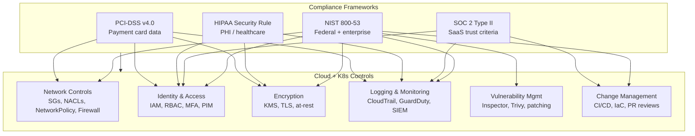
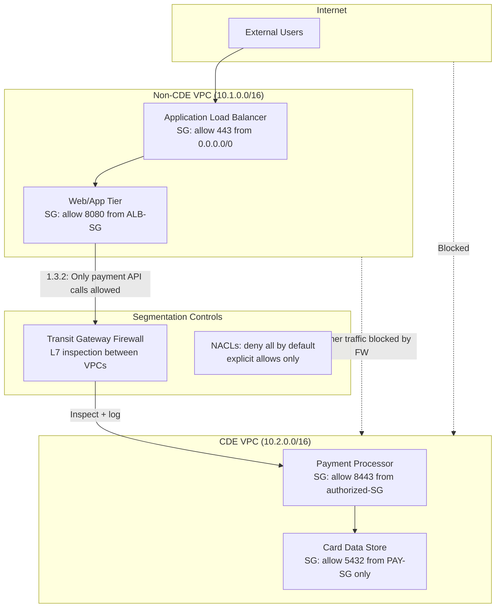
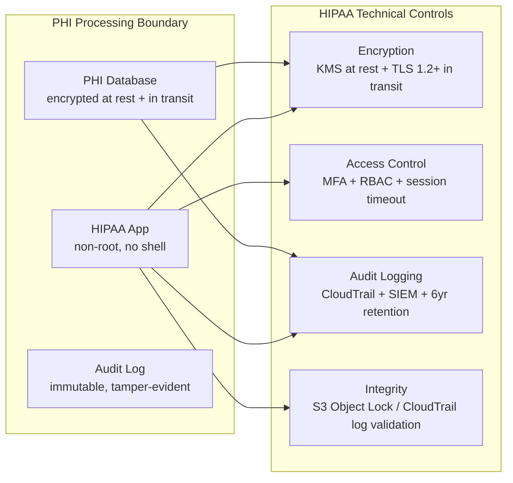
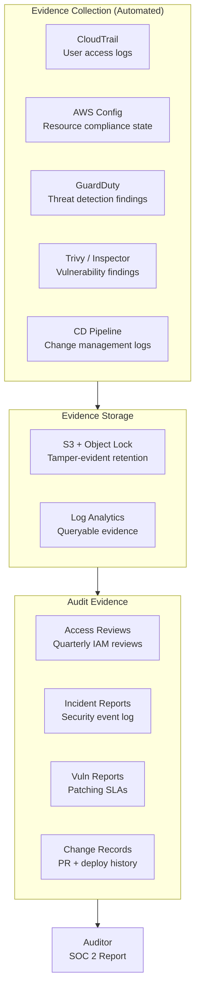

# Compliance Frameworks: PCI-DSS, HIPAA, SOC 2, NIST 800-53

## Overview

Compliance frameworks are not the same as security. Compliance is a snapshot of controls at a point in time; security is a continuous practice. But for senior SREs, frameworks matter operationally: they define which controls must be implemented, how they must be documented, and what evidence must be collected for audits. The critical skill is mapping abstract framework requirements to specific cloud and Kubernetes controls — understanding that PCI-DSS Requirement 1 (network segmentation) translates to Security Groups + NetworkPolicy + NACLs in practice, and that a QSA audit finding on "inadequate segmentation between CDE and non-CDE" is a specific, fixable infrastructure problem.



---

## PCI-DSS v4.0

Payment Card Industry Data Security Standard applies to any organization that processes, stores, or transmits cardholder data (CHD) — primary account numbers (PAN), cardholder names, expiration dates. PCI-DSS v4.0 (effective March 2024) introduced significant changes including expanded multi-factor authentication requirements and a new customized approach for achieving requirements.

### 12 Requirements Summary

| Req | Category | Focus |
|---|---|---|
| 1 | Network Security | Install and maintain network security controls |
| 2 | Secure Configurations | Apply secure configurations to all system components |
| 3 | Protect Stored CHD | Encryption, masking, and storage minimization |
| 4 | Protect Transmission | Strong cryptography in transit (TLS 1.2+) |
| 5 | Protect Against Malware | Malware protection on all applicable systems |
| 6 | Secure Software | Secure development practices + vulnerability management |
| 7 | Restrict Access | Need-to-know basis: least privilege |
| 8 | Identify Users | User authentication and access management |
| 9 | Physical Security | Restrict physical access to CHD |
| 10 | Log and Monitor | Maintain and review activity logs |
| 11 | Test Security | Regular testing of controls |
| 12 | Organizational Policy | Information security policy and risk management |

### Requirement 1: Network Security Controls

The most technically involved requirement for infrastructure engineers.

**Requirement 1.2.1:** All traffic flows to and from the CDE are identified and documented.

**Requirement 1.3.1:** Inbound traffic to the CDE is restricted to only that which is necessary.

**Requirement 1.3.2:** Outbound traffic from the CDE is restricted to only that which is necessary.

**Cloud implementation:**



**Kubernetes network segmentation for PCI:**
```yaml
# CDE namespace isolation
apiVersion: networking.k8s.io/v1
kind: NetworkPolicy
metadata:
  name: cde-isolation
  namespace: card-processing
spec:
  podSelector: {}
  policyTypes: [Ingress, Egress]
  ingress:
    - from:
        - namespaceSelector:
            matchLabels:
              pci-cde-authorized: "true"  # Only labeled namespaces
      ports:
        - port: 8443
          protocol: TCP
  egress:
    - to:
        - namespaceSelector:
            matchLabels:
              pci-cde-authorized: "true"
    - to:  # DNS resolution only
        - namespaceSelector:
            matchLabels:
              kubernetes.io/metadata.name: kube-system
      ports:
        - port: 53
          protocol: UDP
```

### Requirement 4: Encryption in Transit

TLS 1.2 minimum, TLS 1.3 strongly recommended. PCI-DSS v4.0 requires an inventory of all trusted certificates and certificate management processes.

```bash
# Verify TLS version on payment endpoint
openssl s_client -connect payment-api.mycompany.com:443 -tls1_1 2>&1 | grep "Secure Renegotiation"
# Expected: "no peer certificate available" or handshake failure for TLS 1.1

# Verify cipher suite strength
nmap --script ssl-enum-ciphers -p 443 payment-api.mycompany.com | grep -E "TLSv1\.[0-1]"
# Should return empty — no TLS 1.0 or 1.1 ciphers

# Certificate transparency check
curl -s "https://crt.sh/?q=payment-api.mycompany.com&output=json" | \
  jq '.[] | {cn: .common_name, issuer: .issuer_name, expiry: .not_after}'
```

### Requirement 7: Least Privilege

```bash
# AWS: Review IAM roles for PCI systems — find overly broad permissions
aws iam simulate-principal-policy \
  --policy-source-arn arn:aws:iam::123456789012:role/CardProcessorRole \
  --action-names "s3:*" "ec2:*" "iam:*" \
  --resource-arns "*" \
  | jq '.EvaluationResults[] | select(.EvalDecision == "allowed") | .EvalActionName'
```

### Requirement 10: Logging and Monitoring

PCI-DSS v4.0 requires:
- Logs for all system components in the CDE
- Minimum log elements: user, event type, date/time, success/failure, origin, identity of affected data
- Log review daily (automated) with manual escalation
- Log retention: 12 months; 3 months immediately available

### Requirement 11: Penetration Testing

PCI-DSS v4.0 requires annual penetration tests and network segmentation tests:
- Internal pen test: test the CDE from inside the network
- External pen test: test the CDE from outside the network perimeter
- Segmentation test: verify the CDE is isolated from non-CDE systems
- Application layer pen test: test web apps and APIs in the CDE

---

## HIPAA Security Rule

HIPAA Security Rule applies to Covered Entities (healthcare providers, health plans) and Business Associates (cloud providers, SaaS vendors processing PHI). It applies to electronic Protected Health Information (ePHI).

### Three Safeguard Categories

**Administrative Safeguards:**
- **Risk Analysis (Required):** Thorough, accurate assessment of potential risks and vulnerabilities to ePHI
- **Risk Management (Required):** Implement security measures to reduce identified risks
- **Workforce Training (Required):** Security awareness training for all workforce members
- **Access Management (Required):** Implement procedures to authorize access to ePHI

**Physical Safeguards:**
- **Facility Access Controls (Required):** Limit physical access to systems that contain ePHI
- **Workstation Security (Required):** Specify proper use and protection of workstations
- **Device and Media Controls (Required):** Disposal and re-use of electronic media containing ePHI

**Technical Safeguards:**
- **Access Control (Required):** Unique user IDs, emergency access procedure, automatic logoff
- **Audit Controls (Required):** Hardware, software, procedural mechanisms to record activity in systems containing ePHI
- **Integrity Controls (Addressable):** Mechanisms to authenticate ePHI has not been altered or destroyed
- **Transmission Security (Required):** Guard against unauthorized access during ePHI transmission

### HIPAA Cloud Implementation Pattern



**AWS HIPAA-eligible services** (require BAA with AWS):
- EC2, ECS, EKS, Lambda, RDS, S3, CloudWatch, CloudTrail, KMS, Secrets Manager, and 150+ others

---

## SOC 2 Type II: Trust Service Criteria

SOC 2 Type II is an audit report that evaluates whether controls are *operating effectively* over a defined period (typically 6-12 months). Type I evaluates design; Type II evaluates operation over time. SaaS companies pursuing SOC 2 need to demonstrate continuous monitoring, not point-in-time compliance.

### Five Trust Service Criteria

| Category | Code | Focus |
|---|---|---|
| Security | CC6-CC9 | The system is protected against unauthorized access |
| Availability | A1 | System is available for operation as committed |
| Confidentiality | C1 | Information designated as confidential is protected |
| Processing Integrity | PI1 | Processing is complete, valid, accurate |
| Privacy | P1-P8 | Personal information is collected and used appropriately |

**Security is mandatory.** The others are optional depending on your service commitments.

### Critical CC Controls for SREs

**CC6: Logical and Physical Access Controls**
- CC6.1: Logical access security — user authentication, MFA, role-based access
- CC6.2: New access provisioning — formal access request and approval
- CC6.3: Access removal — timely deprovisioning when roles change
- CC6.6: Logical access security at network boundaries — firewalls, network segmentation
- CC6.7: Transmission of confidential information — encryption in transit
- CC6.8: Malicious software — malware protection, vulnerability scanning

**CC7: System Operations**
- CC7.1: Vulnerability and threat detection
- CC7.2: Monitoring for anomalous behavior
- CC7.3: Evaluation of security events
- CC7.4: Incident response and recovery procedures
- CC7.5: Disclosure of breaches

**CC8: Change Management**
- CC8.1: Infrastructure changes are authorized, tested, and documented
- Code review requirements, CI/CD controls, change tickets

**CC9: Risk Management**
- CC9.1: Risk assessment identifying threats to meeting service commitments
- CC9.2: Monitoring for compliance with commitments and third-party risks

### SOC 2 Continuous Monitoring Implementation



**Key SOC 2 evidence requirements for SREs:**
- Quarterly access reviews (who has access to what) — automated via IAM Access Analyzer reports
- Patch management evidence — vulnerability scan results + patch deployment timestamps
- Incident log — every security alert, when it fired, how it was resolved
- Change management — PR approvals, deployment records, rollback capability evidence
- Penetration test results — annual third-party pen test report

---

## NIST 800-53: Control Families

NIST SP 800-53 Rev 5 provides a comprehensive catalog of security and privacy controls for federal information systems. It is increasingly used as the baseline for enterprise security programs beyond the federal government.

### Key Control Families for SREs

| Family | ID | Controls |
|---|---|---|
| Access Control | AC | AC-2 (Account Mgmt), AC-3 (Access Enforcement), AC-6 (Least Privilege), AC-17 (Remote Access) |
| Audit and Accountability | AU | AU-2 (Event Logging), AU-3 (Content of Audit Records), AU-6 (Review), AU-9 (Protection of Records) |
| Configuration Management | CM | CM-2 (Baseline Config), CM-6 (Config Settings), CM-7 (Least Functionality), CM-8 (Component Inventory) |
| Identification & Authentication | IA | IA-2 (User Identification), IA-5 (Authenticator Mgmt), IA-8 (Non-organizational Users) |
| System Comms Protection | SC | SC-7 (Boundary Protection), SC-8 (Transmission Conf+Int), SC-12 (Crypto Key Management) |
| System Integrity | SI | SI-2 (Flaw Remediation), SI-3 (Malicious Code), SI-4 (System Monitoring) |
| Incident Response | IR | IR-4 (Incident Handling), IR-5 (Incident Monitoring), IR-6 (Reporting) |
| Risk Assessment | RA | RA-3 (Risk Assessment), RA-5 (Vulnerability Monitoring), RA-7 (Risk Response) |

**Impact levels:** NIST 800-53 controls are tailored to Low, Moderate, or High impact systems. SaaS handling sensitive data typically requires Moderate baseline; systems handling classified or sensitive PII require High.

---

## Compliance Control Mapping: Framework to Cloud/K8s

| Requirement | PCI-DSS | HIPAA | SOC 2 | NIST 800-53 | AWS Control | K8s Control |
|---|---|---|---|---|---|---|
| Network segmentation | Req 1.3 | Physical Safeguard | CC6.6 | SC-7 | Security Groups + NACLs + Transit GW | NetworkPolicy default-deny |
| Encryption in transit | Req 4.2.1 | Trans Security | CC6.7 | SC-8 | TLS on ALB/NLB, VPC endpoints | Istio mTLS, cert-manager |
| Encryption at rest | Req 3.5 | Technical Safeguard | CC6.1 | SC-28 | S3 SSE-KMS, RDS encryption, EBS KMS | etcd EncryptionConfig |
| Least privilege | Req 7.2 | Access Control | CC6.3 | AC-6 | IAM least privilege, IRSA | RBAC, PSA Restricted |
| Access logging | Req 10.2 | Audit Controls | CC6.1, CC7.2 | AU-2, AU-3 | CloudTrail, VPC Flow Logs | K8s Audit Logs |
| MFA | Req 8.4 | Admin Safeguard | CC6.1 | IA-2 | AWS IAM MFA, SSO | OIDC federation, PIM |
| Vulnerability scanning | Req 6.3 | Risk Analysis | CC7.1 | RA-5, SI-2 | Inspector, ECR scanning | Trivy Operator |
| Malware protection | Req 5.2 | Technical Safeguard | CC6.8 | SI-3 | GuardDuty, Macie | Falco, Tetragon |
| Change management | Req 6.5 | Config Mgmt | CC8.1 | CM-3 | CloudTrail + Config Rules | GitOps, PR reviews |
| Incident response | Req 12.10 | Admin Safeguard | CC7.4 | IR-4 | GuardDuty + EventBridge | Falco + automated response |
| Penetration testing | Req 11.3 | Risk Mgmt | CC4.1 | CA-8 | AWS pen test policy | kube-bench, kube-hunter |

---

## Compliance Automation

### AWS Config Rules for PCI-DSS

```bash
# Enable PCI DSS Conformance Pack
aws configservice put-conformance-pack \
  --conformance-pack-name PCI-DSS-Conformance-Pack \
  --template-s3-uri s3://aws-conformance-packs-us-east-1/Operational-Best-Practices-for-PCI-DSS.yaml

# Key rules included:
# - restricted-ssh: no SG allows 22 from 0.0.0.0/0
# - vpc-flow-logs-enabled: all VPCs have flow logs
# - cloud-trail-enabled: CloudTrail multi-region active
# - s3-bucket-server-side-encryption-enabled
# - rds-storage-encrypted
# - iam-root-access-key-check
# - mfa-enabled-for-iam-console-access
```

### Azure Policy Initiative for HIPAA

```bash
# Apply HIPAA/HITRUST initiative to subscription
az policy assignment create \
  --name hipaa-hitrust-initiative \
  --scope /subscriptions/$SUBSCRIPTION_ID \
  --policy-set-definition /providers/Microsoft.Authorization/policySetDefinitions/a169a624-5599-4385-a696-c8d643089fab \
  --enforce DoNotEnforce   # Start in audit mode

# Check compliance state
az policy state summarize \
  --policy-assignment hipaa-hitrust-initiative \
  | jq '.value[] | {resource: .resourceId, compliant: .complianceState}'
```

### OPA Policies for K8s Compliance (PCI)

```rego
# PCI DSS Req 7: Enforce least privilege — no ClusterAdmin bindings except platform team
package pci.req7.clusterroles

import rego.v1

violation[{"msg": msg}] {
  input.review.object.kind == "ClusterRoleBinding"
  input.review.object.roleRef.name == "cluster-admin"
  subject := input.review.object.subjects[_]
  not is_platform_team(subject)
  msg := sprintf("ClusterRoleBinding to cluster-admin for non-platform subject: %v", [subject.name])
}

is_platform_team(subject) {
  subject.kind == "ServiceAccount"
  subject.namespace == "platform-system"
}

is_platform_team(subject) {
  subject.kind == "Group"
  subject.name == "platform-team"
}
```

### Automated Evidence Collection

```python
# collect_compliance_evidence.py — runs weekly, generates audit evidence package
import boto3
import json
from datetime import datetime, timedelta

def collect_pci_evidence():
    evidence = {}

    # Req 10: CloudTrail log coverage
    ct = boto3.client('cloudtrail')
    trails = ct.describe_trails(includeShadowTrails=False)
    evidence['cloudtrail'] = {
        trail['Name']: ct.get_trail_status(Name=trail['Name'])
        for trail in trails['trailList']
    }

    # Req 7: IAM Access Analyzer findings (public/external access)
    aa = boto3.client('accessanalyzer')
    findings = aa.list_findings(analyzerArn=get_analyzer_arn())
    evidence['external_access_findings'] = findings['findings']

    # Req 6: Vulnerability scan results (Inspector)
    insp = boto3.client('inspector2')
    critical_findings = insp.list_findings(
        filterCriteria={
            'severity': [{'comparison': 'EQUALS', 'value': 'CRITICAL'}],
            'findingStatus': [{'comparison': 'EQUALS', 'value': 'ACTIVE'}]
        }
    )
    evidence['critical_vulnerabilities'] = critical_findings['findings']

    # Req 1: Security Group compliance (Config)
    cfg = boto3.client('config')
    non_compliant = cfg.get_compliance_details_by_config_rule(
        ConfigRuleName='restricted-ssh',
        ComplianceTypes=['NON_COMPLIANT']
    )
    evidence['sg_compliance'] = non_compliant['EvaluationResults']

    # Export to S3 with object lock (tamper-evident)
    s3 = boto3.client('s3')
    s3.put_object(
        Bucket='compliance-evidence-bucket',
        Key=f'pci-evidence/{datetime.now().isoformat()}.json',
        Body=json.dumps(evidence, default=str),
        ObjectLockMode='COMPLIANCE',
        ObjectLockRetainUntilDate=datetime.now() + timedelta(days=365)
    )
```

---

## Penetration Testing in Cloud

### AWS Penetration Testing Policy

AWS permits customers to conduct security testing on their own AWS infrastructure without prior approval for a defined list of services:
- EC2, RDS, Aurora, CloudFront, API Gateway, Lambda, Lightsail, Elastic Beanstalk, ELB

**Pre-approval required for:**
- DNS zone walking (Route 53)
- DoS/DDoS simulations
- Port flooding, protocol flooding
- Any testing of AWS-owned infrastructure

**Evidence requirements for QSA:**
- Third-party pen test reports (cannot be first-party for PCI compliance)
- Scope documentation showing CDE boundary
- Methodology documentation
- Finding remediation evidence

### PCI Segmentation Test

PCI requires annual tests verifying the CDE is isolated from non-CDE systems:

```bash
# Segmentation test: can non-CDE systems reach CDE?
# From non-CDE application server (10.1.0.50):
for port in 5432 3306 6379 8443 22 3389; do
  result=$(nc -zv -w3 10.2.0.100 $port 2>&1)
  echo "Port $port: $result"
done
# All should show "Connection refused" or timeout

# Verify from CDE that only authorized egress is possible
# From CDE payment processor (10.2.0.100):
curl -s --connect-timeout 3 http://10.1.0.50:8080  # Non-CDE web server — should fail
curl -s --connect-timeout 3 http://payment-gateway.external.com:443  # External — should work
curl -s --connect-timeout 3 http://169.254.169.254/latest/meta-data/  # Metadata — should fail (IMDSv2)
```

---

## Real-World Production Scenario

### PCI-DSS QSA Audit Finding: Firewall Segmentation Gap Between CDE and Non-CDE

**Finding from QSA:** "The cardholder data environment shares a Security Group rule permitting all TCP traffic (port 0-65535) from the internal VPC CIDR (10.0.0.0/8). This fails Requirement 1.3.2 (outbound traffic from CDE restricted to only what is necessary) and Requirement 1.3.1 (inbound traffic to CDE restricted to only what is necessary). Any compromised workload in the non-CDE VPC can reach any port on any CDE resource."

**Root cause:** A developer added an overly broad Security Group rule 18 months ago to "temporarily" fix a connectivity issue. It was never reviewed. AWS Config had no rule monitoring for this pattern in the CDE VPC.

**Immediate containment (before QSA follow-up):**

Step 1: Map actual traffic flows
```bash
# Query VPC Flow Logs (Athena) for actual traffic to CDE in last 30 days
SELECT srcaddr, dstport, COUNT(*) as connections
FROM vpc_flow_logs
WHERE dstaddr LIKE '10.2.%'  -- CDE subnet
  AND action = 'ACCEPT'
  AND start > TO_UNIXTIME(current_timestamp - interval '30' day)
GROUP BY srcaddr, dstport
ORDER BY connections DESC
```

Step 2: Replace broad rule with explicit allowlist
```bash
# Remove the overly broad rule
BROAD_RULE_ID=$(aws ec2 describe-security-groups --group-ids $CDE_SG_ID \
  | jq -r '.SecurityGroups[0].IpPermissions[] | select(.IpRanges[0].CidrIp == "10.0.0.0/8") | .FromPort')

aws ec2 revoke-security-group-ingress \
  --group-id $CDE_SG_ID \
  --protocol tcp --port 0-65535 \
  --cidr 10.0.0.0/8

# Add only required connections (from VPC Flow Log analysis)
aws ec2 authorize-security-group-ingress \
  --group-id $CDE_SG_ID \
  --protocol tcp --port 8443 \
  --source-group $PAYMENT_PROXY_SG_ID  # Only payment proxy SG

aws ec2 authorize-security-group-ingress \
  --group-id $CDE_SG_ID \
  --protocol tcp --port 5432 \
  --source-group $CDE_APP_SG_ID  # Only CDE app servers
```

Step 3: Implement preventive control (Config rule + automatic remediation)
```bash
# Custom Config rule: alert if CDE SG allows broad inbound from internal CIDR
aws configservice put-config-rule \
  --config-rule '{
    "ConfigRuleName": "cde-sg-no-broad-internal",
    "Source": {
      "Owner": "CUSTOM_LAMBDA",
      "SourceIdentifier": "arn:aws:lambda:us-east-1:123456789012:function:check-cde-sg",
      "SourceDetails": [{
        "EventSource": "aws.config",
        "MessageType": "ConfigurationItemChangeNotification"
      }]
    },
    "Scope": {
      "ComplianceResourceTypes": ["AWS::EC2::SecurityGroup"],
      "TagFilters": [{"Key": "pci-cde", "Value": "true"}]
    }
  }'
```

Step 4: Evidence package for QSA
- Before screenshot: Security Group rules showing broad /8 rule
- After screenshot: Security Group rules showing minimal allow rules
- VPC Flow Log analysis showing no legitimate traffic was using the broad rule
- AWS Config compliance timeline showing remediation date
- Change management ticket with approval workflow

---

## Failure Modes

| Failure | Symptoms | Detection | Fix |
|---|---|---|---|
| PCI scope creep (systems touch CHD but not in CDE) | QSA expands audit scope unexpectedly; more systems require PCI controls | Annual scope review with network diagram | Strict data flow documentation; minimize CHD touching systems via tokenization |
| Logging gaps in CDE | QSA finds missing audit logs for Req 10 | Config rule for CloudTrail coverage; manual log review | Enable CloudTrail data events + flow logs on all CDE resources |
| MFA not enforced on CDE access | QSA finding on Req 8.4; potential attack vector | Monthly IAM credential report review | Enforce MFA via IAM policy condition `"aws:MultiFactorAuthPresent": "true"` |
| Stale SOC 2 evidence | Auditor cannot verify controls were operating for entire audit period | Automated evidence collection gaps; manual evidence requests | Continuous automated evidence collection to immutable S3 |
| HIPAA BAA missing for cloud service | PHI stored/processed by service without signed BAA = HIPAA violation | Service inventory audit vs BAA list | Maintain BAA inventory; require BAA before adding any new cloud service |
| Penetration test remediation gaps | Critical findings from pen test not remediated before next test | QSA review of remediation evidence | SLA for pen test finding remediation: Critical 7 days, High 30 days |

---

## Debugging Guide

```bash
# Check PCI compliance status in AWS Security Hub
aws securityhub get-standards-control-associations \
  --standards-subscription-arn arn:aws:securityhub:us-east-1:123456789012:subscription/pci-dss/v/3.2.1 \
  | jq '.StandardsControlAssociationSummaries[] | select(.AssociationStatus == "DISABLED") | .SecurityControlId'

# Find all non-compliant Config rules
aws configservice describe-compliance-by-config-rule \
  --compliance-types NON_COMPLIANT \
  | jq '.ComplianceByConfigRules[] | .ConfigRuleName'

# Verify CloudTrail is logging all CDE API events
aws cloudtrail lookup-events \
  --start-time "$(date -d '1 hour ago' --iso-8601=seconds)" \
  --lookup-attributes AttributeKey=ResourceType,AttributeValue=AWS::EC2::Instance \
  | jq '.Events | length'

# Check TLS version compliance on payment API
testssl.sh --protocols --cipher --severity HIGH \
  --json payment-api.mycompany.com:443 | \
  jq '.scanResult[].findings[] | select(.severity == "HIGH" or .severity == "CRITICAL")'

# Verify K8s RBAC for PCI compliance (no cluster-admin in CDE namespace)
kubectl get clusterrolebindings -o json | \
  jq '.items[] | select(.roleRef.name == "cluster-admin") | {name: .metadata.name, subjects: .subjects}'
```

---

## Security Considerations

- **Compliance is not security; security enables compliance.** A system can be compliant but insecure (all checkboxes ticked, but controls are ineffective). Conversely, a well-secured system usually satisfies compliance requirements naturally. Design for security first; compliance documentation follows.
- **Scope minimization is the highest-value PCI strategy.** Every system that touches cardholder data must meet all 12 requirements. Tokenization (replacing PAN with a non-sensitive token at ingestion) can reduce the number of in-scope systems from dozens to a handful. This reduces compliance cost by 10x and attack surface proportionally.
- **SOC 2 Type II requires continuity of controls.** A control that existed on the last day of the audit period but failed for 9 of the 12 months is a finding. Implement continuous monitoring and alerting for every control — treat a compliance control outage as an incident.
- **HIPAA breach notification has tight SLAs.** Discovered breaches must be reported to HHS within 60 days, and to affected individuals if > 500 in a state. HIPAA does not have a "we didn't know" defense — the risk analysis obligation means you are expected to have identified and addressed risks proactively.
- **Evidence is the product.** For auditors, controls that exist without evidence do not exist. Every compliance control must produce auditable, tamper-evident evidence automatically. Manual evidence collection is unreliable and expensive.

---

## Interview Questions

### Basic

**Q: What is the Cardholder Data Environment (CDE) in PCI-DSS and why does scope matter?**
A: The CDE is the set of people, processes, and technology that store, process, or transmit cardholder data — primary account numbers (PAN), cardholder names, expiration dates, and service codes. Every system in the CDE must comply with all 12 PCI-DSS requirements. Scope matters because more systems in scope = more compliance work + more audit cost + more risk. The primary strategy to reduce scope is tokenization: replace PAN with a token at the point of ingestion (before it enters your systems) so only the tokenization service touches actual card numbers. All other systems see only the token — they are out of scope.

**Q: What is the difference between SOC 2 Type I and Type II?**
A: SOC 2 Type I evaluates whether controls are *suitably designed* at a single point in time — "were the right controls in place on audit date?" Type II evaluates whether controls *operated effectively* over a defined period (typically 6-12 months) — "did the controls actually work consistently during this period?" Type I is faster (a few months) and cheaper but provides less assurance. Type II is the gold standard that enterprise customers and partners require, as it demonstrates sustained security operations rather than a point-in-time snapshot.

**Q: What are HIPAA's required vs addressable safeguards?**
A: Required safeguards must be implemented — there is no flexibility. Addressable safeguards must be assessed: implement them if reasonable and appropriate; if not implementing, document why and implement an equivalent alternative. Examples of required: access controls (unique user IDs), audit logs, transmission security. Addressable: automatic logoff (must be implemented or document why equivalent controls suffice), encryption at rest (addressable — but in practice, regulators and post-breach investigations will scrutinize a decision not to encrypt). For cloud deployments, encryption at rest should be treated as required.

### Intermediate

**Q: A QSA finds that your Kubernetes cluster does not have proper network segmentation for the CDE. How do you remediate?**
A: Three layers: (1) **K8s NetworkPolicy:** Deploy default-deny NetworkPolicy to the CDE namespace (card-processing) — deny all ingress and egress. Then add explicit allow rules for only required flows: payment proxy → card processor on port 8443, card processor → database on port 5432, all pods → kube-dns on UDP 53. (2) **Cloud network layer:** Ensure Kubernetes nodes running CDE workloads are in CDE VPC subnets. Security Groups on those subnets should mirror the NetworkPolicy rules at the VPC level (defense-in-depth). (3) **Namespace isolation:** Label the CDE namespace appropriately and use Kyverno to enforce that no CDE namespace pod mounts host paths, uses hostNetwork, or runs privileged. Evidence for QSA: NetworkPolicy YAML + kubectl describe showing effective rules + VPC Flow Log analysis showing no unauthorized cross-network flows.

**Q: How would you automate SOC 2 evidence collection for CC7.2 (monitoring for anomalous behavior)?**
A: CC7.2 requires evidence that you detect and respond to anomalous behavior. Automated evidence: (1) **Detection tools:** GuardDuty, CloudWatch anomaly detection alarms, and Falco are active and producing findings — export alert summaries weekly to immutable S3. (2) **Alert suppression log:** Every suppressed/resolved alert documented with: alert ID, type, suppression reason, who resolved it. Stored in audit-immutable S3 (Object Lock). (3) **MTTR tracking:** Measure mean time to respond for each alert type — evidence that alerts are actioned, not ignored. (4) **Coverage report:** Which services are monitored? Gaps in coverage are themselves a finding risk. Generate a weekly report mapping all production resources to their monitoring coverage. (5) **Access anomaly evidence:** SIEM queries showing impossible travel alerts, off-hours access detections, and their resolutions — exported to audit store weekly.

### Advanced / Staff Level

**Q: Design a compliance-as-code pipeline that continuously enforces PCI-DSS Requirement 1 in a multi-account AWS organization.**
A: (1) **Detection layer:** AWS Config with Organization-level conformance pack deploying `restricted-ssh`, `vpc-flow-logs-enabled`, `cde-sg-broad-rule-check` (custom Lambda rule), and `nacl-cde-permissive-check` rules to all accounts. Config aggregator in the management account gives organization-wide visibility. (2) **Prevention layer:** Service Control Policies preventing any user from disabling Config, disabling GuardDuty, or creating broad SG rules in CDE-tagged accounts: `"Condition": {"StringEquals": {"aws:RequestedRegion": "us-east-1"}, "StringLike": {"ec2:CreateSecurityGroup": "cde-*"}}`. (3) **Automated remediation:** EventBridge rule triggers when Config marks a CDE SG as NON_COMPLIANT. SSM Automation document analyzes the violating rule, removes it if it matches known-bad patterns (broad /8 inbound), and creates a ServiceNow ticket for human review of edge cases. (4) **Evidence collection:** Lambda runs weekly, exports Config compliance reports, VPC Flow Log summaries, and SG configuration snapshots to S3 with Object Lock (COMPLIANCE mode, 395-day retention for PCI). (5) **Continuous testing:** Monthly automated segmentation test: from EC2 in non-CDE subnet, attempt connections to all CDE resources on all ports, verify all connections are rejected. Results stored as compliance evidence.
