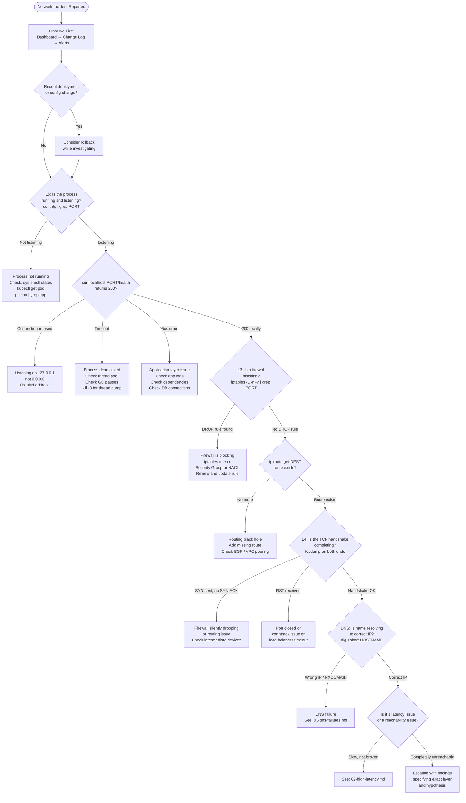

# 00: Debugging Methodology — The Senior SRE Framework

## When to Use This Document

Use this before starting any network incident. This is the meta-playbook: the mental framework that all other playbooks in this directory apply. If you are randomly running commands, stop and read this first.

---

## The 5-Layer Diagnostic Model

The fundamental principle: **an issue at layer N presents symptoms at every layer above N**. A silently-dropping firewall rule (L3) causes TCP timeouts (L4) which cause HTTP 503s (L5). If you start debugging at L5, you will waste time reading application logs when the problem is three layers below.

```text
Layer 5: Application
  What: HTTP response codes, gRPC status, application error logs, business logic
  Tools: curl -v, grpc_cli, strace -e network, application metrics
  Signal: 4xx/5xx responses, connection reset by peer, EOF unexpectedly

Layer 4: Transport
  What: TCP handshake completion, retransmissions, RSTs, connection state
  Tools: ss -ti, nstat -az, tcpdump 'tcp[tcpflags]', netstat -s
  Signal: SYN retransmits, high RTT variance, RST packets, zero-window

Layer 3: Network
  What: IP routing, firewall rules, MTU, NAT, ICMP unreachables
  Tools: ip route get, traceroute -T, iptables -L -v -n, mtr, ping
  Signal: No route to host, ICMP unreachable, packets stopping at a hop

Layer 2: Data Link
  What: ARP resolution, MAC learning, bridge forwarding, VLAN tagging
  Tools: ip neigh, bridge fdb, arping, ethtool, tcpdump arp
  Signal: Incomplete ARP entries, ARP storms, duplex mismatch

Layer 1: Physical
  What: Link state, signal quality, CRC errors, cable integrity
  Tools: ethtool eth0, ethtool -S eth0, dmesg | grep eth0
  Signal: Link flapping, CRC errors incrementing, speed/duplex mismatch
```

**Practical mapping to the 5-question checklist** (the SRE shortcut for most incidents):

| Question | Layer | First Command |
|---|---|---|
| Is the process running? | L5 | `systemctl status svc` / `kubectl get pod` |
| Is it listening on the port? | L4 | `ss -tnlp \| grep PORT` |
| Is a firewall blocking? | L3 | `iptables -L -n -v \| grep PORT` |
| Is there a route to the destination? | L3 | `ip route get DEST` |
| Is the application responding? | L5 | `curl -v http://host:port/health` |

These 5 questions diagnose 85% of connectivity incidents. Run them in order. Do not skip ahead.

---

## Hypothesis-Driven Debugging

Random command spam is the single biggest indicator of a junior engineer in a debugging scenario. Every command must answer a specific hypothesis.

**The cycle:**

```
Observation (symptom) → Hypothesis → Prediction → Test → Eliminate or Confirm → Next Hypothesis
```

**Correct process example:**

```
Symptom: "service unreachable from client"
Hypothesis 1: "process is not running"
  Prediction: ss -tnlp shows nothing on port 8080
  Test: ss -tnlp | grep 8080
  Result: port IS listening → eliminate H1

Hypothesis 2: "firewall is blocking from client subnet"
  Prediction: iptables -L shows a DROP rule matching source subnet
  Test: iptables -L INPUT -v -n | grep DROP
  Result: rule found matching 10.0.2.0/24 → CONFIRMED
```

**Wrong process (what interviewers penalize):**

```
"Let me check the logs"  → (reads 500 lines of app logs, finds nothing)
"Let me restart the service" → (problem persists)
"Let me check the firewall" → (finds the DROP rule after 15 minutes)
```

The wrong process fixes symptoms and wastes time. The right process isolates the root cause in 2 minutes.

**Forming a good hypothesis:**

A good hypothesis is falsifiable with one specific command. "Something is wrong with the network" is not a hypothesis — it is a statement of the obvious. "The iptables FORWARD chain has a DROP rule matching the destination port" is a hypothesis: you can confirm or eliminate it in 5 seconds.

---

## Observe Before Acting

**Do not change anything until you understand the current state.**

This rule exists because:
1. Changes create new symptoms that obscure the original cause
2. In a production incident, unauthorized changes can make the blast radius larger
3. You lose the ability to describe the original state in the post-mortem

**The observation checklist (gather before touching anything):**

```bash
# 1. When did it start? Correlate with deployments
git log --oneline -20                         # recent code changes
kubectl rollout history deployment/app        # K8s deployment history

# 2. What changed? (the most common root cause is a recent change)
kubectl describe pod <pod-name> | grep -A5 "Events:"   # K8s events
journalctl -u service --since "30 minutes ago"         # systemd journal

# 3. What does the current state look like?
ss -s                           # socket summary (TCP states, counts)
netstat -s | head -30           # protocol statistics since boot
nstat -az 2>/dev/null | head -20  # kernel network counters

# 4. Is this affecting all clients or specific ones?
# Partial failures often indicate routing asymmetry or partial firewall rules
```

---

## The 60-Second Triage Sequence

This is the first minute of any network incident. Run these in order. Each takes under 10 seconds.

```bash
# T+0s: Is the process running and listening?
ss -tnlp | grep <PORT>
# Expected (healthy): "LISTEN  0  128  0.0.0.0:8080  0.0.0.0:*  users:(("app",pid=1234))"
# Bad: no output = process not listening. Check systemctl status or kubectl get pod.

# T+10s: Can you connect locally (bypass network path)?
curl -s -o /dev/null -w "%{http_code}" http://localhost:<PORT>/health
# Expected: 200
# "Connection refused" = process not listening (confirm with ss above)
# Timeout = process is stuck (deadlock, resource exhaustion)
# 5xx = application-level error

# T+20s: Is there a local firewall blocking?
iptables -L INPUT -n -v | grep <PORT>
# Expected: no DROP/REJECT rules for this port
# Any DROP rule with incrementing packet counter = firewall is the problem

# T+30s: From the client, can you reach the server at all?
nc -zv -w5 <SERVER_IP> <PORT>
# "Connection to server 8080 port [tcp/*] succeeded" = TCP connectivity OK
# "Connection timed out" = routing/firewall between client and server
# "Connection refused" = server-side process issue (confirmed by ss above)

# T+40s: Is DNS resolving correctly? (if connecting by name)
dig +short <HOSTNAME>
# Expected: one or more IP addresses matching the server
# Empty output or NXDOMAIN = DNS failure

# T+50s: Traceroute to see where packets stop
traceroute -T -p <PORT> <SERVER_IP> -n
# Shows each hop; first hop that doesn't respond or high RTT = problem location

# T+60s: Based on the above, you now know WHICH LAYER to investigate
```

After 60 seconds you should be able to answer: "The problem is at layer N, specifically X." You then open the appropriate playbook from this directory.

---

## Information Radiators: What to Check First

In a real incident, check these in order before running any commands:

1. **Monitoring dashboard** — Is this spike visible in metrics? When did it start? What else changed at that exact time?
2. **Deployment/change log** — Was there a deploy, config push, or infrastructure change in the last 30 minutes?
3. **Alerts** — What other alerts are firing? Co-occurring alerts indicate shared infrastructure (same node, same network path, same DNS server).
4. **Application logs** (structured search, not `tail -f`) — Look for the first occurrence of the error, not the most recent.
5. **Direct testing** — Only after you have a hypothesis from the above.

**The most common mistake:** opening `kubectl logs` or `journalctl` before checking the dashboard. Logs tell you what the application experienced, not why. Start with the why (metrics, changes) and use logs to confirm.

---

## Escalation Criteria

**Escalate immediately if:**
- Customer data may be at risk (security incident, not networking incident — different playbook)
- The incident has been ongoing > 15 minutes without a clear hypothesis
- You need access to infrastructure you do not have (BGP routers, cloud provider support)
- The blast radius is expanding while you are debugging
- You suspect a DDoS or external attack

**Continue debugging if:**
- You have a clear hypothesis and the next test will confirm or eliminate it
- The incident is isolated to a single service/pod/node
- You have a rollback path ready (even if you do not execute it yet)

**Escalation format (brief and specific):**

```
Service: api-gateway
Symptom: connection timeouts from 10.0.2.x/24 to api-gateway:8080 since 14:32 UTC
Hypothesis: iptables rule added in deploy abc123 blocking client subnet
Current state: I can confirm the rule exists, need network team to remove it
Blast radius: ~300 customers on 10.0.2.x/24
```

Do not escalate with "something is broken with the network." Escalate with what you know, what you do not know, and what you need.

---

## Common Mistakes That Kill Incident Response

**1. Fixing symptoms, not root causes**

Restarting a pod that is crash-looping due to a misconfigured TLS certificate does not fix the certificate. The pod restarts and crashes again. Identify and fix the root cause before the symptom.

**2. Changing multiple things simultaneously**

If you restart the service, update the firewall, and change a config all at once, you do not know which change fixed it (or broke it worse). One change at a time. Observe the result. Then make the next change.

**3. Assuming the error message is literal**

"Connection refused" from a load balancer can mean: (a) the backend port is not listening, (b) the LB health check is failing, (c) the LB's security group is blocked, or (d) the LB itself is misconfigured. The error message tells you what the LB experienced. Work backwards to find why.

**4. Not checking the obvious**

Before spending 30 minutes debugging network policies: is the service running? Is it listening on the right port? Is the DNS name correct? Is the certificate expired? These take 30 seconds to check and explain >50% of incidents.

**5. Debugging on the wrong host**

"It works from my machine" means nothing. Debug from the host that is actually experiencing the issue (or a host in the same subnet/VPC/namespace). Connectivity issues are often path-specific.

---

## Decision Flowchart



---

## Related Playbooks

- `01-service-not-reachable.md` — Full decision tree for "I cannot reach service X"
- `02-high-latency.md` — When the service is slow but reachable
- `03-dns-failures.md` — DNS-specific failures
- `04-tls-certificate-issues.md` — TLS/certificate errors
- `05-packet-drops.md` — Silent packet drops
- `06-kubernetes-networking-issues.md` — K8s-specific networking
- `07-cloud-connectivity-issues.md` — AWS/Azure connectivity
- `08-ddos-incident-response.md` — DDoS response
