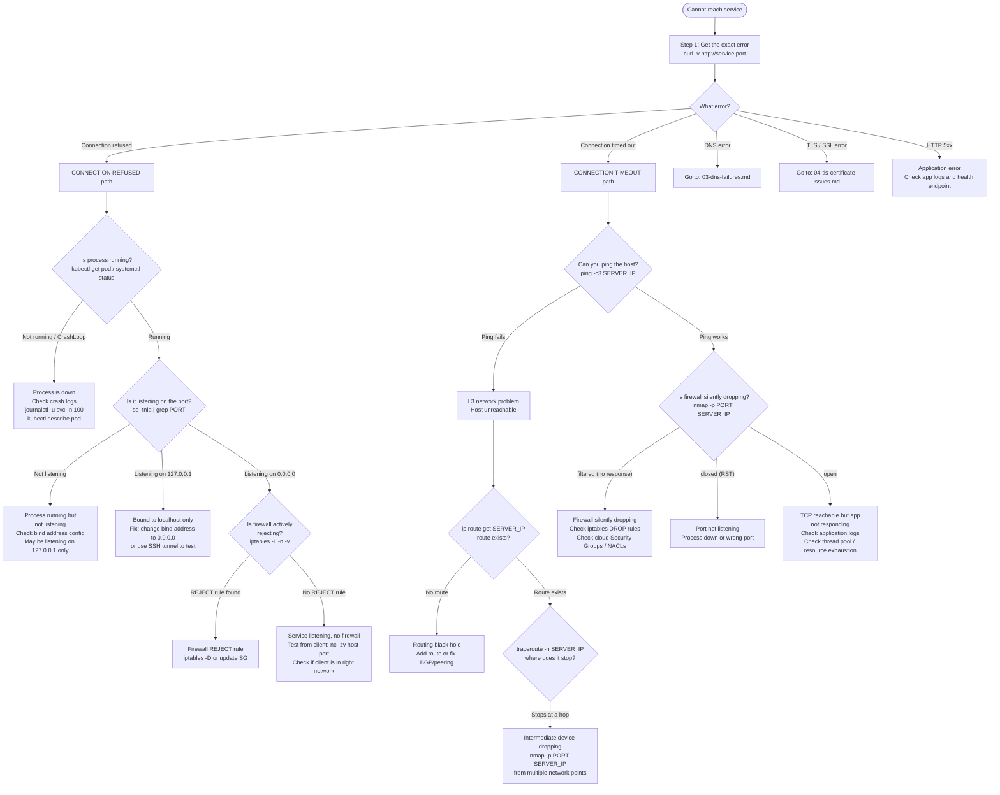

# 01: Service Not Reachable

## Table of Contents

- [Trigger](#trigger)
- [Connection Refused vs Timeout: Critical Distinction](#connection-refused-vs-timeout-critical-distinction)
- [Decision Tree](#decision-tree)
- [Step-by-Step Procedure](#step-by-step-procedure)
  - [Step 1: Get the Exact Error](#step-1-get-the-exact-error)
  - [Step 2: Check DNS](#step-2-check-dns)
  - [Step 3: Is the Process Running?](#step-3-is-the-process-running)
  - [Step 4: Is It Listening?](#step-4-is-it-listening)
  - [Step 5: Firewall Check](#step-5-firewall-check)
  - [Step 6: Routing Check](#step-6-routing-check)
  - [Step 7: Application Health](#step-7-application-health)
- [Kubernetes-Specific Checks](#kubernetes-specific-checks)
  - [From Client Pod](#from-client-pod)
  - [Check Endpoints](#check-endpoints)
  - [Check kube-proxy Rules](#check-kube-proxy-rules)
  - [Check NetworkPolicy](#check-networkpolicy)
- [Common Mistakes](#common-mistakes)
- [Related Playbooks](#related-playbooks)

---

## Trigger

Use this playbook when: clients report they cannot reach a service, you receive an alert for failed health checks, or a dependent service returns connection errors. The first thing you must determine is the **error type** — "connection refused" and "connection timed out" are completely different failure modes.

---

## Connection Refused vs Timeout: Critical Distinction

| Signal | Meaning | Where to Start |
|---|---|---|
| `Connection refused (ECONNREFUSED)` | Server sent TCP RST — port is not listening, or firewall is actively rejecting | Process and listen state |
| `Connection timed out (ETIMEDOUT)` | No response at all — firewall silently dropping, routing black hole, network partition | Network path and firewall |
| `No route to host (ENETUNREACH)` | Kernel has no route for the destination | Routing table |
| `Name or service not known` | DNS resolution failed before TCP even started | DNS — see `03-dns-failures.md` |

---

## Decision Tree



---

## Step-by-Step Procedure

### Step 1: Get the Exact Error

Always start with a verbose connection attempt. The error message determines the entire path.

```bash
curl -v http://service-name:8080/health
# OR with timeout to avoid waiting forever:
curl -v --connect-timeout 5 --max-time 10 http://service-name:8080/health
```

**Expected output (healthy):**
```
* Connected to service-name (10.0.1.50) port 8080
* HTTP/1.1 200 OK
```

**Connection refused output:**
```
* connect to 10.0.1.50 port 8080 failed: Connection refused
```

**Timeout output:**
```
* Connection timed out after 5001 milliseconds
```

---

### Step 2: Check DNS

Before debugging connectivity, verify DNS is giving you the right IP. A wrong IP means you are debugging the wrong server.

```bash
# In a standard Linux host:
dig +short service-name
host service-name

# In a Kubernetes pod:
dig +short service-name.namespace.svc.cluster.local
# OR (the short name — relies on search domain):
nslookup service-name

# Expected: one or more IP addresses
# Bad: empty output (NXDOMAIN) or an unexpected IP
```

If DNS returns the wrong IP or fails entirely, stop here and use `03-dns-failures.md`.

---

### Step 3: Is the Process Running?

```bash
# For systemd services:
systemctl status service-name
# Expected: "Active: active (running)"
# Bad: "Active: failed" or "Active: activating" (stuck)

# For Kubernetes:
kubectl get pod -l app=service-name -o wide
# Expected: STATUS=Running, RESTARTS=0 (or low)
# Bad: CrashLoopBackOff, Error, Pending

# If CrashLoopBackOff:
kubectl logs <pod-name> --previous    # logs from the crashed container
kubectl describe pod <pod-name>       # look at Events section at the bottom

# For a bare process:
ps aux | grep service-name
# Expected: process visible with correct arguments
```

---

### Step 4: Is It Listening?

Run this on the server (or exec into the pod).

```bash
# On the server:
ss -tnlp | grep 8080
# Expected: "LISTEN 0 128 0.0.0.0:8080 0.0.0.0:* users:(("app",pid=1234,fd=5))"

# In a Kubernetes pod:
kubectl exec -it <pod-name> -- ss -tnlp

# CRITICAL: check the local address column
# 127.0.0.1:8080  = only reachable from localhost (common misconfiguration)
# 0.0.0.0:8080    = reachable from all interfaces (correct for most cases)
# :::8080         = IPv6 wildcard (may or may not bind IPv4 depending on IPV6_V6ONLY)
```

**If listening on 127.0.0.1 only**, the service is configured to bind to localhost. This is the most common "works on the server but not from the network" bug.

```bash
# Verify from the server itself:
curl http://127.0.0.1:8080/health   # works
curl http://<server-external-ip>:8080/health  # fails
```

---

### Step 5: Firewall Check

```bash
# iptables (most Linux hosts):
iptables -L INPUT -n -v | grep 8080
iptables -L FORWARD -n -v | grep 8080
# Look for DROP or REJECT rules with non-zero packet counts

# nftables (modern kernels):
nft list ruleset | grep -B5 -A2 "8080"

# Check DROP rules specifically:
iptables -L -n -v | grep -E "(DROP|REJECT)"
# Any rule here with a non-zero packet counter is actively dropping traffic

# Quick port probe from client (tests through all firewalls):
nmap -p 8080 <SERVER_IP>
# open     = reachable and listening
# filtered = firewall silently dropping (no response to SYN)
# closed   = reachable but nothing listening (RST received)

# AWS Security Groups (from AWS CLI):
aws ec2 describe-security-groups --group-ids sg-XXXXXXXX \
  --query 'SecurityGroups[*].IpPermissions'
```

---

### Step 6: Routing Check

```bash
# Does a route to the destination exist?
ip route get <SERVER_IP>
# Expected: shows route via gateway with src address
# Bad: "Network unreachable" or unexpected gateway

# Trace the path (TCP traceroute bypasses ICMP filtering):
traceroute -T -p 8080 <SERVER_IP> -n
# Expected: each hop returns, final hop is the server
# Bad: "* * *" after a certain hop = that device is dropping packets

# For MTU issues (black hole where TCP works for small packets but not large):
traceroute -T -p 8080 <SERVER_IP> -n --mtu
# Reports path MTU at each hop
```

---

### Step 7: Application Health

Once you have confirmed network connectivity (Steps 1-6 pass), the problem is application-layer.

```bash
# Hit the health endpoint directly:
curl -v http://localhost:8080/health
curl -v http://localhost:8080/ready

# Check application logs for errors:
kubectl logs <pod-name> --tail=100 | grep -i "error\|fatal\|panic\|exception"
journalctl -u service-name --since "10 minutes ago"

# Check for resource exhaustion:
kubectl top pod <pod-name>    # CPU/memory usage
kubectl describe pod <pod-name> | grep -A3 "Limits:\|Requests:"

# Check active connections:
ss -tnp | grep 8080 | wc -l  # how many connections to this port
# High count with many in CLOSE_WAIT = app not closing connections properly
# High count with many in TIME_WAIT = normal for high-traffic services
```

---

## Kubernetes-Specific Checks

### From Client Pod

```bash
# Test DNS + service resolution from inside the mesh:
kubectl exec -it <debug-pod> -n <client-namespace> -- \
  curl -v http://service-name.target-namespace.svc.cluster.local:8080/health

# Test the ClusterIP directly (bypasses CoreDNS):
kubectl get svc service-name -n target-namespace -o jsonpath='{.spec.clusterIP}'
kubectl exec -it <debug-pod> -- curl -v http://<CLUSTER_IP>:8080/health
# If ClusterIP works but hostname doesn't: DNS problem
# If ClusterIP fails: kube-proxy or NetworkPolicy problem
```

### Check Endpoints

```bash
# Are there healthy endpoints backing the service?
kubectl get endpoints service-name -n namespace
# Expected: "10.244.1.5:8080,10.244.2.3:8080" (pod IPs)
# Bad: "<none>" = no pods match the selector, or all pods are failing readiness

# Verify the selector matches the pod labels:
kubectl get svc service-name -n namespace -o jsonpath='{.spec.selector}'
kubectl get pods -n namespace -l app=service-name   # use the selector from above
```

### Check kube-proxy Rules

```bash
# iptables mode (most common):
iptables -t nat -L KUBE-SERVICES -n | grep <CLUSTER_IP>
# Expected: line showing KUBE-SVC-* chain for this service

# Follow the chain to see load balancing rules:
iptables -t nat -L KUBE-SVC-<HASH> -n
# Shows KUBE-SEP-* (endpoint) entries

# IPVS mode:
ipvsadm -Ln | grep -A3 <CLUSTER_IP>
# Shows virtual server and real server (pod IP) mappings
```

### Check NetworkPolicy

```bash
# List all policies in the relevant namespaces:
kubectl get networkpolicy -n <namespace>
kubectl describe networkpolicy <policy-name> -n <namespace>

# A "default-deny-all" ingress policy blocks everything not explicitly allowed:
kubectl get networkpolicy -A -o yaml | grep -A5 "podSelector: {}"

# Check Cilium-specific (if using Cilium CNI):
kubectl exec -n kube-system <cilium-pod> -- cilium policy get
```

---

## Common Mistakes

1. **Not distinguishing refused vs timeout** — these have completely different root causes. Refused = process/listen issue. Timeout = network/firewall issue. Starting with the wrong hypothesis wastes 15 minutes.

2. **Checking the wrong server** — verify DNS is giving you the right IP before debugging connectivity. You may be debugging a healthy server while the broken one is serving a different DNS response.

3. **Testing from the wrong host** — "It works from my laptop" does not mean it works from the client pod/subnet. Always test from the actual client network.

4. **Ignoring the bind address** — service listening on `127.0.0.1:8080` is one of the most common issues. Always check the Local Address column in `ss -tnlp`.

5. **Kubernetes: checking app logs before checking endpoints** — if `kubectl get endpoints` shows `<none>`, the pod is not ready. App logs won't tell you why it's not ready; `kubectl describe pod` will.

---

## Related Playbooks

- `00-debugging-methodology.md` — 5-layer model and methodology
- `03-dns-failures.md` — If DNS is returning wrong/no answer
- `04-tls-certificate-issues.md` — If connection succeeds but TLS fails
- `05-packet-drops.md` — If packets are being silently dropped
- `06-kubernetes-networking-issues.md` — K8s pod/service networking
