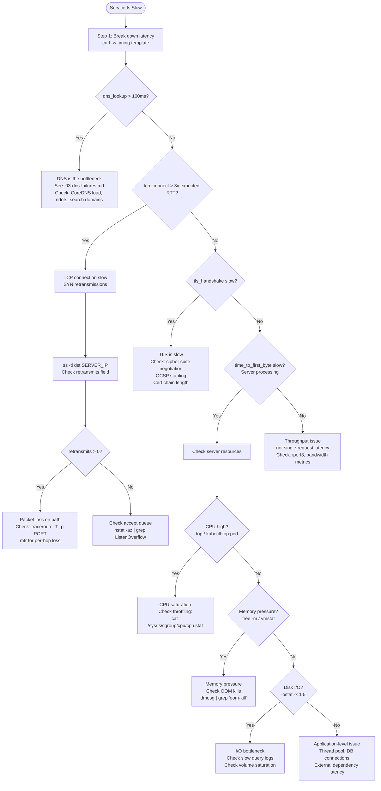

# 02: High Latency — Service Is Slow

## Trigger

Use this playbook when: p99 latency is elevated, health checks are passing but responses are slow, users report slowness, or latency alerts fire. The service is reachable (use `01-service-not-reachable.md` if it is not) but slower than baseline.

---

## Latency vs Throughput: Distinguish First

| Symptom | Likely Cause | Starting Point |
|---|---|---|
| Single request slow | Server-side processing, GC pause, DB query | Application layer |
| All requests slow simultaneously | CPU saturation, memory pressure, disk I/O | Resource exhaustion |
| Slow connection establishment, fast response | DNS, TCP handshake, TLS | Network/infra layer |
| Slow first byte, fast streaming | Server processing (TTFB) | Application/DB |
| Slow throughput, low latency | Bandwidth saturation, TCP window | Network layer |
| Intermittent spikes | GC, scheduler, retransmissions, noisy neighbor | Profile over time |

**The tool that immediately breaks down where time is spent:**

```bash
curl -w "\ndns_lookup:     %{time_namelookup}s\ntcp_connect:    %{time_connect}s\ntls_handshake:  %{time_appconnect}s\ntime_to_first_byte: %{time_starttransfer}s\ntotal_time:     %{time_total}s\n" \
  -o /dev/null -s https://service:443/health
```

**Interpreting the output:**

| Field | What it measures | Healthy | Investigate if |
|---|---|---|---|
| `dns_lookup` | DNS resolution time | < 5ms | > 100ms |
| `tcp_connect` | TCP handshake (= ~1 RTT) | < 10ms same-region | > 100ms |
| `tls_handshake` | TLS negotiation | < 50ms | > 200ms |
| `time_to_first_byte` | Server processing time | varies by app | > 500ms for simple requests |
| `total_time` | End-to-end | sum of above | baseline + 20% |

The difference between phases tells you exactly which layer is slow. Run this command first for every latency incident.

---

## Decision Tree



---

## Step-by-Step Procedure

### Step 1: Break Down Latency by Phase

```bash
# Run this 10 times to get a distribution (latency varies):
for i in $(seq 10); do
  curl -w "dns:%{time_namelookup} tcp:%{time_connect} tls:%{time_appconnect} ttfb:%{time_starttransfer} total:%{time_total}\n" \
    -o /dev/null -s https://service:443/health
done

# For HTTP (no TLS):
curl -w "dns:%{time_namelookup} tcp:%{time_connect} ttfb:%{time_starttransfer} total:%{time_total}\n" \
  -o /dev/null -s http://service:8080/health
```

**What to look for:** Consistency matters as much as magnitude. If dns time is 0ms for 9 out of 10 requests and 300ms for 1, that is intermittent DNS. If tcp_connect is always 200ms but should be 5ms (same-region), that is TCP connection establishment (likely retransmissions or SYN queue overflow).

---

### Step 2: DNS Latency Check

```bash
# Measure DNS resolution time directly:
time dig +short service.namespace.svc.cluster.local

# Expected: < 5ms for a warm cache
# If > 100ms: DNS is the bottleneck

# K8s: check CoreDNS latency metrics
kubectl top pod -n kube-system -l k8s-app=kube-dns
# High CPU on CoreDNS pods = DNS overloaded

# Check ndots amplification (a major source of DNS latency in K8s):
kubectl exec <pod> -- cat /etc/resolv.conf
# If ndots:5 (default), short names trigger 5 search domain queries before FQDN
# "api" becomes: api.namespace.svc.cluster.local, api.svc.cluster.local,
#                api.cluster.local, api.ec2.internal, api (FQDN)

# Measure the amplification:
tcpdump -i any -nn port 53 &
kubectl exec <pod> -- curl http://api/health
# Count how many DNS queries appear for one request
```

---

### Step 3: TCP Retransmission Analysis

```bash
# Check TCP retransmissions to the specific server:
ss -ti dst <SERVER_IP>
# Look for: retrans:X/Y (X retransmits out of Y total segments)
# Also look for: rtt:X/Y (average RTT / variance — high variance = jitter)
# cwnd value: low cwnd = TCP throttling itself due to perceived loss

# System-wide retransmit counter (use to see if it is trending up):
nstat -az | grep -i retrans
# Key counters:
# TcpRetransSegs — total retransmitted segments
# TcpExtTCPLostRetransmit — retransmits lost (severe loss)
# TcpExtTCPFastRetrans — fast retransmit triggered (good, means loss detection is working)
# TcpExtTCPSlowStartRetrans — retransmit from slow start (bad — full congestion window reset)

# Capture retransmissions in real time:
tcpdump -i eth0 -nn 'tcp[tcpflags] & (tcp-push) != 0 and tcp[8:4] == tcp[8:4]' dst <SERVER_IP>
# More practical — just watch for duplicate sequence numbers in output

# Retransmit rate calculation:
netstat -s | grep -i "retransmit"
# Run twice, 60 seconds apart:
# retransmit rate = (count2 - count1) / 60 segments/sec
# > 1% of outgoing segments = significant loss
```

---

### Step 4: Network Path Analysis

```bash
# TCP traceroute (bypasses ICMP filtering):
traceroute -T -p 443 <SERVER_IP> -n
# Expected: each hop shows RTT, final hop is server
# Bad: * * * after a certain hop = silent drop (or ICMP rate limited)

# mtr gives continuous measurement with per-hop loss statistics:
mtr -n --report --report-cycles 100 <SERVER_IP>
# Read carefully: a hop showing 100% loss but subsequent hops with 0% loss
# is NOT real loss — that router is rate-limiting ICMP
# Real loss: a hop where loss starts AND all subsequent hops show the same or higher loss

# Check for bufferbloat (latency under load):
# In background:
iperf3 -c <SERVER_IP> -t 60 &
# While iperf is running:
ping -c 30 <SERVER_IP>
# If latency jumps from 5ms to 200ms under load: bufferbloat
# Fix: fq_codel qdisc, BBR congestion control
```

---

### Step 5: Server-Side Resource Check

```bash
# CPU utilization:
top -b -n 1 | head -20
# Look for: high %us (user) or %sy (system) or %st (steal — bad in VMs)

# CPU throttling in containers:
cat /sys/fs/cgroup/cpu/cpu.stat 2>/dev/null || \
  cat /sys/fs/cgroup/cpu,cpuacct/cpu.stat 2>/dev/null
# throttled_time > 0 = container is being CPU throttled by cgroup limits
# This is a major source of latency spikes in K8s with CPU limits

# K8s: check CPU throttling directly:
kubectl top pod <pod-name>
# If CPU usage is close to limit, throttling is likely

# Memory pressure:
free -m
vmstat 1 5
# Look for: si/so (swap in/out) > 0 = swapping = severe latency
# Look for: high 'wa' in vmstat = waiting on I/O

# Disk I/O:
iostat -x 1 5
# Look for: %util near 100% = disk saturated
# Look for: await > 10ms for SSD, > 20ms for HDD = slow I/O

# Connection count and states:
ss -s
# TCP connections summary: if established count is unusually high, check for connection leaks
# Many CLOSE_WAIT = app not closing connections (bug)
# Many TIME_WAIT = normal for high-traffic server, but check if it is consuming ephemeral ports
```

---

### Step 6: Application-Level Latency

```bash
# Check thread pool / worker exhaustion:
# Java: thread dump
kill -3 <PID>    # prints thread dump to stdout/stderr
# Look for: large number of threads in WAITING or BLOCKED state

# Check open file descriptors (includes sockets):
ls /proc/<PID>/fd | wc -l
cat /proc/sys/fs/file-max    # system limit
# If fd count is near the limit, app cannot open new connections

# Check socket receive queue (non-zero = app not reading fast enough):
ss -tnp | awk '{print $2}' | sort | uniq -c | sort -rn | head -5
# Recv-Q > 0 = data sitting in kernel buffer waiting for application to read
# This is application back-pressure, not network latency

# Database connection pool (if applicable):
# Most ORMs expose metrics on pool exhaustion
# Symptoms: latency spike when load increases, no CPU spike
# Test: measure latency to DB directly
time mysql -h <DB_HOST> -e "SELECT 1" 2>/dev/null
```

---

### Step 7: K8s-Specific Latency Sources

```bash
# CPU throttling (most common K8s latency cause):
kubectl top pod <pod-name> -n namespace
# If near limits, increase CPU limit or optimize the application

# HPA lag (scale-up delay causing latency during traffic bursts):
kubectl describe hpa <hpa-name>
# Check: "Current Replicas" vs "Desired Replicas"
# If desired > current during latency spike: HPA is scaling up but pods are not ready yet

# CoreDNS latency (check CoreDNS logs for slow queries):
kubectl logs -n kube-system -l k8s-app=kube-dns --tail=50 | grep -i "slow\|error\|timeout"

# Node-level issues (noisy neighbor, NUMA):
# Which node is the pod on?
kubectl get pod <pod-name> -o wide
# Check node pressure:
kubectl describe node <node-name> | grep -A5 "Conditions:"
# MemoryPressure or DiskPressure = node is struggling

# K8s DNS ndots:5 latency (the most common surprise):
kubectl exec <pod> -- cat /etc/resolv.conf
# If ndots:5, every short name generates up to 5 DNS queries
# For external names like "api.example.com" (3 dots < 5):
# Queries: api.example.com.namespace.svc.cluster.local (NXDOMAIN)
#          api.example.com.svc.cluster.local (NXDOMAIN)
#          api.example.com.cluster.local (NXDOMAIN)
#          api.example.com (answer found)
# Fix: use FQDNs with trailing dot in application config, or set ndots:1
```

---

## TCP Retransmission Capture with tcpdump

```bash
# Identify specific retransmitted packets:
tcpdump -i eth0 -nn host <SERVER_IP> and port <PORT> -w /tmp/cap.pcap

# Analyze with tcpdump (look for duplicate sequence numbers):
tcpdump -r /tmp/cap.pcap -nn | grep -E "\[P\.\]|seq" | head -50
# Two packets with same seq number = retransmission

# Faster: use nstat to monitor retransmit counter in real time:
watch -n 1 'nstat -az | grep -E "TcpRetransSegs|TcpExtTCPFastRetrans|TcpExtTCPSlowStartRetrans"'
# If TcpRetransSegs increments rapidly during the latency window: packet loss
```

---

## Common Mistakes

1. **Blaming the application before measuring the network** — `curl -w` timing takes 5 seconds and immediately shows if DNS or TCP is the bottleneck. Do this before reading any application logs.

2. **Ignoring CPU throttling in Kubernetes** — CPU limits cause hard throttling that looks exactly like "application slowness." A pod using 450m of a 500m CPU limit will have frequent multi-millisecond stalls. Check `cpu.stat` throttled_time.

3. **Confusing bufferbloat with server slowness** — If latency is low at idle but high under load, the bottleneck is in the network queues (bufferbloat), not the server. Test latency with and without background load to distinguish.

4. **mtr showing 100% loss on a hop** — This is almost always ICMP rate limiting, not real loss. The next hop shows normal RTT, proving packets are getting through. Real loss shows up as elevated latency from that hop onward, not a single hop showing 100%.

5. **Not checking ndots in K8s** — The default `ndots:5` setting causes every external DNS query to go through 4-5 search domain lookups first. This adds 4-20ms per external request. Use FQDNs (trailing dot) for external names.

---

## Related Playbooks

- `00-debugging-methodology.md` — 5-layer model and hypothesis framework
- `03-dns-failures.md` — If dns_lookup is the slow phase
- `04-tls-certificate-issues.md` — If tls_handshake is the slow phase
- `05-packet-drops.md` — If retransmissions are the cause
- `06-kubernetes-networking-issues.md` — K8s-specific latency sources
