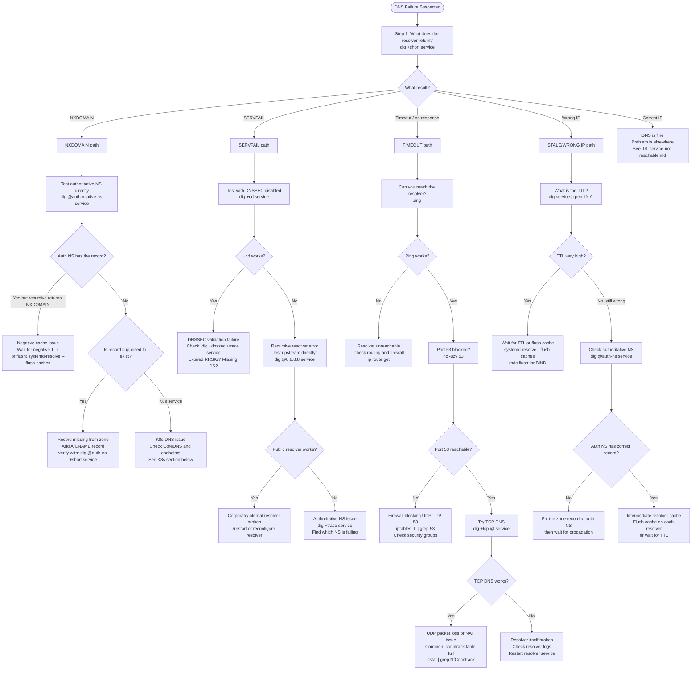

# 03: DNS Failures

## Table of Contents

- [Trigger](#trigger)
- [DNS Failure Types: Classify First](#dns-failure-types-classify-first)
- [Decision Tree](#decision-tree)
- [Step-by-Step Procedure](#step-by-step-procedure)
  - [Step 1: Test from the Affected Host](#step-1-test-from-the-affected-host)
  - [Step 2: Test the Authoritative Name Server Directly](#step-2-test-the-authoritative-name-server-directly)
  - [Step 3: Test Public Recursive Resolver](#step-3-test-public-recursive-resolver)
  - [Step 4: Check TTL and Caching](#step-4-check-ttl-and-caching)
  - [Step 5: Kubernetes DNS Checks](#step-5-kubernetes-dns-checks)
  - [Step 6: The ndots:5 Problem](#step-6-the-ndots5-problem)
  - [Step 7: DNSSEC Validation Failures](#step-7-dnssec-validation-failures)
- [Common Mistakes](#common-mistakes)
- [Related Playbooks](#related-playbooks)

---

## Trigger

Use this playbook when: services cannot resolve hostnames, you see NXDOMAIN or SERVFAIL errors in logs, DNS resolution is intermittent or very slow, or `curl` fails with "Name or service not known." DNS is the most common single point of failure in distributed systems.

---

## DNS Failure Types: Classify First

| Error | Meaning | Root Cause |
|---|---|---|
| `NXDOMAIN` | Name does not exist | Typo, record not created, record deleted, wrong search domain |
| `SERVFAIL` | Resolver error | Upstream resolver unreachable, DNSSEC validation failure, zone transfer failure |
| Timeout (no response) | Resolver unreachable | Firewall blocking UDP/TCP port 53, resolver down |
| Wrong IP (stale answer) | Cached old record | TTL too high, cache not flushed after change |
| `REFUSED` | Resolver rejected the query | Query from unauthorized source, ACL on resolver |
| Intermittent failures | Flaky resolver or packet loss | Load balanced resolvers out of sync, UDP packet loss |

---

## Decision Tree



---

## Step-by-Step Procedure

### Step 1: Test from the Affected Host

Always start from the host experiencing the failure. The resolver path matters.

```bash
# Basic query — what does the resolver return?
dig +short service-name
# Expected: one or more IP addresses
# NXDOMAIN: name does not exist (from resolver's perspective)
# SERVFAIL: resolver error

# See the full answer (with TTL, flags, resolver used):
dig service-name
# Look at:
# "status:" field: NOERROR (good), NXDOMAIN, SERVFAIL, REFUSED
# "flags:" field: "qr rd ra" is normal; "aa" = authoritative answer
# "ANSWER SECTION": the record and TTL
# "Query time": should be < 5ms for cached, < 100ms for recursive

# What resolver is being used?
cat /etc/resolv.conf
# nameserver line shows the resolver IP
# search line shows search domains (important for K8s ndots problem)
# options ndots:N controls when to try FQDN vs search domains
```

---

### Step 2: Test the Authoritative Name Server Directly

```bash
# Find the authoritative NS for the domain:
dig NS example.com +short
# Returns: ns1.example.com, ns2.example.com

# Query the authoritative NS directly (bypasses recursive cache):
dig @ns1.example.com service.example.com +short
# Expected: same answer as the recursive resolver
# If this works but recursive returns NXDOMAIN: recursive cache problem

# Check with +trace (follows the full delegation chain):
dig +trace service.example.com
# Output: root NS → .com NS → example.com NS → answer
# If it fails at a specific NS: that NS is the problem
```

---

### Step 3: Test Public Recursive Resolver

```bash
# Bypass your internal resolver:
dig @8.8.8.8 service.example.com
dig @1.1.1.1 service.example.com

# If public resolver returns NXDOMAIN: the record truly does not exist publicly
# If public resolver returns correct answer but internal returns NXDOMAIN:
#   → internal split-horizon DNS issue or internal resolver has a stale/wrong cache
```

---

### Step 4: Check TTL and Caching

```bash
# View the current TTL of a record:
dig service.example.com
# In ANSWER SECTION: "service.example.com. 295 IN A 10.0.1.50"
#                                          ^^^-- TTL (295 seconds remaining)

# For negative caching (NXDOMAIN): TTL comes from SOA MINIMUM field
dig service.example.com | grep -A5 "AUTHORITY SECTION"
# SOA record shows: "minimum 3600" = NXDOMAIN cached for 3600 seconds

# Check if a recently-deleted record is still cached:
dig +short @<recursive-resolver-ip> service.example.com  # check resolver cache
dig +short @<authoritative-ns-ip> service.example.com    # check authoritative

# Flush the resolver cache (if you have access):
systemd-resolve --flush-caches          # systemd-resolved
rndc flush                              # BIND
pdns_control purge service.example.com # PowerDNS
kubectl rollout restart deployment/coredns -n kube-system  # CoreDNS
```

---

### Step 5: Kubernetes DNS Checks

```bash
# Check what nameserver and search domains the pod is using:
kubectl exec <pod-name> -- cat /etc/resolv.conf
# Expected (K8s default):
# nameserver 10.96.0.10        (CoreDNS ClusterIP)
# search namespace.svc.cluster.local svc.cluster.local cluster.local
# options ndots:5

# Test DNS from inside the pod:
kubectl exec <pod-name> -- nslookup service-name
# Tests: DNS + search domain expansion

# Test with FQDN (bypasses ndots search domain expansion):
kubectl exec <pod-name> -- nslookup service-name.namespace.svc.cluster.local

# Test CoreDNS directly:
kubectl get svc -n kube-system kube-dns
# Get the ClusterIP (usually 10.96.0.10 or 10.100.0.10)
kubectl exec <pod-name> -- dig @10.96.0.10 service-name.namespace.svc.cluster.local

# Check CoreDNS logs for errors:
kubectl logs -n kube-system -l k8s-app=kube-dns --tail=100
# Look for: NXDOMAIN queries, SERVFAIL, connection refused to upstream

# Check CoreDNS configuration:
kubectl get configmap coredns -n kube-system -o yaml
# Look at: upstream nameservers, forward plugin config, health check interval

# Is CoreDNS running and healthy?
kubectl get pod -n kube-system -l k8s-app=kube-dns
kubectl top pod -n kube-system -l k8s-app=kube-dns  # CPU/memory
```

---

### Step 6: The ndots:5 Problem

This is the most common K8s DNS latency and failure source.

```bash
# Default resolv.conf in K8s:
# options ndots:5
# search namespace.svc.cluster.local svc.cluster.local cluster.local ec2.internal

# What happens when a pod queries "api.stripe.com":
# Stripe has 3 dots. ndots:5 means: if name has < 5 dots, try search domains first.
# Query 1: api.stripe.com.namespace.svc.cluster.local  → NXDOMAIN
# Query 2: api.stripe.com.svc.cluster.local            → NXDOMAIN
# Query 3: api.stripe.com.cluster.local                → NXDOMAIN
# Query 4: api.stripe.com.ec2.internal                 → NXDOMAIN
# Query 5: api.stripe.com.                             → ANSWER (finally)
# 5 queries to resolve one external name. 5x DNS latency.

# Observe this with tcpdump on the node:
tcpdump -i any -nn port 53 &
kubectl exec <pod> -- curl http://api.stripe.com/
# You will see 5 DNS queries for one request.

# Fix options:
# 1. Use FQDN with trailing dot in app config: "api.stripe.com."
# 2. Change ndots to 1 in pod spec (breaks K8s short names):
#    dnsConfig:
#      options:
#        - name: ndots
#          value: "1"
# 3. Use FQDNs for all external calls, short names for internal
```

---

### Step 7: DNSSEC Validation Failures

```bash
# Test without DNSSEC checking:
dig +cd service.example.com
# +cd = checking disabled (tells resolver to skip validation)
# If this works but normal query returns SERVFAIL: DNSSEC is the problem

# Check DNSSEC validation chain:
dig +dnssec +trace service.example.com
# Look for RRSIG records at each level
# If RRSIG is missing or expired, that is the failure point

# Check if a record has valid DNSSEC signatures:
dig +dnssec service.example.com
# Look for: RRSIG record in answer section
# Look for: "ad" flag in flags (authenticated data = validation passed)

# Check DS record (delegation signer):
dig DS example.com
# DS record at parent zone must match DNSKEY in child zone

# Common DNSSEC failure causes:
# - Expired RRSIG (keys not rotated automatically)
# - DS record in parent zone not updated after key rollover
# - Algorithm mismatch between old and new keys during rollover
# - Clock skew on resolver making valid signatures appear expired
```

---

## Common Mistakes

1. **Only testing from your machine** — DNS results depend on which resolver you use. A record might be NXDOMAIN from inside the cluster (CoreDNS) but NOERROR from your laptop (public resolver). Always test from the affected host using the same resolver.

2. **Confusing NXDOMAIN and SERVFAIL** — NXDOMAIN is a definitive "name does not exist." SERVFAIL is a resolver error. They have completely different fixes. Check `status:` in dig output.

3. **Not checking the negative TTL** — If a service was briefly missing and returned NXDOMAIN, that answer is cached for the SOA minimum TTL (often 300-3600 seconds). Fixing the record does not immediately fix clients; they are still serving the cached NXDOMAIN. Wait for the TTL or flush caches.

4. **Forgetting about ndots in Kubernetes** — The default `ndots:5` causes 4-5 DNS queries for every external hostname lookup. This is not a failure, but it looks like intermittent slowness and wastes CoreDNS capacity. Use FQDNs with trailing dots for external services.

5. **Testing TCP DNS when the problem is UDP** — `dig +tcp` always uses TCP. UDP DNS (the default) has different failure modes (packet fragmentation, conntrack issues). Test UDP by default: `dig @resolver service`.

6. **Not checking CoreDNS logs** — CoreDNS logs all SERVFAIL and NXDOMAIN responses. One look at the logs tells you what queries are failing and from which pods.

---

## Related Playbooks

- `00-debugging-methodology.md` — 5-layer model
- `01-service-not-reachable.md` — When DNS is fine but service is still unreachable
- `02-high-latency.md` — When DNS is slow but not failing
- `06-kubernetes-networking-issues.md` — K8s-specific DNS issues (CoreDNS)
