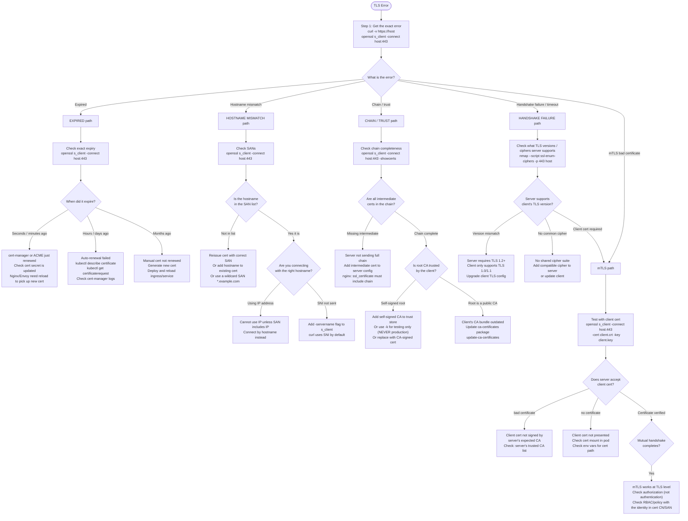

# 04: TLS Certificate Issues

## Table of Contents

- [Trigger](#trigger)
- [TLS Error Classification](#tls-error-classification)
- [Decision Tree](#decision-tree)
- [Step-by-Step Procedure](#step-by-step-procedure)
  - [Step 1: Get the Exact TLS Error](#step-1-get-the-exact-tls-error)
  - [Step 2: Inspect the Certificate](#step-2-inspect-the-certificate)
  - [Step 3: Check Expiry](#step-3-check-expiry)
  - [Step 4: Check Hostname (SAN)](#step-4-check-hostname-san)
  - [Step 5: Check the Certificate Chain](#step-5-check-the-certificate-chain)
  - [Step 6: Kubernetes cert-manager Checks](#step-6-kubernetes-cert-manager-checks)
  - [Step 7: mTLS Debugging](#step-7-mtls-debugging)
- [Common Mistakes](#common-mistakes)
- [Related Playbooks](#related-playbooks)

---

## Trigger

Use this playbook when: services fail with TLS errors, browsers show certificate warnings, mTLS authentication is failing, cert-manager shows failed certificate requests, or you see `SSL_ERROR_RX_RECORD_TOO_LONG`, `certificate has expired`, `CERTIFICATE_VERIFY_FAILED`, or `handshake failure` errors.

---

## TLS Error Classification

| Error Message | Meaning | Where to Start |
|---|---|---|
| `certificate has expired` or `certificate verify failed` | Server cert is past `notAfter` date | Check expiry — Step 3 |
| `hostname mismatch` / `SSL: no alternative certificate subject name matches` | Cert's SAN doesn't include the hostname you are connecting to | Check SAN — Step 4 |
| `unable to verify the first certificate` | Intermediate CA cert missing from chain | Check chain — Step 5 |
| `self-signed certificate in chain` | Self-signed cert not trusted by client's CA bundle | Add to trust store or replace with CA-signed cert |
| `handshake failure` | Cipher mismatch, TLS version mismatch, or client cert required | Check TLS negotiation |
| `handshake timeout` | Server not sending TLS hello | Port is open but not speaking TLS (wrong port) |
| `CERTIFICATE_VERIFY_FAILED` | Python/curl generic validation failure | Run through Steps 2-5 |
| `bad certificate` in mTLS | Client cert invalid or not signed by expected CA | Check mTLS client cert — Step 7 |

---

## Decision Tree



---

## Step-by-Step Procedure

### Step 1: Get the Exact TLS Error

Never skip this step. The error message from `openssl s_client` is more detailed than from `curl`.

```bash
# curl (fast, shows user-facing error):
curl -v https://service:443/health 2>&1 | grep -E "SSL|error|certificate|expired|verify"

# openssl s_client (detailed TLS handshake view):
openssl s_client -connect service:443 -servername service </dev/null
# Key output sections to read:
# "Certificate chain" — what certs the server sent
# "subject" / "issuer" — cert identity and who signed it
# "Verify return code: 0 (ok)" — chain validation result
# "CONNECTED" — TLS negotiated successfully (even if cert fails verification)
# "TLSv1.3" or "TLSv1.2" — which version negotiated

# For a K8s ingress with SNI (critical — without servername, wrong cert is served):
openssl s_client -connect ingress-ip:443 -servername hostname.example.com </dev/null
```

**Critical detail about `-servername`:** When multiple TLS certificates serve different hostnames on the same IP (SNI), you must specify `-servername` to get the correct cert. Without it, `openssl s_client` sends no SNI and the server returns a default certificate, which may not be the one you are testing.

---

### Step 2: Inspect the Certificate

```bash
# Check the certificate the server is actually serving:
openssl s_client -connect host:443 -servername host </dev/null 2>/dev/null \
  | openssl x509 -noout -text
# Key fields:
# Subject: CN=hostname.example.com
# Subject Alternative Names: DNS:hostname.example.com, DNS:*.example.com
# Validity: Not Before, Not After
# Issuer: CN=Let's Encrypt Authority X3 (or internal CA)

# If you have the cert file locally:
openssl x509 -noout -text -in cert.pem

# Quick summary (expiry + SANs):
openssl x509 -noout -subject -issuer -dates -ext subjectAltName -in cert.pem
```

---

### Step 3: Check Expiry

```bash
# Check expiry directly from server:
openssl s_client -connect host:443 -servername host </dev/null 2>/dev/null \
  | openssl x509 -noout -dates
# Output:
# notBefore=Jan  1 00:00:00 2025 GMT
# notAfter=Apr  1 00:00:00 2026 GMT

# Days until expiry (script-friendly):
echo | openssl s_client -connect host:443 -servername host 2>/dev/null \
  | openssl x509 -noout -checkend 0 && echo "cert valid" || echo "cert EXPIRED"

# Check expiry X seconds in the future (0 = now, 86400 = 24 hours):
openssl x509 -noout -checkend 86400 -in cert.pem && echo "OK" || echo "expires within 24h"

# For K8s TLS secrets:
kubectl get secret tls-secret -o jsonpath='{.data.tls\.crt}' | base64 -d \
  | openssl x509 -noout -dates
```

---

### Step 4: Check Hostname (SAN)

```bash
# List all Subject Alternative Names:
openssl s_client -connect host:443 -servername host </dev/null 2>/dev/null \
  | openssl x509 -noout -ext subjectAltName
# Expected: DNS:hostname.example.com, DNS:*.example.com
# Bad: only CN in Subject with no SAN (modern clients require SAN, not just CN)

# Check if your hostname is covered:
openssl s_client -connect host:443 -servername host </dev/null 2>/dev/null \
  | openssl x509 -noout -ext subjectAltName | grep "hostname"
# If empty: your hostname is NOT in the cert

# Wildcard matching rules:
# *.example.com covers: api.example.com, www.example.com
# *.example.com does NOT cover: api.sub.example.com (only one level)
# *.example.com does NOT cover: example.com itself
```

---

### Step 5: Check the Certificate Chain

```bash
# Get all certificates the server sends:
openssl s_client -connect host:443 -servername host -showcerts </dev/null 2>/dev/null
# Output: multiple "-----BEGIN CERTIFICATE-----" blocks
# Block 0 = leaf cert (the server's cert)
# Block 1 = intermediate CA
# Block 2 = (optional) root CA
# If there is only one block: server is not sending the chain (browser may work
#   because it caches intermediates, but curl and most services will fail)

# Verify the chain manually:
# Save the chain to a file, then:
openssl verify -CAfile /etc/ssl/certs/ca-certificates.crt cert-chain.pem
# Expected: cert-chain.pem: OK
# Bad: "unable to verify the first certificate" or "certificate signature failure"

# Build and verify chain manually:
openssl verify -CAfile root-ca.pem -untrusted intermediate.pem leaf.pem
```

---

### Step 6: Kubernetes cert-manager Checks

```bash
# Check certificate object status:
kubectl describe certificate <cert-name> -n namespace
# Look at:
# Status.Conditions: Type=Ready, Status=True (healthy)
# Status.Conditions: Type=Ready, Status=False, Reason=... (failed — read the reason)
# Status.NotBefore, Status.NotAfter: actual validity period
# Status.RenewalTime: when cert-manager will renew (default: 2/3 of cert lifetime)

# Check CertificateRequest (created during issuance):
kubectl get certificaterequest -n namespace
kubectl describe certificaterequest <name> -n namespace
# Look for failed requests and the failure reason
# Common: ACME challenge failed, DNS propagation delay, rate limit hit

# Check the TLS secret itself:
kubectl describe secret <tls-secret-name> -n namespace
# Look for: tls.crt and tls.key in Data
# Verify cert in secret matches what the ingress uses:
kubectl get secret <tls-secret-name> -n namespace -o jsonpath='{.data.tls\.crt}' \
  | base64 -d | openssl x509 -noout -subject -dates -ext subjectAltName

# Check cert-manager logs for this specific cert:
kubectl logs -n cert-manager deployment/cert-manager | grep -i "cert-name\|error\|failed" | tail -50

# List all certificates and their ready status:
kubectl get certificate -A
# NOT_READY certificates need immediate attention
```

---

### Step 7: mTLS Debugging

```bash
# Test mTLS connection manually:
openssl s_client -connect host:443 \
  -servername host \
  -cert client.crt \
  -key client.key \
  </dev/null
# Expected: "Verify return code: 0 (ok)" AND server accepts the connection
# "SSL alert number 42" = bad_certificate (server rejected client cert)

# Verify your client cert is valid:
openssl x509 -noout -subject -issuer -dates -in client.crt
# Check: is the cert expired? is the CN/SAN what the server expects?

# Check which CA the server trusts for client certs (nginx):
grep ssl_client_certificate /etc/nginx/nginx.conf
# This CA must have signed your client certificate

# Verify client cert is signed by the right CA:
openssl verify -CAfile server-trusted-ca.pem client.crt
# Expected: client.crt: OK
# Bad: "certificate signature failure" = client cert not signed by server-trusted CA

# Istio/Envoy mTLS (service mesh):
kubectl exec <pod> -c istio-proxy -- openssl s_client \
  -connect <service>:443 \
  -cert /etc/certs/cert-chain.pem \
  -key /etc/certs/key.pem \
  -CAfile /etc/certs/root-cert.pem

# Check Istio PeerAuthentication policy:
kubectl get peerauthentication -A
# STRICT mode: rejects non-mTLS connections
# PERMISSIVE mode: allows both mTLS and plaintext
```

---

## Common Mistakes

1. **Not using `-servername` with openssl s_client** — Without this flag, the server may return a default certificate that is not the one serving your hostname. Always specify `-servername hostname` when testing SNI-enabled servers.

2. **Not checking the cert the server actually sends vs what you think it sends** — cert-manager may have renewed the cert but the ingress controller did not reload. The secret is updated but the running process still has the old cert in memory.

3. **Trusting the CN instead of the SAN** — Modern browsers and most clients (curl, Python requests) require the hostname to be in the Subject Alternative Name extension. A cert with `CN=api.example.com` but no SAN will be rejected by most modern clients even if the CN matches.

4. **Ignoring intermediate certificate chain** — A cert that validates in browsers may fail in server-to-server calls because browsers cache intermediate CAs. Always check that the server is sending the full chain (`-showcerts` flag).

5. **Debugging the wrong cert** — In a K8s cluster with multiple ingress controllers or services on the same IP, SNI determines which cert is served. Always test with the correct hostname, not just the IP.

6. **cert-manager renewed but app still serving old cert** — cert-manager updates the Kubernetes Secret. The application must reload to pick up the new secret. Nginx with `ssl_certificate` from a mounted volume: needs `nginx -s reload` or container restart. Envoy and most service mesh proxies: pick up changes via xDS without restart.

---

## Related Playbooks

- `00-debugging-methodology.md` — 5-layer model
- `01-service-not-reachable.md` — If TLS fails before connection
- `06-kubernetes-networking-issues.md` — K8s ingress and cert-manager context
