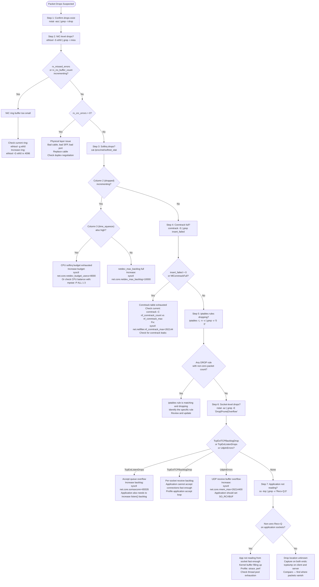

# 05: Packet Drops

## Table of Contents

- [Trigger](#trigger)
- [Packet Drop Locations (from NIC to Application)](#packet-drop-locations-from-nic-to-application)
- [Decision Tree](#decision-tree)
- [Step-by-Step Procedure](#step-by-step-procedure)
  - [Step 1: Confirm Drops Are Occurring](#step-1-confirm-drops-are-occurring)
  - [Step 2: NIC-Level Drops](#step-2-nic-level-drops)
  - [Step 3: Softirq Drops](#step-3-softirq-drops)
  - [Step 4: Conntrack Table Drops](#step-4-conntrack-table-drops)
  - [Step 5: iptables/nftables Drops](#step-5-iptablesnftables-drops)
  - [Step 6: Socket-Level Drops](#step-6-socket-level-drops)
  - [Step 7: Application Receive Queue](#step-7-application-receive-queue)
- [Tcpdump for Drop Verification](#tcpdump-for-drop-verification)
- [Common Mistakes](#common-mistakes)
- [Related Playbooks](#related-playbooks)

---

## Trigger

Use this playbook when: connections are timing out without explicit error, you observe high TCP retransmission rates, latency is high and variable, ICMP unreachables appear in logs, or `netstat -s` shows incrementing error counters. Silent packet drops are the hardest class of network problem because they leave no direct trace — you must check counters at every layer to find where the drop occurs.

---

## Packet Drop Locations (from NIC to Application)

```text
Packet arrival order through the kernel:
NIC hardware → Ring buffer → Softirq/NAPI → Conntrack → Netfilter/iptables → Routing → Socket buffer → Application

Drop can occur at ANY of these stages. The counter that increments tells you where.
```

| Location | Counter to Check | Tool |
|---|---|---|
| NIC ring buffer | `rx_missed_errors`, `rx_no_buffer_count` | `ethtool -S eth0` |
| NIC CRC errors | `rx_crc_errors` | `ethtool -S eth0` |
| Softirq backlog | Column 2 in `/proc/net/softnet_stat` | `cat /proc/net/softnet_stat` |
| Softirq time budget | Column 3 in `/proc/net/softnet_stat` | `cat /proc/net/softnet_stat` |
| Conntrack table full | `insert_failed`, `NfConntrackFull` | `conntrack -S`, `nstat` |
| iptables/nftables | Rules with non-zero packet counters | `iptables -L -v -n` |
| Socket receive buffer | `TcpExtTCPBacklogDrop`, `UdpInErrors` | `nstat -az` |
| Application not reading | Non-zero `Recv-Q` in ss | `ss -tnp` |

---

## Decision Tree



---

## Step-by-Step Procedure

### Step 1: Confirm Drops Are Occurring

```bash
# Quick summary of all kernel drop counters:
nstat -asz | grep -i drop
# Key output:
# TcpExtListenDrops N     — accept queue overflow
# TcpExtTCPBacklogDrop N  — per-socket receive queue overflow
# IpInDiscards N          — IP-level drops (routing/policy)

# Watch counters increment in real time:
watch -n 1 'nstat -az | grep -i drop'

# Packet receive errors (older interface):
netstat -s | grep -E "(receive errors|failed|overflow|dropped)"

# Also check overall socket statistics:
ss -s
# Output:
# TCP: total estab time-wait ...
# If time-wait count is abnormally high, you may be exhausting ephemeral ports
```

---

### Step 2: NIC-Level Drops

```bash
# Check all NIC error/drop counters:
ethtool -S eth0 | grep -E -i '(drop|miss|error|discard|overflow|lost)'
# Key counters (names vary by driver):
# rx_missed_errors    — ring buffer was full, NIC dropped the packet
# rx_no_buffer_count  — DMA ring buffer exhausted (same problem, different driver)
# rx_crc_errors       — frame checksum failed (physical layer problem)
# rx_over_errors      — FIFO overflow at NIC level
# tx_dropped          — transmit queue full
# rx_missed           — Intel e1000/ixgbe name

# Check ring buffer sizes:
ethtool -g eth0
# Output:
# Pre-set maximums:
# RX: 4096
# Current hardware settings:
# RX: 256         <-- if current << max, ring is undersized
#
# Increase ring buffer:
ethtool -G eth0 rx 4096
# This takes effect immediately but is not persistent.
# For persistence: add to /etc/network/interfaces or NetworkManager config.

# Confirm physical link quality:
ethtool eth0
# Speed: 10000Mb/s, Duplex: Full = healthy for 10G interface
# Half duplex on a 1G port = duplex mismatch with the switch

# dmesg for driver-level messages:
dmesg | grep -i "eth0\|ens\|bond\|dropped\|error" | tail -20
```

---

### Step 3: Softirq Drops

```bash
# Read the softnet_stat table:
cat /proc/net/softnet_stat
# Each row = one CPU core (CPU 0 is row 1, CPU 1 is row 2, etc.)
# Format: total  dropped  time_squeeze  [...]  throttled
# Column 1 (hex): total packets processed by this CPU
# Column 2 (hex): packets DROPPED because netdev_max_backlog was full
# Column 3 (hex): time_squeeze events (softirq ran out of budget, deferred work)

# Convert to decimal for readability:
awk '{ printf "cpu%d: total=%d dropped=%d squeezed=%d\n", NR-1, strtonum("0x"$1), strtonum("0x"$2), strtonum("0x"$3) }' /proc/net/softnet_stat

# If column 2 is incrementing:
# → netdev_max_backlog queue is full
sysctl net.core.netdev_max_backlog   # default: 1000 (too low for high-pps)
sysctl -w net.core.netdev_max_backlog=10000

# If column 3 is incrementing:
# → softirq cannot finish processing in its budget (CPU not keeping up)
sysctl net.core.netdev_budget          # default: 300 packets per poll
sysctl net.core.netdev_budget_usecs    # default: 2000 microseconds
sysctl -w net.core.netdev_budget_usecs=8000

# Check which CPUs are handling network interrupts:
cat /proc/interrupts | grep -i eth0
# If one CPU is doing all the work: enable Receive Side Scaling (RSS)
# or set IRQ affinity to distribute across CPUs
```

---

### Step 4: Conntrack Table Drops

```bash
# Current conntrack entry count vs maximum:
cat /proc/sys/net/netfilter/nf_conntrack_count    # current
cat /proc/sys/net/netfilter/nf_conntrack_max      # maximum

# If count is near max, new connections are dropped:
conntrack -S 2>/dev/null
# Output includes: insert_failed, drop, early_drop
# insert_failed = conntrack table full at insertion time

# Kernel message when table fills:
dmesg | grep "nf_conntrack: table full"
# "nf_conntrack: table full, dropping packet" = conntrack is the drop cause

# nstat counter:
nstat -az | grep NfConntrackFull

# Fix (immediate):
sysctl -w net.netfilter.nf_conntrack_max=262144

# Also check for conntrack leaks (connections stuck in ESTABLISHED state):
conntrack -L | grep ESTABLISHED | wc -l
# Compare to actual established TCP connections:
ss -s | grep estab
# If conntrack ESTABLISHED >> ss established: conntrack leak

# Reduce conntrack timeout for TIME_WAIT states:
cat /proc/sys/net/netfilter/nf_conntrack_tcp_timeout_time_wait  # default: 120
sysctl -w net.netfilter.nf_conntrack_tcp_timeout_time_wait=30
```

---

### Step 5: iptables/nftables Drops

```bash
# List all rules with packet and byte counters:
iptables -L -n -v
# Non-zero packet counts = rule is matching traffic
# Look for DROP or REJECT targets with non-zero counts

# Filter for only active DROP rules:
iptables -L -n -v | grep -E "DROP|REJECT" | awk '$1 != "0" || $2 != "0"'

# Check specific tables:
iptables -t nat -L -n -v     # NAT rules (PREROUTING, POSTROUTING)
iptables -t mangle -L -n -v  # Mangle rules (QoS, mark)
iptables -t filter -L -n -v  # Filter rules (the main drop location)

# nftables (modern systems):
nft list ruleset | grep -B5 "drop\|reject"

# Watch packet counter increment in real time (identifies active drops):
watch -n 1 'iptables -L -n -v | grep -v "0     0"'
# Any rule whose packet count increases each second is actively dropping traffic

# K8s specific: kube-proxy creates many rules — look for KUBE-FIREWALL:
iptables -t filter -L KUBE-FIREWALL -n -v
```

---

### Step 6: Socket-Level Drops

```bash
# Comprehensive socket drop counters:
nstat -az | grep -E 'TcpExt(Listen|Backlog|Prune|RcvPruned|OFO|TCPSchedulerFailed)'

# Key counters explained:
# TcpExtListenOverflows     — accept queue full (server slow to accept())
# TcpExtListenDrops         — includes ListenOverflows + other drops
# TcpExtTCPBacklogDrop      — per-socket receive queue full
# TcpExtPruneCalled         — receive buffer almost full, pruning OOO packets
# TcpExtRcvPruned           — packets dropped due to receive buffer full
# UdpInErrors               — UDP receive buffer overflow

# For listen queue overflow:
ss -ltn | grep <PORT>
# Recv-Q column for LISTEN sockets = current backlog depth
# Send-Q column for LISTEN sockets = maximum backlog (from listen() call)
# If Recv-Q is consistently close to Send-Q: accept queue overflow

# Increase the listen backlog:
sysctl -w net.core.somaxconn=65535  # kernel maximum
# Application must also call listen(fd, backlog) with a higher value

# For UDP drops (very common for DNS, syslog, metrics):
nstat -az | grep UdpInErrors
# Fix:
sysctl -w net.core.rmem_max=26214400
sysctl -w net.core.rmem_default=26214400
```

---

### Step 7: Application Receive Queue

```bash
# Non-zero Recv-Q = kernel has received data that the application has not read yet
ss -tnmp | head -30
# Recv-Q > 0 persistently = application is too slow reading from the socket
# Recv-Q growing over time = application is falling further behind

# Identify which process owns the socket:
ss -tnmp | grep -v "Recv-Q:0\|Recv-Q 0"
# The users:(("name",pid=N,fd=M)) field shows which process

# Profile the application's socket reads:
strace -p <PID> -e trace=read,recv,recvfrom,recvmsg 2>&1 | head -50
# If application is making read() calls but slowly: CPU-bound or lock contention
# If application is not making read() calls: deadlock or blocked elsewhere

# Check thread pool saturation (if applicable):
cat /proc/<PID>/status | grep -i thread
ls /proc/<PID>/task | wc -l   # actual thread count
```

---

## Tcpdump for Drop Verification

When counters do not point to an obvious layer, use tcpdump on both sides.

```bash
# Capture on the server (destination):
tcpdump -i eth0 -nn -w /tmp/server.pcap host <CLIENT_IP> and port <PORT>

# Capture on the client (source) simultaneously:
tcpdump -i eth0 -nn -w /tmp/client.pcap host <SERVER_IP> and port <PORT>

# Analysis:
# If client sends SYN but server pcap shows nothing: drop between client and server
# If server gets SYN but sends no SYN-ACK: server-side firewall or backlog
# If server sends SYN-ACK but client pcap shows nothing: asymmetric routing
# If both sides see packets but connections fail: upper layer issue (TLS, application)

# Quick retransmission check from pcap:
tcpdump -r /tmp/server.pcap -nn | awk '{print $NF}' | grep seq | sort | uniq -d | head -10
# Duplicate seq numbers = retransmissions
```

---

## Common Mistakes

1. **Only checking one layer** — packet drops can stack. The ring buffer fills because softirq is not draining fast enough because one CPU is overwhelmed. Fix the lowest-layer problem first, then check if the upper layers resolve.

2. **Checking iptables rules without the -v flag** — `-L` without `-v` hides the packet counters. You cannot see which rules are matching. Always use `-L -n -v`.

3. **Conntrack timeouts too long in high-connection-rate environments** — default TCP TIME_WAIT conntrack timeout is 120 seconds. In a service processing 10,000 requests/second, the conntrack table fills with TIME_WAIT entries. Reduce the timeout.

4. **Ignoring NIC ring buffer on high-throughput hosts** — the default ring buffer size (256 entries on many drivers) was set for 10Mbps networks. On 10G+ interfaces handling 1M+ pps, the ring fills instantly under burst traffic. Check this first on high-throughput servers.

5. **Recv-Q on LISTEN sockets vs ESTABLISHED sockets** — `Recv-Q` means different things depending on state. For LISTEN sockets: current accept queue depth. For ESTABLISHED sockets: unread data waiting for the application. Both indicate different problems.

---

## Related Playbooks

- `00-debugging-methodology.md` — 5-layer model
- `01-service-not-reachable.md` — When drops cause connection failures
- `02-high-latency.md` — When drops cause retransmissions and latency
- `06-kubernetes-networking-issues.md` — K8s-specific drop scenarios (CNI, kube-proxy)
