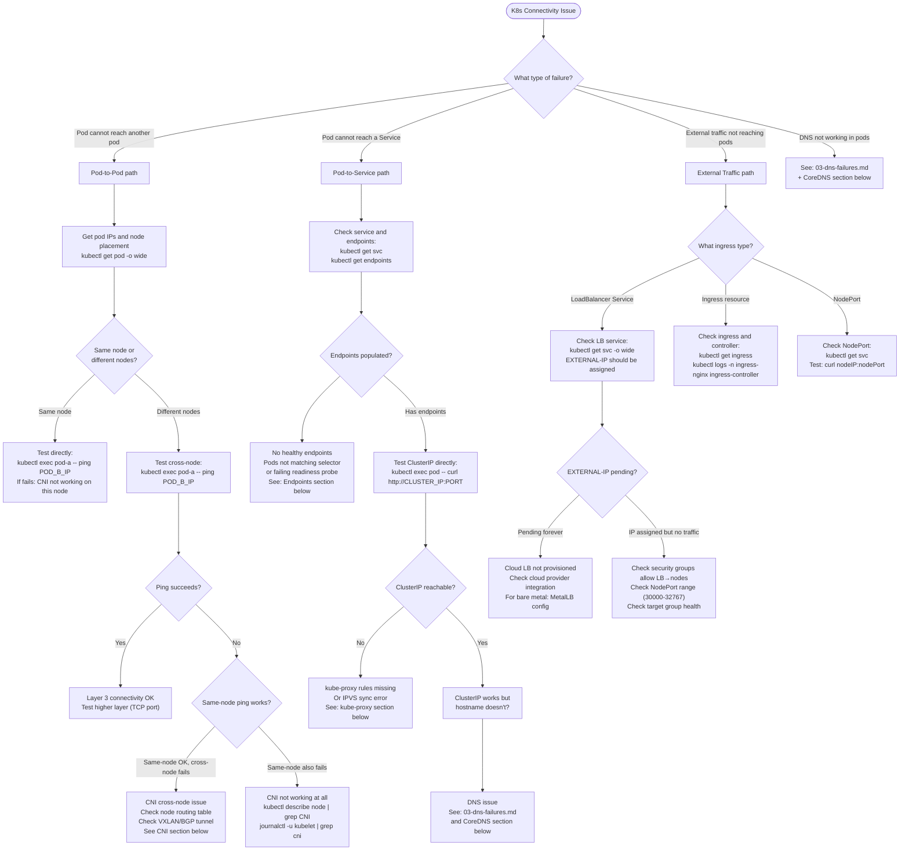

# 06: Kubernetes Networking Issues

## Table of Contents

- [Trigger](#trigger)
- [K8s Networking Layers (What Can Break)](#k8s-networking-layers-what-can-break)
- [Decision Tree](#decision-tree)
- [Section 1: Pod-to-Pod Debugging](#section-1-pod-to-pod-debugging)
  - [Step 1: Confirm Pod IPs and Node Placement](#step-1-confirm-pod-ips-and-node-placement)
  - [Step 2: Test Basic Connectivity](#step-2-test-basic-connectivity)
  - [Step 3: Check CNI Assignment](#step-3-check-cni-assignment)
  - [Step 4: Check Node-Level Routing](#step-4-check-node-level-routing)
  - [Step 5: MTU Issues (Overlay-Specific)](#step-5-mtu-issues-overlay-specific)
  - [Step 6: CNI Logs](#step-6-cni-logs)
- [Section 2: Pod-to-Service Debugging](#section-2-pod-to-service-debugging)
  - [Step 1: Verify Service and Selector](#step-1-verify-service-and-selector)
  - [Step 2: Check Endpoints](#step-2-check-endpoints)
  - [Step 3: Test ClusterIP Directly](#step-3-test-clusterip-directly)
  - [Step 4: Check kube-proxy Rules](#step-4-check-kube-proxy-rules)
- [Section 3: External Traffic Debugging](#section-3-external-traffic-debugging)
  - [LoadBalancer Service](#loadbalancer-service)
  - [Ingress](#ingress)
- [Section 4: NetworkPolicy Blocking](#section-4-networkpolicy-blocking)
  - [Check Policies](#check-policies)
  - [Test by Isolating NetworkPolicy](#test-by-isolating-networkpolicy)
- [Section 5: CoreDNS Debugging](#section-5-coredns-debugging)
- [Common Mistakes](#common-mistakes)
- [Related Playbooks](#related-playbooks)

---

## Trigger

Use this playbook when: pods cannot communicate with each other, pods cannot reach services, external traffic is not reaching pods, DNS resolution fails inside pods, or you have unexplained connectivity failures in a K8s cluster. This playbook covers the K8s-specific networking stack layered on top of the Linux networking primitives in other playbooks.

---

## K8s Networking Layers (What Can Break)

```text
External Traffic
    ↓
LoadBalancer (cloud LB, MetalLB)
    ↓
NodePort / Ingress Controller
    ↓
kube-proxy (iptables/IPVS rules for ClusterIP)
    ↓
CNI (Calico/Flannel/Cilium — pod routing, VXLAN/BGP)
    ↓
Pod network namespace (veth pair, eth0 in pod)
    ↓
Container
```

Every layer can fail independently. The pattern is: narrow down which layer by testing directly at each layer.

---

## Decision Tree



---

## Section 1: Pod-to-Pod Debugging

### Step 1: Confirm Pod IPs and Node Placement

```bash
kubectl get pod -o wide -n <namespace>
# Output shows: pod name, IP, NODE
# Note which pods are on which nodes
# Cross-node communication requires CNI tunnel or BGP routes
```

### Step 2: Test Basic Connectivity

```bash
# Create a debug pod if no exec-capable pod exists:
kubectl run netdebug --image=nicolaka/netshoot --rm -it --restart=Never -- bash

# Test ICMP:
kubectl exec -it pod-a -- ping -c3 <POD_B_IP>

# Test TCP to a specific port:
kubectl exec -it pod-a -- nc -zv <POD_B_IP> <PORT>

# Test from pod-a to pod-b's IP bypassing DNS:
kubectl exec -it pod-a -- curl http://<POD_B_IP>:<PORT>/health
```

### Step 3: Check CNI Assignment

```bash
# Are pod CIDRs assigned to nodes?
kubectl describe node <node-name> | grep -A5 "PodCIDR"
# Expected: "PodCIDR: 10.244.1.0/24"
# Empty: CNI is not assigning CIDRs (controller-manager issue)

# Check CNI plugin is running on every node:
kubectl get pod -n kube-system -l k8s-app=flannel -o wide       # Flannel
kubectl get pod -n kube-system -l k8s-app=calico-node -o wide   # Calico
kubectl get pod -n kube-system -l k8s-app=cilium -o wide        # Cilium
# All should be Running on every node
```

### Step 4: Check Node-Level Routing

```bash
# SSH to the source pod's node (or use kubectl node-shell):
# Does this node have a route to the destination pod's subnet?
ip route show
# For Flannel (VXLAN): should see "10.244.X.0/24 via X.X.X.X dev flannel.1"
# For Calico (BGP): should see "10.244.X.0/24 via X.X.X.X dev eth0 proto bird"
# For Cilium: routes may be BPF-based (check cilium bpf lb list)

# Check VXLAN tunnel interface (Flannel):
ip -d link show flannel.1
# Should show: VXLAN id, dstport 8472, nolearning

# If cross-node traffic not reaching destination, check VXLAN UDP:
tcpdump -i eth0 -nn udp port 4789  # Flannel VXLAN port
tcpdump -i eth0 -nn udp port 8472  # Flannel VXLAN (some versions)
# If you see VXLAN packets leaving but not arriving on dest node:
# Firewall between nodes is blocking UDP 4789/8472
```

### Step 5: MTU Issues (Overlay-Specific)

```bash
# MTU is the #1 silent killer in overlay networks
# VXLAN adds 50 bytes of overhead: physical MTU 1500 → pod MTU should be 1450

# Test with specific packet sizes:
kubectl exec -it pod-a -- ping -M do -s 1400 <POD_B_IP>   # 1400 + 28 = 1428 bytes
kubectl exec -it pod-a -- ping -M do -s 1450 <POD_B_IP>   # Should work if MTU is 1450
kubectl exec -it pod-a -- ping -M do -s 1451 <POD_B_IP>   # Should fail if MTU is 1450

# If large pings fail but small pings work: MTU mismatch
# Fix: set pod MTU explicitly in CNI config
# Flannel: edit flannel configmap, set "MTU": 1450
# Calico: kubectl patch FelixConfiguration default -p '{"spec":{"mtu":1450}}'
```

### Step 6: CNI Logs

```bash
# kubelet logs for CNI errors:
journalctl -u kubelet --since "30 minutes ago" | grep -i "cni\|network"

# CNI binary logs (varies by CNI):
# Flannel:
kubectl logs -n kube-system -l app=flannel --tail=100
# Calico:
kubectl logs -n kube-system -l k8s-app=calico-node --tail=100
# Cilium:
kubectl logs -n kube-system -l k8s-app=cilium --tail=100
```

---

## Section 2: Pod-to-Service Debugging

### Step 1: Verify Service and Selector

```bash
# Check service configuration:
kubectl get svc <service-name> -n <namespace> -o yaml
# Look for: spec.selector (must match pod labels)
# Look for: spec.ports (must match pod's containerPort)

# Verify pods match the selector:
kubectl get svc <service-name> -n <namespace> -o jsonpath='{.spec.selector}'
# Output: {"app":"myapp"}
kubectl get pods -n <namespace> -l app=myapp   # use the selector
# These pods must be Running AND Ready
```

### Step 2: Check Endpoints

```bash
kubectl get endpoints <service-name> -n <namespace>
# Expected: "10.244.1.5:8080,10.244.2.3:8080"
# Bad: "<none>"

# If endpoints are empty:
# Case 1: Pod labels don't match service selector
kubectl describe svc <service-name> | grep Selector
kubectl get pods --show-labels | grep <pod-name>

# Case 2: Pods exist but are not Ready (failing readiness probe)
kubectl describe pod <pod-name> | grep -A10 "Conditions:"
kubectl describe pod <pod-name> | grep -A10 "Readiness:"
# If readiness probe failing: fix the application, not the networking

# Case 3: Pods in a different namespace
# Services can only select pods in the same namespace (unless ExternalName or headless)
```

### Step 3: Test ClusterIP Directly

```bash
# Get ClusterIP:
kubectl get svc <service-name> -n <namespace> -o jsonpath='{.spec.clusterIP}'
# Example: 10.96.45.123

# Test from a pod in the same namespace:
kubectl exec -it <debug-pod> -- curl http://10.96.45.123:<PORT>/health
# If this fails but pod IP works: kube-proxy rules are missing

# Test from a pod in a different namespace (ClusterIP is cluster-wide):
kubectl exec -it <debug-pod> -n other-namespace -- curl http://10.96.45.123:<PORT>/health
```

### Step 4: Check kube-proxy Rules

```bash
# iptables mode (most common):
iptables -t nat -L KUBE-SERVICES -n | grep <CLUSTER_IP>
# Expected: line starting with KUBE-SVC-* → following the chain shows endpoints

# Follow the service chain:
iptables -t nat -L KUBE-SVC-<HASH> -n -v
# Shows: KUBE-SEP-* entries = load balancing to individual pod IPs

# Follow to an endpoint:
iptables -t nat -L KUBE-SEP-<HASH> -n -v
# Shows: DNAT --to-destination <POD_IP>:<PORT>

# If kube-proxy rules are missing:
kubectl get pod -n kube-system -l k8s-app=kube-proxy -o wide
kubectl logs -n kube-system -l k8s-app=kube-proxy | grep -i "error\|failed" | tail -30

# IPVS mode:
ipvsadm -Ln | grep -A5 <CLUSTER_IP>
# Shows: TCP 10.96.45.123:8080 rr (round-robin)
#          -> 10.244.1.5:8080  Route  1
#          -> 10.244.2.3:8080  Route  1

# Force kube-proxy to resync:
kubectl rollout restart daemonset/kube-proxy -n kube-system
```

---

## Section 3: External Traffic Debugging

### LoadBalancer Service

```bash
# Check service status:
kubectl get svc <service-name> -n <namespace> -o wide
# EXTERNAL-IP should show an IP, not "<pending>"

# If EXTERNAL-IP stays "<pending>":
# AWS: check if cloud-controller-manager is running, check IAM permissions
# Bare metal: check MetalLB speaker pods are running
kubectl get pod -n metallb-system -o wide

# Test from outside the cluster:
curl -v http://<EXTERNAL_IP>:<PORT>/health

# Check target health in AWS:
aws elbv2 describe-target-health --target-group-arn <ARN>
# Unhealthy targets: pod is not passing health check from LB
```

### Ingress

```bash
# Check ingress resource:
kubectl get ingress -n <namespace>
kubectl describe ingress <ingress-name> -n <namespace>
# Look for: Address (should show the ingress IP)
# Look for: Rules (hostname → service → port mapping)

# Check ingress controller pods:
kubectl get pod -n ingress-nginx -l app.kubernetes.io/name=ingress-nginx
kubectl logs -n ingress-nginx <controller-pod> | tail -50

# Test ingress routing:
curl -H "Host: hostname.example.com" http://<INGRESS_IP>/path
# The -H header simulates the HTTP Host header used for ingress routing
```

---

## Section 4: NetworkPolicy Blocking

### Check Policies

```bash
# List all NetworkPolicies (in all namespaces):
kubectl get networkpolicy -A

# Describe a specific policy:
kubectl describe networkpolicy <policy-name> -n <namespace>
# Look for:
# Pod Selector: which pods this policy applies to
# Policy Types: Ingress, Egress
# Ingress / Egress rules: what is allowed

# Default-deny policies block everything not explicitly allowed:
kubectl get networkpolicy -n <namespace> -o yaml | grep -A5 "podSelector: {}"
# Empty podSelector {} = applies to ALL pods in namespace
```

### Test by Isolating NetworkPolicy

```bash
# Temporarily allow all traffic to isolate if NetworkPolicy is the cause:
# (Do this in a test environment, not production without change control)
kubectl apply -f - <<EOF
apiVersion: networking.k8s.io/v1
kind: NetworkPolicy
metadata:
  name: allow-all-debug
  namespace: <namespace>
spec:
  podSelector: {}
  policyTypes:
  - Ingress
  - Egress
  ingress:
  - {}
  egress:
  - {}
EOF
# If connectivity is restored: a NetworkPolicy was blocking it
# Remove the debug policy after confirming and add specific allow rules

# Cilium-specific drop monitoring:
kubectl exec -n kube-system <cilium-pod> -- cilium monitor --type drop
# Shows real-time packet drops with policy reason

# Calico-specific:
calicoctl get networkpolicies -A
kubectl exec -n kube-system <calico-pod> -- calico-node -bird-live 2>/dev/null
```

---

## Section 5: CoreDNS Debugging

```bash
# Check CoreDNS pods:
kubectl get pod -n kube-system -l k8s-app=kube-dns -o wide
# All should be Running; if restarting frequently, check resource limits

# Check CoreDNS logs:
kubectl logs -n kube-system -l k8s-app=kube-dns --tail=100
# Look for: [ERROR] plugin/errors, SERVFAIL, connection refused

# Check CoreDNS configuration:
kubectl get configmap coredns -n kube-system -o yaml
# The Corefile shows:
# forward . 8.8.8.8  (upstream resolver for external names)
# kubernetes cluster.local (handles .cluster.local names)
# health, ready (health check endpoints)

# Test CoreDNS directly:
COREDNS_IP=$(kubectl get svc -n kube-system kube-dns -o jsonpath='{.spec.clusterIP}')
kubectl run dnstest --image=busybox --rm -it --restart=Never -- \
  nslookup kubernetes.default.svc.cluster.local $COREDNS_IP

# Check CoreDNS resource usage (CPU/memory):
kubectl top pod -n kube-system -l k8s-app=kube-dns
# High CPU = DNS overload
# If at limits: increase CoreDNS replicas or resource limits

# Scale CoreDNS if overloaded:
kubectl scale deployment coredns -n kube-system --replicas=4
```

---

## Common Mistakes

1. **Not checking endpoints first** — 40% of "service not reachable" issues in K8s are empty endpoints. A missing label on the pod or a failing readiness probe means no endpoints. Check `kubectl get endpoints` before anything else.

2. **Testing connectivity with the wrong DNS name** — `service-name` only works within the same namespace (with ndots:5). From a different namespace, use `service-name.namespace.svc.cluster.local`. From outside the cluster, use the external DNS name.

3. **Confusing Pod IP and ClusterIP** — Pod IPs change when pods restart. ClusterIP is stable. Always use ClusterIP (via service name) for service-to-service calls.

4. **NetworkPolicy with empty podSelector + Ingress only** — A policy with `spec.podSelector: {}` and `policyTypes: [Ingress]` applies to ALL pods and denies all ingress not explicitly allowed. This is intentional for default-deny, but operators sometimes add this without realizing the blast radius.

5. **VXLAN UDP blocked between nodes** — Cloud environments often have security groups between nodes. Flannel VXLAN requires UDP port 4789 between all nodes. Calico BGP requires TCP 179. If these are blocked, CNI installs successfully but cross-node pod communication silently fails.

6. **kube-proxy in iptables mode on high-connection servers** — iptables rules are O(n) to evaluate (linear scan). With 10,000+ services, every new connection evaluates thousands of rules. Switch to IPVS mode for large clusters.

---

## Related Playbooks

- `00-debugging-methodology.md` — 5-layer model and hypothesis framework
- `01-service-not-reachable.md` — General service reachability
- `03-dns-failures.md` — CoreDNS and DNS failures in pods
- `05-packet-drops.md` — Packet drops in CNI and kube-proxy
