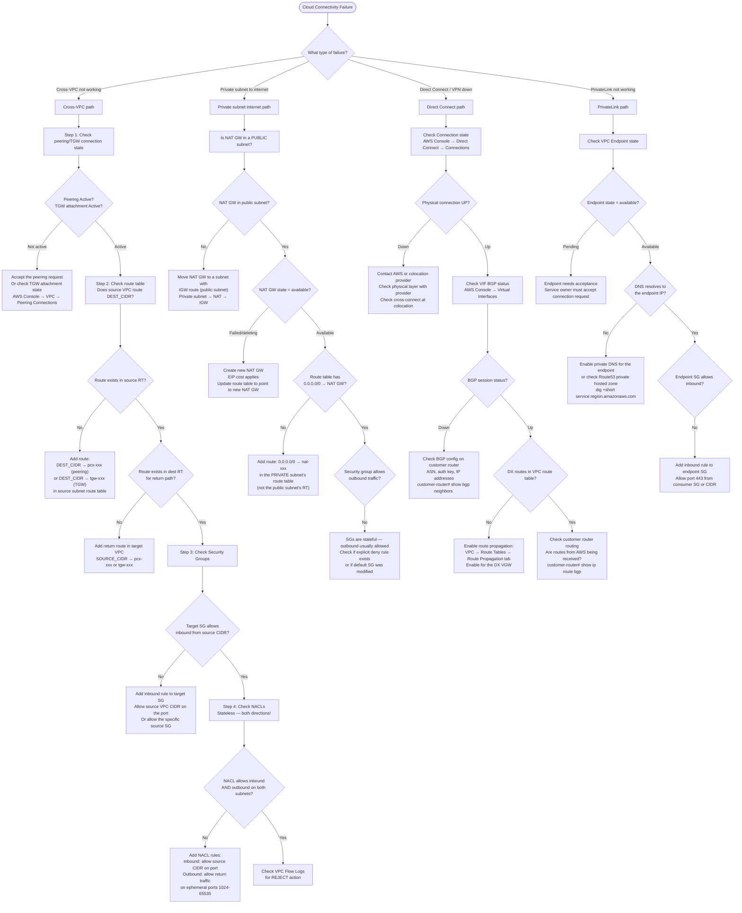

# 07: Cloud Connectivity Issues (AWS Focus)

## Table of Contents

- [Trigger](#trigger)
- [AWS Connectivity Layers (What Can Block Traffic)](#aws-connectivity-layers-what-can-block-traffic)
- [Decision Tree](#decision-tree)
- [Section 1: Cross-VPC Connectivity](#section-1-cross-vpc-connectivity)
  - [Step 1: Verify Peering or TGW Connection](#step-1-verify-peering-or-tgw-connection)
  - [Step 2: Check Route Tables](#step-2-check-route-tables)
  - [Step 3: Check Security Groups](#step-3-check-security-groups)
  - [Step 4: Check NACLs (Stateless — Both Directions)](#step-4-check-nacls-stateless-both-directions)
  - [Step 5: VPC Flow Logs Analysis](#step-5-vpc-flow-logs-analysis)
- [Section 2: Private Subnet to Internet (NAT Gateway)](#section-2-private-subnet-to-internet-nat-gateway)
  - [Common Architecture Check](#common-architecture-check)
- [Section 3: Direct Connect / VPN](#section-3-direct-connect-vpn)
  - [Direct Connect Debugging](#direct-connect-debugging)
  - [VPN Debugging](#vpn-debugging)
- [Section 4: PrivateLink / VPC Endpoints](#section-4-privatelink-vpc-endpoints)
- [Azure Connectivity Notes](#azure-connectivity-notes)
- [Common Mistakes](#common-mistakes)
- [Related Playbooks](#related-playbooks)

---

## Trigger

Use this playbook when: EC2 instances or containers cannot reach resources in another VPC, private subnet instances cannot reach the internet, Direct Connect or VPN connectivity is lost, PrivateLink endpoints are not resolving or unreachable, or cross-account connectivity fails.

---

## AWS Connectivity Layers (What Can Block Traffic)

```text
Source (EC2/Pod) → Security Group → Route Table → VPC Peering/TGW/PrivateLink → Route Table → Security Group → Target

Also:
- Network ACL (stateless, BOTH directions must be allowed)
- VPC Flow Logs (tells you what was ACCEPTED or REJECTED)
- DNS (Route53 Resolver rules for private zones)
```

**Key distinction: Security Groups vs NACLs:**

| Feature | Security Group | Network ACL |
|---|---|---|
| Stateful? | Yes (return traffic auto-allowed) | No (must explicitly allow both directions) |
| Applied to | ENI (instance/pod) | Subnet |
| Default | Deny all inbound, allow all outbound | Allow all |
| Ephemeral ports | Handled automatically | Must allow 1024-65535 on return path |

---

## Decision Tree



---

## Section 1: Cross-VPC Connectivity

### Step 1: Verify Peering or TGW Connection

```bash
# VPC Peering — check connection state:
aws ec2 describe-vpc-peering-connections \
  --filters "Name=status-code,Values=active" \
  --query 'VpcPeeringConnections[*].{ID:VpcPeeringConnectionId,Status:Status.Code,Requester:RequesterVpcInfo.CidrBlock,Accepter:AccepterVpcInfo.CidrBlock}'

# TGW — check attachment states:
aws ec2 describe-transit-gateway-attachments \
  --filters "Name=transit-gateway-id,Values=tgw-XXXXXXXX" \
  --query 'TransitGatewayAttachments[*].{VPC:ResourceId,State:State}'
# All attachments must be "available"
```

### Step 2: Check Route Tables

This is the most common cross-VPC failure. Routes must exist on BOTH sides.

```bash
# Find the route table for the source subnet:
aws ec2 describe-route-tables \
  --filters "Name=association.subnet-id,Values=subnet-XXXXXXXXX" \
  --query 'RouteTables[*].Routes'

# Look for: "DestinationCidrBlock": "10.1.0.0/16", "GatewayId": "pcx-xxx" or "tgw-xxx"
# If missing: add the route

# Add a peering route (CLI):
aws ec2 create-route \
  --route-table-id rtb-XXXXXXXX \
  --destination-cidr-block 10.1.0.0/16 \
  --vpc-peering-connection-id pcx-XXXXXXXXXXXXXXXXX

# Add a TGW route (CLI):
aws ec2 create-route \
  --route-table-id rtb-XXXXXXXX \
  --destination-cidr-block 10.1.0.0/16 \
  --transit-gateway-id tgw-XXXXXXXXXXXXXXXXX

# Check TGW route table (for inter-VPC routing through TGW):
aws ec2 search-transit-gateway-routes \
  --transit-gateway-route-table-id tgw-rtb-XXXXXXXX \
  --filters "Name=state,Values=active"
```

### Step 3: Check Security Groups

```bash
# Describe the target instance's security groups:
aws ec2 describe-instances --instance-ids i-XXXXXXXXXXXXXXXXX \
  --query 'Reservations[*].Instances[*].SecurityGroups'

# Check inbound rules on the target SG:
aws ec2 describe-security-groups --group-ids sg-XXXXXXXXXXXXXXXXX \
  --query 'SecurityGroups[*].IpPermissions'
# Look for: IpProtocol, FromPort, ToPort, IpRanges (source CIDR or GroupId)

# The source CIDR must match the source instance's IP
# OR the source SG must be referenced directly (SG-to-SG rules do not work across VPCs — use CIDR)
# IMPORTANT: SG peering rules (referencing another SG ID) ONLY work within the same VPC
# For cross-VPC: always use CIDR ranges
```

### Step 4: Check NACLs (Stateless — Both Directions)

```bash
# Get NACL for the target subnet:
aws ec2 describe-network-acls \
  --filters "Name=association.subnet-id,Values=subnet-XXXXXXXXX" \
  --query 'NetworkAcls[*].{Entries:Entries,Associations:Associations}'

# NACLs have rule numbers — lower numbers evaluate first
# Check:
# Inbound: source CIDR, port range, ALLOW (not DENY)
# Outbound: dest CIDR, ephemeral ports 1024-65535, ALLOW (not DENY)
# If a DENY rule exists at rule 100 and your ALLOW is at 200: traffic is denied

# Common NACL mistake:
# Inbound: ALLOW 10.0.0.0/8 on port 8080 ← traffic enters
# Outbound: Only ALLOW on port 8080 ← return traffic uses ephemeral ports, not 8080
# Fix outbound: ALLOW 10.0.0.0/8 on ports 1024-65535
```

### Step 5: VPC Flow Logs Analysis

```bash
# VPC Flow Logs are the ground truth. Enable if not already enabled:
aws ec2 create-flow-logs \
  --resource-type VPC \
  --resource-ids vpc-XXXXXXXXX \
  --traffic-type ALL \
  --log-group-name /vpc/flowlogs \
  --deliver-logs-permission-arn arn:aws:iam::ACCOUNT:role/FlowLogsRole

# Query via CloudWatch Logs Insights:
# Fields: version, srcAddr, dstAddr, srcPort, dstPort, protocol, packets, bytes, action, logStatus
# Find REJECT entries for your destination:
# Query:
# fields @timestamp, srcAddr, dstAddr, dstPort, action
# | filter dstAddr = "10.1.2.3" and action = "REJECT"
# | sort @timestamp desc
# | limit 50

# REJECT action = security group OR NACL is blocking
# ACCEPT action = traffic is being forwarded (but may fail at application layer)
```

---

## Section 2: Private Subnet to Internet (NAT Gateway)

### Common Architecture Check

```bash
# The correct flow for private subnet outbound:
# Private instance → Private subnet route table (0.0.0.0/0 → NAT GW)
#   → NAT GW in PUBLIC subnet → Public subnet route table (0.0.0.0/0 → IGW)
#     → Internet Gateway → Internet

# Step 1: Verify NAT GW is in a public subnet (has IGW route):
aws ec2 describe-nat-gateways --nat-gateway-ids nat-XXXXXXXXXXXXXXXXX \
  --query 'NatGateways[*].{State:State,SubnetId:SubnetId}'
# Get the SubnetId, then check its route table has 0.0.0.0/0 → igw-xxx

# Step 2: Verify private subnet route table:
# The private subnet should have:
# 0.0.0.0/0 → nat-XXXXXXXXXXXXXXXXX

# Step 3: Test from instance:
# SSH to a private instance (via bastion or SSM):
aws ssm start-session --target i-XXXXXXXXXXXXXXXXX
# Test internet connectivity:
curl -s --connect-timeout 5 http://checkip.amazonaws.com
# Expected: returns the NAT Gateway's Elastic IP (not your instance's private IP)

# Step 4: Check NAT GW health:
aws ec2 describe-nat-gateways --nat-gateway-ids nat-XXXXXXXXXXXXXXXXX \
  --query 'NatGateways[*].{State:State,FailureMessage:FailureMessage}'
```

---

## Section 3: Direct Connect / VPN

### Direct Connect Debugging

```bash
# Check physical connection state:
aws directconnect describe-connections --connection-id dxcon-XXXXXXXX \
  --query 'connections[*].{Name:connectionName,State:connectionState,Bandwidth:bandwidth}'
# State must be "available"

# Check Virtual Interface (VIF) BGP status:
aws directconnect describe-virtual-interfaces \
  --query 'virtualInterfaces[*].{VIF:virtualInterfaceId,BGP:bgpPeers[*].bgpStatus,State:virtualInterfaceState}'
# bgpStatus must be "up"

# If BGP is down, check on customer router:
# IOS example:
show bgp neighbors <aws-bgp-peer-ip>
# Look for: BGP state = Established (healthy)
# "Idle" or "Active" = BGP not up

# BGP common issues:
# - ASN mismatch (check: aws DX VIF ASN vs customer router ASN)
# - MD5 auth key mismatch
# - IP address mismatch (VLAN IP assigned to wrong interface)

# Check if DX routes are in VPC route table:
aws ec2 describe-route-tables \
  --filters "Name=vpc-id,Values=vpc-XXXXXXXXX" \
  --query 'RouteTables[*].Routes[?GatewayId!=`null`]'
# Look for routes with GatewayId = "vgw-xxx" (Virtual Private Gateway = DX/VPN)

# Enable route propagation if missing:
aws ec2 enable-vgw-route-propagation \
  --route-table-id rtb-XXXXXXXX \
  --gateway-id vgw-XXXXXXXX
```

### VPN Debugging

```bash
# Check VPN tunnel states:
aws ec2 describe-vpn-connections --vpn-connection-id vpn-XXXXXXXX \
  --query 'VpnConnections[*].VgwTelemetry[*].{IP:OutsideIpAddress,Status:Status,Reason:StatusMessage}'
# Status: UP (healthy), DOWN (problem)
# Reason field: "IPSEC IS UP", or the error message if down

# Both tunnels should ideally be UP; at minimum one must be UP for connectivity
# If tunnels are DOWN: check IKE/IPSec configuration on customer device

# Check BGP over VPN (if using BGP):
aws ec2 describe-vpn-connections --vpn-connection-id vpn-XXXXXXXX \
  --query 'VpnConnections[*].Routes'
# Routes must be propagated to VPC route table (same as DX)
```

---

## Section 4: PrivateLink / VPC Endpoints

```bash
# List VPC endpoints:
aws ec2 describe-vpc-endpoints --filters "Name=vpc-id,Values=vpc-XXXXXXXXX" \
  --query 'VpcEndpoints[*].{ID:VpcEndpointId,Service:ServiceName,State:State,Type:VpcEndpointType}'
# State must be "available"

# Check endpoint DNS names:
aws ec2 describe-vpc-endpoints --vpc-endpoint-ids vpce-XXXXXXXXXXXXXXXXX \
  --query 'VpcEndpoints[*].DnsEntries'
# These DNS names must resolve to private IPs within your VPC

# Test DNS resolution from instance:
dig +short s3.amazonaws.com   # if S3 endpoint with private DNS enabled
# Should return: 10.x.x.x (VPC CIDR) not 52.x.x.x (public S3)

# Check endpoint security group inbound rules:
# Interface endpoints have security groups; Gateway endpoints do not
aws ec2 describe-vpc-endpoints --vpc-endpoint-ids vpce-XXXXXXXXXXXXXXXXX \
  --query 'VpcEndpoints[*].Groups'
# Then check the SG allows inbound from your source

# For ECS/EKS in private subnets needing AWS APIs (ECR, SSM, CloudWatch):
# Required endpoints for EKS:
# - com.amazonaws.region.ecr.dkr  (ECR Docker)
# - com.amazonaws.region.ecr.api  (ECR API)
# - com.amazonaws.region.s3       (ECR layers stored in S3)
# - com.amazonaws.region.sts      (IAM auth)
# - com.amazonaws.region.ssm      (SSM if used)
```

---

## Azure Connectivity Notes

For Azure environments, the equivalent concepts:

| AWS | Azure |
|---|---|
| VPC Peering | VNet Peering |
| Transit Gateway | Virtual WAN Hub / VNet peering hub-spoke |
| Security Group | Network Security Group (NSG) |
| NACL | No direct equivalent; NSGs are stateful like SGs |
| NAT Gateway | NAT Gateway (same concept) |
| Direct Connect | ExpressRoute |
| VPN Gateway | VPN Gateway |
| PrivateLink | Private Endpoint / Private Link Service |

Azure NSG key difference: NSGs are **stateful** (unlike AWS NACLs). You do not need to add return traffic rules.

```bash
# Azure CLI equivalents:
az network nsg rule list --nsg-name <NSG_NAME> --resource-group <RG>
az network route-table route list --route-table-name <RT> --resource-group <RG>
az network vnet peering list --vnet-name <VNET> --resource-group <RG>
```

---

## Common Mistakes

1. **Cross-VPC SG reference** — Security group rules that reference another security group ID only work within the same VPC. For cross-VPC traffic through peering or TGW, use CIDR ranges in the security group rules.

2. **NACL ephemeral port direction** — NACLs are stateless. For a client making an outbound request, the server's response comes back on an ephemeral source port (1024-65535). If the client's outbound NACL does not allow inbound on 1024-65535, the response never reaches the client. This is the most common NACL mistake.

3. **NAT Gateway in the wrong subnet** — The NAT Gateway must be in a PUBLIC subnet (one with a route to an Internet Gateway). The PRIVATE subnet's route table has `0.0.0.0/0 → NAT-GW`. If the NAT GW is in a private subnet, it cannot reach the internet.

4. **Overlapping CIDR blocks in VPC peering** — VPC peering does not work if the VPCs have overlapping CIDRs. This is a design constraint you must catch before deployment.

5. **TGW route table vs VPC route table** — The TGW has its own route table (not the VPC route table). Traffic must be routable in BOTH the VPC route table (VPC → TGW for the destination CIDR) AND the TGW route table (which attachments can communicate).

6. **Flow logs show ACCEPT but still failing** — VPC Flow Logs showing ACCEPT means the packet passed security groups and NACLs. If connectivity still fails, the problem is above L3: application not listening, TLS failure, DNS returning wrong IP, or application-level firewall.

---

## Related Playbooks

- `00-debugging-methodology.md` — 5-layer model
- `01-service-not-reachable.md` — General connectivity debugging
- `03-dns-failures.md` — DNS failures with Route53 or PrivateLink DNS
- `08-ddos-incident-response.md` — DDoS mitigation using AWS Shield and WAF
