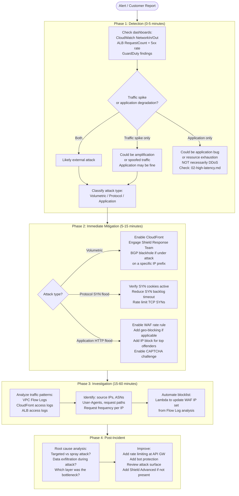

# 08: DDoS Incident Response

## Trigger

Use this playbook when: CloudWatch shows a traffic spike 5-10x above normal, ALB shows a surge in 5xx errors or request count, GuardDuty fires a DDoS finding, upstream bandwidth is saturated, or on-call receives "site is down" during unusually high traffic.

**Critical first question before executing this playbook:** Is this a DDoS or a legitimate traffic surge? A product launch, viral social media post, or marketing campaign can look identical to a volumetric DDoS in monitoring. Check application metrics (new user sign-ups, conversion rates, revenue) alongside network metrics. Blocking legitimate traffic during a product launch is the worst possible mitigation.

---

## Attack Classification

Identify the attack type before mitigating. Mitigation strategies are completely different.

| Attack Type | Signal | Layer | Mitigation |
|---|---|---|---|
| **Volumetric** (UDP flood, ICMP flood, amplification) | Gbps-level bandwidth spike, interface saturation | L3 | BGP blackhole, upstream scrubbing, CloudFront |
| **Protocol** (SYN flood, RST flood, fragmentation) | High packet rate, low bandwidth, SYN cookie activation, NIC at pps limit | L4 | SYN cookies, rate limiting at L4, scrubbing |
| **Application** (HTTP flood, Slowloris, cache busting) | High request rate, normal bandwidth, application CPU/connection pool at 100% | L7 | WAF rate rules, CAPTCHA challenge, connection limiting |
| **Amplification** (DNS/NTP/memcached reflection) | Large response packets from unexpected sources, asymmetric in/out ratio | L3 | Block amplification protocol source, source IP filtering |

---

## Response Timeline



---

## Phase 1: Detection (0-5 Minutes)

### Confirm the Attack

```bash
# CloudWatch — network spike:
aws cloudwatch get-metric-statistics \
  --namespace AWS/EC2 \
  --metric-name NetworkIn \
  --dimensions Name=InstanceId,Value=i-XXXXXXXXXXXXXXXXX \
  --start-time $(date -u -d '15 minutes ago' +%FT%TZ) \
  --end-time $(date -u +%FT%TZ) \
  --period 60 \
  --statistics Average,Maximum

# ALB — request spike and error rate:
aws cloudwatch get-metric-statistics \
  --namespace AWS/ApplicationELB \
  --metric-name RequestCount \
  --dimensions Name=LoadBalancer,Value=app/my-alb/XXXXXXXXXXXXXXXX \
  --start-time $(date -u -d '15 minutes ago' +%FT%TZ) \
  --end-time $(date -u +%FT%TZ) \
  --period 60 --statistics Sum

# GuardDuty DDoS findings:
aws guardduty list-findings \
  --detector-id <DETECTOR_ID> \
  --finding-criteria '{"Criterion":{"type":{"Eq":["UnauthorizedAccess:EC2/DDoSattack"]}}}'

# On the affected host (if accessible):
# Check interface saturation:
sar -n DEV 1 5
# Look for: rxpck/s (packets per second) and rxkB/s (bandwidth)
# If rxpck/s > 1M pps or rxkB/s > 500MB/s: volumetric attack

# Check connection rate:
ss -s
# Large number of SYN_RECV = SYN flood
# Large number of ESTABLISHED = HTTP flood or connection exhaustion
```

### Distinguish Attack from Legitimate Load Surge

```bash
# If it is a real traffic spike, application metrics should be elevated too:
# - New user sign-ups / registrations
# - Revenue / transactions
# - Login events

# DDoS signature (attack, not real users):
# - Traffic spike with NO corresponding application business metrics
# - Requests from a narrow set of source IPs or ASNs
# - Requests with invalid headers, no referer, unusual User-Agents
# - Requests to non-existent paths (404 rate is high)

# Quick request pattern check from ALB access logs:
aws s3 cp s3://your-alb-logs-bucket/AWSLogs/ACCOUNT/elasticloadbalancing/region/YYYY/MM/DD/ /tmp/alb-logs/ --recursive
# Parse latest logs:
zcat /tmp/alb-logs/*.log.gz 2>/dev/null | tail -10000 \
  | awk '{print $13}' | sort | uniq -c | sort -rn | head -20
# Column 13 = client IP; top IPs in a small list = potential attacker sources
```

---

## Phase 2: Immediate Mitigation (5-15 Minutes)

### Volumetric Attack (Bandwidth Saturation)

```bash
# Enable AWS Shield Advanced (if not already enabled):
# AWS Console → Shield → Subscribe
# Once enabled, engage Shield Response Team (SRT):
aws shield create-subscription  # one-time setup (costs money, check first)
aws shield create-protection \
  --name "my-application" \
  --resource-arn arn:aws:elasticloadbalancing:region:account:loadbalancer/app/my-alb/xxx

# Place CloudFront in front of the ALB (absorbs volumetric attack):
# CloudFront can handle 100+ Gbps per distribution
# Create distribution pointing to ALB as origin

# BGP blackhole (RTBH) — last resort for IP-specific attacks:
# Contact AWS Support to request blackhole routing for the victim IP
# This drops ALL traffic to the IP — causes a full outage for that IP
# Only use if the IP is being attacked and cannot be protected any other way

# At the Linux level (if still on the host):
# Check SYN cookie status:
cat /proc/sys/net/ipv4/tcp_syncookies
# 1 = SYN cookies enabled (good — default on most systems)
# 2 = always use SYN cookies regardless of backlog depth

# Enable if not set:
sysctl -w net.ipv4.tcp_syncookies=1

# Check if SYN flooding is being detected:
dmesg | grep "SYN flooding"
# "TCP: request_sock_TCP: Possible SYN flooding on port 443. Sending cookies."
# This is informational — SYN cookies are working, but the queue did overflow
```

### Protocol Attack (SYN Flood)

```bash
# Confirm SYN flood:
ss -s | grep -i "SYN_RECV"
# Large number of SYN_RECV = SYN queue being filled

# Check SYN queue depth:
nstat -az | grep -i "TcpExtListenOverflow\|TcpExtTCPSynRetrans"

# Monitor SYN cookie rate:
nstat -az | grep TcpExtSyncookiesSent
# Watch -n 1: if this is incrementing rapidly, SYN cookies are in effect

# Reduce SYN-RECEIVED timeout to flush bad connections faster:
sysctl -w net.ipv4.tcp_syn_retries=2        # Default: 6 (reduce to free up SYN queue faster)
sysctl -w net.ipv4.tcp_synack_retries=2     # Default: 5 (reduce retries for unanswered SYN-ACKs)

# Rate limit TCP SYNs using iptables (use carefully — may block legitimate users):
iptables -I INPUT -p tcp --syn -m limit --limit 100/s --limit-burst 200 -j ACCEPT
iptables -A INPUT -p tcp --syn -j DROP
# This allows 100 new connections/second burst to 200, drops rest
# Tune limit based on your legitimate traffic rate

# AWS WAF SYN rate limiting is more effective than iptables for AWS deployments
```

### Application Layer Attack (HTTP Flood)

```bash
# Add WAF rate-based rule (AWS CLI):
aws wafv2 create-rule-group \
  --name "RateLimit" \
  --scope REGIONAL \
  --capacity 10 \
  --rules '[{
    "Name": "IPRateLimit",
    "Priority": 1,
    "Statement": {
      "RateBasedStatement": {
        "Limit": 2000,
        "AggregateKeyType": "IP"
      }
    },
    "Action": {"Block": {}},
    "VisibilityConfig": {
      "SampledRequestsEnabled": true,
      "CloudWatchMetricsEnabled": true,
      "MetricName": "IPRateLimit"
    }
  }]'
# Limit of 2000 = 2000 requests per 5-minute period per IP before blocking

# Block specific IPs immediately:
aws wafv2 update-ip-set \
  --name "BlockedIPs" \
  --scope REGIONAL \
  --id <IPSET_ID> \
  --addresses '["1.2.3.4/32","5.6.7.8/32"]' \
  --lock-token <LOCK_TOKEN>

# Geo-block (if attack is from a specific country, no legitimate traffic from there):
# AWS WAF → GeoMatchStatement → block country codes

# Enable managed bot protection:
aws wafv2 associate-web-acl \
  --web-acl-arn <WEB_ACL_ARN> \
  --resource-arn <ALB_ARN>

# Add CAPTCHA challenge for suspicious IPs (less disruptive than blocking):
# Use AWS WAF CAPTCHA action instead of Block for borderline cases
```

---

## Phase 3: Investigation (15-60 Minutes)

### Traffic Pattern Analysis

```bash
# VPC Flow Logs — find top source IPs:
# CloudWatch Insights query:
# fields srcAddr, bytes, packets, action
# | filter action = "ACCEPT"
# | stats sum(bytes) as totalBytes, sum(packets) as totalPackets by srcAddr
# | sort totalBytes desc
# | limit 50
# Top sources with 10-100x more bytes than normal = attack sources

# ALB access logs — find attack patterns:
# Download recent logs:
aws s3 sync s3://alb-access-logs-bucket/AWSLogs/ACCOUNT/elasticloadbalancing/ /tmp/alb-logs/

# Analyze request paths (what are they hitting?):
zcat /tmp/alb-logs/**/*.log.gz 2>/dev/null \
  | awk '{print $13, $13, $16}' \
  | sort | uniq -c | sort -rn | head -30
# $13 = URL, $16 = user-agent

# Find requests with suspicious user agents:
zcat /tmp/alb-logs/**/*.log.gz 2>/dev/null \
  | awk '{print $NF}' \
  | sort | uniq -c | sort -rn | head -20
# Botnet user-agents often: empty, "python-requests", "curl", or random strings

# CloudFront real-time logs (if enabled):
# Use Athena to query CloudFront logs at scale for patterns
```

### Automate Blocklist with Lambda

```python
# Lambda pseudo-code for automated IP blocking from VPC Flow Logs:
# Trigger: CloudWatch Events on flow log delivery
# Action: Add top offending IPs to WAF IP set

import boto3
import re

def lambda_handler(event, context):
    # Parse flow log from S3 event
    # Extract source IPs with byte count > threshold
    # Get current WAF IP set
    waf = boto3.client('wafv2')

    # Add attacking IPs to block list
    # Update WAF IP set with lock token
    # (implement with exponential backoff for token conflicts)
    pass
```

---

## Phase 4: Post-Incident

### Immediate Actions (Within 24 Hours)

```bash
# 1. Confirm attack is over (traffic returned to baseline):
aws cloudwatch get-metric-statistics \
  --namespace AWS/ApplicationELB \
  --metric-name RequestCount ...  # compare to pre-attack baseline

# 2. Remove overly broad blocks (if geo-blocked legitimate regions):
# Remove temporary WAF rules that are no longer needed

# 3. Document the attack timeline:
# Start time, peak traffic rate, attack vector, mitigation applied, time to mitigate
```

### Post-Mortem Questions

1. **Was this targeted or spray-and-pray?** A targeted attack has consistent patterns (specific API endpoints, consistent user-agents). A spray attack is opportunistic.

2. **Was there data exfiltration during the attack?** DDoS is sometimes a distraction for a simultaneous breach. Check CloudTrail for unusual API calls during the attack window.

3. **Which layer was the actual bottleneck?** Was the application CPU, the ALB, the NAT Gateway, or the upstream bandwidth? The bottleneck determines the architecture improvement.

4. **How long did the automated response take?** AWS Shield Advanced with automatic mitigation should respond within seconds. Manual WAF rule updates take minutes. Improve automation if the response was manual.

### Architectural Improvements

```bash
# 1. AWS Shield Advanced on all public endpoints:
aws shield list-protections

# 2. CloudFront in front of all public-facing services:
# Absorbs volumetric attacks at CDN edge, not at your origin

# 3. WAF Managed Rule Groups (pre-built rules):
aws wafv2 list-available-managed-rule-groups --scope REGIONAL
# Notable groups:
# AWSManagedRulesAmazonIpReputationList — blocks known bad IPs
# AWSManagedRulesCommonRuleSet — OWASP top 10 protection
# AWSManagedRulesBotControlRuleSet — bot protection

# 4. Rate limiting at API Gateway level:
# Not just WAF — API GW has built-in throttling per API key, per stage
# Set usage plans and throttle limits before WAF if possible

# 5. Auto Scaling with buffer headroom:
# If you have no headroom, even a 2x traffic spike causes degradation
# Keep 40-50% spare capacity as protection against sudden spikes

# 6. Review public attack surface:
# Minimize the number of directly internet-reachable IPs
# Use CloudFront for all HTTP/HTTPS
# Use NLB + PrivateLink for other protocols
# Avoid directly exposing EC2 instances to the internet
```

---

## AWS Shield Advanced vs Standard

| Feature | Shield Standard | Shield Advanced |
|---|---|---|
| Cost | Free | $3,000/month + data transfer fees |
| L3/L4 protection | Yes (automatic) | Yes (automatic + SRT engaged) |
| L7 protection | No | Yes (with WAF, SRT engaged) |
| Shield Response Team | No | Yes (24/7 engagement) |
| Attack diagnostics | No | Yes (detailed post-attack report) |
| Cost protection | No | Yes (AWS credits if attack causes scaling costs) |

**Recommendation:** Enable Shield Advanced for any production system with public internet exposure generating >$3,000/month. The cost protection clause alone justifies it.

---

## Common Mistakes

1. **Blocking without confirming attack vs legitimate load** — blocking traffic during a legitimate viral traffic surge causes self-inflicted outage. Always check business metrics (conversions, sign-ups) alongside network metrics before blocking.

2. **Using BGP blackhole before trying WAF** — RTBH takes the IP completely offline. Try WAF rate limiting and CloudFront first. RTBH is the nuclear option.

3. **Not having automation ready** — manually adding IPs to WAF IP sets during a large HTTP flood (thousands of sources) is impossible at human speed. Automation must exist before the attack.

4. **Focusing on source IPs instead of attack patterns** — volumetric attacks use spoofed or botnet IPs. Blocking individual IPs is whack-a-mole. Focus on blocking attack patterns (request structure, user-agent, path patterns) instead of individual IPs.

5. **Not checking for simultaneous intrusion** — DDoS attacks are sometimes distractions. While the team is focused on the DDoS, an attacker may be exfiltrating data or planting backdoors. Always check CloudTrail and security logs during a DDoS incident.

6. **Not having a runbook before the incident** — DDoS incidents are high-pressure situations. The mitigation decisions in this playbook must be pre-approved (WAF rule changes, Shield SRT engagement, geo-blocking policy) or you will spend the first 30 minutes waiting for approvals instead of mitigating.

---

## Related Playbooks

- `00-debugging-methodology.md` — 5-layer model and incident methodology
- `05-packet-drops.md` — Kernel-level packet drop analysis during attack
- `07-cloud-connectivity-issues.md` — AWS VPC, security groups, flow logs
