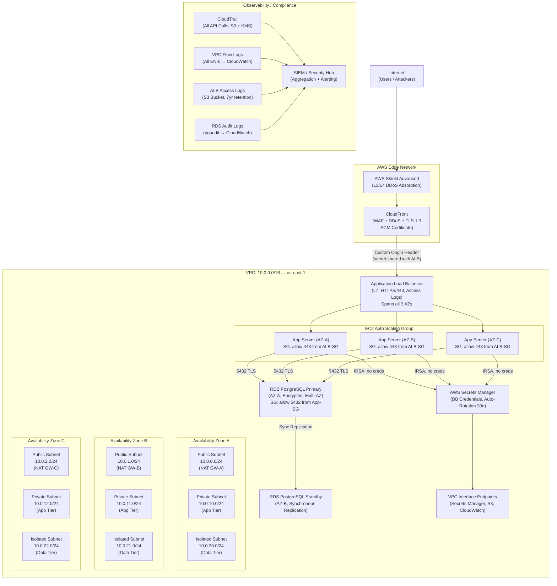

# Secure Multi-Tier Architecture on AWS

## Table of Contents

- [Design Requirements](#design-requirements)
  - [Functional Requirements](#functional-requirements)
  - [Non-Functional Requirements](#non-functional-requirements)
- [Architecture Overview](#architecture-overview)
- [Component Design](#component-design)
  - [VPC and Network Layout](#vpc-and-network-layout)
  - [Edge Layer: CloudFront + WAF + Shield](#edge-layer-cloudfront-waf-shield)
  - [Web Tier: Application Load Balancer](#web-tier-application-load-balancer)
  - [Application Tier: EC2 ASG](#application-tier-ec2-asg)
  - [Secrets Management](#secrets-management)
  - [Data Tier: RDS PostgreSQL Multi-AZ](#data-tier-rds-postgresql-multi-az)
  - [Logging and Compliance](#logging-and-compliance)
- [Trade-offs and Alternatives](#trade-offs-and-alternatives)
- [Failure Modes and Mitigations](#failure-modes-and-mitigations)
- [Scaling Considerations](#scaling-considerations)
  - [Current Design Handles](#current-design-handles)
  - [At 10x Scale (10x traffic, 10x data)](#at-10x-scale-10x-traffic-10x-data)
- [Security Design](#security-design)
  - [Defense in Depth Layers](#defense-in-depth-layers)
  - [PCI-DSS Controls Mapping](#pci-dss-controls-mapping)
- [Cost Considerations](#cost-considerations)
  - [Major Cost Drivers (estimated monthly, moderate traffic)](#major-cost-drivers-estimated-monthly-moderate-traffic)
  - [Optimization Opportunities](#optimization-opportunities)
- [Operational Runbooks](#operational-runbooks)
  - [Responding to a Security Group Change Alert](#responding-to-a-security-group-change-alert)
  - [RDS Failover Procedure](#rds-failover-procedure)
  - [Secrets Rotation Validation](#secrets-rotation-validation)
- [Interview Questions](#interview-questions)
  - [Basic](#basic)
  - [Intermediate](#intermediate)
  - [Advanced / Staff Level](#advanced-staff-level)

---

## Design Requirements

### Functional Requirements
- 3-tier web application: web, application, and data tiers
- User-facing HTTPS endpoints with global reach
- Business logic in application tier, persisted to PostgreSQL
- Automated horizontal scaling based on load

### Non-Functional Requirements
- Availability: 99.99% (< 52 minutes downtime/year)
- Compliance: PCI-DSS Level 1 (cardholder data environment)
- Recovery Time Objective (RTO): < 15 minutes
- Recovery Point Objective (RPO): < 1 minute (synchronous replication)
- Encryption in transit and at rest everywhere
- Audit logging for all API calls, network flows, and database queries
- Secrets never hardcoded; auto-rotated credentials

---

## Architecture Overview



---

## Component Design

### VPC and Network Layout

**CIDR Selection: 10.0.0.0/16**
- Provides 65,536 addresses. Avoids RFC 1918 overlap with common on-premises ranges (192.168.x.x).
- Reserve 10.1.0.0/16 for future VPC peering or VPN to corporate network.
- Do not use 172.16.0.0/12 — conflicts with Docker default bridge network and many on-premises setups.

**Subnet tiers (3 per AZ = 9 subnets total):**

| Tier | CIDR Range | Route Table | Internet Route |
|------|-----------|-------------|----------------|
| Public | 10.0.0-2.0/24 | Public RT | 0.0.0.0/0 → IGW |
| Private (App) | 10.0.10-12.0/24 | Private RT (per AZ) | 0.0.0.0/0 → NAT GW (same AZ) |
| Isolated (Data) | 10.0.20-22.0/24 | Isolated RT | No internet route |

**NAT Gateway placement:** One NAT GW per AZ in the public subnet, not shared. Shared NAT GW creates a cross-AZ dependency — if AZ-A's NAT GW goes down, AZ-B and C app servers lose internet access. The cost increase ($32/month per additional NAT GW) is justified for PCI environments.

**VPC Interface Endpoints** for Secrets Manager, CloudWatch Logs, S3, ECR: keeps traffic off the internet, satisfies PCI requirement that cardholder data environment does not traverse untrusted networks.

### Edge Layer: CloudFront + WAF + Shield

**CloudFront** acts as the public face of the application:
- ACM certificate for TLS 1.3 termination at the edge; TLS 1.2 minimum policy.
- AWS WAF attached: OWASP Top 10 managed rule set, rate limiting (1000 req/5min per IP), SQL injection and XSS rules.
- **Origin protection**: CloudFront sets a custom HTTP header (`X-Origin-Secret: <secret>`) to the ALB. The ALB listener rule rejects any request without this header. This prevents attackers from bypassing CloudFront to hit the ALB directly.
- AWS Shield Advanced: always-on DDoS detection, L3/L4 absorption, 24/7 DDoS response team access.

**Latency trade-off:** CloudFront adds ~10-50ms of overhead on cache misses due to geographic indirection. For a dynamic application, this is usually dominated by application processing time. The DDoS and WAF benefits outweigh the latency cost at production scale.

### Web Tier: Application Load Balancer

- Deployed across all 3 AZs. ALB is a managed service — AWS handles the HA and scaling internally.
- HTTPS listener on 443; HTTP on 80 redirected (301) to HTTPS.
- **Access logs** sent to S3 bucket with AES-256 encryption. PCI requires log retention for at least 1 year, with 3 months immediately available.
- Target group health check: `/health` endpoint returning 200, interval 30s, threshold 2 consecutive failures.
- **Listener rules**: reject requests without the CloudFront origin header (protects against direct ALB access).
- **Deletion protection** enabled — prevents accidental teardown in production.

### Application Tier: EC2 ASG

- Instances run in private subnets — no public IP, no direct internet ingress.
- **Security Group (App-SG)**: inbound 443 from ALB security group ID only (not CIDR). Security Group references are preferred over CIDR because they track instance membership dynamically.
- IAM instance profile (IRSA pattern on EC2): role allows `secretsmanager:GetSecretValue` on specific ARN only, `logs:PutLogEvents` for CloudWatch, and nothing else. No AWS access keys stored on disk.
- Auto Scaling Group:
  - Min: 3 (one per AZ), Max: 30
  - Target tracking policy: `ASGAverageCPUUtilization = 70%`
  - Scale-out cooldown: 300s, scale-in cooldown: 600s (longer to avoid thrashing)
  - Launch template uses latest hardened AMI (CIS Benchmark Level 2), no SSH access, SSM Session Manager for operational access.
- **Instance Refresh**: deploy new AMI versions via rolling refresh, minimum healthy percentage 90%, checkpoint after 20% of instances replaced.

### Secrets Management

- **AWS Secrets Manager** stores the RDS master password and application secrets.
- **Auto-rotation**: Lambda function rotates the secret every 30 days without service disruption. The rotation Lambda updates the secret in Secrets Manager first, then updates RDS, using the "dual user" strategy (keeps old credential valid briefly to avoid connection drops).
- Application retrieves secrets at startup via the Secrets Manager API endpoint (via VPC interface endpoint, no internet). Secret is cached in memory with a 5-minute TTL; application refreshes on `SecretNotFoundException` (handles mid-rotation gracefully).
- **No secrets in environment variables**: Lambda rotation function itself uses an IAM role, not hardcoded creds. EC2 uses instance profile.

### Data Tier: RDS PostgreSQL Multi-AZ

- RDS deployed in isolated subnets with no route to the internet.
- **Security Group (RDS-SG)**: inbound 5432 from App-SG only. No other inbound rules.
- **Multi-AZ**: synchronous replication to standby in AZ-B. Automatic failover in ~60-120 seconds if primary fails.
- **Encryption at rest**: AES-256 via AWS KMS CMK (customer-managed key). KMS key policy restricts usage to account-level roles; key rotation enabled annually.
- **Encryption in transit**: `rds.force_ssl = 1` parameter group setting. App connects with `sslmode=verify-full` and the RDS CA certificate bundle.
- **pgaudit extension**: logs all DDL, DML, and connection events to CloudWatch Logs. Required for PCI audit trail.
- **Parameter group hardening**: `log_connections=on`, `log_disconnections=on`, `log_duration=on` for queries > 1s.
- **Backup**: automated backups retained 35 days (PCI maximum), point-in-time recovery to any second in that window. Daily snapshots copied cross-region to us-west-2.

### Logging and Compliance

All logs shipped to CloudWatch Logs then exported to S3 with:
- Server-side encryption (SSE-KMS)
- S3 Object Lock (WORM) for compliance retention
- Lifecycle policy: S3 Standard for 90 days → S3 Glacier for 3 years (PCI requires 3-year retention)
- S3 access logging enabled on the log bucket itself (meta-logging)

| Log Source | Content | Retention |
|-----------|---------|-----------|
| CloudTrail | All AWS API calls | 7 years |
| VPC Flow Logs | All ENI traffic (accept + reject) | 1 year S3 Standard + 6 years Glacier |
| ALB Access Logs | Each HTTP request, client IP, latency | 1 year |
| RDS Audit Logs | All SQL queries, connections | 7 years |
| Application Logs | Structured JSON via CloudWatch agent | 1 year |

---

## Trade-offs and Alternatives

| Decision | Chosen | Alternative | Why Chosen |
|----------|--------|-------------|------------|
| CloudFront + ALB | Two-tier edge | ALB directly | WAF, DDoS absorption, global PoPs, origin protection |
| RDS Multi-AZ | Synchronous standby | Aurora Multi-AZ Cluster | Lower cost, simpler for single-region; Aurora justified at higher TPS |
| NAT GW per AZ | $32/AZ/month | Single shared NAT GW | Eliminates cross-AZ dependency; required for 99.99% |
| EC2 ASG | Auto-scaled VMs | ECS Fargate | More control over OS hardening for PCI; Fargate viable for simpler compliance |
| Secrets Manager | Managed rotation | HashiCorp Vault | AWS-native, no additional infrastructure to operate |
| KMS CMK | Customer-managed key | AWS-managed key | CMK allows key policy auditing and cross-account control |

---

## Failure Modes and Mitigations

| Component | Failure Mode | Detection | Mitigation |
|-----------|-------------|-----------|------------|
| Single AZ failure | All instances in one AZ fail | CloudWatch AZ-level metrics | ASG and ALB distribute across 3 AZs; RDS failover to standby |
| RDS primary crash | PostgreSQL process dies | RDS Multi-AZ health check | Automatic failover to standby in ~60-120s; app reconnects |
| Secrets Manager rotation | App uses rotated-away secret | Application error logs `SecretNotFoundException` | Dual-user rotation; app retries fetch on error |
| NAT Gateway failure | Private instances lose internet | CloudWatch NAT GW metric, VPC Flow Logs | Per-AZ NAT GW; other AZs unaffected |
| CloudFront POP degraded | Increased latency/errors | CloudFront error rate metric | AWS's global backbone reroutes to next nearest PoP |
| EC2 instance crash | Instance becomes unhealthy | ALB health check (30s interval, 2 failures) | ASG replaces instance; ALB stops sending traffic |
| KMS key unavailable | Cannot decrypt data | CloudWatch KMS API error | CMK with multi-region replication for DR; key policy prevents accidental deletion |
| WAF rule false positive | Legitimate traffic blocked | CloudWatch WAF blocked request metric | WAF in count-only mode initially; alert before switching to block |

---

## Scaling Considerations

### Current Design Handles
- App tier: 3–30 instances (10x CPU-based ASG scaling)
- ALB: auto-scales internally to ~100K concurrent connections
- RDS Multi-AZ: single instance handles ~5K TPS for typical OLTP workloads
- CloudFront: unlimited scale (AWS-managed)

### At 10x Scale (10x traffic, 10x data)
1. **RDS bottleneck**: Single RDS instance becomes the bottleneck. Migrate to **Aurora PostgreSQL** with read replicas (up to 15). Route read traffic to the reader endpoint. At extreme scale, consider Aurora Serverless v2 for unpredictable spikes, or PgBouncer connection pooling (RDS Proxy).
2. **Cross-AZ data transfer costs**: At scale, data transfer between AZs (app-to-RDS, app-to-ALB internal) becomes a significant cost. Measure and use AZ-affinity routing where possible.
3. **CloudFront caching**: Add aggressive cache policies for any cacheable responses to reduce origin load.
4. **Observability overhead**: VPC Flow Logs at high traffic volume are expensive. Consider selective sampling (1:10) for non-critical flows.
5. **ASG pre-warming**: Target tracking is reactive. Add scheduled scaling for known peak periods (marketing events, market opens).
6. **Database sharding or read replicas**: Partition by customer or product line for horizontal scale beyond what a single Aurora cluster supports.

---

## Security Design

### Defense in Depth Layers

```
Layer 1: DDoS (Shield Advanced — volumetric L3/L4)
Layer 2: WAF (CloudFront WAF — OWASP, rate limiting)
Layer 3: TLS termination (CloudFront + ALB — no plaintext)
Layer 4: Origin header validation (ALB — blocks bypass attacks)
Layer 5: Security Groups (stateful firewall, SG-to-SG references)
Layer 6: NACLs (stateless subnet-level, deny inbound on unused ports)
Layer 7: IAM (least-privilege roles, no wildcard actions)
Layer 8: Secrets Manager (no hardcoded credentials)
Layer 9: KMS (encryption at rest, CMK with key policy)
Layer 10: Audit logs (CloudTrail, VPC Flow Logs, pgaudit)
```

### PCI-DSS Controls Mapping

| PCI Requirement | Control |
|----------------|---------|
| Req 1: Firewalls | Security Groups + NACLs |
| Req 2: No default passwords | Secrets Manager rotation, SSM-only access |
| Req 3: Protect stored cardholder data | RDS encryption at rest (KMS CMK) |
| Req 4: Encrypt data in transit | TLS everywhere, `rds.force_ssl=1` |
| Req 6: Secure systems | CIS-hardened AMIs, WAF, patch management |
| Req 7: Access control | IAM least privilege, IRSA |
| Req 8: Identify and authenticate | SSM Session Manager, MFA for console |
| Req 10: Track and monitor access | CloudTrail, VPC Flow Logs, pgaudit |
| Req 11: Test security systems | Quarterly ASV scans, penetration testing |
| Req 12: Maintain security policy | AWS Security Hub, Config Rules |

---

## Cost Considerations

### Major Cost Drivers (estimated monthly, moderate traffic)

| Component | Estimated Cost | Notes |
|-----------|---------------|-------|
| CloudFront | $50–200 | Per TB transferred; free tier covers 1TB |
| Shield Advanced | $3,000/month | Fixed cost; covers all resources in account |
| ALB | $20–100 | Per LCU; ALB hours + request processing |
| EC2 ASG (3–10 t3.medium) | $100–350 | Reserved Instances save ~40% |
| NAT Gateway (3 AZs) | $96/month | $32/NAT GW + data processing $0.045/GB |
| RDS Multi-AZ (db.r6g.xlarge) | $400–600 | Reserved saves ~40% |
| Secrets Manager | $2 per secret/month | Minimal |
| KMS | $1/CMK/month + API calls | Minimal |
| CloudTrail + VPC Flow Logs | $50–200 | Depends on traffic volume |

### Optimization Opportunities
- **Reserved Instances** for RDS and EC2 (1-year or 3-year): 40-60% savings on compute.
- **NAT Gateway data processing**: Use VPC endpoints (S3, DynamoDB, Secrets Manager) to avoid NAT GW data charges for AWS API calls.
- **CloudFront caching**: Every cache hit reduces origin egress charges. Target >90% cache hit ratio for static assets.
- **S3 Intelligent-Tiering** for logs: automatically moves infrequently accessed logs to cheaper storage classes.
- **Shield Advanced** cost amortizes across all protected resources in the account — justify with risk (DDoS attack business impact).

---

## Operational Runbooks

### Responding to a Security Group Change Alert

AWS Config rule `restricted-ssh` or a custom config rule fires when a Security Group is modified. Runbook:

1. **Triage**: check CloudTrail for the `AuthorizeSecurityGroupIngress` event. Who made the change? Was it a known IAM role (e.g., Terraform deployment role) or an unexpected principal?
2. **Assess impact**: what SG was modified, what rule was added. If it opens a port to `0.0.0.0/0` on a non-public resource, treat as a potential security incident.
3. **Rollback**: if unauthorized, immediately revoke the rule via CloudFormation/Terraform re-apply, or manually via `aws ec2 revoke-security-group-ingress`.
4. **Post-incident**: review if IAM permissions allowed this change unexpectedly; tighten permissions; add a Service Control Policy (SCP) via AWS Organizations to deny `ec2:AuthorizeSecurityGroupIngress` for port ranges outside allowed list.

### RDS Failover Procedure

If the primary RDS instance becomes unhealthy:

1. RDS Multi-AZ detects the failure and initiates automatic failover (no manual action required).
2. Monitor via CloudWatch event: `RDS-EVENT-0006` (Multi-AZ failover started), `RDS-EVENT-0007` (finished).
3. Application reconnects automatically — verify the connection pool has retry logic (typical max retry: 5 attempts, 5s exponential backoff).
4. Check RDS endpoint DNS: `nslookup <rds-endpoint>` should now resolve to the standby AZ's IP.
5. Post-failover: verify pgaudit logs are intact, no data loss (check last committed transaction timestamp in app logs vs. new primary).
6. The old primary becomes the new standby automatically. No action needed to restore redundancy.

### Secrets Rotation Validation

After a Secrets Manager rotation event (Lambda rotates the DB password):

1. CloudWatch Logs for the rotation Lambda should show `Step 3: finishSecret completed` (the secret is live).
2. Application logs should show no `AuthenticationFailed` errors from the database within 5 minutes of rotation (if they do, the dual-user rotation window needs extending).
3. Manually verify: call `aws secretsmanager get-secret-value --secret-id prod/db/password` and attempt to connect with the returned credentials.
4. If the rotation Lambda fails (visible in CloudWatch Logs): check Lambda execution role permissions (`SecretsManagerRDSPostgreSQLRotationMultiUser` managed policy), check VPC connectivity from Lambda to RDS (Lambda must be in the same VPC with a security group rule allowing 5432 to RDS-SG).

---

## Interview Questions

### Basic

**Q: Why do we put the database in an isolated subnet with no internet route?**
A: Defense in depth. Even if an attacker compromises an app server, they cannot reach the database from the internet, and the database cannot exfiltrate data outbound. The only path to the database is through the app tier Security Group.

**Q: What is the difference between a Security Group and a NACL?**
A: Security Groups are stateful (return traffic automatically allowed), operate at the instance/ENI level, and only support allow rules. NACLs are stateless (must explicitly allow return traffic), operate at the subnet level, and support both allow and deny rules. SGs are the primary control; NACLs add an extra layer at subnet boundaries.

**Q: Why use AWS Secrets Manager instead of environment variables for database credentials?**
A: Environment variables are stored in plaintext, visible in process listings, logged in error messages, and stored in ECS/Lambda task definitions. Secrets Manager provides encryption at rest (KMS), fine-grained IAM access control, audit logging of every credential access, and automatic rotation without requiring application redeployment.

### Intermediate

**Q: How does the CloudFront origin header protection work, and what are its limitations?**
A: CloudFront injects a custom HTTP header (e.g., `X-Origin-Secret: <token>`) on all requests to the origin. The ALB listener rule checks for this header and returns 403 if absent. This blocks direct-to-origin attacks because attackers do not know the secret. Limitation: the secret must be protected — if it leaks (e.g., in application logs), the protection is bypassed. Rotate the header secret periodically using Secrets Manager, and monitor ALB for requests without the header as an anomaly signal.

**Q: Explain RDS Multi-AZ failover and its impact on application availability.**
A: Multi-AZ maintains a synchronous standby replica in a different AZ. Replication is synchronous — a write is not acknowledged until it is committed on both primary and standby. On primary failure, RDS flips the DNS CNAME of the endpoint from the primary to the standby within ~60-120 seconds. The application must handle this: database connection pools should reconnect on connection errors with exponential backoff. The DNS TTL for RDS endpoints is 5 seconds, so connections drain within ~2 minutes after the CNAME update.

**Q: How would you design the auto-scaling policy to handle a flash sale (known spike)?**
A: Three-part strategy: (1) **Scheduled scaling** — add capacity 15 minutes before the known event start to avoid scale-out latency during the initial spike; (2) **Target tracking** (CPU 70%) handles sustained and organic load growth; (3) **Predictive scaling** (ASG feature using ML on historical data) pre-provisions capacity. Also: pre-warm the ALB by requesting an increase from AWS support before large events, since ALB scales internally and there can be a brief period where it cannot handle a sudden 10x spike.

### Advanced / Staff Level

**Q: A PCI auditor asks for evidence that no cardholder data can be exfiltrated from the RDS isolated subnet. How do you prove it?**
A: Present multiple controls: (1) Route table for isolated subnet has no 0.0.0.0/0 route — only explicit routes to VPC-internal CIDR; (2) Security Group on RDS has no outbound rules permitting internet destinations; (3) VPC Flow Logs showing all rejected outbound attempts from isolated subnet; (4) CloudTrail showing no changes to the RDS Security Group outside approved change windows; (5) AWS Config rule `vpc-sg-open-only-to-authorized-ports` alerting on any SG modification; (6) GuardDuty findings for any anomalous RDS activity. Defense in depth means no single control needs to be perfect.

**Q: The application is growing 5x. At what point does RDS Multi-AZ become the bottleneck, and what is your migration path?**
A: Single RDS Multi-AZ instance typically handles 5K-20K TPS depending on query complexity and instance size. At 5x current load, profile the bottleneck first (CPU, I/O, connections, or lock contention). Migration path: (1) Add **RDS Proxy** to pool connections and reduce connection overhead; (2) Add **read replicas** and redirect read traffic from the application (requires read/write splitting in app or using RDS Proxy read endpoint); (3) Migrate to **Aurora PostgreSQL** for up to 15 read replicas and faster failover (~30s vs 90s); (4) At extreme scale, introduce **PgBouncer** in front of Aurora, or consider **Citus** for horizontal sharding. Each step requires application changes and careful blue-green migration.

**Q: How would you design a zero-downtime database schema migration for a PCI-scoped system with this architecture?**
A: Use the expand-contract pattern: (1) **Expand** — deploy a schema migration that adds new columns/tables but does not remove anything; run this while old code is still live; (2) **Migrate** — deploy new application code that writes to both old and new schema, and reads from new (dual-write period); (3) **Backfill** — background job copies existing data to new schema; (4) **Contract** — once new code is fully deployed and verified, remove old columns. For PCI: all schema changes are tracked in CloudTrail (DDL via pgaudit), and the change is documented in the change management system. Never run a migration that locks a table for more than a few milliseconds in production — use `pg_repack` or `pg_online_schema_change` for table rewrites.
