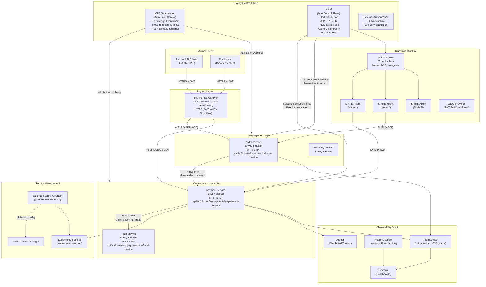

# Zero-Trust Architecture for Kubernetes Microservices

## Table of Contents

- [Design Requirements](#design-requirements)
  - [Functional Requirements](#functional-requirements)
  - [Non-Functional Requirements](#non-functional-requirements)
- [Architecture Overview](#architecture-overview)
- [Component Design](#component-design)
  - [1. Workload Identity: SPIFFE/SPIRE](#1-workload-identity-spiffespire)
  - [2. mTLS with Istio: STRICT PeerAuthentication](#2-mtls-with-istio-strict-peerauthentication)
  - [3. L7 Authorization: Istio AuthorizationPolicy](#3-l7-authorization-istio-authorizationpolicy)
  - [4. Policy as Code: OPA Gatekeeper](#4-policy-as-code-opa-gatekeeper)
  - [5. Kubernetes Network Policies](#5-kubernetes-network-policies)
  - [6. Ingress: External Traffic](#6-ingress-external-traffic)
  - [7. Secrets: External Secrets Operator + IRSA](#7-secrets-external-secrets-operator-irsa)
- [Trade-offs and Alternatives](#trade-offs-and-alternatives)
- [Failure Modes and Mitigations](#failure-modes-and-mitigations)
- [Phased Rollout Strategy](#phased-rollout-strategy)
- [Scaling Considerations](#scaling-considerations)
  - [Current Design Handles](#current-design-handles)
  - [At 10x Scale (500 services)](#at-10x-scale-500-services)
- [Security Design](#security-design)
  - [Zero Trust Principles Applied](#zero-trust-principles-applied)
  - [SOC 2 Controls Mapping](#soc-2-controls-mapping)
- [Cost Considerations](#cost-considerations)
- [Interview Questions](#interview-questions)
  - [Basic](#basic)
  - [Intermediate](#intermediate)
  - [Advanced / Staff Level](#advanced-staff-level)

---

## Design Requirements

### Functional Requirements
- 50 microservices on Kubernetes (EKS or self-managed)
- Mixed traffic: internal service-to-service, external partner-facing APIs, user-facing APIs
- No implicit trust: every request authenticated and authorized regardless of network location
- Compliance: SOC 2 Type II (security, availability, confidentiality trust service criteria)

### Non-Functional Requirements
- Identity: cryptographic workload identity for every service (not network location)
- mTLS: all service-to-service communication encrypted and mutually authenticated
- Authorization: per-request L7 authorization (not just network-level)
- Policy as code: all security policies version-controlled, peer-reviewed, automated
- Latency overhead: < 5ms added per inter-service hop for mTLS + policy enforcement
- Certificate rotation: automated, < 24h certificate lifetime
- Breach containment: lateral movement limited to explicitly allowed paths

---

## Architecture Overview



---

## Component Design

### 1. Workload Identity: SPIFFE/SPIRE

**Why SPIFFE/SPIRE over cert-manager?**
cert-manager issues certificates but relies on Kubernetes ServiceAccount tokens as the identity attestation mechanism, which are tied to the Kubernetes API server. SPIRE provides a vendor-neutral identity framework (SPIFFE) that:
- Works across multiple platforms (VMs, Kubernetes, bare metal)
- Attests node identity via cloud provider APIs (AWS instance identity documents), hardware attestation, or TPM
- Issues short-lived X.509 SVIDs (SPIFFE Verifiable Identity Documents) with a TTL of 1-24 hours
- Enables workload portability without re-issuing identities

**SPIRE Server** (deployed as StatefulSet with persistent storage):
- Acts as the Certificate Authority (CA) or intermediate CA under your PKI
- Holds the trust bundle (root certificate)
- Receives registration entries: `(node selector, workload selector) → SPIFFE ID`
- Example registration: `k8s:node=node-1` + `k8s:pod-label:app=payment-service` → `spiffe://cluster.local/ns/payments/sa/payment-service`

**SPIRE Agent** (deployed as DaemonSet, one per node):
- Attests itself to the SPIRE Server using the node's AWS instance identity document
- Once attested, the agent fetches SVIDs for workloads running on that node
- Exposes the Workload API on a Unix socket; the Envoy sidecar fetches its SVID from this socket (SDS — Secret Discovery Service)
- Certificates are rotated continuously (auto-renew at 50% of TTL)

**SVID format**: X.509 certificate with SAN=`spiffe://cluster.local/ns/<namespace>/sa/<service-account>`. The SPIFFE ID is verifiable by any peer that trusts the SPIRE root CA.

### 2. mTLS with Istio: STRICT PeerAuthentication

Istio manages the Envoy sidecar proxy injected into every pod. The sidecar intercepts all inbound and outbound traffic transparently.

**PeerAuthentication policy (mesh-wide STRICT mode):**
```yaml
apiVersion: security.istio.io/v1beta1
kind: PeerAuthentication
metadata:
  name: default
  namespace: istio-system  # applies mesh-wide
spec:
  mtls:
    mode: STRICT  # reject any plaintext traffic
```

This single policy, applied to the `istio-system` namespace, enforces that every inter-service connection in the mesh uses mTLS. There are no exceptions unless explicitly overridden at namespace or workload level (and those overrides require explicit justification in code review).

**Certificate integration with SPIRE:**
Istio's control plane (Istiod) is configured to use SPIRE as the external CA via the `ca.istio.io/override` annotation. Envoy fetches its certificate via SDS from the SPIRE agent on the same node — no certificates are ever stored in Kubernetes Secrets or ConfigMaps.

**Certificate rotation:** SPIRE issues certificates with 24-hour TTL and renews at 12 hours (50% of lifetime). Envoy SDS receives the new certificate automatically without any connection interruption. This satisfies SOC 2 requirement for certificate lifecycle management.

### 3. L7 Authorization: Istio AuthorizationPolicy

Network policies (L3/L4) alone are insufficient for zero trust — they cannot distinguish between two services sharing the same pod IP range, or enforce HTTP method/path restrictions.

**Example: only order-service can call payment-service POST /payments:**
```yaml
apiVersion: security.istio.io/v1beta1
kind: AuthorizationPolicy
metadata:
  name: payment-service-authz
  namespace: payments
spec:
  selector:
    matchLabels:
      app: payment-service
  action: ALLOW
  rules:
  - from:
    - source:
        principals:
          - "cluster.local/ns/orders/sa/order-service"
    to:
    - operation:
        methods: ["POST"]
        paths: ["/payments"]
```

Every service has a default-deny policy (no rules = deny all), and explicit ALLOW policies for each allowed caller/method/path combination. This is stored in Git, reviewed as code, and applied via GitOps (ArgoCD/Flux).

**Default deny:**
```yaml
apiVersion: security.istio.io/v1beta1
kind: AuthorizationPolicy
metadata:
  name: deny-all
  namespace: payments
spec:
  {}  # empty spec = deny all traffic to all workloads in namespace
```

### 4. Policy as Code: OPA Gatekeeper

OPA Gatekeeper runs as an admission webhook — every `kubectl apply` or Helm deployment is validated before any resource is created in the cluster.

**Key constraint templates:**

| Policy | Enforcement |
|--------|-------------|
| No privileged containers | Block `securityContext.privileged: true` |
| Require resource limits | Block pods without CPU and memory limits |
| Restrict image registries | Allow only `<account>.dkr.ecr.us-east-1.amazonaws.com/*` |
| No `:latest` image tags | Require immutable image digests |
| Require non-root user | Block containers running as UID 0 |
| Require read-only root filesystem | Enforce `readOnlyRootFilesystem: true` where possible |
| Require Pod Disruption Budgets | Ensure availability during node drains |

Policies are defined as `ConstraintTemplate` (Rego logic) and `Constraint` (parameters). Both live in Git and are audited. Gatekeeper also runs in audit mode, continuously scanning existing resources for violations and reporting them as Kubernetes events.

### 5. Kubernetes Network Policies

Network policies are L3/L4 controls enforced by the CNI (Cilium or Calico). They complement Istio's L7 controls — a defense-in-depth layer.

**Default deny per namespace:**
```yaml
apiVersion: networking.k8s.io/v1
kind: NetworkPolicy
metadata:
  name: default-deny-all
  namespace: payments
spec:
  podSelector: {}  # applies to all pods
  policyTypes:
  - Ingress
  - Egress
```

Then explicit allow policies per service pair. The combination of network policy (L3/L4) + Istio AuthorizationPolicy (L7) means an attacker needs to bypass both independent controls to achieve lateral movement.

### 6. Ingress: External Traffic

**Istio Ingress Gateway** (not nginx-ingress) for external traffic:
- Terminates TLS using ACM/cert-manager certificate
- Validates JWT tokens using `RequestAuthentication`:

```yaml
apiVersion: security.istio.io/v1beta1
kind: RequestAuthentication
metadata:
  name: jwt-auth
  namespace: istio-system
spec:
  jwtRules:
  - issuer: "https://auth.company.com"
    jwksUri: "https://auth.company.com/.well-known/jwks.json"
```

- Istio validates the JWT signature, expiry, and audience before the request reaches any backend service.
- Partner APIs use client certificate mTLS in addition to JWT (two-factor authentication at the edge).

### 7. Secrets: External Secrets Operator + IRSA

- **No AWS credentials on pods**: EKS pods use IRSA (IAM Roles for Service Accounts) — the pod's ServiceAccount is annotated with an IAM role ARN. AWS injects a projected token; the ESO webhook exchanges it for temporary STS credentials.
- **ESO pulls secrets from AWS Secrets Manager** and creates Kubernetes Secrets. Secrets are refreshed every 60 seconds (configurable TTL).
- **Secrets never in Git**: environment variables reference Kubernetes Secret names (not values). OPA Gatekeeper blocks pods with hardcoded env var values matching secret patterns.
- **Encryption at rest**: Kubernetes Secrets are encrypted at rest using KMS envelope encryption (EKS managed key, or CMK).

---

## Trade-offs and Alternatives

| Decision | Chosen | Alternative | Why Chosen |
|----------|--------|-------------|------------|
| SPIRE for identity | SPFFE/SPIRE | cert-manager + SPIFFE IDs | SPIRE provides hardware attestation, multi-platform support, and true workload identity beyond k8s |
| Istio sidecars | Envoy sidecar injection | Istio ambient mode | Ambient mode reduces resource overhead but is newer (alpha/beta) — sidecar is production-proven |
| OPA Gatekeeper | Admission control | Kyverno | OPA/Rego is more expressive; Gatekeeper has better enterprise tooling; Kyverno has simpler YAML syntax |
| Cilium CNI | Network policies | Calico | Cilium uses eBPF for better performance, Hubble for network observability, and L7-aware policies |
| Strict mTLS from day 1 | STRICT PeerAuthentication | PERMISSIVE then STRICT | PERMISSIVE allows plaintext and creates a window where security is assumed but not enforced |

---

## Failure Modes and Mitigations

| Component | Failure Mode | Detection | Mitigation |
|-----------|-------------|-----------|------------|
| SPIRE Server crash | No new SVIDs issued | Existing SVIDs still valid for remaining TTL; monitor SPIRE server health | SPIRE Server HA (3-node Raft cluster); existing certs valid for 24h |
| SPIRE Agent crash | Pods on that node cannot renew certificates | Node-level SPIRE agent health check | Pods continue with cached SVID until TTL; DaemonSet restarts agent |
| Istiod crash | No new xDS config pushed | Existing Envoy config still enforces last known policy | Istiod HA (3 replicas); Envoy caches last good config |
| OPA Gatekeeper crash | Webhook unavailable | Admission webhook timeout | Set `failurePolicy: Fail` for security policies, `Ignore` for non-critical to avoid deployment outage |
| mTLS cert expiry | All inter-service calls fail | Prometheus metric: `istio_requests_total{response_code="503"}` | Short-lived certs with automated renewal; alert at 80% of TTL |
| JWT JWKS endpoint unavailable | All external requests fail | Error rate spike on ingress gateway | Cache JWKS with 5-minute TTL; alert on JWKS fetch failures |
| Network Policy misconfiguration | Traffic unexpectedly blocked | Service error rates, Hubble flow drops | Canary approach: test in staging; Hubble shows dropped flows with policy name |

---

## Phased Rollout Strategy

Zero trust cannot be switched on overnight. A phased approach by namespace avoids production outages.

```
Phase 1: Observability (weeks 1-4)
  - Install Istio in permissive mode (mTLS optional)
  - Deploy Hubble and enable flow logging
  - Map all actual service-to-service communication
  - Identify undocumented connections

Phase 2: mTLS enforcement (weeks 5-8)
  - Namespace by namespace, switch from PERMISSIVE to STRICT
  - Start with low-risk namespaces (non-production services)
  - Monitor error rates; roll back if >0.1% error increase

Phase 3: AuthorizationPolicy (weeks 9-16)
  - Apply default-deny per namespace
  - Create explicit ALLOW policies based on observed traffic (from Phase 1)
  - Run in audit mode first; review violations before enforcing

Phase 4: OPA Gatekeeper (weeks 17-20)
  - Start with audit mode: identify all violations without blocking
  - Fix violations in application code/Helm charts
  - Switch to enforce mode namespace by namespace

Phase 5: SPIRE integration (weeks 21-28)
  - Replace cert-manager with SPIRE for certificate issuance
  - Validate SVIDs are correctly assigned
  - Enable SPIRE-based AuthorizationPolicy source principals
```

---

## Scaling Considerations

### Current Design Handles
- 50 microservices with sidecar injection: ~50 Envoy proxies, each consuming ~50MB RAM + ~0.1 CPU core = significant overhead
- mTLS overhead: ~2ms per hop for TLS handshake (amortized via connection reuse), ~0.5ms for crypto on modern hardware
- SPIRE Server: handles ~10K certificate requests/minute

### At 10x Scale (500 services)
1. **Istio ambient mode**: replace per-pod sidecars with per-node L4 proxy (ztunnel) and shared L7 proxy (waypoint). Eliminates 500 sidecar proxies; reduces CPU/memory overhead by ~60-70%.
2. **SPIRE Server federation**: split into domain-specific SPIRE servers (one per cluster or business domain), federated via trust bundle exchange.
3. **AuthorizationPolicy explosion**: 500 services × N policies = thousands of policies. Use OPA with policy aggregation, or Istio's `WorkloadGroup` and `ServiceEntry` abstractions to reduce policy cardinality.
4. **Istiod scalability**: one Istiod instance handles ~1000 sidecars; at 500 services with multiple replicas each, deploy multiple Istiod replicas per cluster.
5. **Observability volume**: Jaeger trace sampling must be reduced (1% or head-based sampling); Prometheus federation or Thanos for long-term metrics at scale.

---

## Security Design

### Zero Trust Principles Applied

| Principle | Implementation |
|-----------|---------------|
| Never trust, always verify | Every request validated: identity (SPIFFE SVID) + policy (AuthorizationPolicy) |
| Least privilege access | Per-service ALLOW policies; default deny everywhere |
| Assume breach | Lateral movement limited to explicitly authorized paths; Hubble detects anomalous flows |
| Verify explicitly | JWT validation at ingress; mTLS client cert at every service hop |
| Minimize blast radius | Namespace isolation; network policies prevent cross-namespace lateral movement |

### SOC 2 Controls Mapping

| SOC 2 Criteria | Control |
|---------------|---------|
| CC6.1 Logical access controls | SPIFFE identity + Istio AuthorizationPolicy |
| CC6.3 Authentication | mTLS mutual authentication + JWT validation |
| CC6.6 Restrict inbound network | Network Policy default deny + Istio STRICT mTLS |
| CC7.2 Monitor for anomalies | Hubble flow anomalies, Prometheus error rate alerts |
| CC8.1 Change management | OPA Gatekeeper admission control, GitOps for policies |
| A1.1 Availability measures | Istio HA (3 Istiod replicas), SPIRE HA |

---

## Cost Considerations

| Component | Cost Driver | Optimization |
|-----------|------------|--------------|
| Istio sidecar overhead | 50MB RAM + 0.1 CPU per pod | Ambient mode at 10x scale; right-size sidecar resource limits |
| SPIRE Server | EC2 instance or Fargate for HA | Single SPIRE Server per cluster is sufficient up to 1000 nodes |
| OPA Gatekeeper | CPU for Rego evaluation on admission | Negligible; <1ms per admission webhook |
| Hubble/Cilium | eBPF overhead: ~2-3% CPU per node | Sampling for high-frequency flows |
| Jaeger storage | Trace storage in S3/Elasticsearch | Adaptive sampling; retain traces for only 7 days in hot storage |
| IRSA/ESO | No additional cost beyond API calls | Minimal |

---

## Interview Questions

### Basic

**Q: What is the difference between zero trust and perimeter security?**
A: Perimeter security assumes everything inside the network boundary is trusted (castle-and-moat model). Zero trust assumes no implicit trust based on network location — every request must be authenticated, authorized, and encrypted regardless of whether it comes from inside or outside the network. In a Kubernetes cluster, this means a compromised pod cannot talk to other services just because it is on the same network.

**Q: What is mTLS and how does it differ from regular TLS?**
A: Regular TLS authenticates only the server to the client (the client verifies the server's certificate). mTLS (mutual TLS) authenticates both parties — both the client and server present and verify certificates. In service mesh context, this means service A proves its identity to service B, and vice versa, before any application data is exchanged. This prevents a compromised service from impersonating a different service.

**Q: What is a SPIFFE ID and why is it useful?**
A: A SPIFFE ID is a URI in the format `spiffe://<trust-domain>/<workload-path>` that uniquely identifies a workload, regardless of its network address. It is useful because IP addresses and hostnames change (pod restarts, scaling events), but the SPIFFE ID is stable. Authorization policies can be written against SPIFFE IDs rather than IPs, making them resilient to infrastructure changes.

### Intermediate

**Q: How do you handle the bootstrap problem in SPIRE — how does the first workload get its identity?**
A: SPIRE solves this through node attestation and workload attestation. Node attestation: the SPIRE Agent on a new node proves its identity to the SPIRE Server using the cloud provider's instance identity document (e.g., AWS IID). AWS confirms the node is genuinely running in the account. Workload attestation: the SPIRE Agent (running as root/privileged on the node) observes which pods are running and their Kubernetes metadata (namespace, ServiceAccount, labels). It matches this against registration entries to issue the correct SVID. The pod itself never needs to do anything — it just calls the Workload API on the local Unix socket, and the agent responds with the appropriate SVID.

**Q: OPA Gatekeeper uses `failurePolicy: Fail` for security policies. What is the blast radius if Gatekeeper becomes unavailable?**
A: With `failurePolicy: Fail`, if the Gatekeeper webhook is unavailable, all new resource admissions (pod creates, deployments, config changes) will fail until Gatekeeper recovers. This means no new deployments can happen during an outage. The trade-off is intentional for security-critical policies (e.g., no privileged containers) — allowing deployments to proceed without security validation is worse than a brief deployment freeze. Mitigation: run Gatekeeper with 3+ replicas across AZs, and use `failurePolicy: Ignore` for non-security-critical policies (e.g., labeling conventions) to avoid blocking deployments for cosmetic violations.

**Q: A new microservice team wants to join the mesh. Walk me through the onboarding process.**
A:

1. Namespace creation with standard labels (`istio-injection: enabled`) and default-deny NetworkPolicy
2. SPIRE registration entries created for the new service's ServiceAccount
3. OPA Gatekeeper automatically validates all resources on admission
4. Start with Istio PERMISSIVE mode for 1 week to observe actual traffic patterns using Hubble
5. Define AuthorizationPolicy ALLOW rules based on observed traffic
6. Switch to STRICT PeerAuthentication
7. Set up Prometheus alerts for the service's error rate and mTLS status
8. Create ExternalSecret for any AWS Secrets Manager dependencies. The whole process is codified as a Terraform module + Helm chart.

### Advanced / Staff Level

**Q: How do you detect and respond to a compromised pod in a zero-trust mesh?**
A: Detection has multiple layers:

1. **Hubble/Cilium** detects flows to services not in the AuthorizationPolicy ALLOW list (these are blocked and logged)
2. **Falco** or **Tetragon** (eBPF-based) detects anomalous syscalls (unexpected network connections, file system access, privilege escalation attempts) within the pod
3. **Prometheus alerts** on sudden changes in service call patterns (a service that never called payment-service suddenly making requests)
4. **SPIRE audit logs** showing certificate requests for unexpected SPIFFE IDs. Response:
5. Immediately revoke the SPIFFE SVID for the compromised workload — SPIRE Server removes the registration entry, existing certs expire within 24h (or 1h if short TTL), and Envoy will not renew
6. Scale the deployment to zero to kill existing pods
7. Cordon the node if node-level compromise is suspected
8. Use Hubble to review all connections the pod made before detection
9. Trigger incident response. Key insight: because every connection requires a valid SVID and passes through Envoy, the attacker's lateral movement options are extremely limited even after compromise.

**Q: The Istio control plane (Istiod) crashes during a production incident. What happens to traffic?**
A: Envoy proxies continue to enforce the last known configuration. This is Envoy's design — it operates independently of the control plane once configured. Running traffic using existing connections continues unaffected. New connections also work because Envoy's cert cache (from SPIRE SDS) remains valid until certificate TTL. What does NOT work: new AuthorizationPolicies will not be pushed; new service registrations (new pods, new services) will not be discovered by existing Envoys; certificate renewals will fail if SPIRE integration also goes down. Recovery: Istiod is deployed as a 3-replica deployment — it should restart automatically. Operator action: verify Istiod pod health, check etcd/API server connectivity, ensure SPIRE Server is healthy. The blast radius of Istiod downtime is limited to configuration freshness, not to complete traffic loss — this is a key design property of the xDS protocol.

**Q: Compare SPIRE + Istio to a simpler cert-manager + Kubernetes NetworkPolicy approach for a 10-service startup. When does the complexity of ZTA pay off?**
A: For a 10-service startup with a single Kubernetes cluster and a small team, cert-manager + NetworkPolicy is the right choice. It provides mTLS between services (cert-manager issues certificates per ServiceAccount), network-level isolation (NetworkPolicy), and is much simpler to operate. SPIRE's value emerges when:

1. you have multi-cluster or multi-cloud deployments where a single k8s-native CA is insufficient
2. you need hardware attestation (regulated industries)
3. you have non-Kubernetes workloads (VMs, Lambda) that need the same identity fabric
4. you need cross-cluster federation. Istio over a simpler alternative is justified when: you need L7 authorization (HTTP method/path), traffic management (canary, circuit breaking), and unified observability across 20+ services. The inflection point is roughly 15-20 services where ad-hoc service-to-service auth becomes unmanageable, or when cross-platform identity is required. Never choose complexity for its own sake — choose it when the problem requires it.
