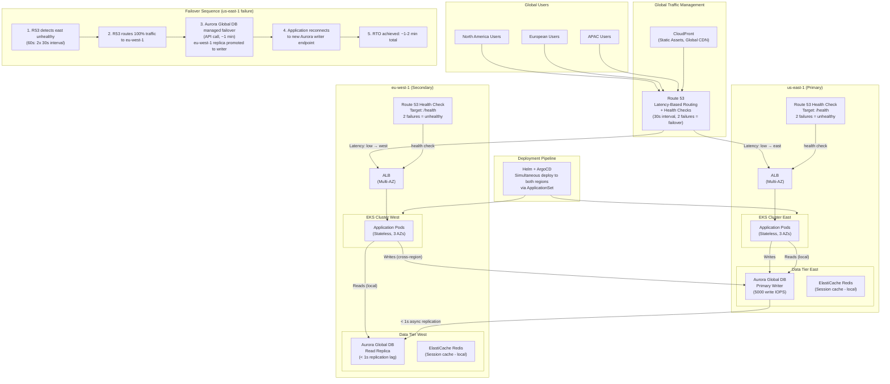

# Active-Active Multi-Region Architecture on AWS

## Table of Contents

- [Design Requirements](#design-requirements)
  - [Functional Requirements](#functional-requirements)
  - [Non-Functional Requirements](#non-functional-requirements)
- [Architecture Overview](#architecture-overview)
- [Component Design](#component-design)
  - [Global Traffic Management: Route 53](#global-traffic-management-route-53)
  - [Compute: EKS in Both Regions](#compute-eks-in-both-regions)
  - [Data Tier: Aurora Global Database](#data-tier-aurora-global-database)
  - [Session State: JWT Tokens (Stateless Approach)](#session-state-jwt-tokens-stateless-approach)
  - [Cross-Region Traffic and In-Flight Requests](#cross-region-traffic-and-in-flight-requests)
- [Trade-offs and Alternatives](#trade-offs-and-alternatives)
  - [Active-Active vs Active-Passive](#active-active-vs-active-passive)
- [Failure Modes and Mitigations](#failure-modes-and-mitigations)
- [Scaling Considerations](#scaling-considerations)
  - [Current Design Handles](#current-design-handles)
  - [At 10x Scale](#at-10x-scale)
- [Security Design](#security-design)
  - [Cross-Region Security Controls](#cross-region-security-controls)
  - [Blast Radius Containment](#blast-radius-containment)
- [Cost Considerations](#cost-considerations)
  - [Major Cost Drivers](#major-cost-drivers)
  - [Cost Optimization](#cost-optimization)
- [Chaos Engineering and Testing](#chaos-engineering-and-testing)
  - [Monthly Chaos Tests](#monthly-chaos-tests)
- [Interview Questions](#interview-questions)
  - [Basic](#basic)
  - [Intermediate](#intermediate)
  - [Advanced / Staff Level](#advanced-staff-level)

---

## Design Requirements

### Functional Requirements
- Two AWS regions: us-east-1 (primary) and eu-west-1 (secondary)
- Global user base with traffic routed to nearest healthy region
- Stateless application tier deployable to both regions simultaneously
- Relational data (PostgreSQL-compatible) with synchronization across regions

### Non-Functional Requirements
- RTO (Recovery Time Objective): < 1 minute
- RPO (Recovery Point Objective): < 5 seconds
- Availability: 99.99% (< 52 minutes downtime/year)
- Active-active: both regions serve live traffic simultaneously (not just standby)
- Failover: automatic, without manual intervention
- Data consistency: eventual consistency for reads acceptable; writes acknowledged only when durable
- Compliance: GDPR data residency (EU users' data must stay in eu-west-1 for certain data classes)

---

## Architecture Overview



---

## Component Design

### Global Traffic Management: Route 53

**Latency-based routing** selects the region with the lowest measured round-trip latency from the user's source IP. AWS maintains a database of latency measurements between edge locations and regions, updated periodically.

**Health check configuration:**
```
Type: HTTPS
Endpoint: /health (application-level, not just TCP)
Request interval: 30 seconds
Failure threshold: 2 consecutive failures
= 60 seconds maximum detection time
```

The `/health` endpoint is not a shallow ping — it verifies:
1. Application process is running (200 OK)
2. Database connectivity (can execute a lightweight query)
3. Cache connectivity (can reach ElastiCache)
4. Returns degraded (503) if any dependency is unavailable

**Failover record configuration:**
- Primary record: latency-based, us-east-1 ALB DNS name, associated with health check
- Secondary record: latency-based, eu-west-1 ALB DNS name, associated with health check
- Route 53 evaluates both health checks continuously; when one region fails, all traffic automatically routes to the healthy region

**TTL consideration:** Route 53 health check failover overrides the DNS TTL — DNS clients that have cached the failed record will continue to get the old response until their TTL expires. To minimize this window, set the ALB DNS record TTL to 60 seconds (Route 53 health check records bypass TTL for the failover record itself, but clients may have cached earlier responses).

### Compute: EKS in Both Regions

**Identical cluster configuration** in both regions managed via Terraform with region as a variable.

**Simultaneous deployment via ArgoCD ApplicationSet:**
```yaml
apiVersion: argoproj.io/v1alpha1
kind: ApplicationSet
spec:
  generators:
  - list:
      elements:
      - cluster: eks-east
        region: us-east-1
      - cluster: eks-west
        region: eu-west-1
  template:
    spec:
      destination:
        server: "{{cluster}}"
      source:
        helm:
          parameters:
          - name: region
            value: "{{region}}"
```

Both clusters receive the same Helm chart version simultaneously. Rollout uses ArgoCD's progressive sync to validate the east deployment before proceeding to west (or simultaneously if risk appetite allows).

**Statelessness is mandatory:** Applications must not store user session state in local memory. Session state is stored in ElastiCache (JWT tokens preferred as they are stateless by design — no cache lookup required).

### Data Tier: Aurora Global Database

Aurora Global Database is the critical design choice for meeting the < 5 second RPO:

**Architecture:**
- Primary cluster in us-east-1: handles all writes, up to 128TB storage
- Read replica cluster in eu-west-1: serves reads locally (reduces latency for EU users), lag typically < 100ms (well under the 5s RPO requirement)
- Replication uses Aurora's dedicated storage-layer replication path, not MySQL/PostgreSQL logical replication — this is why the lag is so low

**Write routing:** All writes go to the primary cluster (us-east-1), even from the eu-west-1 application tier. This adds ~80ms cross-region latency for EU write operations, which is a fundamental trade-off: strong consistency requires writes to go to a single writer.

**Read routing:** Application in eu-west-1 reads from the local Aurora replica endpoint. Application in us-east-1 reads from the primary. Each region's application is configured with:
- Writer endpoint: us-east-1 Aurora cluster writer endpoint (cross-region for eu-west-1 app)
- Reader endpoint: local region's Aurora cluster reader endpoint

**Managed failover procedure (when us-east-1 fails):**
```
1. Aurora detects primary failure (typically within 30s)
2. Operator (or automation) calls: aws rds failover-global-cluster
3. Aurora promotes eu-west-1 replica to primary writer (~1 minute)
4. Aurora updates the cluster endpoints (DNS CNAME flip)
5. Applications reconnect to the new writer (connection pool retry logic)
```

Aurora's managed failover is not fully automatic for Global Database — it requires an API call. This can be automated via a Lambda function triggered by a CloudWatch alarm on Aurora primary DB instance metrics, or via AWS Fault Injection Simulator in testing.

### Session State: JWT Tokens (Stateless Approach)

**Decision: stateless JWT tokens instead of Redis session sync.**

Distributing Redis state across regions introduces a new replication problem:
- Redis Cluster does not support native cross-region replication
- ElastiCache Global Datastore supports cross-region replication but with eventual consistency (users may see stale session data briefly after failover)
- Any approach involving session sync adds complexity and creates another potential RPO risk

**JWT approach:**
- Server issues a signed JWT (RS256 or ES256) on login; private key stored in Secrets Manager
- Token contains all session state needed for authorization (user ID, roles, permissions)
- Application validates the JWT signature using the public key (fetched from JWKS endpoint)
- JWKS endpoint is served from both regions (public keys replicated via Secrets Manager cross-region replication)
- On failover to eu-west-1: existing JWTs are still valid because the public keys are available in eu-west-1

**Trade-off:** JWTs cannot be revoked before expiry without a distributed blocklist. If a user's token is compromised, you need a Redis blocklist checked on every request. Acceptable for most applications with short token TTLs (15 minutes); high-security contexts may require ElastiCache Global Datastore for the revocation list only.

### Cross-Region Traffic and In-Flight Requests

When us-east-1 becomes unhealthy and Route 53 starts routing new connections to eu-west-1:

**In-flight request handling:**
1. Existing TCP connections to us-east-1 ALB continue until the connection closes or times out
2. New DNS lookups resolve to eu-west-1 (after TTL expiry and health check failover)
3. ALB in us-east-1 has a **deregistration delay** (connection draining): 30 seconds before forcibly closing connections to unhealthy targets
4. Applications should implement **retry with exponential backoff** on connection errors to automatically hit the new endpoint

**504 fallback strategy:**
- If a request to us-east-1 times out (after 5s timeout), the client should retry against the eu-west-1 endpoint
- API clients should be configured with region-fallback logic in their retry policy
- For browser clients: Route 53 DNS failover handles this transparently once TTL expires

**GDPR data residency during failover:**
- When EU users are routed to us-east-1 during eu-west-1 outage, their request data temporarily flows to us-east-1
- Mitigation: encrypt all EU user data at the application layer with EU-region-managed KMS keys; non-EU infra cannot decrypt
- Document the temporary cross-border transfer in the incident record for GDPR Art. 30 records

---

## Trade-offs and Alternatives

| Decision | Chosen | Alternative | Why Chosen |
|----------|--------|-------------|------------|
| Active-active | Both regions serve traffic | Active-passive | Better RTO (no warm-up needed), better utilization, lower blast radius per region |
| Aurora Global DB | Storage-layer replication | DynamoDB Global Tables | SQL/relational model required; Aurora gives < 1s lag; DynamoDB is NoSQL |
| Aurora Global DB | Managed replication | PostgreSQL logical replication | Aurora abstraction handles split-brain prevention; logical replication requires manual management |
| JWT sessions | Stateless tokens | Redis ElastiCache Global Datastore | Eliminates session sync problem; simpler failover; Redis Global Datastore still needed for revocation |
| Route 53 latency routing | L-DNS-based routing | AWS Global Accelerator | Route 53 is cheaper; Global Accelerator provides anycast and faster failover (~30s vs 60s) |
| ArgoCD ApplicationSet | GitOps multi-cluster deploy | Manual Helm releases per region | Drift prevention; simultaneous deploys; audit trail |
| Same AMI/image both regions | Identical compute | Region-specific optimizations | Operational simplicity; predictable behavior; image promotion pipeline handles this |

### Active-Active vs Active-Passive

| Aspect | Active-Active | Active-Passive |
|--------|--------------|----------------|
| RTO | ~1 minute (DNS propagation) | ~5-15 minutes (warm-up + DNS) |
| Cost | 2x infrastructure | 1.5x (passive region smaller) |
| Write handling | Writes must go to single writer (Aurora) | All writes go to active |
| Complexity | Higher (data consistency, write routing) | Lower (standby does nothing until needed) |
| Traffic distribution | Load spread across regions | 100% in active region |

**Recommendation:** Active-active when RTO < 1 minute is required and the cost is justified. Active-passive when RTO of 5-15 minutes is acceptable and cost is constrained.

---

## Failure Modes and Mitigations

| Failure Scenario | Impact | Detection | Mitigation |
|-----------------|--------|-----------|------------|
| Full region failure (us-east-1) | 100% traffic must move to eu-west-1 | Route 53 health check (60s) | Auto-failover via health check; Aurora managed failover (manual trigger); validate capacity in eu-west-1 |
| Aurora primary failure | Writes fail; reads continue from replica | Aurora CloudWatch metric `DatabaseConnections=0` | Auto-promote in Aurora Multi-AZ (within same region, ~30s); Global DB failover for full region loss |
| Aurora replication lag spike | RPO risk if lag > 5s | CloudWatch `AuroraGlobalDBReplicationLag` | Alert at 2s lag; investigate write throughput; scale instance type |
| Route 53 health check false positive | Unnecessary failover | Correlated: check both R53 and ALB metrics | Set threshold to 2 failures, not 1; use application-level health check that filters transient errors |
| Deployment failure in eu-west-1 | eu-west-1 is unhealthy during failover | ArgoCD sync failure; ALB health check fails | Halt deployment pipeline; Route 53 marks eu-west-1 unhealthy; never deploy both regions simultaneously |
| Split-brain after failover | Both regions attempt to be writer | Aurora prevents this at storage layer | Aurora Global Database enforces single writer; application must use correct writer endpoint |
| DNS cache poisoning / stale cache | Users stuck on failed region | Client-side DNS errors | Short TTL (60s); retry logic in clients; CloudFront for static assets bypasses DNS entirely |

---

## Scaling Considerations

### Current Design Handles
- EKS: 100-500 pods per region, scales via HPA/KEDA
- Aurora Global DB: 128TB storage, ~100K read IOPS (with read replicas), ~5K write IOPS
- Route 53: unlimited DNS queries, health checks scale automatically
- Cross-region replication: Aurora handles up to 5 secondary regions

### At 10x Scale
1. **Write amplification**: Aurora single writer becomes the bottleneck. Solutions: (a) **Aurora Limitless** (distributed writes, MySQL-compatible, preview); (b) Application-level sharding by user/tenant with different Aurora clusters per shard; (c) Move to DynamoDB Global Tables for high-write-throughput entities.
2. **Cross-region write latency**: At 10x write volume, 80ms round-trip per write from eu-west-1 to us-east-1 writer becomes significant. Evaluate **CRDTs** (conflict-free replicated data types) for data that can be merged, eliminating single-writer requirement.
3. **DNS latency** is not a bottleneck — add more regions instead. Route 53 supports up to 6 latency-based records; adding APAC regions (ap-southeast-1) reduces latency for Asian users.
4. **EKS cluster limits**: a single EKS cluster supports ~5000 nodes. At 10x scale with 50K pods, use multiple clusters per region behind a single ALB (via AWS Load Balancer Controller cross-cluster routing).
5. **Aurora replication fan-out**: adding 5 secondary regions means the Aurora primary replicates to 5 remote clusters. Monitor `AuroraGlobalDBReplicationLag` per secondary; scale up primary instance to handle replication overhead.
6. **Observability at scale**: Prometheus federation or Thanos for cross-region metrics aggregation; centralized logging with cross-region S3 replication.

---

## Security Design

### Cross-Region Security Controls

| Control | Implementation |
|---------|---------------|
| Data encryption in transit | TLS 1.3 everywhere; Aurora replication encrypted via TLS |
| Data encryption at rest | Aurora encrypted with KMS CMK (separate CMK per region) |
| Cross-region KMS key sharing | KMS multi-region key (same key material in both regions, independent key IDs) |
| Access control | IAM roles per region; no cross-region role assumption except for DR automation |
| Secrets replication | Secrets Manager automatic cross-region replication for shared secrets (JWT signing keys, API keys) |
| Network isolation | VPCs in both regions, peered or connected via Transit Gateway for operational access only |
| Audit logging | CloudTrail in both regions, logs aggregated to a central compliance S3 bucket |

### Blast Radius Containment
- Compromised us-east-1 credentials cannot access eu-west-1 (separate IAM contexts)
- Aurora Global DB failover can only be triggered from the primary region or by an authorized operator role
- Route 53 health check modification requires explicit IAM permission (`route53:ChangeResourceRecordSets` on health check records)

---

## Cost Considerations

### Major Cost Drivers

| Component | Estimated Monthly Cost | Notes |
|-----------|----------------------|-------|
| EKS clusters (x2) | $144 ($72/cluster) | Control plane only; node costs separate |
| EC2 nodes both regions | $2,000-10,000 | Depends on instance types and count |
| Aurora Global DB | $1,500-4,000 | Primary + 1 replica cluster; instance type dependent |
| Cross-region data transfer | $200-2,000 | Aurora replication + application cross-region writes |
| Route 53 health checks | $3/check/month | 2 health checks + latency records: ~$10/month |
| NAT Gateways (6 total) | $576 | $32 × 3 AZs × 2 regions |
| Data transfer out | Variable | Largest cost driver at high traffic |

### Cost Optimization
- **Reserved Instances**: 40-60% savings on Aurora and EC2; commit to 1-year for stable workloads.
- **Scale down eu-west-1 during primary health**: reduce eu-west-1 EKS node count to minimum (warm standby) during normal operations. Trade-off: failover requires scale-out (adds 3-5 minutes to RTO).
- **Aurora Global DB vs read replicas**: if RPO of 30 seconds is acceptable, standard Aurora cross-region read replicas are ~50% cheaper than Global Database.
- **Consolidated billing**: use AWS Organizations to pool Reserved Instance and Savings Plans across both region accounts.

---

## Chaos Engineering and Testing

### Monthly Chaos Tests

| Test | Procedure | Success Criteria |
|------|-----------|-----------------|
| Route 53 health check failover | Manually fail the /health endpoint in us-east-1 | Traffic shifts to eu-west-1 within 90s |
| Aurora Global DB failover | Call `aws rds failover-global-cluster` | eu-west-1 promoted; writes succeed within 2 minutes |
| AZ failure simulation | Terminate all EC2/EKS nodes in one AZ | No traffic loss; remaining AZs absorb load |
| Network partition | Security Group rule blocks traffic between app and Aurora | Application returns 503 gracefully; no data corruption |
| Deployment failure | Push a bad image to eu-west-1 | Deployment paused; Route 53 excludes eu-west-1; east serves all traffic |

**Game Day** (quarterly):
- Simulate a full us-east-1 region failure during business hours
- Measure actual RTO and RPO (clock from failure event to full service in eu-west-1)
- Validate that the Aurora replication lag at the moment of failure was within RPO
- Document and improve runbook based on findings

---

## Interview Questions

### Basic

**Q: What is the difference between RTO and RPO?**
A: RTO (Recovery Time Objective) is the maximum acceptable time the system can be unavailable after a failure — how long before service is restored. RPO (Recovery Point Objective) is the maximum acceptable amount of data loss measured in time — how far back in time can you afford to restore from. Example: RTO = 1 minute means the system must be serving traffic within 1 minute of failure. RPO = 5 seconds means you cannot lose more than 5 seconds of transactions. Lower RTO and RPO require more expensive, real-time replication and automation.

**Q: Why does active-active require stateless application servers?**
A: In active-active, any request might be served by any region. If an application server stores state locally (user session in memory, local file uploads), a user whose next request is served by a different server (or different region) will lose that state. Stateless servers store all state externally (database, cache, object storage), so any server can serve any request with the same result. This also enables horizontal scaling and replacement of failed instances without data loss.

**Q: How does Route 53 latency-based routing decide which region to send traffic to?**
A: Route 53 maintains a continuously updated database of measured latency between AWS edge locations (Route 53 resolver locations) and AWS regions. When a DNS query arrives, Route 53 maps the client's IP to an edge location and selects the record with the lowest measured latency to a region that is also healthy (health check passing). It is not real-time measurement per query — it uses aggregate latency data, so it approximates optimal routing rather than guaranteeing it.

### Intermediate

**Q: Aurora Global Database has < 1s replication lag. How does this work technically?**
A: Aurora's storage layer is decoupled from the compute layer. When a write occurs on the primary, the storage layer writes redo log records to a distributed storage fleet (6 copies across 3 AZs). For Global Database, these redo log records are replicated to the secondary region's storage fleet asynchronously, directly at the storage layer — not through the database engine. This is faster than logical replication (which requires the engine to apply changes) and is why the lag is measured in milliseconds rather than seconds. The secondary cluster's compute nodes read from the secondary storage fleet and serve reads.

**Q: How do you handle in-flight write requests when failing over from us-east-1 to eu-west-1?**
A: Three categories:

1. **Requests in flight on us-east-1 that haven't received Aurora acknowledgment**: these are lost (within the RPO window of < 5s). The application should use idempotency keys so clients can retry without double-executing.
2. **Requests in flight on us-east-1 that received Aurora ACK but the response hasn't reached the client**: these are committed in Aurora; after failover, the data is in eu-west-1. Client timeout triggers a retry with the idempotency key; the application sees the data already exists and returns success.
3. **New requests during the 60-second detection window**: these hit the unhealthy us-east-1 and fail at the application level. Clients should retry immediately; Route 53 will redirect them to eu-west-1 after failover completes. The application must return a retryable error code (503 with `Retry-After` header).

**Q: GDPR requires that EU user data not leave the EU. How do you handle this in an active-active multi-region architecture?**
A: Three-layer approach:

1. **Routing layer**: use Route 53 geolocation routing (not just latency) to route EU users to eu-west-1 exclusively for GDPR-sensitive endpoints. This ensures the primary request path stays in the EU.
2. **Data layer**: EU user data is stored in eu-west-1 Aurora cluster with a separate KMS CMK managed in eu-west-1. Cross-region replication to us-east-1 is disabled for tables containing personal data; only non-personal operational data replicates globally.
3. **Failover exception**: document in legal agreements that temporary processing in us-east-1 during eu-west-1 outage constitutes a "transfer under necessity" per GDPR Article 49
4. (c). Implement application-layer encryption for personal data with EU-region-only keys so that us-east-1 cannot decrypt personal data even during failover.

### Advanced / Staff Level

**Q: Design the Aurora Global Database failover automation to meet the 1-minute RTO without a human in the loop.**
A: A Lambda-based automation triggered by CloudWatch alarms:

1. **Alarm**: `AuroraGlobalDBReplicationLag` is 0 (primary has disappeared) and `RDS DatabaseConnections` for the primary falls to 0, or `AWS/RDS CPUUtilization` flatlines. Combine with Route 53 health check state change (secondary region is healthy).
2. **Lambda execution**: (a) Verify the primary is genuinely down (not a transient blip) by checking at least 3 consecutive health check failures across multiple CloudWatch data points; (b) Call `rds:FailoverGlobalCluster` API targeting eu-west-1 as the new primary; (c) Update SSM Parameter Store with the new writer endpoint (applications read writer endpoint from Parameter Store, not hardcoded); (d) Update Route 53 records if needed; (e) Page on-call with incident details. Total automation time: ~90-120 seconds from detection to eu-west-1 serving writes. Risk management: add a manual approval gate for production failover using SNS + human confirmation to prevent automation-triggered split-brain; build the automation to be safe to run twice (idempotent API calls).

**Q: How do you safely test the multi-region failover without impacting production users?**
A: Three levels of testing:

1. **Synthetic failover in lower environment**: replicate the full production architecture in a staging account with reduced instance sizes; run the full failover procedure monthly; validate RTO/RPO measurements.
2. **Production health check manipulation**: without failing actual infrastructure, update the Route 53 health check to point to a dedicated `/healthcheck-failover-test` endpoint that you temporarily return 503 from. Observe that Route 53 correctly marks the region unhealthy and routes traffic to the other region. Restore immediately. This tests the detection and routing path without touching the database.
3. **Full Game Day**: once per quarter, with executive sponsorship and user communication, trigger a real failover: (a) Quiesce the Aurora primary by revoking application IAM permissions to the primary endpoint (not deleting anything); (b) Observe Aurora replication lag → 0; (c) Trigger managed failover; (d) Measure time from trigger to eu-west-1 accepting writes; (e) Restore operations. Key measurement: the gap between Aurora primary going offline and the last committed transaction timestamp — this is your actual RPO at the time of the test.
