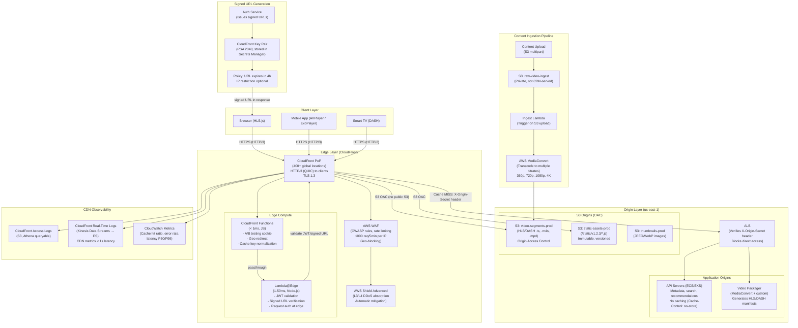

# CDN and Edge Architecture for High-Traffic Media Platform

## Table of Contents

- [Design Requirements](#design-requirements)
  - [Functional Requirements](#functional-requirements)
  - [Non-Functional Requirements](#non-functional-requirements)
- [Architecture Overview](#architecture-overview)
- [Component Design](#component-design)
  - [CloudFront Distribution Configuration](#cloudfront-distribution-configuration)
  - [Origin Protection: Custom Header + ALB](#origin-protection-custom-header-alb)
  - [TLS Configuration](#tls-configuration)
  - [Video Streaming: HLS/DASH Architecture](#video-streaming-hlsdash-architecture)
  - [Edge Compute: CloudFront Functions vs Lambda@Edge](#edge-compute-cloudfront-functions-vs-lambdaedge)
  - [Cache Invalidation Strategy](#cache-invalidation-strategy)
  - [DDoS Protection Architecture](#ddos-protection-architecture)
- [Trade-offs and Alternatives](#trade-offs-and-alternatives)
  - [CDN Provider Comparison](#cdn-provider-comparison)
- [Failure Modes and Mitigations](#failure-modes-and-mitigations)
- [Scaling Considerations](#scaling-considerations)
  - [Current Design Handles](#current-design-handles)
  - [At 10x Scale (100TB/day, global live streaming)](#at-10x-scale-100tbday-global-live-streaming)
- [Security Design](#security-design)
  - [Content Security](#content-security)
  - [Security Headers (added via CloudFront Function)](#security-headers-added-via-cloudfront-function)
- [Cost Considerations](#cost-considerations)
  - [Cost Model (10TB/day)](#cost-model-10tbday)
  - [Optimization Opportunities](#optimization-opportunities)
- [Interview Questions](#interview-questions)
  - [Basic](#basic)
  - [Intermediate](#intermediate)
  - [Advanced / Staff Level](#advanced-staff-level)

---

## Design Requirements

### Functional Requirements
- Video streaming: HLS/DASH adaptive bitrate video delivery
- Static assets: JavaScript, CSS, images for web/mobile applications
- API proxying: dynamic API responses for metadata, search, recommendations
- Access control: authenticated access to premium content with expiring URLs
- Edge compute: personalization, A/B testing, geo-based redirects

### Non-Functional Requirements
- Volume: 10TB/day delivered (approximately 115MB/second average, 1TB/hour peak)
- Latency: < 500ms Time to First Byte (TTFB) for video segments globally
- Availability: 99.99% (CDN inherently highly available via multi-PoP)
- Origin protection: origin must not be directly reachable from the internet
- DDoS resilience: absorb volumetric attacks at edge without impacting origin
- Cache hit ratio: > 95% for video segments to protect origin bandwidth
- Compliance: GDPR (geo-blocking capability), DMCA (content takedowns)

---

## Architecture Overview



---

## Component Design

### CloudFront Distribution Configuration

**Multiple cache behaviors (path-based routing):**

| Path Pattern | Origin | Cache Policy | TTL | Notes |
|-------------|--------|-------------|-----|-------|
| `/static/v*/*` | S3 static | Managed-CachingOptimized | 365 days | Versioned assets; immutable |
| `/video/*.ts` | S3 video | Custom (segment caching) | 24 hours | HLS TS segments |
| `/video/*.m4s` | S3 video | Custom (segment caching) | 24 hours | DASH fragments |
| `/video/*.m3u8` | ALB (Video Packager) | Custom | 5 seconds | HLS manifest — changes frequently |
| `/video/*.mpd` | ALB (Video Packager) | Custom | 5 seconds | DASH manifest — changes frequently |
| `/api/*` | ALB (API Servers) | CachingDisabled | 0 | Dynamic; Cache-Control: no-store |
| `/thumbnails/*` | S3 thumbnails | Custom | 7 days | Static images, long TTL |
| `/*` | ALB (default) | CachingDisabled | 0 | Fallback to application |

**Cache key design:** CloudFront's default cache key includes the URL and Host header. For video segments, include the `CloudFront-Viewer-Country` header only if geo-specific content variants exist. Exclude cookies and most query strings from the cache key for video paths — they increase cache fragmentation dramatically. Normalize the cache key via CloudFront Functions (e.g., remove tracking query params before forwarding to cache key calculation).

### Origin Protection: Custom Header + ALB

The critical security control preventing origin bypass attacks:

1. **CloudFront** sets `X-Origin-Secret: <40-character-random-token>` on all requests to the ALB origin.
2. **ALB listener rule** checks for this header. Requests without the correct value receive `403 Forbidden`.
3. The secret is stored in **AWS Secrets Manager** and rotated every 90 days. Rotation procedure: (a) Generate new secret; (b) Update CloudFront distribution custom header (API call); (c) Update ALB listener rule to accept both old and new secrets for 30 minutes (transition window); (d) Remove old secret from ALB rule.
4. **S3 origins** use **Origin Access Control (OAC)**: CloudFront signs requests to S3 using SigV4; the S3 bucket policy allows `s3:GetObject` only when the requester is the specific CloudFront distribution. The S3 bucket has no public access.
5. **Security Group on ALB**: only allow inbound HTTPS from `com.amazonaws.global.cloudfront.origin-facing` managed prefix list (AWS-maintained list of CloudFront origin IP ranges).

### TLS Configuration

**Client-facing (browser/CDN):**
- TLS 1.3 preferred, TLS 1.2 as minimum (TLS 1.0 and 1.1 disabled)
- Certificate: ACM-managed wildcard (`*.domain.com`) auto-renewed
- HTTP Strict Transport Security (HSTS): `max-age=31536000; includeSubDomains; preload`
- HTTP/3 (QUIC) enabled: reduces connection establishment latency from ~3 RTTs (TCP + TLS 1.3) to ~1 RTT (QUIC 0-RTT for returning clients)
- Security policy: `TLSv1.2_2021` (CloudFront managed policy, supports TLS 1.2 + 1.3)

**CloudFront to origin (origin protocol policy):**
- HTTPS only: TLS 1.2 minimum between CloudFront PoP and ALB/S3
- Custom SSL certificate on ALB (ACM certificate for the origin domain)
- This means the full request path is encrypted: client → CloudFront (TLS 1.3) → origin (TLS 1.2+)

### Video Streaming: HLS/DASH Architecture

**HLS (HTTP Live Streaming):**
- Master playlist (`.m3u8`): lists all bitrate variants; served from ALB; low TTL (5s) because it may be updated
- Variant playlists (`.m3u8` per bitrate): lists segment filenames; TTL 5s
- Segments (`.ts` or `.fmp4`): 2-6 second chunks; TTL 24h; the majority of bandwidth

**Adaptive Bitrate (ABR) ladder:** MediaConvert generates:
```
2160p (4K):   12 Mbps  — for premium subscribers, WiFi only
1080p:         4 Mbps  — standard HD
720p:          2 Mbps  — default
480p:          1 Mbps  — mobile, poor connections
360p:        400 Kbps  — fallback
```

**Signed URLs for access control:**
- Auth service issues a CloudFront signed URL with a 4-hour expiry when a user starts a video
- Policy document: `{"Statement": [{"Condition": {"DateLessThan": {"AWS:EpochTime": <expiry>}}}]}`
- The signing key pair (RSA 2048) is stored in Secrets Manager; the public key is registered in CloudFront
- Segments are accessed via the signed URL; Lambda@Edge validates the signature before CloudFront serves from cache

**Segment pre-warming:** For popular content (new releases), pre-warm CloudFront cache by making requests to video segments from multiple regions before the release. Use a Lambda function that iterates segment URLs and makes HEAD requests, triggering CloudFront cache fill.

### Edge Compute: CloudFront Functions vs Lambda@Edge

**CloudFront Functions (use for high-frequency, simple logic):**
- Runtime: JavaScript (ES5.1), 1ms execution time limit
- Location: 400+ PoPs
- Cost: $0.10 per 1 million invocations (100x cheaper than Lambda@Edge)
- Use cases:
  - Normalize URL query strings (remove tracking params before cache key calculation)
  - A/B testing: set a cookie for 50/50 split, redirect to `/v1/` or `/v2/` path
  - Geo-based redirect: `CF-IPCountry` header → redirect to regional subdomain
  - Add security headers (HSTS, CSP, X-Frame-Options)

**Lambda@Edge (use for latency-tolerant, complex logic):**
- Runtime: Node.js or Python, 5s (viewer events) or 30s (origin events) limit
- Location: 13 regional edge locations (not all 400+ PoPs — adds ~10-50ms)
- Cost: $0.60 per 1 million invocations + compute duration
- Use cases:
  - JWT validation: verify signature, expiry, audience before allowing access to protected API paths
  - Signed URL verification for video: custom validation beyond CloudFront's built-in signed URL checking
  - Dynamic origin selection: route `/video/` requests to different S3 buckets based on content region

**Decision rule:** start with CloudFront Functions; escalate to Lambda@Edge only when execution time or runtime capabilities are insufficient.

### Cache Invalidation Strategy

**Avoid reactive invalidations:** every CloudFront invalidation costs $0.005 per path (first 1000 paths/month free). More importantly, invalidations are eventual — they take 1-5 minutes to propagate globally, so they are not suitable for real-time correction.

**Preferred approach — immutable versioned URLs:**
- Static assets: include build hash in filename (`app.8f3a2b.js`) or path (`/static/v1.2.3/app.js`). No invalidation needed — new deployment uses new URLs.
- Video segments: segments are immutable once written; TTL of 24h is safe.

**When invalidations are necessary:**
- Emergency content takedown (DMCA): `aws cloudfront create-invalidation --paths "/video/<content-id>/*"` — invalidates all segments for a specific title
- Manifest updates: HLS manifests have 5s TTL, so they naturally refresh. No invalidation needed.
- Compromised signed URL: revoke the signing key in CloudFront (all URLs signed with that key become invalid) — nuclear option; rotate key only when signing key compromise is confirmed

**Purge via API in CI/CD:** on deployment of a new version of the web application, the CI pipeline runs `aws cloudfront create-invalidation --paths "/index.html" "/app*.js" "/app*.css"` for the specific changed files only (not `/*` which invalidates everything and costs proportionally).

### DDoS Protection Architecture

```
Layer 1: Route 53 — BGP anycast absorbs DNS amplification
Layer 2: CloudFront — absorbs volumetric HTTP floods at 400+ PoPs;
          traffic never reaches origin during L7 flood
Layer 3: Shield Advanced — L3/L4 protection, automatic mitigation,
          $3000/month, DDoS cost protection (AWS credits egress costs from attacks)
Layer 4: WAF — rate limiting 1000 req/5min per IP;
          bot detection (managed Bot Control rule group);
          geo-blocking at the rule level
Layer 5: ALB — protected by Security Group allowing only CloudFront IPs
          origin cannot be reached even if CloudFront is bypassed
```

**Shield Advanced DDoS cost protection:** if a DDoS attack causes unusual CloudFront data transfer costs, AWS credits the excess charges. This removes the financial risk of scaling costs during an attack.

---

## Trade-offs and Alternatives

| Decision | Chosen | Alternative | Why Chosen |
|----------|--------|-------------|------------|
| CloudFront | AWS-native CDN | Fastly | Easier integration with S3, ACM, WAF, Shield; single AWS bill; Lambda@Edge for compute |
| CloudFront | CDN choice | Cloudflare | Cloudflare has better DDoS and Workers (more powerful edge compute); choose Cloudflare if multi-cloud or superior DDoS is priority |
| CloudFront Functions | Edge compute (simple) | Lambda@Edge for all | 100x cost reduction; 400+ PoPs vs 13; sub-millisecond for simple transforms |
| Signed URLs | Video access control | Signed Cookies | Signed URLs work per-asset; signed cookies work per-session (less flexibility); URLs preferred for HLS segments |
| OAC (S3 Origin Access Control) | S3 access | OAI (legacy) | OAC supports newer AWS features, SSE-KMS, better security; OAI is deprecated by AWS |
| HTTP/3 (QUIC) | Protocol | HTTP/2 only | QUIC eliminates head-of-line blocking for video streams; particularly valuable on lossy mobile networks |
| 24h segment TTL | Cache duration | Shorter TTL | Video segments are immutable once written; long TTL maximizes cache hit ratio and reduces origin load |

### CDN Provider Comparison

| Feature | CloudFront | Fastly | Cloudflare |
|---------|-----------|--------|-----------|
| DDoS protection | Shield Advanced (paid) | Built-in | Best-in-class, included |
| Edge compute | Functions (JS) + Lambda@Edge | VCL (complex) | Workers (full JS/WASM) |
| Cache invalidation speed | 1-5 minutes | < 150ms (instant purge) | ~1 second |
| AWS integration | Native | API-based | API-based |
| Custom VCL/rules | Limited | Full VCL | Workers + Rules |
| Price | Pay per request + transfer | Request + transfer | Flat-rate options |

**Key insight:** Fastly's instant cache invalidation (< 150ms) is a significant advantage for news or live sports platforms where content changes must propagate immediately. CloudFront's 1-5 minute invalidation is acceptable for video-on-demand.

---

## Failure Modes and Mitigations

| Component | Failure Mode | Detection | Mitigation |
|-----------|-------------|-----------|------------|
| CloudFront PoP failure | Requests to that PoP fail | CloudFront error rate metric by PoP | AWS automatically reroutes to adjacent PoP; transparent to users |
| S3 bucket region failure | Cache misses cannot be served | CloudFront origin error rate spike | S3 cross-region replication to secondary bucket; CloudFront failover origin group (primary + secondary S3) |
| Origin secret rotated incorrectly | All origin requests return 403 | CloudFront 4xx error rate spike | Dual-secret validation window during rotation; automated canary test before removing old secret |
| Lambda@Edge timeout | Edge function returns 5xx | Lambda@Edge error rate CloudWatch metric | Set conservative timeouts; fallback to allow on timeout (for non-critical auth) or deny (for security) |
| WAF rule false positive | Legitimate users blocked | WAF blocked requests metric + customer reports | Run new rules in count mode first; gradually enable; maintain emergency rule disable runbook |
| MediaConvert transcode failure | Video not available | Ingest Lambda DLQ; CloudWatch alarm on failed job | Retry mechanism in ingest pipeline; alert to content ops team; pre-transcoded fallback quality |
| CloudFront key pair compromise | Signed URLs cannot be revoked individually | Security incident | Rotate signing key pair (invalidates all signed URLs); accept brief disruption; users must request new URLs |

---

## Scaling Considerations

### Current Design Handles
- 10TB/day = 115 MB/s average, ~500 MB/s peak: well within CloudFront capacity (no documented limit on per-distribution bandwidth)
- Cache hit ratio > 95%: origin sees < 5% of requests = ~5.75 MB/s to origin
- Lambda@Edge: 10,000 concurrent executions per edge region

### At 10x Scale (100TB/day, global live streaming)
1. **Live vs VoD**: at 10x scale, live events become significant. Live streaming uses different caching rules — manifests update every 2s, and segments have a 2-6s window of validity. Use **CloudFront for live with very short TTLs** (2s) and many simultaneous segment requests hitting origin. The challenge is origin scaling for live — MediaPackage (AWS managed HLS packaging) scales automatically for live events.
2. **CloudFront capacity**: CloudFront has per-distribution soft limits (100 Gbps default, up to 100 Tbps with support request). Request limit increase proactively.
3. **Origin bandwidth**: at 10x, even 5% cache miss rate = 1TB/day to origin. S3 Transfer Acceleration helps for uploads; S3 request costs become significant — optimize by increasing TTLs further.
4. **Multi-CDN strategy**: at 10x scale, use a multi-CDN approach (CloudFront + Fastly or Cloudflare). Benefits: redundancy (if one CDN has an outage), performance comparison, and negotiating leverage. Requires a CDN orchestration layer (Cedexis/Conviva) to route users to the best CDN in real-time.
5. **Real-time analytics**: Kinesis Data Streams from CloudFront real-time logs becomes expensive at high volume. Use sampling (1:10 for non-critical events) and purpose-built CDN analytics (Datadog CDN, Cloudflare Analytics, or CloudFront Lens).
6. **Edge image resizing**: add Lambda@Edge for on-the-fly image resizing and WebP conversion to reduce thumbnail bandwidth by 30-50%.

---

## Security Design

### Content Security

| Control | Implementation |
|---------|---------------|
| Signed URL validation | Lambda@Edge validates signature + expiry + IP binding |
| Token expiry | Signed URLs expire in 4h; users must re-authenticate |
| Geo-blocking | WAF geographic match rule blocks sanctioned countries |
| Hotlinking prevention | Referer header check in WAF; reject requests without expected Referer |
| DRM integration | Widevine/FairPlay DRM for premium content; CloudFront delivers encrypted segments |
| S3 no public access | All S3 buckets have `BlockPublicAccess` enabled; access only via CloudFront OAC |

### Security Headers (added via CloudFront Function)
```javascript
response.headers['strict-transport-security'] = {value: 'max-age=31536000; includeSubDomains; preload'};
response.headers['content-security-policy'] = {value: "default-src 'self'; media-src blob: https:"};
response.headers['x-content-type-options'] = {value: 'nosniff'};
response.headers['x-frame-options'] = {value: 'DENY'};
response.headers['referrer-policy'] = {value: 'strict-origin-when-cross-origin'};
```

---

## Cost Considerations

### Cost Model (10TB/day)

| Cost Component | Calculation | Monthly Estimate |
|---------------|-------------|-----------------|
| CloudFront data transfer out | 10TB/day × 30 days × $0.0085/GB | $2,550 |
| CloudFront HTTP requests | 1B requests/day × 30 × $0.0075/10K | $2,250 |
| Lambda@Edge | 100M invocations × $0.60/M | $60 |
| CloudFront Functions | 1B invocations × $0.10/M | $100 |
| S3 storage (video) | 1PB × $0.023/GB | $23,000 |
| S3 requests | 1B GET requests × $0.0004/1K | $400 |
| Shield Advanced | Fixed | $3,000 |
| WAF | $5/rule/month + $0.60/M requests | $500 |
| **Total** | | **~$32,000/month** |

### Optimization Opportunities
- **Reserved capacity pricing**: CloudFront offers reserved pricing at committed data transfer volumes (savings of 15-30%). Negotiate at 10TB/day.
- **S3 Intelligent-Tiering**: move old video segments to cheaper storage class (e.g., videos with < 10 views/month → S3-IA). For a library with millions of titles, most content is in the "long tail" and accessed rarely.
- **Compress responses**: Brotli compression for text assets (JS, CSS) saves 20-30% on transfer. CloudFront supports automatic Brotli compression.
- **CloudFront Functions vs Lambda@Edge**: every use case that can use CloudFront Functions saves 85% of edge compute cost.
- **Cache hit ratio optimization**: every 1% increase in cache hit ratio at 10TB/day saves ~100GB/day of origin egress ($0.09/GB for inter-region transfer to CloudFront origin).

---

## Interview Questions

### Basic

**Q: What is a CDN and why is it needed for a video streaming platform?**
A: A CDN (Content Delivery Network) is a geographically distributed network of cache servers (PoPs — Points of Presence) that store copies of content close to users. For video streaming, it is essential because:

1. **Latency**: serving a video segment from a cache server 20ms away vs. the origin 200ms away dramatically improves startup time and reduces buffering
2. **Origin protection**: without a CDN, 1M concurrent viewers would each request segments from the origin, requiring massive origin infrastructure. With a CDN, each segment is fetched from the origin once and served to millions from cache
3. **DDoS resilience**: CDN PoPs absorb volumetric attacks, protecting the origin.

**Q: What is the difference between CloudFront Functions and Lambda@Edge?**
A: CloudFront Functions run at all 400+ CloudFront PoPs, execute in under 1ms, are limited to simple JavaScript (ES5.1), and cost $0.10/million invocations. Lambda@Edge runs at 13 regional edge locations, supports Node.js and Python, has execution limits of 5-30 seconds, and costs $0.60/million. Use CloudFront Functions for simple transformations (URL normalization, header manipulation, A/B testing cookie). Use Lambda@Edge for complex logic requiring full runtime capabilities (JWT validation, database lookups, request signing). The 13 vs 400+ PoP difference means Lambda@Edge adds additional latency because requests must be routed to a regional PoP rather than the nearest PoP.

**Q: Explain HLS video streaming and why video manifests have a much shorter TTL than segments.**
A: HLS works by splitting video into small segments (2-6 seconds each) referenced by a playlist file (manifest, `.m3u8`). The manifest is a text file listing which segments exist and their URLs. For live streaming, the manifest is updated every few seconds to add new segments. For VoD (video-on-demand), the manifest is static. Segments are immutable — once generated, a segment's content never changes. Therefore segments can have a long TTL (24h for VoD). The manifest for live streaming must have a short TTL (2-5s) because it changes frequently. For VoD, the manifest can also have a longer TTL (minutes to hours), but we keep it short (5s) to support future content updates or CDN invalidation.

### Intermediate

**Q: A video segment has a 24-hour TTL in CloudFront. How do you handle an emergency content takedown (DMCA)?**
A: Multiple options with different trade-offs:

1. **CloudFront invalidation**: `aws cloudfront create-invalidation --paths "/video/<content-id>/*"` — purges all cached segments for the content within 1-5 minutes globally. Cost: $0.005 per path after 1000 free paths/month.
2. **Signed URL revocation**: if the content uses signed URLs, rotate the CloudFront signing key pair. This invalidates all signed URLs signed with that key. Disruptive (other content using the same key is also affected), but immediate. Better: use per-content key pairs for this reason.
3. **Lambda@Edge block**: deploy a Lambda@Edge function that returns 403 for specific content IDs without invalidating the cache. New requests are blocked; existing cached responses in end-user buffers cannot be recalled.
4. **S3 object deletion**: delete the source objects from S3. CloudFront will return 404 on cache miss. Existing cache entries remain until TTL. For DMCA compliance, the combination of invalidation + S3 deletion achieves takedown within minutes, which is generally considered prompt action under DMCA safe harbor.

**Q: How do you design the cache key for video segments to maximize cache hit ratio while supporting multiple quality levels and geographic variants?**
A: The cache key determines when CloudFront creates a separate cache entry vs. reuses an existing one. For video:

1. **URL path** (always in cache key): `/video/title123/1080p/segment0001.ts` — already encodes quality level in path, no need for separate dimension
2. **Query strings**: strip all query strings from the cache key for video segments (tracking parameters create cache fragmentation). Use a CloudFront Function to remove `?utm_source=...` etc. before cache key calculation.
3. **Headers**: do NOT include Accept-Encoding in video segment cache key — video segments are binary, not compressible. Do NOT include Cookie — segments are public, not user-specific.
4. **Geographic variants**: only add `CloudFront-Viewer-Country` to cache key if you actually serve different content per country (e.g., different dub tracks). If all countries receive the same segments, adding country to the cache key reduces hit ratio by orders of magnitude. Result: cache key = URL path only (after query string stripping). This maximizes cache hit ratio because every user requesting the same segment at the same quality level hits the same cache entry.

**Q: Your CloudFront cache hit ratio is 60% instead of the target 95%. How do you diagnose and fix this?**
A: Diagnostic steps using CloudFront access logs (Athena query):

1. Query for cache status distribution: `SELECT x_edge_result_type, COUNT(*) FROM cf_logs GROUP BY 1`. Look at ratio of `Hit` vs `Miss` vs `RefreshHit` vs `Error`
2. Query the top URLs with `Miss` status — identify which content is most frequently causing cache misses
3. Check cache behavior configuration: are query strings being forwarded to the origin? Even one forwarded query string (like a timestamp anti-cache parameter) will cause every request to miss. Fix: strip query strings in the cache policy
4. Check TTL settings: are short TTLs causing frequent expiry? 60% hit rate on a static asset with 24h TTL suggests cache is being bypassed; verify no `Cache-Control: max-age=0` is being set by the origin
5. Check if cookies are being forwarded — forwarded cookies create separate cache entries per cookie value
6. Check if the content was recently invalidated. Common root causes: (a) developer added a timestamp query param for debugging and forgot to remove it; (b) API response accidentally returns `Cache-Control: no-store` for cacheable content; (c) CloudFront behavior configuration has "All" query strings forwarded instead of "None".

### Advanced / Staff Level

**Q: Design the video ingestion and packaging pipeline to ensure new content is available via CDN within 10 minutes of upload.**
A: End-to-end pipeline with time budgets:

1. **Upload (0-3 min)**: S3 multipart upload for large files; S3 Transfer Acceleration for global content partners; S3 event triggers Lambda on `s3:ObjectCreated`
2. **Validation Lambda (< 30s)**: verify file integrity (checksum), codec compatibility, licensing metadata; reject invalid files early
3. **MediaConvert transcoding (2-8 min depending on duration)**: create one job per quality level in parallel (not sequential); MediaConvert scales to handle multiple concurrent jobs; SNS notification on job completion
4. **Packaging Lambda (< 30s)**: organize transcoded segments in S3, generate HLS master playlist and variant playlists, write to `s3://video-segments-prod/<content-id>/`
5. **Cache pre-warming (optional, 1 min)**: for high-demand launches, pre-warm CloudFront by requesting the first 10 segments of each quality level via Lambda (triggers cache fill at edge locations near target audience)
6. **Metadata update (< 5s)**: DynamoDB/RDS update marks content as available; CDN-served manifest URL published to API. Total: ~6-10 minutes for a 1-hour video file. For 4K, MediaConvert time increases; use MediaConvert reserved queues (dedicated capacity) to guarantee throughput. Monitor with CloudWatch Metrics on MediaConvert job queue depth; auto-scale reserved queues for batch launch events.

**Q: How do you prevent CDN cost explosion if you serve 100x traffic during a viral event?**
A: Defense-in-depth against cost explosion:

1. **Rate limiting at WAF**: 1000 requests per 5 minutes per IP prevents any single client from consuming disproportionate bandwidth. Adjust for legitimate high-throughput clients (streaming devices with valid sessions) using IP-based exception rules
2. **Shield Advanced DDoS cost protection**: Shield Advanced includes a commitment from AWS to credit egress costs that result from DDoS attacks. This eliminates the cost risk from volumetric attacks
3. **AWS Budgets alert**: set budget alerts at 150% of expected monthly CloudFront cost with SNS alert and automatic throttle action (Lambda that adds a WAF rate limit rule to slow new connections)
4. **Per-user bandwidth caps**: the application server enforces maximum concurrent stream resolution per subscription tier — free users are limited to 480p; premium users get 4K. This is enforced in the signed URL policy (Lambda@Edge validates the resolution parameter against the user's subscription)
5. **CloudFront price class**: if your users are primarily in US/Europe/Japan, select Price Class 200 (excludes South America, Africa, Middle East) to avoid the highest per-GB egress regions
6. **Capacity planning**: for known viral events (sport finals, product launches), proactively notify AWS (via TAM or support) for CDN capacity reservation and Shield Advanced event preparedness.
