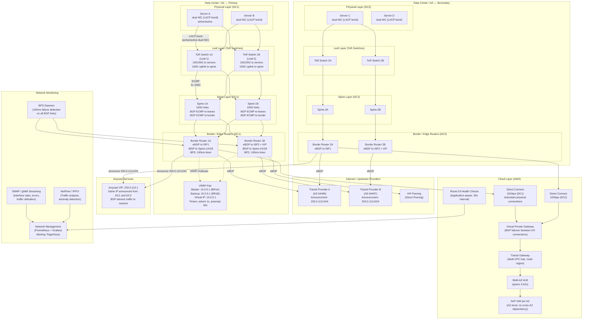

# High-Availability Networking Architecture

## Table of Contents

- [Design Requirements](#design-requirements)
  - [Functional Requirements](#functional-requirements)
  - [Non-Functional Requirements](#non-functional-requirements)
- [Architecture Overview](#architecture-overview)
- [Component Design](#component-design)
  - [Physical Layer: NIC Bonding and ToR Redundancy](#physical-layer-nic-bonding-and-tor-redundancy)
  - [IP Gateway Redundancy: VRRP and Gratuitous ARP](#ip-gateway-redundancy-vrrp-and-gratuitous-arp)
  - [BGP: ECMP, BFD, and Fast Convergence](#bgp-ecmp-bfd-and-fast-convergence)
  - [Anycast Routing](#anycast-routing)
  - [Cloud-Layer HA: Multi-AZ Networking](#cloud-layer-ha-multi-az-networking)
  - [Health Checks: Application-Aware](#health-checks-application-aware)
  - [Graceful Shutdown and Connection Draining](#graceful-shutdown-and-connection-draining)
- [Trade-offs and Alternatives](#trade-offs-and-alternatives)
- [Failure Modes and Mitigations](#failure-modes-and-mitigations)
  - [Split-Brain Prevention](#split-brain-prevention)
- [Scaling Considerations](#scaling-considerations)
  - [Current Design Handles](#current-design-handles)
  - [At 10x Scale (10x traffic, 10x data centers)](#at-10x-scale-10x-traffic-10x-data-centers)
- [Security Design](#security-design)
  - [Network Security Controls](#network-security-controls)
  - [Out-of-Band Management Network](#out-of-band-management-network)
- [Cost Considerations](#cost-considerations)
- [Interview Questions](#interview-questions)
  - [Basic](#basic)
  - [Intermediate](#intermediate)
  - [Advanced / Staff Level](#advanced-staff-level)

---

## Design Requirements

### Functional Requirements
- Network connectivity for a large-scale platform spanning multiple data centers or AWS regions
- Zero planned downtime for maintenance operations
- Automatic failover for all network components
- Traffic engineering and load distribution across multiple paths

### Non-Functional Requirements
- Availability: 99.999% (< 5.26 minutes downtime/year)
- Failover time: < 1 second for link failures (BFD-assisted BGP), < 50ms for VRRP gateway failover
- Redundancy: no single point of failure at any layer (physical, link, IP, routing)
- Capacity: each path must handle 2x normal traffic (N+1 redundancy minimum)
- Monitoring: network health visible in < 10 seconds of fault
- Planned maintenance: any single component can be taken offline without traffic impact

---

## Architecture Overview



---

## Component Design

### Physical Layer: NIC Bonding and ToR Redundancy

**Server-level redundancy (NIC bonding):**
- Each server has two physical NICs connected to two different ToR switches (never both to the same switch)
- Bond mode: **802.3ad LACP (Link Aggregation Control Protocol)**, active/active — traffic distributed across both links using a hash (src-dst IP, src-dst port)
- Benefits: full bandwidth of both links during normal operation, automatic failover if one NIC or link fails, zero impact on TCP sessions during link failure (LACP detects failure in ~90ms by default, configurable to 30ms with fast timers)
- **Never use mode 0 (round-robin)** for production — it causes out-of-order packet delivery which hurts TCP performance. LACP with src-dst hash maintains per-flow ordering.

**ToR switch redundancy:**
- Each rack has two ToR (Top of Rack) switches, each connected to different spine switches
- This ensures that failure of either ToR switch, or any cable from server to ToR, does not impact the rack
- Some designs use a single switch with dual uplinks — this saves cost but leaves the ToR as a single point of failure within the rack

**Dual power circuits:** each switch and server has dual power supplies connected to different PDUs (Power Distribution Units) on different circuit breakers from different UPS/generator paths. Network redundancy fails if the physical plant has a single power source.

### IP Gateway Redundancy: VRRP and Gratuitous ARP

**VRRP (Virtual Router Redundancy Protocol):**
- Two border routers share a virtual IP address (VIP) that servers use as their default gateway
- One router is the **Master** (holds the VIP, responds to ARP for the VIP MAC address); the other is the **Backup** (listens for VRRP advertisements)
- Advertisement interval: 1 second (fast VRRP uses 100ms). Master dead interval: 3 × advertisement interval.
- On master failure, the backup detects the absence of advertisements within the dead interval and promotes itself to master in < 1 second (with 1s advertisements) or < 300ms (with 100ms fast advertisements)
- **Preemption**: once the original master recovers, it reclaims the master role after a preemption delay (configured to 30 seconds to avoid flapping during unstable recovery)

**Gratuitous ARP (GARP) on failover:**
- When the backup becomes master, it sends GARPs to update the ARP cache of all servers on the subnet
- GARPs broadcast the new master's MAC address for the VIP, ensuring existing connections are forwarded to the new master without waiting for ARP expiry
- Sub-second failover from gateway failure to traffic flowing through backup: VRRP detection (~200ms with 100ms fast timers) + GARP propagation (~50ms) = ~250ms total

**VRRP authentication:** configure MD5 authentication on VRRP group to prevent rogue devices from becoming master.

### BGP: ECMP, BFD, and Fast Convergence

**ECMP (Equal-Cost Multi-Path):**
- Multiple BGP paths to the same destination with equal cost are installed in the FIB simultaneously
- Traffic is distributed across all ECMP paths using a hash (per-flow for connection affinity, per-packet avoided due to reordering)
- Configuration: `maximum-paths 4` or `maximum-paths ibgp 4` (varies by OS). Most modern hardware supports 64-way ECMP.
- On failure of one ECMP path: BGP withdraws that path; remaining paths absorb traffic within BGP convergence time

**BFD (Bidirectional Forwarding Detection):**
- BFD is a lightweight hello protocol designed for fast failure detection
- Runs at configurable intervals down to 50ms (detect failures in 3 × 50ms = 150ms)
- BGP session is configured with `bfd` keyword; when BFD declares the peer down, BGP immediately withdraws routes from that peer
- Without BFD: BGP detection relies on holddown timer (default 90 seconds — catastrophically slow for HA networking)
- With BFD: BGP convergence after link failure = BFD detection (~150ms) + BGP path selection + RIB/FIB update (~100ms) = ~250ms total
- BFD is resource-intensive at very short intervals; balance against router CPU capacity

**BGP security:**
- **MD5 session authentication**: BGP TCP sessions between peers use MD5 hash of a shared secret to prevent session hijacking
- **Route filtering**: prefix lists on eBGP sessions — accept only specific prefixes from each peer, never accept default route unless explicitly intended, set maximum-prefix limits (kill session if peer advertises more than N prefixes, protects against route table corruption)
- **BGP prefix limits**: `neighbor 192.0.2.1 maximum-prefix 1000 warning-only` — alert when approaching limit; hard limit with session termination for genuine prefix bombs
- **RPKI ROA validation**: validate BGP route announcements against Resource Public Key Infrastructure (RPKI) Route Origin Authorizations. Drop routes where origin AS does not match the ROA. Prevents BGP route origin spoofing (e.g., the famous 2018 AWS Route 53 BGP hijack).

**BGP Graceful Restart:**
- During planned BGP software upgrades or process restarts, BGP Graceful Restart (RFC 4724) allows the restarting router to signal its peer that it is restarting
- The peer retains the routes in its FIB (stale routes) for the Graceful Restart time (typically 120 seconds) rather than withdrawing them
- Traffic continues flowing during the BGP process restart; sessions are re-established without withdrawing/re-advertising routes
- Prevents traffic drops during router software upgrades

### Anycast Routing

**Anycast** allows the same IP address to be announced from multiple locations. BGP routing naturally directs traffic to the topologically nearest announcement.

**Use cases:**
- DNS resolvers (8.8.8.8 is anycast to hundreds of Google PoPs)
- CDN edge nodes
- DDoS scrubbing centers
- Internal load balancing across data centers

**Implementation:**
1. Assign a /32 (single host) or /24 from the public IP space to the anycast service
2. Configure the same IP on the loopback interface of servers in each data center
3. Announce the /24 via BGP from each data center — BGP's path selection (shortest AS path, lowest MED, local preference) routes traffic to the nearest DC
4. On failure: withdraw the BGP announcement from the failed DC; traffic automatically reroutes to the remaining DCs (BGP convergence time: ~250ms with BFD)

**Anycast health integration:**
- Do not withdraw the anycast route unconditionally — health-check the service first
- A monitoring daemon (ExaBGP with a health-check script) conditionally announces the route only when the local service is healthy
- This prevents traffic blackholing to a DC where the service is down but BGP is still up

### Cloud-Layer HA: Multi-AZ Networking

**Application Load Balancer (ALB):**
- ALB spans all 3 AZs in a region. AWS manages the ALB nodes (one node per AZ); if one AZ fails, the remaining nodes absorb traffic automatically.
- **Cross-zone load balancing**: enabled on ALB by default — each ALB node distributes traffic to all targets regardless of AZ. This prevents imbalance when one AZ has fewer healthy instances.
- ALB does NOT expose an IP address; it uses a DNS name that resolves to multiple IPs (one per AZ). DNS TTL is 60 seconds.

**NAT Gateway per AZ:**
- Deploy one NAT GW per AZ in the public subnet of that AZ. Private subnets route to the NAT GW in their own AZ.
- If a shared NAT GW in AZ-A fails, instances in AZ-B and AZ-C lose outbound internet access.
- Per-AZ NAT GW eliminates this cross-AZ dependency at the cost of additional NAT GW charges ($32/month per additional NAT GW).

**AWS Direct Connect (DX) redundancy:**
- Two Direct Connect connections from different physical locations (different DX locations if available, or different devices in the same DX location)
- Configure both as BGP peers to the Virtual Private Gateway; traffic uses both links via ECMP or prefers the lower-latency connection

### Health Checks: Application-Aware

Naive health checks (TCP port check, ICMP ping) declare a service healthy when the network path is reachable but the application may be unable to serve requests.

**Health check design:**
```
Shallow: TCP port open on 443 (proxy/load balancer check)
  → Catches: process crashed, port not bound

Medium: HTTP GET /health returns 200
  → Catches: application process running, basic routing works

Deep: HTTP GET /health validates:
  - Application can process requests (compute healthy)
  - Database connection pool has available connections
  - Cache (Redis/Memcached) is reachable
  - Dependent microservice responds (optional, risk: cascading failures)
  → Catches: database down, connection exhaustion, cache miss storms
```

**Risk of deep health checks:** if the health check checks dependencies (DB connectivity), a database outage causes ALL app servers to report unhealthy simultaneously, and the load balancer removes them all from the pool. The result is the entire application going down even though compute is healthy.

**Solution:** tiered health checks:
- Load balancer health check: medium depth (HTTP 200 from `/live`) — conservative; keeps instance in rotation unless process is dead
- Application-layer degraded state: deep check exposed via `/health/detailed` returns JSON with component status; this drives metrics and alerting but NOT load balancer registration
- Circuit breaker pattern in application: if DB is unavailable, the application returns 503 with `Retry-After` header rather than failing the health check — this is more informative than a silent health check pass

### Graceful Shutdown and Connection Draining

**Planned maintenance procedure (zero-downtime):**
1. Signal the load balancer to stop sending new connections to the target (ALB: deregister target, wait for deregistration delay)
2. **Deregistration delay** (default 300s, reduce to 30s for fast-cycling services): after deregistration, ALB keeps the target in the pool for existing connections until the delay expires
3. Send `SIGTERM` to the application process: application stops accepting new connections, completes in-flight requests
4. If in-flight requests are not completed within the graceful shutdown timeout (30-60s), send `SIGKILL`
5. Perform maintenance; bring node back; register with load balancer; verify health checks pass

**Pre-shutdown traffic drain (BGP):**
- Before taking a router down for maintenance: increase local preference for traffic through the backup path, or increase MED to make this path less preferred
- BGP re-converges; traffic migrates to the backup path while the router to be maintained still forwards traffic (no blackhole)
- Then take the router down — it is already carrying no traffic

---

## Trade-offs and Alternatives

| Decision | Chosen | Alternative | Why Chosen |
|----------|--------|-------------|------------|
| VRRP for gateway HA | Active/passive gateway with VIP | Active/active (ECMP) with routing protocol per server | VRRP is simpler for L2 subnet gateway HA; ECMP per server requires BGP on every host |
| BFD for BGP failure detection | 100ms timers | BGP hold-down timer (90s) | 90s is unacceptable for HA; BFD adds complexity but is standard in carrier-grade networks |
| Anycast vs DNS-based load balancing | Anycast for stateless services | Route 53 geolocation routing | Anycast provides sub-second failover; DNS failover takes 60+ seconds (TTL dependent) |
| LACP (802.3ad) bonding | Active/active NIC bonding | Active/passive (bonding mode 1) | LACP uses both NICs simultaneously (2x bandwidth); active/passive wastes standby NIC bandwidth |
| Per-AZ NAT GW | Separate NAT GW per AZ | Shared NAT GW | Eliminates cross-AZ dependency for 99.999% availability; ~$64/month additional cost is justified |
| BGP ECMP | Multi-path routing | Single best path | ECMP uses all available bandwidth across multiple paths; single best path wastes redundant links |
| BGP Graceful Restart | Control-plane restart without traffic loss | Planned outage with traffic cutover | GR allows software upgrades without any traffic disruption; reduces maintenance window risk |

---

## Failure Modes and Mitigations

| Component | Failure Mode | Detection Time | Recovery Time | Mitigation |
|-----------|-------------|---------------|--------------|------------|
| Single NIC failure | Loss of 50% server bandwidth | LACP: ~90ms | Immediate (other NIC takes all traffic) | LACP bonding; monitor bond member status |
| ToR switch failure | All servers in rack lose connectivity | LACP: ~90ms | Immediate (LACP detects link down) | Dual ToR; LACP bond across two switches |
| Spine switch failure | Partial network partition | BGP: ~250ms with BFD | ~250ms BGP convergence | Dual spine; ECMP across both; BFD on spine-border links |
| Border router failure | Loss of one ISP path | BFD: ~150ms | BGP convergence ~250ms | Dual border routers; ECMP across ISPs |
| VRRP master failure | Default gateway unreachable | VRRP dead interval: ~300ms (fast mode) | < 300ms + GARP propagation | Fast VRRP timers (100ms advertisements); GARP on failover |
| BGP session flap | Routing instability | BFD: ~150ms | ~250ms reconvergence | BFD for fast detection; route dampening to prevent flapping |
| ISP link failure | Loss of upstream reachability | BFD: ~150ms on DX/eBGP peer | Traffic rerouted to other ISP immediately | Dual ISPs; ECMP or BGP preference (MED) |
| Split-brain (VRRP) | Two masters simultaneously | VRRP multicast — both get same VIP | Detected immediately via GARP conflict | Ensure VRRP multicast path is reliable; configure preemption delay |
| BGP route leak | Malicious/accidental route propagation | BGP prefix limit alarm | Session terminated if exceeds max-prefix | RPKI ROA validation; prefix filters on all eBGP sessions; max-prefix limits |

### Split-Brain Prevention

Split-brain occurs when two nodes both believe they are the active/master node and both attempt to serve the same VIP or announce the same route:

**For VRRP:** split-brain is prevented by VRRP's multicast design — the master sends periodic advertisements. If both nodes can hear each other, only one can be master. Split-brain only occurs if the VRRP heartbeat path is severed while both nodes are still connected to the network. Mitigation: ensure VRRP uses a dedicated management VLAN or link distinct from the data path; if the data path is severed, VRRP should also fail.

**For BGP anycast:** two DCs announcing the same prefix is the intended design — BGP routing directs traffic to the nearest. This is not split-brain. The risk is if a compromised or misconfigured DC announces a more specific prefix (/32 more specific than /24) and hijacks traffic. Mitigate: prefix filter on eBGP sessions; RPKI to validate announcements.

**For distributed systems (leader election):** use quorum-based systems (Raft, ZooKeeper, etcd) that require a majority (n/2+1) of nodes to agree before electing a leader. In a 3-node cluster, split into groups of 2+1 — the group with 2 nodes has quorum and continues; the group with 1 node does not have quorum and steps down.

---

## Scaling Considerations

### Current Design Handles
- 100Gbps links at spine/border layer
- BGP tables up to ~1M routes (full internet routing table) on modern hardware
- VRRP: two nodes, one virtual IP per subnet

### At 10x Scale (10x traffic, 10x data centers)
1. **Spine-leaf no longer sufficient**: at 10x scale (>100 racks), introduce a **super-spine layer** (3-stage Clos fabric). This provides non-blocking bandwidth between any two racks regardless of rack count.
2. **BGP on every server (BGP unnumbered)**: instead of VRRP gateway per subnet, run iBGP on each server (using FRRouting in a container). Each server peers with both ToR switches. ToR switches peer with spines. This eliminates the VRRP bottleneck and provides per-server traffic engineering. LinkedIn and Facebook use this approach at scale.
3. **EVPN/VXLAN for L2 overlay**: at scale, traditional VLANs spanning the entire data center are operationally complex. EVPN over VXLAN provides L2 overlays with L3 routing fabric beneath — enables VM/container migration without network reconfiguration.
4. **SmartNIC / DPU offload**: at 400Gbps+ per server, CPU cannot handle all network processing (firewall, NAT, load balancing). SmartNICs (NVIDIA BlueField, Intel IPU) offload packet processing to dedicated network processors, freeing server CPU for applications.
5. **SR-IOV for low-latency networking**: Single Root I/O Virtualization allows VMs/containers to directly access NIC hardware queues, bypassing the hypervisor network stack. Reduces network latency from ~50 microseconds to ~5 microseconds for latency-sensitive workloads.
6. **BGP ECMP at 100+ paths**: at scale, ECMP may need to distribute across hundreds of paths. Most hardware ASICs support 64-128 ECMP paths; verify hardware capacity before designing for this many parallel paths.

---

## Security Design

### Network Security Controls

| Layer | Control | Purpose |
|-------|---------|---------|
| BGP (eBGP) | MD5 session authentication | Prevent BGP session hijacking |
| BGP (eBGP) | RPKI ROA validation | Prevent route origin spoofing |
| BGP (eBGP) | Prefix filters | Reject invalid/unexpected prefixes |
| BGP (eBGP) | Max-prefix limits | Protect against route table poisoning |
| IP layer | BCP38 (ingress filtering) | Block IP spoofing at network edge |
| Infrastructure | Out-of-band management network | Isolated management path survives data plane failure |
| Physical | Dual-factor physical access | Prevent physical interference with network hardware |
| Monitoring | NetFlow anomaly detection | Detect DDoS, port scans, exfiltration |

**BCP38 (Network Ingress Filtering):** configure the border routers to drop packets with source IPs that are not in the announced prefix of the downstream customer. Prevents IP address spoofing — a critical defense against amplification DDoS attacks (which rely on spoofed source IPs to redirect reflected traffic).

### Out-of-Band Management Network

Critical principle: the management network used to configure network equipment must be physically separate from the data network. If the data network fails (the scenario you are trying to fix), you must still be able to connect to routers and switches to diagnose and repair the issue.

- Dedicated management interfaces (not the same ports carrying data traffic)
- Separate management VLAN or physical network (ideally separate cables and switches)
- Console servers (Opengear, Lantronix) provide serial console access to every device — accessible even if the device's management Ethernet is down
- IPMI/BMC (Baseboard Management Controller) for servers: provides out-of-band power control and serial console
- Never route management access through the production internet path — use a dedicated management ISP connection or cellular backup

---

## Cost Considerations

| Component | Cost Driver | Optimization |
|-----------|------------|--------------|
| Redundant ISP links | Transit bandwidth × 2 providers | Negotiate volume discounts; use IXP peering (cheap/free) to reduce transit |
| Dual border routers | Hardware + licensing | Software routing on commodity hardware (white-box + FRRouting) reduces cost by 80% |
| LACP bonding | 2 NICs per server | Cost of extra NIC ($100-500) justified by elimination of NIC as single point of failure |
| Per-AZ NAT GW | $32/month per additional AZ | Required for 99.999%; data processing charges; optimize by using VPC endpoints for AWS services |
| Direct Connect (10Gbps) | $1,500-4,000/month per connection | Redundant DX is required; data transfer savings offset cost for high-volume workloads |
| BFD-capable hardware | Premium on some vendors | BFD is supported on all modern routing platforms; no premium on software-based routers |

---

## Interview Questions

### Basic

**Q: What is VRRP and why is it needed for high availability?**
A: VRRP (Virtual Router Redundancy Protocol) provides a virtual IP address that is shared between two routers. Servers on a subnet configure this virtual IP as their default gateway. Normally, one router (the Master) holds the virtual IP and responds to ARP requests for it. If the Master fails, the Backup router takes over the virtual IP within seconds and sends Gratuitous ARP messages to update neighbors' ARP caches. Without VRRP, servers would need to detect gateway failure themselves and switch to a backup gateway — which has no standard mechanism and would take minutes or require manual intervention.

**Q: What is the difference between active/active and active/passive redundancy?**
A: Active/passive: one component handles all traffic; the standby waits idle until the active component fails. Simpler but wastes the standby's capacity. Failover is slightly slower because the standby may need to warm up or learn state. Active/active: both components handle traffic simultaneously (LACP bonding, ECMP routing). Uses full capacity of both components; failover is seamless because both are already processing traffic. More complex to configure and requires the application or protocol to support multi-path. For networking, active/active (ECMP, LACP) is preferred wherever possible because it uses all available bandwidth and has instantaneous failover.

**Q: What is BFD and why is BGP's native failure detection inadequate?**
A: BGP's native failure detection uses the BGP hold-down timer (default 90 seconds). If no BGP keepalive messages are received within 90 seconds, the session is declared down. For high-availability networking, 90 seconds of routing instability is catastrophic. BFD (Bidirectional Forwarding Detection) is a lightweight hello protocol that can detect link failures in 150-300ms (3 × 50-100ms hello interval). BGP is configured to monitor BFD for its peers; when BFD declares a peer down, BGP immediately withdraws routes from that peer, converging in ~250ms total. BFD operates at the hardware level for very fast timers (sub-50ms) or in software for slightly slower but still fast detection.

### Intermediate

**Q: Explain BGP ECMP and how traffic is distributed across multiple paths.**
A: ECMP (Equal-Cost Multi-Path) installs multiple next-hops in the forwarding table for the same destination prefix when those paths have equal cost (same BGP attributes: local preference, AS path length, MED, etc.). Traffic distribution uses a hash of packet fields (source IP, destination IP, source port, destination port, protocol) to select a next-hop for each flow. The hash ensures all packets of the same TCP/UDP flow go through the same path (maintaining TCP ordering), but different flows are distributed across paths. With 4 ECMP paths, traffic is distributed approximately 25% per path (hash distribution depends on traffic diversity). When one path fails, the FIB is updated and traffic redistributed across remaining paths within BGP convergence time (~250ms with BFD).

**Q: How do you perform a zero-downtime router replacement?**
A: Step-by-step procedure: (1) **Verify redundancy**: confirm that traffic can be served entirely by the remaining routers at expected load. Check ECMP path utilization on remaining routers. (2) **Drain traffic**: increase the local preference or MED on the target router to make it less preferred by BGP. Wait for BGP convergence (traffic migrates to other paths). Verify with monitoring that the target router carries minimal traffic. (3) **Remove BGP sessions**: gracefully shut down BGP sessions (`neighbor shutdown`). BGP Graceful Restart allows peers to keep routes in FIB during the shutdown. (4) **Take offline**: power off, replace hardware, restore configuration. (5) **Bring back online**: verify BGP sessions establish, routes are advertised correctly, health checks pass. (6) **Restore traffic**: revert the preference changes from step 2. Monitor for 10 minutes for any issues. Total procedure: 30-60 minutes with zero packet loss if executed correctly.

**Q: A monitoring alert fires: `BGP session to ISP1 is down`. Walk me through your diagnosis.**
A: Systematic diagnosis: (1) **Check the physical link**: `show interface GigabitEthernet0/0` — is the interface up/up? Check for errors (`input errors`, `output drops`). If interface is down, it is a physical/cable issue. (2) **Check the BGP neighbor state**: `show bgp neighbor 203.0.113.1` — what state is it in? (Idle = no connection attempt; Active = trying to connect but failing; OpenSent/OpenConfirm = partial connection). (3) **Check BGP authentication**: MD5 mismatch causes sessions to fail. `debug ip bgp 203.0.113.1 events` on a test session. (4) **Check connectivity to BGP peer**: `ping 203.0.113.1 source 203.0.113.2` — is the IP reachable? If not, routing issue or ISP-side problem. (5) **Contact ISP NOC**: if physical link is up but BGP cannot establish, ISP may have configuration issue on their side. Provide them with the BGP session details (AS numbers, peer IPs). (6) **Check impact**: what prefixes were learned from ISP1? Are they still reachable via ISP2 (ECMP failover)? `show ip route 8.8.8.8` — is there still a valid path? (7) **Check BGP logs and SNMP traps**: when did the session go down? Correlates with any maintenance, traffic spike, or configuration change?

### Advanced / Staff Level

**Q: Design a network architecture that can survive the simultaneous failure of one data center and one ISP link, while maintaining full service.**
A: This requires N+2 redundancy at the internet edge and N+1 at every other layer. Architecture: (1) **Three data centers** (or three AZs): any two can serve full load. Applications are deployed across all three; load balancing distributes traffic 33/33/33 normally, and 50/50 on single-DC failure. (2) **Two ISP connections per DC** (6 total): each DC has ISP-A and ISP-B. If ISP-A goes down globally, ISP-B in all DCs serves traffic. If DC-1 goes down and ISP-A fails, DCs 2 and 3 still have ISP-B connectivity. (3) **Anycast from all three DCs**: BGP announces the same prefix from all three; BGP path selection routes users to their nearest healthy DC. On DC failure, routes are withdrawn; users route to next nearest. (4) **Cross-DC capacity**: each DC must handle 50% of total traffic (50% of load when one of three DCs fails). Provision 60% capacity per DC to handle uneven distribution. (5) **State management**: databases must be synchronously replicated to at least two DCs (RPO = 0) or asynchronously to all three (RPO = milliseconds). Use quorum writes (acknowledge when 2/3 DCs confirm write). (6) **Chaos testing**: actually test this by failing a DC and an ISP simultaneously in production (with advance notice) to verify the design holds.

**Q: RPKI is deployed at your border routers. A BGP route from your transit provider is being dropped. How do you diagnose a false RPKI rejection?**
A: RPKI route origin validation compares the origin AS in the BGP path against the Resource Public Key Infrastructure (RPKI) Route Origin Authorizations (ROAs). A false rejection means a legitimate route has an ROA that does not match the received announcement. Diagnosis: (1) **Check the route**: `show bgp 1.2.3.0/24` — what is the origin AS in the received path? Is it `Invalid` or `Unknown` in the RPKI validation state? (2) **Query RPKI validator**: use a tool like `routinator validate --asn 64496 --prefix 1.2.3.0/24`. It returns the ROA entries for that prefix and whether the origin AS matches. (3) **Check ROA validity**: perhaps the prefix owner created an ROA with the wrong AS number (fat-finger error), or the prefix is more/less specific than the ROA covers. Example: ROA for `1.2.3.0/24 max-length /24 origin AS64496`, but the BGP path arrives as `1.2.3.0/25` (more specific — not covered by the max-length /24). (4) **Mitigation while resolving**: set the route to `RPKI Unknown` state (accept but warn) rather than `RPKI Invalid` (reject) temporarily while the prefix owner creates the correct ROA. (5) **Long-term**: contact the prefix owner's NOC to create or fix the ROA in their RIR (ARIN, RIPE, etc.) portal. RPKI ROA changes propagate within 24-48 hours as validators refresh their cache. Key lesson: RPKI protects the routing system but requires operational processes to maintain ROAs — coordinate with prefix owners before changes.
