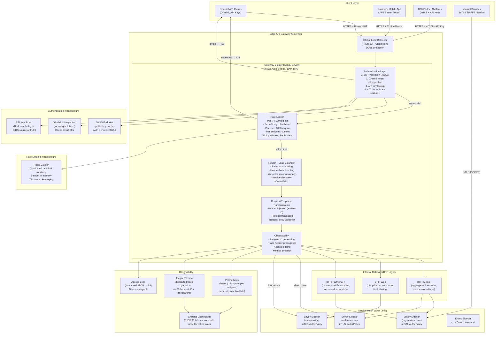

# API Gateway Architecture for Large-Scale Microservices

## Table of Contents

- [Design Requirements](#design-requirements)
  - [Functional Requirements](#functional-requirements)
  - [Non-Functional Requirements](#non-functional-requirements)
- [Architecture Overview](#architecture-overview)
- [Component Design](#component-design)
  - [1. Deployment Pattern: Edge Gateway + BFF + Sidecar](#1-deployment-pattern-edge-gateway-bff-sidecar)
  - [2. Authentication at the Gateway](#2-authentication-at-the-gateway)
  - [3. Rate Limiting: Sliding Window with Redis](#3-rate-limiting-sliding-window-with-redis)
  - [4. Routing and Service Discovery](#4-routing-and-service-discovery)
  - [5. Circuit Breaking and Retry Policy](#5-circuit-breaking-and-retry-policy)
  - [6. mTLS from Gateway to Backend](#6-mtls-from-gateway-to-backend)
  - [7. Observability: Request ID and Trace Propagation](#7-observability-request-id-and-trace-propagation)
- [Technology Comparison](#technology-comparison)
  - [Gateway Technology Trade-offs](#gateway-technology-trade-offs)
  - [Kong vs Envoy Decision](#kong-vs-envoy-decision)
- [Trade-offs and Alternatives](#trade-offs-and-alternatives)
- [Failure Modes and Mitigations](#failure-modes-and-mitigations)
- [Scaling Considerations](#scaling-considerations)
  - [Current Design Handles](#current-design-handles)
  - [At 10x Scale (1M RPS)](#at-10x-scale-1m-rps)
- [Security Design](#security-design)
  - [Gateway Security Controls](#gateway-security-controls)
  - [Gateway API Key Security](#gateway-api-key-security)
- [Cost Considerations](#cost-considerations)
- [Interview Questions](#interview-questions)
  - [Basic](#basic)
  - [Intermediate](#intermediate)
  - [Advanced / Staff Level](#advanced-staff-level)

---

## Design Requirements

### Functional Requirements
- Route external and internal HTTP/gRPC traffic to 50 backend microservices
- Authentication and authorization for all external API requests
- Rate limiting at multiple granularities (per-user, per-key, per-IP, per-endpoint)
- Protocol translation (REST ↔ gRPC, HTTP/1.1 ↔ HTTP/2)
- Request and response transformation
- Canary and blue-green deployments via weighted routing

### Non-Functional Requirements
- Throughput: 100,000 RPS sustained, 300,000 RPS burst
- Latency overhead: < 2ms added per gateway hop at P99
- Availability: 99.99% (gateway must be more available than the backends it proxies)
- Horizontal scalability: no state in gateway instances (Redis for distributed rate limiting)
- Observability: every request logged with request ID, latency, upstream, response code
- Security: no request reaches a backend without passing authentication and authorization

---

## Architecture Overview



---

## Component Design

### 1. Deployment Pattern: Edge Gateway + BFF + Sidecar

**Three-tier gateway architecture:**

**Tier 1 — Edge Gateway (internet-facing):**
- Handles all external traffic entering the platform
- Responsibilities: SSL termination, authentication, rate limiting, DDoS defense, routing
- Deployed as a horizontally scaled cluster (stateless instances, Redis for distributed state)
- Technology: Kong (plugin ecosystem for auth, rate limiting, logging) or Envoy with control plane

**Tier 2 — Backend for Frontend (BFF):**
- Aggregation layer purpose-built for specific client types
- Mobile BFF: aggregates 3-5 service calls into one response to reduce mobile round trips
- Web BFF: returns full HTML-renderable JSON with all fields; filters differently than mobile
- Partner BFF: exposes a stable, versioned, partner-specific contract independent of internal service churn
- Deployed as microservices inside the cluster; communicates via mTLS through the service mesh

**Tier 3 — Sidecar (Envoy per service):**
- Per-service Envoy proxy handles L7 policy enforcement inside the cluster
- mTLS from the edge gateway to each service, circuit breaking, retry logic
- No authentication needed at this layer (authenticated at edge); authorization policies enforced by service mesh

**Why not just one gateway?**
A single monolithic gateway becomes a performance and operational bottleneck. Edge gateway handles the N×100K RPS from the internet; internal traffic between 50 services is handled by the mesh. BFFs reduce the number of internal calls (aggregation). Each layer can be scaled independently.

### 2. Authentication at the Gateway

**JWT validation (stateless, preferred for scalability):**
```
1. Client sends: Authorization: Bearer <JWT>
2. Gateway extracts JWT header → finds key ID (kid)
3. Gateway fetches JWKS from auth service cache (5-minute TTL)
4. Gateway validates: signature (RS256/ES256), expiry (exp), audience (aud), issuer (iss)
5. If valid: gateway injects X-User-ID, X-User-Roles headers before forwarding to backend
6. Backend trusts these headers (only gateway can set them; service mesh blocks direct access)
```

JWKS endpoint is cached at the gateway (in-memory per gateway instance, refreshed every 5 minutes). This avoids a round-trip to the auth service for every request. Cache miss on unknown `kid` triggers immediate refresh (handles key rotation).

**OAuth2 token introspection (for opaque tokens):**
```
1. Client sends: Authorization: Bearer <opaque-token>
2. Gateway calls auth server: POST /oauth/introspect (token=..., client_credentials)
3. Auth server returns: {active: true, sub: "user123", scope: "read:orders write:orders"}
4. Gateway caches result for 60 seconds (TTL from token expiry, not fixed 60s)
5. Subsequent requests with the same token use cached result
```

Introspection is slower (network call) and stateful (cache). Use JWT where possible; opaque tokens are necessary for revocation capability.

**API key management:**
```
1. API keys stored in Redis (for low-latency lookup) backed by RDS (source of truth)
2. Key structure: {prefix}_{random} — prefix allows visual identification of key type
3. Keys are hashed (SHA-256) before storage — never store plaintext API keys
4. Lookup: gateway hashes inbound key, looks up hash in Redis
5. Redis returns: {user_id, plan, rate_limits, scopes, active: true/false}
6. Invalidation: delete from Redis immediately on revocation; RDS updated async
```

**mTLS for partner integrations:**
Partners present a client certificate during TLS handshake. Gateway validates the certificate against a trust store (CA certificates from approved partners). Certificate subject (`CN` or `O` field) is mapped to a partner ID. Rate limits and permissions are tied to the partner ID.

### 3. Rate Limiting: Sliding Window with Redis

**Why sliding window over fixed window?**
Fixed window allows 2× the allowed rate at window boundaries (burst at end of window 1 + start of window 2). Sliding window distributes rate limiting evenly over any rolling time period.

**Distributed sliding window implementation:**
```
Key: rate_limit:{dimension}:{window_start}
  Example: rate_limit:user:123:1706745600  (1-minute window)

Algorithm:
1. Current minute = floor(now / 60)
2. Previous minute = current - 1
3. Elapsed in current window = now % 60 (seconds)
4. Count estimate = previous_minute_count × (1 - elapsed/60) + current_minute_count
5. If count_estimate >= limit: return 429 with Retry-After header
6. Else: INCR current_minute_key with TTL=120s; allow request

Redis commands: single Lua script for atomicity:
  EVAL "<lua>" 2 prev_key curr_key current_time limit
```

**Rate limit tiers:**

| Dimension | Free Plan | Pro Plan | Enterprise |
|-----------|-----------|----------|-----------|
| Per IP | 100/min | 100/min | 1000/min |
| Per API key | 100/hour | 5000/hour | Custom |
| Per user ID | 500/day | 50,000/day | Custom |
| Per endpoint | Varies | Varies | Custom |

**Rate limit response headers (standard):**
```
X-RateLimit-Limit: 1000
X-RateLimit-Remaining: 750
X-RateLimit-Reset: 1706745660  (Unix timestamp when window resets)
Retry-After: 30  (on 429 responses only)
```

**Redis failover for rate limiting:** if Redis cluster is unavailable, two options: (a) **Fail open**: allow all requests (rate limiting unavailable temporarily) — better for availability; (b) **Fail closed**: return 503 to all requests — better for security. Recommendation: fail open with a circuit breaker; alert immediately on Redis unavailability; accept the brief rate limit bypass in exchange for availability. Log all requests during Redis outage for post-hoc rate limit analysis.

### 4. Routing and Service Discovery

**Path-based routing configuration:**
```yaml
routes:
  - path: /api/v1/orders/*
    service: order-service
    methods: [GET, POST, PUT]
    strip_prefix: false
  - path: /api/v1/payments/*
    service: payment-service
    plugins: [jwt-auth, rate-limit-strict]
  - path: /api/v2/orders/*
    service: order-service-v2
    weight: 95  # canary routing
  - path: /api/v2/orders/*
    service: order-service-v3
    weight: 5   # 5% canary
```

**Service discovery:** in Kubernetes, services are discovered via Kubernetes DNS (`order-service.orders.svc.cluster.local`). For multi-cluster or hybrid environments, use Consul service catalog. The gateway resolves service endpoints dynamically — no hardcoded IPs.

**Header-based routing for internal testing:**
```yaml
- path: /api/v1/orders/*
  conditions:
    - header: X-Canary: true
  service: order-service-canary
  # Only traffic with X-Canary: true goes to canary
  # All other traffic goes to stable
```

### 5. Circuit Breaking and Retry Policy

**Circuit breaker pattern (Envoy-based):**
```yaml
circuit_breakers:
  thresholds:
  - max_connections: 1000
    max_pending_requests: 100
    max_requests: 1000
    max_retries: 3
    consecutive_5xx: 5   # open circuit after 5 consecutive 5xx
```

**States:**
- **Closed**: normal operation; requests flow through; tracking error rate
- **Open**: error threshold exceeded; requests fail immediately (no upstream call); reduces load on struggling backend
- **Half-open**: after `sleep_window` (30s), allow a probe request; if successful, close circuit; if fails, reopen

**Retry policy (idempotent requests only):**
```yaml
retry_policy:
  retry_on: 5xx, gateway-error, reset, connect-failure
  num_retries: 3
  per_try_timeout: 2s
  retry_back_off:
    base_interval: 0.1s
    max_interval: 10s
  retry_budget:
    budget_percent: 20.0  # max 20% of active requests can be retried
    min_retry_concurrency: 3
```

**Critical**: only retry idempotent requests (GET, HEAD, PUT, DELETE). Never retry POST or PATCH blindly — they may not be idempotent (creating a new order on retry is catastrophically wrong). Require backends to implement idempotency keys for non-idempotent operations.

**Retry budget**: limits the total percentage of in-flight requests that are retries. Without a budget, a degraded backend causes cascading retries that amplify load 3× (each failed request retried 3 times). The retry budget caps this amplification.

### 6. mTLS from Gateway to Backend

The edge gateway terminates external TLS (from client). It then establishes new mTLS connections to backend services through the service mesh.

```
External client → [TLS terminated at edge] → Gateway → [mTLS (SPIFFE SVID)] → Backend service
```

Gateway identity in the service mesh: the gateway has its own SPIFFE ID (`spiffe://cluster/ns/gateway/sa/api-gateway`). Istio AuthorizationPolicies on backend services can restrict access to the gateway's SPIFFE ID:

```yaml
# Backend service only accepts traffic from the gateway
apiVersion: security.istio.io/v1beta1
kind: AuthorizationPolicy
metadata:
  name: order-service-authz
spec:
  selector:
    matchLabels:
      app: order-service
  action: ALLOW
  rules:
  - from:
    - source:
        principals:
          - "cluster.local/ns/gateway/sa/api-gateway"
          - "cluster.local/ns/bff/sa/mobile-bff"
```

### 7. Observability: Request ID and Trace Propagation

**Request ID** is generated at the gateway edge for every incoming request:
```
X-Request-ID: <UUID-v4>  (generated if not present, propagated if present)
```

The gateway injects this ID into: access logs, upstream request headers, response headers. Every downstream service logs this ID. Enables correlating logs across the entire request path.

**Distributed trace headers** (W3C Trace Context or B3):
```
traceparent: 00-4bf92f3577b34da6a3ce929d0e0e4736-00f067aa0ba902b7-01
tracestate: vendor-specific
```

Gateway creates a new trace span; upstream services continue the trace. Jaeger/Tempo collects traces for end-to-end latency analysis.

**Latency histogram per endpoint:**
```
http_request_duration_seconds{
  method="POST",
  route="/api/v1/orders",
  upstream="order-service",
  status="200"
} histogram with buckets [.005, .01, .025, .05, .1, .25, .5, 1, 2.5, 5, 10]
```

SLO monitoring: alert if P99 latency > 500ms for any endpoint over a 5-minute window.

**Error rate per service:**
```
rate(http_requests_total{status=~"5.*"}[5m])
/ rate(http_requests_total[5m])
> 0.01  # alert if error rate > 1%
```

---

## Technology Comparison

### Gateway Technology Trade-offs

| Feature | Kong | Envoy + Control Plane | AWS API Gateway | Istio (service mesh) |
|---------|------|----------------------|----------------|---------------------|
| Deployment | Self-managed K8s | Self-managed | Fully managed | Self-managed |
| Performance | 50-80K RPS/node | 100K+ RPS/node | Managed (auto-scale) | Built into pods |
| Plugin ecosystem | 100+ plugins | xDS API (custom) | Lambda integrations | Envoy filters |
| Configuration | Kong Admin API / declarative | YAML + xDS | AWS Console / CDK | YAML CRDs |
| Rate limiting | Built-in plugin | Custom filter | Built-in (50K RPS hard limit) | Custom filter |
| Latency added | ~1-2ms | ~0.5-1ms | ~5-20ms | ~1-2ms |
| Auth | JWT, OAuth2, API keys | Custom ext_authz | Cognito / Lambda | RequestAuthentication |
| Cost | OSS free, Enterprise $$ | OSS free | $3.50/M requests | OSS free |
| Operational complexity | Medium | High | Low | High |
| Multi-protocol | HTTP, gRPC, WebSocket | HTTP, gRPC, TCP | HTTP, WebSocket | HTTP, gRPC, TCP |

**Recommendation by scale:**
- < 1K RPS: AWS API Gateway (managed, low operational overhead)
- 1K–50K RPS: Kong OSS (rich plugin ecosystem, manageable complexity)
- 50K–500K RPS: Envoy with custom control plane or Kong Enterprise
- 500K+ RPS: custom Envoy control plane, heavily optimized; consider multi-CDN edge routing

### Kong vs Envoy Decision

Kong is a better choice when:
- Team is small and needs a rich out-of-the-box plugin library
- Authentication and rate limiting plugins are needed immediately
- Configuration via Kong's declarative config is preferred over xDS

Envoy is a better choice when:
- Maximum performance is required (sub-millisecond overhead)
- Custom protocol or routing logic is needed
- Already deeply invested in Istio/service mesh
- Team has strong Envoy expertise (xDS is complex)

---

## Trade-offs and Alternatives

| Decision | Chosen | Alternative | Why Chosen |
|----------|--------|-------------|------------|
| JWT stateless auth | Validate at gateway, pass user headers | Session cookies + server-side lookup | Stateless JWTs require no gateway-to-auth-DB call on every request; horizontal scale without session affinity |
| Sliding window rate limiting | Per-second accuracy, Redis-backed | Fixed window (simpler) | Fixed window allows burst at window boundary; sliding window provides consistent protection |
| Redis for rate limit state | Centralized distributed counter | Local per-instance counter | Local counting cannot enforce cluster-wide limits when scaled horizontally |
| BFF pattern | Purpose-built aggregation layers | Fat client (multiple API calls) | BFF reduces mobile round trips (critical for mobile UX); isolates partner contracts from internal churn |
| Edge gateway + service mesh | Two-tier approach | Single monolithic gateway | Edge handles N-external-call scale; mesh handles M×N internal service calls; each scales independently |
| Retry budget | 20% of requests | Unlimited retries | Unlimited retries amplify backend load on failure; budget prevents retry storms |

---

## Failure Modes and Mitigations

| Component | Failure Mode | Detection | Mitigation |
|-----------|-------------|-----------|------------|
| Gateway node crash | 1/N traffic capacity lost | Load balancer health check | Auto Scaling Group replaces node; ALB routes to remaining nodes |
| Redis rate limit store down | Rate limiting unavailable | Redis connection error metric | Fail open (allow traffic), alert immediately, accept brief bypass |
| JWKS endpoint unreachable | Cannot validate new JWTs | Auth error spike | Cache last good JWKS (5 min TTL); issue tokens with 15min expiry to limit exposure window |
| Backend service overloaded | 5xx responses from backend | Circuit breaker consecutive_5xx | Circuit breaker opens; 503 with `Retry-After` returned to client; backend relieved |
| Thundering herd on startup | All clients retry simultaneously | Error rate spike after deployment | Exponential backoff + jitter in client; gateway rate limits absorb burst |
| Large request body | Gateway OOM or timeout | Gateway 413/408 errors | Set max request body size (e.g., 10MB); return 413 immediately |
| Request ID collision | Tracing confusion | Duplicate request IDs in logs | Use UUIDv4 (2^122 space); collision probability negligible at 100K RPS |
| API key leaked | Unauthorized API access | Unusual traffic pattern per key | Immediate key revocation (delete from Redis, flag in DB); API key rotation (no grace period for leaked keys) |

---

## Scaling Considerations

### Current Design Handles
- 100K RPS: ~10 gateway nodes × 10K RPS each (Envoy can do 50K+ per instance; Kong can do 10-20K)
- Redis: single cluster handles ~200K ops/sec (rate limit increment = 2-3 Redis ops per request)
- Trace sampling: 10% sampling at 100K RPS = 10K traces/second; ~1TB/day of trace storage

### At 10x Scale (1M RPS)

1. **Gateway tier**: Envoy scales well to 100K+ RPS per instance; need 10-20 instances at 1M RPS. Kong becomes a bottleneck at high RPS with many plugins active — consider Envoy or Nginx for the hot path.
2. **Redis rate limiting**: Redis Cluster partitioned by dimension (hash slot per user/key). At 3M ops/sec (1M RPS × 3 ops each), Redis Cluster with 6-9 nodes handles this. Consider **Redis 7 LMPOP** or local approximate counters with Redis reconciliation for extreme scale.
3. **JWKS caching**: at 1M RPS, even 1% cache miss = 10K auth service calls/second. Use a two-level cache: gateway-local in-memory (1-minute TTL, fast) backed by a shared Redis cache (5-minute TTL, consistent across nodes).
4. **Distributed tracing**: at 1M RPS with 10% sampling = 100K traces/second. Switch to head-based sampling with reservoir sampling; use OpenTelemetry Collector for batching and routing. Traces stored in object storage (S3) rather than Elasticsearch.
5. **API Gateway as a platform**: at this scale, consider building an internal developer portal for service teams to self-register their APIs, configure rate limits, and view their metrics — rather than having platform teams manage all configurations.
6. **Multi-region gateway**: deploy gateway in every region with local Redis for rate limiting. Accept that per-user rate limits are per-region (not globally coordinated) — this is a reasonable trade-off at global scale; coordinate only for high-value rate limits (API key plans) via asynchronous reconciliation.

---

## Security Design

### Gateway Security Controls

| Control | Implementation |
|---------|---------------|
| TLS termination | TLS 1.3 minimum; TLS 1.2 as legacy; ACM certificate auto-renewal |
| Authentication | JWT (stateless), OAuth2 introspection (stateful), API key (hashed), mTLS (partner) |
| Authorization | Route-level permission enforcement (scope checking against JWT claims) |
| Input validation | Max request size (10MB), Content-Type validation, JSON schema validation (optional) |
| Header injection prevention | Strip all `X-*` headers from incoming requests before gateway processes them; only gateway re-injects trusted headers |
| Bot detection | WAF Bot Control rule group (browser fingerprinting, JS challenge) |
| OWASP protection | WAF OWASP Core Rule Set (injection, XSS, path traversal) |
| Secrets | API keys stored hashed; signing keys in HSM or AWS KMS; no plaintext secrets in config |

**Header stripping:** client-provided `X-User-ID`, `X-User-Roles`, `X-Internal-*` headers must be stripped at the gateway entry point. These headers are injected by the gateway after authentication. If a malicious client sends `X-User-ID: admin`, and the backend trusts that header without stripping, it is an authorization bypass vulnerability.

### Gateway API Key Security

```
1. Keys generated: cryptographically random, 32 bytes entropy
2. Format: {env}_{random}  e.g., prod_k3f9m2n7p8q1r4s6t0u5v2w8x1y7z4
3. Storage: SHA-256 hash stored in DB; plaintext shown ONCE to user at creation
4. Transmission: API key in Authorization header (Bearer) or X-API-Key header (HTTPS only)
5. Rotation: new key issued with 7-day overlap period; old key deactivated after period
6. Audit: every API key usage logged (key prefix, timestamp, endpoint, IP)
```

---

## Cost Considerations

| Component | Cost Driver | Monthly Estimate | Optimization |
|-----------|------------|-----------------|--------------|
| Gateway EC2/EKS nodes | Instance type × count | $500-2000 | Spot instances for non-stateful gateway nodes; reserved for baseline |
| Redis Cluster | 3-6 nodes (r7g.large) | $300-900 | Redis serverless for variable workloads; reserved instances for stable load |
| ALB (gateway LB) | LCU × hours | $100-400 | Gateway nodes behind ALB; EKS uses AWS Load Balancer Controller |
| Data transfer | Egress × GB | Largest variable cost | Aggressive caching at CDN layer reduces API calls; compression reduces response size |
| Kong Enterprise | License | $5,000-50,000+/year | Kong OSS (free) sufficient unless enterprise support/compliance features needed |
| AWS API Gateway | $3.50/M requests | $350/M at 100K RPS × 86400 | Cost-prohibitive at 100K RPS sustained ($300K/month); self-hosted required at this scale |
| Observability | Prometheus + Grafana storage | $200-500 | Metric downsampling for long-term retention; sample traces (10%) not 100% |

**AWS API Gateway cost reality check:** at 100,000 RPS × 86,400 seconds/day × 30 days = 259 billion requests/month × $3.50/M = **$906,500/month**. Self-hosted API gateway (Envoy/Kong on EC2) costs ~$2,000-5,000/month. Self-hosted is economically required at 100K RPS.

---

## Interview Questions

### Basic

**Q: What is an API gateway and what problems does it solve?**
A: An API gateway is a reverse proxy that acts as the single entry point for client requests to a collection of backend services. It solves problems that would otherwise be duplicated across every microservice: (1) **Authentication**: clients authenticate once at the gateway; the gateway adds user identity headers that backends trust; (2) **Rate limiting**: prevents any single client from overwhelming the system; (3) **SSL termination**: backends can run HTTP internally; (4) **Routing**: one URL namespace for clients, independent of how backend services are internally organized; (5) **Observability**: centralized access logging and metrics for all APIs; (6) **Protocol translation**: clients speak REST; backends may speak gRPC — the gateway translates. Without a gateway, every microservice team must implement auth, rate limiting, and logging independently, leading to inconsistency and security gaps.

**Q: What is the difference between authentication and authorization at the gateway?**
A: Authentication answers "who are you?" — verifying the identity of the caller (JWT signature valid, API key exists, mTLS certificate trusted). Authorization answers "are you allowed to do this?" — checking permissions against the authenticated identity (does this user have the `write:orders` scope? Is this API key allowed to access the `/payments` endpoint?). The gateway performs authentication for all requests. Authorization is a combination of gateway (scope checking based on JWT claims) and service (fine-grained per-resource authorization in the application logic). The gateway should not implement business-logic authorization — it handles broad access control (scope-based), while the service handles resource-level authorization (can this user access this specific order?).

**Q: Why is HTTP GET safer to retry than HTTP POST?**
A: HTTP GET is defined as idempotent — calling it multiple times produces the same result as calling it once (it only reads data). HTTP POST is typically not idempotent — creating an order twice creates two orders. Retrying a POST on network timeout could result in duplicate orders if the first request succeeded but the response was lost. Safe retry of POST requires the application to implement idempotency keys: the client includes a unique `Idempotency-Key` header; the server stores the key and returns the same result for duplicate requests with the same key rather than processing twice. The gateway should only retry requests marked as safe/idempotent, and the retry budget prevents retry amplification.

### Intermediate

**Q: Your rate limiting Redis cluster goes down. What happens to the 100K RPS system?**
A: Two options: (1) **Fail open**: the gateway detects Redis is unavailable (connection timeout/error), logs a critical alert, and allows all requests through without rate limiting. The system continues to serve traffic; rate limit bypass is the accepted trade-off during the outage. This is the right choice for most consumer APIs where availability > strict rate limiting. (2) **Fail closed**: return 503 to all requests when Redis is unavailable. This protects backends from potential abuse but takes the API offline. Right for security-critical scenarios (financial APIs, authentication endpoints). In practice: implement a circuit breaker around Redis; fail open for non-critical endpoints; fail closed or return cached last-known rate for security-critical paths. Recovery: Redis Cluster is 3+ nodes for HA; automatic failover when one node fails. Alert on Redis availability at P99 latency > 2ms (leading indicator of approaching overload).

**Q: Explain how you would implement canary deployments at the gateway layer.**
A: Weighted routing at the gateway: configure the route for an endpoint with two upstreams and percentage weights: 95% to `order-service-stable`, 5% to `order-service-canary`. The gateway uses consistent hashing (hash on user ID or session) so the same user always goes to the same version — this prevents users from experiencing different behavior across page loads. Monitoring during canary: track error rate, P99 latency, and business metrics (order completion rate) separately per version using the `upstream` label in Prometheus. Rollout gates: automated promotion if canary error rate < stable error rate + 0.1% for 30 minutes; automated rollback if canary error rate > 1% or P99 latency > 200% of stable. Header-based override: allow internal testers to force-route to canary with `X-Canary: true` header (validated to prevent external users from setting it). ArgoCD Rollouts or Flagger automate this process with Prometheus metrics-based promotion/rollback.

**Q: A backend service starts returning 5xx errors. How does the circuit breaker prevent cascading failure?**
A: Without a circuit breaker: the gateway retries every failing request (3 retries each), multiplying load on the struggling backend by 3× while also slowing down client responses (3 × timeout per request). Other healthy services timeout waiting for responses from the failing service. Result: cascading failure across the entire platform. With a circuit breaker: after 5 consecutive 5xx responses, the circuit opens. While open, the gateway immediately returns 503 to clients without calling the backend at all (0 additional load on struggling backend). After 30 seconds (sleep window), one probe request is allowed through (half-open state). If the probe succeeds, the circuit closes and traffic resumes. If the probe fails, the circuit reopens. Benefits: (1) the failing backend gets zero traffic while the circuit is open, allowing it to recover; (2) clients receive immediate 503 with `Retry-After` header instead of timing out (better UX); (3) healthy services are not affected. The circuit breaker is combined with fallback logic — the gateway can return a cached response or gracefully degraded response instead of 503 where applicable.

### Advanced / Staff Level

**Q: Design the rate limiting system to handle 1M RPS globally across 5 regions, with per-user rate limits that are globally coordinated.**
A: Global coordination at 1M RPS is fundamentally a distributed systems problem. Options in increasing complexity: (1) **Per-region rate limits** (simplest): each region enforces its own rate limit. A user gets 1000 req/min per region = 5000 req/min globally. Acceptable if the per-region limit is meaningfully restrictive. No cross-region coordination needed. (2) **Approximate global coordination**: each gateway node maintains a local counter (in-memory, e.g., token bucket). Every 100ms, each node reports its local count to a central Redis store and reads the aggregate. Rate limit decision: local count + (last-known-global - local-contribution). This is eventually consistent — a user can briefly exceed the limit by one "report interval" worth of requests. For consumer APIs, this is acceptable. (3) **Exact global rate limiting with CRDTs**: use a G-Counter CRDT (grow-only counter) replicated across regions. Each region increments its own partition; all regions merge periodically. Exact counts after merge; approximate during merge interval. Use a 1-second merge interval for near-exact global limits. (4) **Token bucket at the edge (Cloudflare Workers / CloudFront Functions)**: enforce rate limits at the CDN edge where all global traffic is visible. Cloudflare's Rate Limiting product operates globally at the CDN layer. This is the most performant approach for volumetric limits (per IP, per API key) — enforce at edge before traffic enters your infrastructure. Reserve Redis-based limits for business-logic limits (per user, per subscription tier). Production recommendation: use CDN edge for IP-based limits; per-region Redis for user-based limits with generous regional allowances; exact global coordination only for critical security-sensitive limits (authentication endpoints, financial operations).

**Q: The security team discovers that API keys are being exfiltrated from client environments and used in unauthorized regions. Design a defense.**
A: Multi-layer defense: (1) **IP allowlisting per API key**: enterprise and partner API keys are bound to specific IP ranges (CIDR allowlist stored in Redis with the key). Gateway rejects requests from outside the allowlist with 403. Limitation: cloud customers with dynamic IPs cannot use this. (2) **API key + JWT requirement (two-factor)**: for high-value keys, require both the API key and a short-lived JWT signed with the customer's private key. The JWT is valid for 5 minutes; attackers with just the API key cannot use it. (3) **Behavioral anomaly detection**: establish baseline usage patterns per API key (IP geolocation, request timing, endpoint distribution). Alert when a key is used from a new country or at unusual hours. Implement via Kinesis Data Analytics consuming gateway access logs. (4) **Short-lived API tokens**: instead of long-lived API keys, implement OAuth2 client credentials flow. The client ID/secret exchange yields a 1-hour access token. The secret is never transmitted in API requests — only the short-lived token. If the token is exfiltrated, it expires in 1 hour. Rotate client secrets regularly. (5) **API key scope minimization**: issue keys with the minimum required scopes. A key exfiltrated from a read-only context cannot be used for writes. (6) **Transparency logging**: every API key usage is logged immutably (API calls to CloudTrail equivalent). Send weekly usage summaries to key owners — they can detect unauthorized usage. (7) **HMAC request signing** (AWS SigV4 style): the API secret never leaves the client. Instead, it signs a canonical request hash. The gateway verifies the signature. An exfiltrated key in a Bearer header is just a token; exfiltrated from a signing key context requires knowing the secret. AWS uses this for all service API calls. Trade-off: more complex for clients to implement; eliminates bearer token exfiltration entirely.
