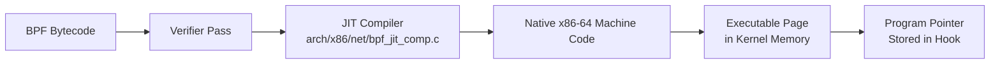
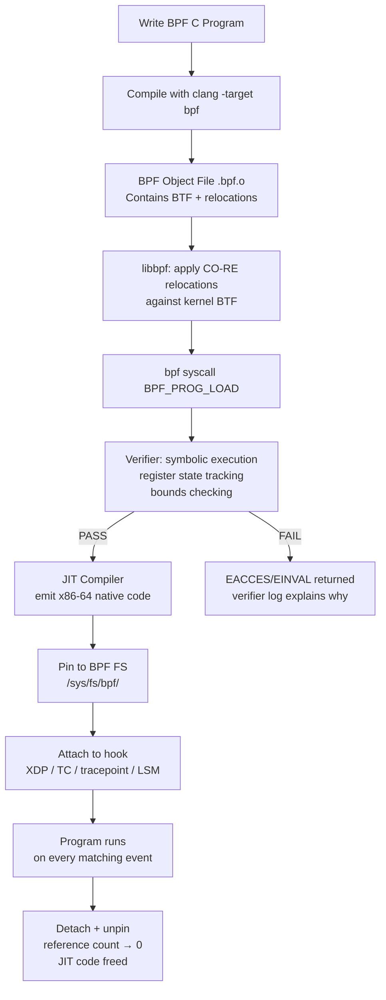
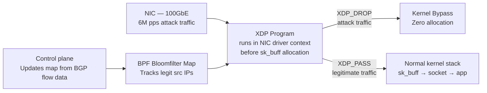

# eBPF Internals

## Table of Contents

- [Overview](#overview)
- [BPF Instruction Set Architecture](#bpf-instruction-set-architecture)
  - [Registers](#registers)
  - [Instruction Classes](#instruction-classes)
  - [Encoding Example](#encoding-example)
- [BPF Verifier](#bpf-verifier)
  - [What the Verifier Checks](#what-the-verifier-checks)
  - [Symbolic Execution and Register State](#symbolic-execution-and-register-state)
  - [Bounded Loops (Kernel 5.3+)](#bounded-loops-kernel-53)
  - [Proof-Carrying Code](#proof-carrying-code)
- [JIT Compilation](#jit-compilation)
  - [x86-64 JIT Pipeline](#x86-64-jit-pipeline)
  - [JIT Hardening (Constant Blinding)](#jit-hardening-constant-blinding)
- [CO-RE: Compile Once, Run Everywhere](#co-re-compile-once-run-everywhere)
  - [The Problem CO-RE Solves](#the-problem-co-re-solves)
  - [BTF: BPF Type Format](#btf-bpf-type-format)
  - [CO-RE Relocations](#co-re-relocations)
- [BPF Map Internals](#bpf-map-internals)
  - [Hash Map (`BPF_MAP_TYPE_HASH`)](#hash-map-bpf_map_type_hash)
  - [LRU Map (`BPF_MAP_TYPE_LRU_HASH`)](#lru-map-bpf_map_type_lru_hash)
  - [Ring Buffer (`BPF_MAP_TYPE_RINGBUF`) — Kernel 5.8+](#ring-buffer-bpf_map_type_ringbuf-kernel-58)
  - [Map-in-Map (`BPF_MAP_TYPE_ARRAY_OF_MAPS`)](#map-in-map-bpf_map_type_array_of_maps)
- [Advanced Program Types](#advanced-program-types)
  - [fentry/fexit (Trampoline-Based)](#fentryfexit-trampoline-based)
  - [LSM Hooks (`BPF_PROG_TYPE_LSM`)](#lsm-hooks-bpf_prog_type_lsm)
  - [sk_msg and sk_skb (Socket Acceleration)](#sk_msg-and-sk_skb-socket-acceleration)
- [BPF Program Lifecycle](#bpf-program-lifecycle)
- [libbpf vs BCC](#libbpf-vs-bcc)
- [Real-World Production Scenario](#real-world-production-scenario)
  - [Scenario: Cloudflare XDP DDoS Mitigation at 6M pps/server](#scenario-cloudflare-xdp-ddos-mitigation-at-6m-ppsserver)
- [Performance Benchmarks](#performance-benchmarks)
- [Debugging Guide](#debugging-guide)
- [Interview Questions](#interview-questions)
  - [Advanced / Staff Level](#advanced-staff-level)
  - [Principal Level](#principal-level)

---

## Overview

eBPF (Extended Berkeley Packet Filter) is the defining technology separating senior engineers from staff and principal engineers in infrastructure. While most engineers know eBPF as a tool for observability or network policy, staff-level mastery requires understanding the verifier's symbolic execution, JIT compilation pipeline, CO-RE's BTF-based relocations, and the production architecture choices that made Cloudflare and Meta abandon traditional kernel modules in favor of BPF programs. This document treats eBPF as a runtime substrate, not a convenience tool.

---

## BPF Instruction Set Architecture

The BPF virtual machine is a RISC-like 64-bit architecture. Every BPF program compiles down to a sequence of fixed-width 64-bit instructions executed by the in-kernel BPF interpreter or JIT-compiled to native machine code.

### Registers

The BPF ISA has 11 registers:

| Register | Role |
|----------|------|
| r0 | Return value from helper calls and program exit value |
| r1-r5 | Function call arguments (caller-saved) |
| r6-r9 | General purpose (callee-saved across BPF-to-BPF calls) |
| r10 | Frame pointer (read-only); points to top of stack frame |
| pc | Program counter (implicit, not addressable) |

Stack size is capped at 512 bytes per BPF stack frame. There is no heap; all persistent state must go through BPF maps.

### Instruction Classes

```
BPF_LD    - load from memory into register
BPF_LDX   - load from map or context pointer
BPF_ST    - store immediate to memory
BPF_STX   - store register to memory
BPF_ALU   - 32-bit arithmetic/logical operations
BPF_ALU64 - 64-bit arithmetic/logical operations
BPF_JMP   - 64-bit conditional and unconditional jumps
BPF_JMP32 - 32-bit conditional jumps
BPF_CALL  - BPF helper function call or BPF-to-BPF call
BPF_EXIT  - program exit (r0 holds return value)
```

### Encoding Example

A simple `r0 = r1 + 42` encodes as:

```
opcode=BPF_ALU64|BPF_ADD|BPF_K  dst=r0  src=r1  imm=42
```

---

## BPF Verifier

The verifier is the most important and most complex component of the BPF subsystem. It runs at program load time (`bpf(BPF_PROG_LOAD, ...)`) and performs **static analysis via symbolic execution** — it simulates all possible execution paths through the program without running it.

### What the Verifier Checks

1. **CFG validity** — No unreachable instructions, no infinite loops (with exceptions in kernel 5.3+), directed acyclic graph unless bounded loops are proven safe.
2. **Register state tracking** — Each register is tracked as one of: `NOT_INIT`, `SCALAR_VALUE`, `PTR_TO_CTX`, `PTR_TO_MAP_VALUE`, `PTR_TO_STACK`, `PTR_TO_PACKET`, `PTR_TO_PACKET_END`. Any attempt to dereference `NOT_INIT` is rejected.
3. **Bounds checking** — Before any load/store, the verifier checks that pointer arithmetic keeps the pointer within valid bounds (packet bounds, map value bounds, stack bounds). This is what prevents arbitrary kernel memory reads.
4. **Helper function validation** — Arguments to BPF helpers (e.g., `bpf_map_lookup_elem`) are validated against the helper's expected argument types.
5. **Return value** — r0 at exit must contain a value of the type expected by the program type (e.g., XDP programs must return `XDP_PASS`, `XDP_DROP`, etc.).

### Symbolic Execution and Register State

The verifier tracks a "register state" for each register at every instruction:

```
Before: r1 = PTR_TO_CTX, r2 = SCALAR_VALUE(umin=0, umax=255)
After r1 += r2: r1 = PTR_TO_CTX(off=0..255)
```

When the program branches (conditional jump), the verifier forks its state and explores both paths. At joins (after an if-else), it computes the union of states from all paths. This is why **verification complexity is exponential** in the worst case — programs with many branches can have O(2^n) paths. The verifier caps exploration at 1 million instructions.

### Bounded Loops (Kernel 5.3+)

Prior to kernel 5.3, all loops were rejected. Since 5.3, the verifier proves loops terminate by requiring a bounded trip count or by requiring the loop variable to be constrained by a proven upper bound:

```c
// This is verifiable: bound is a constant or map value with known max
for (int i = 0; i < 10; i++) {
    // body
}

// This requires the verifier to prove bound <= MAX_ITERATIONS
bpf_loop(n, callback, ctx, 0);  // kernel 5.17+ helper, verifier-friendly
```

### Proof-Carrying Code

BPF's verification model is a form of **proof-carrying code (PCC)**: the program carries proof of its own safety (as annotations implicit in its structure), and the verifier checks that proof before execution. The key insight is that the verifier does not need to trust the programmer — it re-derives safety guarantees from the program itself.

---

## JIT Compilation

### x86-64 JIT Pipeline



The JIT compiler (`arch/x86/net/bpf_jit_comp.c`) maps each BPF instruction to one or more x86-64 instructions. BPF registers r0-r9 map to x86-64 registers (rax, rdi, rsi, rdx, rcx, r8, rbx, r13, r14, r15). The JIT uses a two-pass strategy: first pass calculates instruction sizes for forward-jump resolution, second pass emits the actual machine code.

### JIT Hardening (Constant Blinding)

When `net.core.bpf_jit_harden=2` is set, the JIT applies **constant blinding** to prevent JIT spraying attacks:

```
Original:  MOV r0, 0xdeadbeef
Hardened:  MOV r0, 0xdeadbeef ^ 0xcafe1234  (random mask)
           XOR r0, 0xcafe1234               (unmask at runtime)
```

The random mask is chosen at load time. An attacker who controls BPF bytecode can no longer reliably place shellcode at predictable kernel addresses. This is required when unprivileged BPF is enabled (`kernel.unprivileged_bpf_disabled=0`, which is strongly discouraged in production).

---

## CO-RE: Compile Once, Run Everywhere

### The Problem CO-RE Solves

Traditional BPF programs (BCC-style) re-compiled at runtime using kernel headers to access kernel data structures. This created two problems:
1. **Portability**: A program compiled against kernel 5.4 headers would crash or produce wrong results on kernel 5.15 if a struct layout changed.
2. **Performance**: BCC used Python and Clang/LLVM at runtime — adding 500ms-2s startup latency and requiring LLVM to be present on every production host.

### BTF: BPF Type Format

BTF (BPF Type Format) is a compact type description format embedded in the kernel (exported at `/sys/kernel/btf/vmlinux`) and in compiled BPF object files. It describes every struct, union, typedef, and function signature with exact field offsets for the running kernel.

```bash
# Inspect kernel BTF
bpftool btf dump file /sys/kernel/btf/vmlinux format c | grep "struct task_struct" | head -5

# Verify BTF is enabled in your kernel
ls /sys/kernel/btf/vmlinux
```

### CO-RE Relocations

When a CO-RE BPF program accesses `task->pid`, the compiler emits a **CO-RE relocation** rather than a hard-coded byte offset. At load time, libbpf reads the kernel's BTF to find the actual offset of `pid` in `task_struct` for the running kernel, and patches the instruction:

```c
// In BPF C code (CO-RE style)
pid_t pid = BPF_CORE_READ(task, pid);  // Macro emits relocation

// Compiled to: r1 = *(u32 *)(r6 + OFFSET)
// OFFSET is a relocation — libbpf fills it in at load time
// using the kernel's BTF for the actual running kernel
```

This replaces kernel headers entirely. The BPF object file is compiled once and works across any kernel that exports BTF with the required types.

---

## BPF Map Internals

Maps are the primary mechanism for BPF programs to store state and communicate with userspace.

### Hash Map (`BPF_MAP_TYPE_HASH`)

Implemented as a hash table using **jhash** (Jenkins hash) for key hashing. Internally uses per-bucket spinlocks for concurrent access. The **per-CPU hash map** (`BPF_MAP_TYPE_PERCPU_HASH`) eliminates locking by maintaining one copy per CPU — the userspace aggregation combines per-CPU values.

```bash
# Create a hash map
bpftool map create /sys/fs/bpf/conn_count type hash key 4 value 8 entries 65536 name conn_count

# Inspect a running map
bpftool map dump id 42

# Pin a map to BPF FS (survives program termination)
bpftool map pin id 42 /sys/fs/bpf/my_map
```

### LRU Map (`BPF_MAP_TYPE_LRU_HASH`)

When the map is full, the LRU map evicts the least recently used entry. Implemented with a per-map LRU list. The per-CPU LRU variant uses per-CPU free lists to reduce lock contention during high-rate insertions.

### Ring Buffer (`BPF_MAP_TYPE_RINGBUF`) — Kernel 5.8+

The ring buffer is the preferred mechanism for BPF-to-userspace event streaming. It is **lock-free for BPF programs** (BPF programs use atomic operations to reserve space) and uses `epoll` for efficient userspace consumption. Advantages over perf buffer:

- Single buffer shared across all CPUs (no per-CPU fragmentation)
- No data loss from unread per-CPU buffers
- Memory-mapped by userspace for zero-copy reads
- Preserves event ordering across CPUs

```c
// BPF program: reserve space and commit event
struct event *e = bpf_ringbuf_reserve(&events, sizeof(*e), 0);
if (!e) return 0;
e->pid = bpf_get_current_pid_tgid() >> 32;
bpf_ringbuf_submit(e, 0);
```

### Map-in-Map (`BPF_MAP_TYPE_ARRAY_OF_MAPS`)

An outer map whose values are file descriptors pointing to inner maps. Enables **atomic replacement of an inner map** from userspace — update a routing table without taking any locks visible to BPF programs. Used in production for atomic policy updates.

---

## Advanced Program Types

### fentry/fexit (Trampoline-Based)

`fentry` and `fexit` attach at function entry/exit using BPF trampolines, which are JIT-compiled stubs injected into the function's prologue. They are **5-10x faster than kprobes** because:
- No breakpoint trap (`int 3`) instruction
- No simulated single-step
- Direct call via trampoline, no softirq context switch

```bash
# Attach fentry to tcp_connect
bpftool prog load tcp_trace.bpf.o /sys/fs/bpf/tcp_trace \
  type fentry --attach-to tcp_connect
```

### LSM Hooks (`BPF_PROG_TYPE_LSM`)

BPF LSM programs attach to Linux Security Module hook points (e.g., `bpf_lsm_socket_connect`, `bpf_lsm_file_open`). They can enforce security policy with full MAC (Mandatory Access Control) semantics. Return 0 to allow, return -EPERM to deny. Used in production for runtime security enforcement (e.g., Falco, Tetragon).

### sk_msg and sk_skb (Socket Acceleration)

`sk_msg` programs attach to a `sockmap` and intercept `sendmsg` calls. They can redirect messages between sockets **in-kernel without copying through userspace** — used by Cilium for socket-level service load balancing that bypasses iptables/conntrack entirely.

---

## BPF Program Lifecycle



The **BPF filesystem** (`/sys/fs/bpf/`, type `bpf`) acts as a persistent handle store. Without pinning, a BPF program's lifetime is tied to the file descriptor that loaded it — if the loading process exits, the program is unloaded. Pinning creates an in-kernel reference that persists independently.

---

## libbpf vs BCC

| Dimension | BCC | libbpf + CO-RE |
|-----------|-----|----------------|
| Compilation | At runtime on target host | At build time, once |
| Dependencies | Python + Clang/LLVM on each host | Only libbpf.so on target |
| Startup latency | 500ms – 2s | < 10ms |
| Portability | Requires matching kernel headers | Works on any kernel with BTF |
| Memory overhead | ~100MB (LLVM in memory) | ~5MB |
| Production suitability | Development/debugging | Production |
| Example tools | bcc/tools/tcptracer.py | Cilium, Pixie, Tetragon |

**Rule of thumb**: BCC is excellent for interactive debugging and prototyping. For anything that runs in production at scale, use libbpf with CO-RE.

---

## Real-World Production Scenario

### Scenario: Cloudflare XDP DDoS Mitigation at 6M pps/server

**Context**: A volumetric UDP amplification attack sends 6 million packets per second to a single server. The attack uses spoofed source IPs to generate DNS/NTP reflection. The kernel's normal network stack cannot process 6M pps without saturating all CPU cores.

**Architecture**:



**BPF program logic** (simplified):
```c
SEC("xdp")
int ddos_filter(struct xdp_md *ctx) {
    struct iphdr *iph = data + sizeof(struct ethhdr);
    // Lookup source IP in bloomfilter map
    u32 *verdict = bpf_map_lookup_elem(&ip_blocklist, &iph->saddr);
    if (verdict && *verdict == BLOCKED)
        return XDP_DROP;  // Drop before sk_buff allocation
    return XDP_PASS;
}
```

**Why XDP is required**: At 6M pps, `sk_buff` allocation alone costs ~6M * 200ns = 1.2 seconds of CPU per second. XDP operates on raw `xdp_buff` (a pointer into the DMA ring buffer), costing ~20ns per packet. The 10x latency reduction is the difference between CPU saturation and headroom.

**Production result**: Cloudflare reports handling 6M pps/server with XDP/BPF while consuming < 50% of available CPU cores, leaving capacity for legitimate traffic processing.

---

## Performance Benchmarks

| Operation | kprobe | fentry | XDP (driver mode) | XDP (native mode) |
|-----------|--------|--------|-------------------|-------------------|
| Overhead per event | ~200ns | ~20-40ns | — | — |
| Max pps (packet drop) | — | — | ~24M pps/core | ~14M pps/core |
| Map lookup (hash) | — | — | ~50ns | ~50ns |
| Map update (hash) | — | — | ~100ns | ~100ns |

- Facebook Katran L4 load balancer: 20M pps per server with BPF/XDP
- Cilium: replaces kube-proxy iptables (O(n) rules) with BPF hash maps (O(1) lookups) — 10x faster service routing at 10K services

---

## Debugging Guide

```bash
# List all loaded BPF programs
bpftool prog list

# Show detailed info including verifier stats
bpftool prog show id 42 --pretty

# Dump JIT-compiled x86-64 instructions
bpftool prog dump jited id 42

# Show verifier log for a failed program load
# (must be root, set log_level=1 in bpf_prog_load)
strace -e bpf bpftool prog load fail.bpf.o /dev/null 2>&1 | grep -A 50 "log"

# Trace BPF program execution (bpftrace)
bpftrace -e 'kprobe:__sys_bpf { printf("bpf syscall cmd=%d\n", arg0); }'

# Monitor BPF ring buffer from userspace
bpftool prog tracelog

# Check BPF map memory usage
bpftool map list
# Each map shows: type, key/value size, max_entries, memory_locked

# Verify CO-RE relocations were applied
bpftool prog load prog.bpf.o /sys/fs/bpf/prog -d 2>&1 | grep "CO-RE"

# Check BTF availability
ls -la /sys/kernel/btf/vmlinux
bpftool btf show

# XDP program attach status
ip link show dev eth0  # Shows xdp prog attached
bpftool net list dev eth0

# TC-BPF program status
tc filter show dev eth0 ingress

# Performance: measure BPF program run time
bpftool prog profile id 42 duration 10 cycles instructions
```

---

## Interview Questions

### Advanced / Staff Level

**Q1: Explain how the BPF verifier prevents out-of-bounds memory access for a packet parser that reads variable-length fields.**

The verifier tracks a "packet range" for each `PTR_TO_PACKET` register: it knows the pointer's minimum and maximum offset relative to `data`. Before any load instruction using a packet pointer, the verifier requires a preceding bounds check (e.g., `if (data + offset + 4 > data_end) return XDP_DROP`). This check creates a "pruning point" — if the check is not present or the pointer arithmetic moves the pointer outside the proven range, the verifier rejects the program with an error like "invalid access to packet, off=X size=Y, R1(id=0,off=X,r=0)". The key insight is that bounds checks on data-derived values constrain the register's tracked range, and the verifier models the conditional branches to know which range is valid in each branch.

**Q2: What is the difference between BPF-to-BPF tail calls and BPF-to-BPF function calls, and when would you choose each?**

Tail calls (`bpf_tail_call`) replace the current program's stack frame with the callee — like a C `longjmp`. They are used to chain programs exceeding the 1M instruction verification limit, or to select a program at runtime from a `BPF_MAP_TYPE_PROG_ARRAY`. The limitation is that tail calls do not return — they are terminal. BPF-to-BPF function calls (supported since kernel 4.16) are regular calls that push/pop stack frames, allowing subroutines with return values. Each call frame uses up to 512 bytes of stack space, and call chains are limited to 8 frames deep. Choose tail calls for pipeline stages or program dispatch; choose function calls for code reuse within a program.

**Q3: How does the per-CPU hash map eliminate locking, and what is the userspace aggregation pattern?**

Each CPU maintains its own independent copy of the map. BPF programs running in softirq context on CPU N access only CPU N's copy without any lock. Userspace reads all per-CPU copies via `bpf_map_lookup_elem` with a batch read (kernel 5.6+), then sums or takes the max across CPUs. This works for counters (sum), maximums, and histograms (sum per bucket), but not for exact counts that require cross-CPU consistency (use a regular hash map with lock for that). The key trade-off: per-CPU maps have N times the memory of a regular map, but N times the write throughput.

**Q4: Describe the fentry attachment mechanism at the instruction level — how does the trampoline work?**

At function entry, the kernel reserves 5 bytes in the function prologue (either as `NOP` instructions or as `ENDBR64` on CET-enabled systems). When a fentry program is attached, the JIT compiles the BPF program into a **trampoline** — a native x86-64 stub that saves the required registers to the BPF stack frame, calls the BPF program, then restores registers and returns. The 5-byte NOP at the target function's prologue is **patched atomically** (using text poke with stop-machine) to a `CALL` instruction pointing to the trampoline. The patching is safe because: (1) stop-machine pauses all other CPUs, (2) the 5-byte write is aligned to avoid torn reads, and (3) the trampoline is made executable before the patch. Multiple fentry programs on the same function are chained as a linked list of trampolines.

**Q5: What is the CO-RE field existence pattern, and why is it necessary?**

Kernel structs evolve across versions — fields are added, removed, or renamed. CO-RE field existence checks allow a single BPF binary to handle multiple kernel versions:

```c
if (bpf_core_field_exists(struct task_struct, io_uring)) {
    // kernel 5.1+ has this field
    io_data = BPF_CORE_READ(task, io_uring);
}
```

At compile time, this emits a CO-RE "field existence" relocation. At load time, libbpf checks the kernel's BTF — if the field exists, the check evaluates to 1; if not, it evaluates to 0. The verifier then prunes the dead branch for the running kernel. Without this pattern, a BPF program accessing a non-existent field would either access a wrong offset (producing garbage data) or be rejected by the verifier.

### Principal Level

**Q6: Design a BPF-based connection tracking system to replace nf_conntrack for a high-throughput NAT gateway processing 5M pps. What map types, program types, and synchronization strategy would you use?**

The replacement requires: (1) **BPF_PROG_TYPE_XDP** for the data fast path — XDP operates before sk_buff allocation, critical at 5M pps. (2) A **per-CPU hash map** keyed by 5-tuple for the common case (established connections) — per-CPU eliminates contention on the hot path. (3) A **shared hash map** (with explicit spin lock via `bpf_spin_lock`) for SYN/SYN-ACK state where atomicity across CPUs is required — two CPUs can race processing packets of the same new connection. (4) **fentry/fexit on TCP state machine functions** to update connection state from kernel TCP events rather than re-implementing the TCP state machine in BPF. (5) A **BPF ring buffer** for state change events to a userspace daemon that handles NAT table persistence and monitoring. (6) **map-in-map** for atomic rotation of the NAT table during maintenance windows. The critical insight is that Cilium implements exactly this architecture and achieves O(1) NAT lookups versus conntrack's O(n) hash chain traversal under high collision rates, while also eliminating the per-packet conntrack table lock that becomes a bottleneck above ~2M pps.

**Q7: The BPF verifier rejects your program with "back-edge from insn X to Y" even though your loop is clearly bounded. Explain the underlying reason and three strategies to make the loop verifier-friendly.**

The verifier uses a DAG (directed acyclic graph) check before symbolic execution. A backward edge in the instruction graph — any jump to a lower instruction index — is automatically classified as a "back-edge" and rejected as a potential infinite loop, **regardless of whether the programmer knows it terminates**. The three strategies are: (1) **Unroll the loop** — for small fixed counts (`#pragma unroll` for clang), the compiler eliminates the back-edge by duplicating the loop body. This works for trip counts up to ~100 before the instruction count limit becomes a problem. (2) **Use `bpf_loop()`** (kernel 5.17+) — this helper takes a callback and max iteration count; the verifier trusts the max count and does not need to track the loop variable through the back-edge. (3) **Use bounded loop verification** (kernel 5.3+) — restructure the loop so the iterator variable is in a register with a proven upper bound tracked by the verifier. The key is that the variable used in the loop condition must be a scalar with a tracked `umax` (unsigned max) that the verifier can see is bounded before the back-edge. If the variable is derived from a map value or packet data (which the verifier treats as unbounded), a prior `if (n > MAX) return -1` bounds check must precede the loop.
