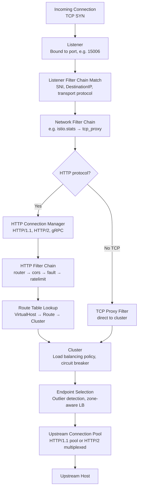
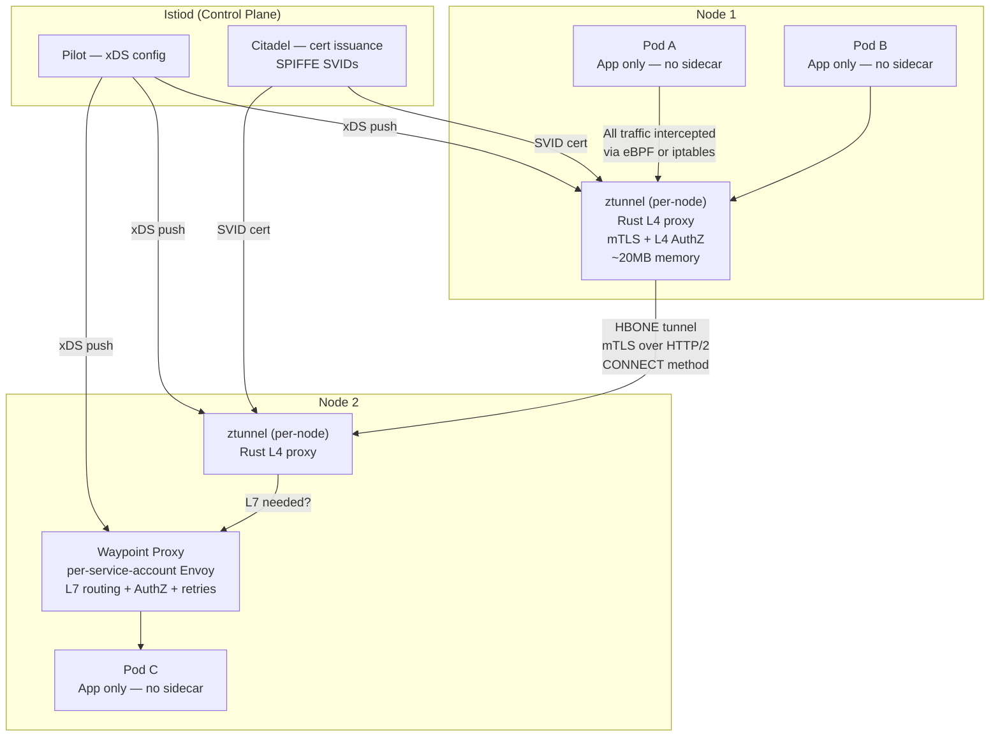
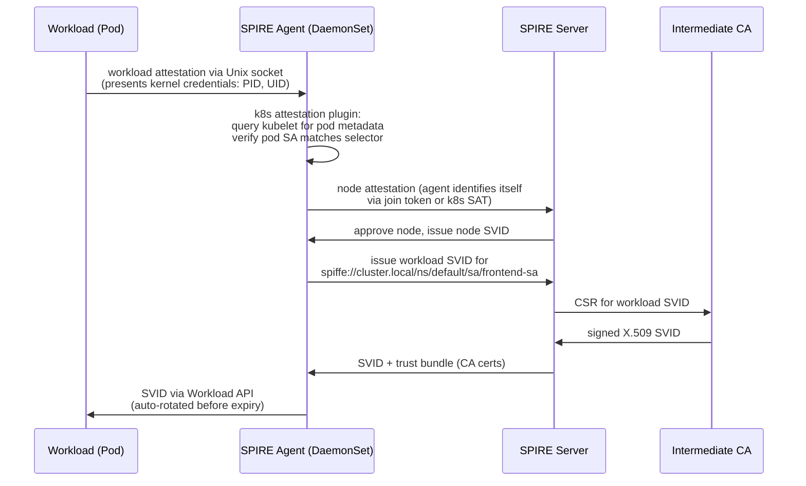

# Service Mesh: Advanced Internals

## Overview

A service mesh is no longer just a "sidecar that does mTLS." At the staff and principal level, the conversation shifts to data plane internals (Envoy's filter chain pipeline, connection pool state machines), the architectural transition from sidecar to Ambient mode and what that means for security boundary placement, multi-cluster identity federation, and the production failure modes that are invisible until they bite. Engineers who can diagnose Envoy's config from `/config_dump` and design a safe Istio upgrade procedure are operating at a different level than those who can only configure VirtualService YAML.

---

## Envoy Internals

Envoy is the data plane proxy used by Istio, AWS App Mesh, and Consul Connect. Understanding its internal pipeline is prerequisite to diagnosing any mesh issue.

### Listener → Filter Chain → Cluster → Endpoint Pipeline



**Listener**: Envoy listens on multiple ports. In Istio sidecar mode, port 15006 catches all inbound traffic (redirected by iptables) and port 15001 catches all outbound. The listener is the entry point.

**Filter Chain Match**: A listener has multiple filter chains selected by matching criteria (destination IP, SNI, ALPN). For Istio, filter chains are selected by the SPIFFE identity in the client's TLS certificate — this is how per-source authorization is implemented.

**HTTP Connection Manager (HCM)**: When the upstream protocol is HTTP, the network-level TCP connection hands off to the HCM, which parses the HTTP protocol and runs HTTP-level filters. The HCM maintains the HTTP/2 multiplexing state, stream priority, and flow control per stream.

**Cluster**: An Envoy cluster represents a logical upstream service. Each cluster has:
- Load balancing policy (round robin, least request, ring hash, Maglev)
- Circuit breaker thresholds (max connections, max pending requests, max retries)
- Connection pool configuration (max connections per host, idle timeout)
- Outlier detection policy (consecutive errors → eject endpoint)

### Connection Pool Internals

Envoy maintains **per-host connection pools** for each upstream endpoint. For HTTP/1.1, a connection pool is a set of connections where each connection handles one request at a time. For HTTP/2, a single connection multiplexes all streams.

Circuit breaker states (tracked per cluster per priority level):

| State | Condition | Effect |
|-------|-----------|--------|
| Closed | Normal operation | Requests flow through |
| Open | Threshold exceeded (e.g., 5 consecutive 5xx) | Fast fail — return 503 without connecting upstream |
| Half-Open | After ejection duration | Allow one request through; success → Closed, failure → Open |

The `consecutive5xxErrors` outlier detection ejects a specific **endpoint** (not the whole cluster). The **overflow** circuit breaker rejects requests when the cluster's `maxConnections` or `maxPendingRequests` threshold is exceeded. These are distinct mechanisms operating at different granularities.

```bash
# Check circuit breaker state for a cluster
kubectl exec -it deploy/frontend -- \
  curl -s localhost:15000/clusters | grep -A 10 "backend::circuit_breakers"

# Expected output shows thresholds:
# backend::default_priority::max_connections::100
# backend::default_priority::remaining_pending::100
# backend::default_priority::cx_open::0   (0 = closed, 1 = open)
```

---

## Istio Ambient Mode Architecture

Ambient mode is a fundamental rearchitecting of Istio that eliminates per-pod sidecars in favor of a layered per-node + per-service-account model.



### ztunnel: Layer 4 mTLS Plane

ztunnel is a per-node Rust proxy (not Envoy) that handles:
- **mTLS establishment** between nodes using SPIFFE SVIDs
- **L4 AuthorizationPolicy** (allow/deny based on source workload identity)
- **Basic telemetry**: bytes transferred, connection established/terminated events
- **HBONE protocol**: HTTP-based Overlay Network Environment — uses HTTP/2 CONNECT to tunnel arbitrary TCP through an mTLS-protected stream

ztunnel does **not** inspect HTTP headers, apply retries, or perform circuit breaking. It sees only L4 streams.

### Waypoint Proxy: Layer 7 Policy Plane

Waypoint proxies are full Envoy instances deployed per-service-account (or per-namespace). They are **optional** — if you only need mTLS and L4 policies, ztunnel alone suffices. Waypoint proxies are deployed when you need:
- HTTP header-based routing (canary, A/B)
- Retries, timeouts, circuit breaking
- L7 AuthorizationPolicy (check JWT claims, HTTP headers)
- Rate limiting

Traffic reaches the waypoint only for services that have one enrolled. ztunnel forwards L7-destined traffic to the waypoint on the destination node via HBONE.

### Performance Comparison

| Mesh | p99 Latency Overhead | Memory per Pod | CPU per Pod | mTLS |
|------|---------------------|----------------|-------------|------|
| Istio sidecar (1.24) | +2.5–5ms | 50–100MB | 0.1–0.5 vCPU | Yes |
| Istio Ambient (ztunnel only) | +0.8–1.5ms | 0 (ztunnel ~20MB/node) | Minimal | Yes |
| Istio Ambient (with waypoint) | +2–3ms | 0 per pod | Minimal | Yes |
| Linkerd (linkerd2-proxy) | +0.5–1.5ms | 10–20MB | 0.01–0.1 vCPU | Yes |
| Cilium (L4 only) | +0.2–0.5ms | 0 per pod | Minimal | via WireGuard |

---

## SPIFFE/SPIRE Internals

### SVID Lifecycle and Attestation

SPIFFE (Secure Production Identity Framework For Everyone) defines the identity format: `spiffe://trust-domain/path`. Example: `spiffe://cluster.local/ns/default/sa/frontend-sa`.

SPIRE (the reference implementation) issues SVIDs via the Workload API (Unix socket: `/run/spire/sockets/agent.sock`). The issuance flow:



**Attestation plugins**: SPIRE uses plugin-based attestation to determine what identity to issue. The Kubernetes workload attestor uses the kubelet API to verify that the process making the request is actually running in the claimed pod with the claimed service account.

**SVID rotation**: SVIDs have short TTLs (default 1 hour). SPIRE Agent rotates them automatically before expiry. The Workload API uses a watch API (`FetchX509SVID` streaming RPC) so the workload receives the new SVID before the old one expires — zero downtime rotation.

### Trust Domain Federation

For multi-cluster or cross-cloud mTLS, SPIRE servers in different trust domains can federate:

```bash
# Configure federation in SPIRE server
spire-server bundle show -format spiffe > bundle.jwks
# Share with remote SPIRE server
spire-server bundle set -format spiffe -id spiffe://remote-cluster.local \
  -path remote-bundle.jwks

# Result: workloads in cluster-A can authenticate to workloads in cluster-B
# using SPIFFE-based mTLS without a shared CA
```

---

## Multi-Cluster Mesh

### Istio Multi-Primary

Each cluster has its own Istiod. Both clusters share a root CA (typically SPIRE or an external CA). Service discovery is federated — each Istiod has read access to the remote cluster's Kubernetes API to discover services.

```bash
# Cluster 1: create remote secret for cluster 2 API access
istioctl create-remote-secret --name=cluster2 \
  --kubeconfig=/path/to/cluster2.kubeconfig | kubectl apply -f -

# Both clusters share the same root CA for cross-cluster mTLS
# Intermediate CAs are issued per-cluster from the shared root
```

**Multi-primary** is preferred for production: no single control plane failure affects both clusters. Trade-off: more complex to set up and requires that both clusters have network connectivity for cross-cluster service discovery.

### Cilium ClusterMesh

Cilium ClusterMesh creates a multi-cluster overlay by federating the etcd stores of each cluster's Cilium agent. Services are exported/imported via `CiliumExportedService` and `CiliumImportedService` CRDs. Cross-cluster traffic uses Cilium's native routing (VXLAN or BGP) with WireGuard for encryption.

```bash
# Connect two clusters
cilium clustermesh connect --destination-context cluster2
cilium clustermesh status  # verify connectivity

# Export a service for cross-cluster discovery
kubectl annotate service backend service.cilium.io/global=true
```

---

## Debugging

### Envoy Admin API

```bash
# Port-forward to Envoy admin (port 15000 in Istio sidecar, 9901 in standalone)
kubectl port-forward deploy/frontend 15000

# Full configuration dump (warning: large JSON output)
curl -s localhost:15000/config_dump | jq .

# Just the cluster configuration
curl -s localhost:15000/config_dump | jq '.configs[] | select(.["@type"] | contains("ClustersConfigDump")) | .dynamic_active_clusters[] | {name: .cluster.name, lb_policy: .cluster.lb_policy}'

# Live cluster stats (includes circuit breaker state)
curl -s localhost:15000/clusters

# Check specific endpoint health
curl -s localhost:15000/clusters | grep "backend::" | grep -E "(healthy|cx_active|rq_active|rq_timeout)"

# Listener configuration
curl -s localhost:15000/config_dump | jq '.configs[] | select(.["@type"] | contains("ListenersConfigDump"))'

# Active connections and requests
curl -s localhost:15000/stats | grep -E "(cx_active|rq_active|upstream_rq_retry)"

# Enable access logging temporarily
curl -s -X POST "localhost:15000/logging?level=info"
```

### istioctl Diagnostics

```bash
# Check all proxy sync status (is Istiod's config reaching proxies?)
istioctl proxy-status

# Expected: all pods show "SYNCED" for CDS, LDS, EDS, RDS
# Any "STALE" indicates the proxy has not received the latest config

# Analyze Istio configuration for common misconfigurations
istioctl analyze --all-namespaces

# Detailed proxy config for a specific deployment
istioctl proxy-config routes deploy/frontend -n default
istioctl proxy-config clusters deploy/frontend -n default
istioctl proxy-config listeners deploy/frontend -n default
istioctl proxy-config endpoints deploy/frontend -n default

# Check what AuthorizationPolicies apply to a workload
istioctl x authz check deploy/backend -n default

# Trace a specific request through the mesh (requires Envoy access log)
istioctl dashboard envoy deploy/frontend  # opens Envoy admin in browser
```

### Kiali Service Graph

Kiali provides a live service topology graph with error rates overlaid. Access:

```bash
kubectl port-forward svc/kiali -n istio-system 20001:20001
# Open http://localhost:20001
# Graph view shows request success/error rates per edge
# Click a service → Inbound/Outbound tabs show per-source/destination metrics
```

---

## Anti-Patterns

**Injecting sidecar into kube-system**: Do not label `kube-system` for Istio injection. The `kube-dns`, `coredns`, and `kube-proxy` pods will have their traffic intercepted by Envoy. CoreDNS will fail to resolve names because Envoy intercepts DNS before CoreDNS can answer. The Envoy sidecar itself needs DNS to start, creating a bootstrap deadlock.

**mTLS without AuthorizationPolicy**: Enabling strict mTLS ensures all traffic is encrypted and authenticated with SPIFFE identity. But without `AuthorizationPolicy`, any workload in the mesh can call any other workload. mTLS provides authentication (I know who you are) but not authorization (I decide whether you're allowed). Always pair strict mTLS with deny-all + explicit ALLOW policies.

**Removing a subset from DestinationRule while VirtualService still references it**: Envoy will return 503 for all traffic to that subset because the cluster no longer exists. The safe sequence is: (1) update VirtualService to remove the subset reference, (2) wait for config propagation (`istioctl proxy-status` shows SYNCED), (3) then remove the subset from DestinationRule.

**Large timeout mismatch between mesh and upstream**: If the VirtualService sets a 30s timeout but the application's HTTP client uses a 5s timeout, the mesh timeout is irrelevant. If the mesh timeout is 5s but the upstream database query takes 10s, the mesh will return 504 to the caller while the database is still processing. Align timeouts from the application layer outward.

---

## Real-World Production Scenario

### Istio Upgrade Causing 5xx Spike — Canary Upgrade and Rollback

**Incident**: An in-place Istio upgrade from 1.22 to 1.24 caused a 12% error rate spike for 8 minutes. The upgrade updated Istiod first, then triggered rolling restarts of all Envoy sidecars (via the injection webhook). During the rolling restart window, old Envoy 1.22 proxies received xDS configuration from the new Istiod 1.24. One configuration feature (the new `filterMetadata` field in `DestinationRule`) was sent to old proxies that did not understand it — they silently dropped the entire route configuration, returning 503 for those routes.

**Root cause**: Istio's xDS server (Pilot) is not fully backward compatible with older proxy versions. Istiod 1.24 sent `DestinationRule` configurations using a proto field introduced in 1.23. Envoy 1.22 proxies (still running before their rolling restart) used the unknown field's behavior: discard the enclosing message, leaving the route unconfigured.

**Diagnosis**:
```bash
# Check proxy versions — mixed versions during upgrade
istioctl proxy-status | awk '{print $NF}' | sort | uniq -c
# 127 istiod-1.24.0
# 43  istiod-1.22.0   <-- old proxies not yet restarted

# Check xDS rejections in Istiod logs
kubectl logs -n istio-system deploy/istiod | grep "NACKed"
# NACK errors indicate proxies rejected the config

# Check error rates per service
kubectl exec -it deploy/prometheus -n istio-system -- \
  curl -s 'localhost:9090/api/v1/query?query=rate(istio_requests_total{response_code=~"5.."}[1m])'
```

**Canary upgrade procedure** (correct approach):
```bash
# Step 1: Install new Istiod as a canary revision
istioctl install --set revision=1-24 --set profile=default

# Step 2: Verify new Istiod is healthy
kubectl -n istio-system get deploy istiod-1-24

# Step 3: Migrate one non-critical namespace to the new revision
kubectl label namespace staging istio.io/rev=1-24 istio-injection-

# Step 4: Roll out pods in staging to pick up new sidecar
kubectl rollout restart deploy -n staging

# Step 5: Verify no errors in staging for 30 minutes
# Step 6: Migrate remaining namespaces one at a time

# Rollback: relabel namespace to old revision, restart pods
kubectl label namespace staging istio.io/rev=1-22 --overwrite
kubectl rollout restart deploy -n staging
```

The canary approach ensures old Istiod and old Envoys coexist, then new Istiod and new Envoys coexist — but never new Istiod + old Envoys at production scale.

---

## Performance Benchmarks

- Istio sidecar: adds 2 network hops per RPC (caller sidecar → callee sidecar)
- Linkerd: 0.5–1ms p99 overhead (Rust proxy with zero-copy buffer management)
- Cilium (L4 only, eBPF): 0.2–0.5ms p99 overhead — processes in kernel, no userspace proxy
- mTLS handshake: ~0.5–1ms one-time cost (amortized over connection lifetime with session resumption)
- Envoy startup: ~200ms cold start, relevant for burst-scale scenarios
- Istiod scale: tested to 10,000 services, 15,000 pods per Istiod instance

---

## Interview Questions

### Advanced / Staff Level

**Q1: How does Envoy's outlier detection differ from its circuit breaker, and when would each trigger?**

Outlier detection (configured via `outlierDetection` in DestinationRule) operates per-endpoint and ejects an endpoint from the load balancing pool when it exhibits anomalous behavior (consecutive 5xx errors, local origin failures, latency outliers). Ejection means the endpoint is temporarily removed from the load balancing rotation — other endpoints absorb its traffic. After the ejection duration (exponentially backed off), the endpoint is re-admitted. The circuit breaker (`connectionPool` thresholds) operates at the cluster level and rejects requests before a connection is even attempted when the cluster is at capacity (max connections, max pending requests exceeded). Outlier detection solves "this specific backend instance is unhealthy"; circuit breaker solves "the entire downstream is overwhelmed."

**Q2: Explain how Istio implements mTLS without modifying application code. What happens at the kernel level?**

In sidecar mode, iptables rules (set up by the `istio-init` init container) redirect all pod traffic: inbound to port 15006 (Envoy) and outbound to port 15001 (Envoy). The application calls `connect("backend-service:8080")` and the kernel redirects the SYN to Envoy on localhost. Envoy then establishes a new connection to the actual backend service using mTLS with the workload's SPIFFE SVID. The application sees a plaintext local connection; the network sees mTLS. In Ambient mode, eBPF programs (or iptables at the node level) redirect traffic to ztunnel instead of a sidecar. The critical point is that the application is completely unaware — it never handles TLS certificates.

**Q3: A service is returning 503 errors but only for requests that go through the mesh, not direct pod-to-pod connections. Describe your diagnostic approach.**

First, determine whether the 503 is generated by Envoy (local) or the upstream. Check the `response_flags` in Envoy's access log: `UF` = upstream connection failure, `URX` = upstream retry exhausted, `UC` = upstream connection termination, `UO` = upstream overflow (circuit breaker). If `UO`, the circuit breaker is open — check the cluster stats for `upstream_rq_pending_overflow`. If `UF`, Envoy cannot reach the upstream — check if the endpoint exists in `istioctl proxy-config endpoints`. Then check `istioctl analyze` for misconfigured DestinationRule subsets. Finally, check if the problem correlates with a specific source pod (outlier detection may have ejected the destination from the load balancing pool asymmetrically, or an AuthorizationPolicy is blocking a specific SPIFFE identity).

### Principal Level

**Q4: Design a zero-downtime Istio migration from sidecar mode to Ambient mode for a 500-service production cluster. What are the failure modes and how do you mitigate them?**

The migration is namespace-by-namespace. The key risk is the **transition window** when a namespace has some pods still with sidecars (from rolling restarts not yet complete) and the namespace is labeled for Ambient. During this window, ztunnel intercepts traffic from Ambient pods but sidecar-injected pods still use the sidecar path. Istio 1.23+ handles this via a compatibility layer: ztunnel can communicate with Envoy sidecars using HBONE for Ambient pods calling sidecar pods, and sidecars use standard mTLS for sidecar pods calling Ambient pods.

Failure modes: (1) ztunnel fails to start due to cgroup permissions — it requires `CAP_NET_ADMIN` to set up traffic redirection. Mitigation: pre-validate on a test node before cluster-wide rollout. (2) Waypoint proxy configuration errors causing all L7 traffic to drop — mitigation: deploy waypoint to a single namespace and validate with synthetic traffic before enrolling all services. (3) mTLS policy conflicts: if Ambient pods talk to pods still in PeerAuthentication PERMISSIVE mode, the policy must allow both HBONE and plaintext. Mitigation: audit PeerAuthentication policies before migration. The overall sequence: (1) deploy ztunnel DaemonSet, (2) migrate dev/staging namespaces, validate for 48 hours, (3) migrate production in batches of 10 namespaces per day, (4) remove sidecar injection webhook last. Maintain a parallel monitoring dashboard comparing error rates before and after each batch.
