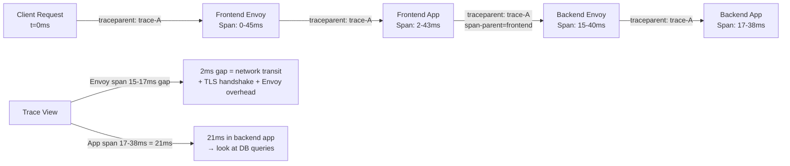

# Network Observability

## Table of Contents

- [Overview](#overview)
- [The Four Signals for Networking](#the-four-signals-for-networking)
- [RED Method for Networking](#red-method-for-networking)
- [Key Prometheus Metrics](#key-prometheus-metrics)
  - [Node-Level Network Metrics (node_exporter)](#node-level-network-metrics-node_exporter)
  - [Container-Level Network Metrics (cAdvisor, kubelet)](#container-level-network-metrics-cadvisor-kubelet)
  - [Alerting Rules](#alerting-rules)
- [Grafana Dashboards](#grafana-dashboards)
  - [Network I/O Dashboard (per Node)](#network-io-dashboard-per-node)
  - [DNS Query and Error Rate Dashboard](#dns-query-and-error-rate-dashboard)
- [Distributed Tracing for Network Latency](#distributed-tracing-for-network-latency)
  - [W3C Trace Context (traceparent)](#w3c-trace-context-traceparent)
  - [Correlating Network Latency with Application Traces](#correlating-network-latency-with-application-traces)
- [Hubble (Cilium): eBPF-Based Flow Observability](#hubble-cilium-ebpf-based-flow-observability)
  - [Hubble CLI](#hubble-cli)
  - [Hubble Metrics for Prometheus](#hubble-metrics-for-prometheus)
- [eBPF Observability: bpftrace One-Liners](#ebpf-observability-bpftrace-one-liners)
  - [Pixie for Kubernetes eBPF Observability](#pixie-for-kubernetes-ebpf-observability)
- [DNS Observability](#dns-observability)
  - [CoreDNS Metrics Reference](#coredns-metrics-reference)
- [Real-World Production Scenario](#real-world-production-scenario)
  - [Silent 0.1% Error Rate from Packet Drops — eBPF Observability Pipeline to Root Cause](#silent-01-error-rate-from-packet-drops-ebpf-observability-pipeline-to-root-cause)
- [Performance Benchmarks](#performance-benchmarks)
- [Interview Questions](#interview-questions)
  - [Advanced / Staff Level](#advanced-staff-level)
  - [Principal Level](#principal-level)

---

## Overview

Network observability is the discipline of making the network's internal state visible through external signals. At the staff and principal level, this is not about which dashboard to use — it is about designing an observability pipeline that can detect a 0.1% packet drop rate before customers notice, trace a latency spike to a single network hop, and give on-call engineers enough signal to diagnose a novel failure in under five minutes. Observability is an architectural concern: it must be designed in, not bolted on.

---

## The Four Signals for Networking

Google's SRE book defines four golden signals for service reliability. For network-layer observability, these translate to:

| Signal | Network Meaning | Key Metric |
|--------|----------------|------------|
| Latency | Time to complete a network operation; track p50/p99/p999 not just average | `node_network_receive_errs_total`, TCP RTT from `ss -ti` |
| Traffic | Volume of data moving through the network; bytes, packets, connections | `node_network_receive_bytes_total`, `container_network_receive_bytes_total` |
| Errors | Packet drops, TCP resets, connection timeouts, DNS failures | `node_netstat_Tcp_RetransSegs`, `node_netstat_TcpExt_TCPSynRetrans` |
| Saturation | How close a resource is to its limit; queue depth, buffer utilization | `node_sockstat_TCP_inuse`, NIC ring buffer drop counters |

The critical insight about latency: the **average** is nearly useless for diagnosing network problems. A 1% tail at p999 = 10s can hide in an average of 5ms. Always alert on p99 and investigate p999.

---

## RED Method for Networking

The RED method (Rate, Error rate, Duration) was designed for service-level observability but applies equally to network flows:

- **Request Rate**: Connections per second, packets per second, bytes per second — per service and per endpoint. A sudden drop in rate without a corresponding drop in upstream traffic indicates drops or resets.
- **Error Rate**: Connection failures, TCP RSTs, retransmissions, DNS NXDOMAIN/SERVFAIL — expressed as a percentage of total requests. Alert threshold: > 0.1% error rate for established connections.
- **Duration (Latency)**: Time from SYN to data delivery, or from DNS query to response. For east-west traffic in a service mesh, Envoy reports this per-route.

Apply RED per service **and** per endpoint. A single unhealthy endpoint hidden inside a load-balanced cluster produces a 1/N error rate at the cluster level but 100% error rate at the endpoint level — invisible without per-endpoint breakdown.

---

## Key Prometheus Metrics

### Node-Level Network Metrics (node_exporter)

```promql
# Bytes received per interface (rate = current throughput)
rate(node_network_receive_bytes_total{device="eth0"}[5m])

# Bytes transmitted per interface
rate(node_network_transmit_bytes_total{device="eth0"}[5m])

# Packet receive errors (hardware errors, CRC errors)
rate(node_network_receive_errs_total{device="eth0"}[5m])

# Packets dropped at the driver/kernel level (ring buffer full, etc.)
rate(node_network_receive_drop_total{device="eth0"}[5m])

# TCP retransmission segments (indicates packet loss or congestion)
rate(node_netstat_Tcp_RetransSegs[5m])

# TCP SYN retransmissions (specifically — indicates connection establishment failures)
rate(node_netstat_TcpExt_TCPSynRetrans[5m])

# TCP out-of-order segments received (indicates path reordering)
rate(node_netstat_TcpExt_TCPOFOQueue[5m])

# TCP socket backlog overflows (accept queue full — server cannot keep up)
rate(node_netstat_TcpExt_ListenOverflows[5m])

# Active TCP sockets in use
node_sockstat_TCP_inuse

# UDP socket buffer errors (RcvbufErrors = receive buffer full, drops)
rate(node_netstat_Udp_RcvbufErrors[5m])
```

### Container-Level Network Metrics (cAdvisor, kubelet)

```promql
# Pod network receive throughput
rate(container_network_receive_bytes_total{pod="frontend-xxxx", namespace="default"}[5m])

# Pod network transmit throughput
rate(container_network_transmit_bytes_total{pod="frontend-xxxx"}[5m])

# Pod network receive errors
rate(container_network_receive_errors_total{pod="frontend-xxxx"}[5m])

# Pod network transmit drops
rate(container_network_transmit_drop_total{pod="frontend-xxxx"}[5m])
```

### Alerting Rules

```yaml
groups:
  - name: network_alerts
    rules:
      - alert: HighTCPRetransmissionRate
        expr: rate(node_netstat_Tcp_RetransSegs[5m]) / rate(node_netstat_Tcp_OutSegs[5m]) > 0.02
        for: 5m
        labels:
          severity: warning
        annotations:
          summary: "TCP retransmission rate > 2% on {{ $labels.instance }}"

      - alert: NetworkReceiveDrops
        expr: rate(node_network_receive_drop_total[5m]) > 100
        for: 2m
        labels:
          severity: critical
        annotations:
          summary: "Packet drops on {{ $labels.device }} at {{ $labels.instance }}"

      - alert: AcceptQueueOverflow
        expr: rate(node_netstat_TcpExt_ListenOverflows[5m]) > 0
        for: 1m
        labels:
          severity: critical
        annotations:
          summary: "TCP accept queue overflowing — connections being dropped"
```

---

## Grafana Dashboards

### Network I/O Dashboard (per Node)

```
Panel 1: Throughput (Gbps)
  Metrics: rate(node_network_receive_bytes_total) * 8  (convert to bits)
           rate(node_network_transmit_bytes_total) * 8
  Visualization: Time series, stacked by interface

Panel 2: Packet Rate (kpps)
  Metrics: rate(node_network_receive_packets_total)
           rate(node_network_transmit_packets_total)

Panel 3: Error and Drop Rate
  Metrics: rate(node_network_receive_errs_total)
           rate(node_network_receive_drop_total)
           rate(node_network_transmit_drop_total)

Panel 4: TCP States (current snapshot)
  Metrics: node_sockstat_TCP_inuse
           node_sockstat_TCP_tw       (TIME_WAIT count)
           node_sockstat_TCP_alloc

Panel 5: TCP Retransmission Rate (%)
  Metrics: rate(node_netstat_Tcp_RetransSegs) / rate(node_netstat_Tcp_OutSegs) * 100
```

### DNS Query and Error Rate Dashboard

```
Panel 1: DNS Queries per Second
  Metric: rate(coredns_dns_requests_total[5m])
  Group by: server, zone, type (A, AAAA, PTR, SRV)

Panel 2: DNS Error Rate by RCODE
  Metric: rate(coredns_dns_responses_total{rcode!="NOERROR"}[5m])
  Group by: rcode (NXDOMAIN, SERVFAIL, REFUSED)

Panel 3: DNS Latency p99
  Metric: histogram_quantile(0.99, rate(coredns_dns_request_duration_seconds_bucket[5m]))
  Alert if > 50ms

Panel 4: CoreDNS Upstream Latency
  Metric: histogram_quantile(0.99, rate(coredns_forward_request_duration_seconds_bucket[5m]))
  High upstream latency → upstream resolver issue, not CoreDNS itself

Panel 5: DNS Cache Hit Rate
  Metric: rate(coredns_cache_hits_total) / (rate(coredns_cache_hits_total) + rate(coredns_cache_misses_total))
  Below 80% → TTL too short or excessive unique queries
```

---

## Distributed Tracing for Network Latency

### W3C Trace Context (traceparent)

The W3C Trace Context standard (RFC) defines a `traceparent` header that propagates trace identity across services:

```
traceparent: 00-4bf92f3577b34da6a3ce929d0e0e4736-00f067aa0ba902b7-01
             ^^ ^^^^^^^^^^^^^^^^^^^^^^^^^^^^^^^^^^ ^^^^^^^^^^^^^^^^ ^^
             version   trace-id (128-bit)           parent-span-id   flags
```

Service meshes (Istio, Linkerd) generate spans for every request they intercept. Application code must **propagate** the `traceparent` header from incoming to outgoing requests — the mesh creates the span, but only the application can connect the inbound and outbound calls into a causal chain.

### Correlating Network Latency with Application Traces



The gap between the parent Envoy span start and the child app span start is pure network overhead. This is how you separate "slow application" from "slow network" without needing packet captures.

---

## Hubble (Cilium): eBPF-Based Flow Observability

Hubble is Cilium's observability layer providing **L3/L4/L7 flow visibility** via eBPF — without sidecar proxies. It hooks into the eBPF programs that Cilium already runs for network policy, so observability has near-zero overhead.

### Hubble CLI

```bash
# Install Hubble CLI
cilium hubble port-forward &
export HUBBLE_SERVER=localhost:4245

# Observe all flows in a namespace
hubble observe --namespace default

# Filter to dropped packets only (diagnose network policy violations)
hubble observe --verdict DROPPED --namespace default

# Watch HTTP traffic to a specific pod
hubble observe --pod frontend --protocol http --output json

# DNS flow monitoring
hubble observe --protocol dns --output jsonpb | jq '.flow.l7.dns'

# Flow count per source/destination pair (traffic matrix)
hubble observe --namespace default --output json | \
  jq -r '[.flow.source.pod_name, .flow.destination.pod_name, .flow.verdict] | @csv' | \
  sort | uniq -c | sort -rn

# Real-time drop monitoring with reason
hubble observe --verdict DROPPED --follow --output json | \
  jq '{src: .flow.source.pod_name, dst: .flow.destination.pod_name, reason: .flow.drop_reason_desc}'
```

### Hubble Metrics for Prometheus

```yaml
# Enable in Cilium Helm chart
hubble:
  metrics:
    enabled:
      - dns:query;ignoreAAAA
      - drop
      - tcp
      - flow
      - port-distribution
      - icmp
      - http

# Key metrics produced:
# hubble_drop_total{direction, reason, protocol}
# hubble_tcp_flags_total{direction, flag}
# hubble_http_requests_total{method, protocol, reporter, status_code}
# hubble_http_request_duration_seconds_bucket{method, reporter}
# hubble_dns_queries_total{qtypes, rcode, source}
```

```promql
# Drop rate by reason
rate(hubble_drop_total[5m])

# HTTP error rate from Hubble (no sidecar needed)
rate(hubble_http_requests_total{status_code=~"5.."}[5m]) /
rate(hubble_http_requests_total[5m])

# DNS NXDOMAIN rate via Hubble
rate(hubble_dns_queries_total{rcode="NXDOMAIN"}[5m])
```

---

## eBPF Observability: bpftrace One-Liners

bpftrace is a high-level tracing language for eBPF, usable without writing C. These one-liners diagnose network issues in seconds:

```bash
# Count new TCP connections per second by destination port
bpftrace -e 'kprobe:tcp_connect { @connections[((struct sock *)arg0)->__sk_common.skc_dport] = count(); } interval:s:1 { print(@connections); clear(@connections); }'

# Trace TCP connection state changes (follow a connection through states)
bpftrace -e 'kprobe:tcp_set_state { @states[arg1] = count(); } interval:s:5 { print(@states); clear(@states); }'

# Monitor TCP retransmissions — shows source/destination of retransmits
bpftrace -e 'kprobe:tcp_retransmit_skb {
  $sk = (struct sock *)arg0;
  printf("retransmit: %s:%d -> %s:%d\n",
    ntop($sk->__sk_common.skc_rcv_saddr),
    $sk->__sk_common.skc_num,
    ntop($sk->__sk_common.skc_daddr),
    ntohs($sk->__sk_common.skc_dport));
}'

# Histogram of TCP receive latency (time in kernel receive queue)
bpftrace -e 'kprobe:tcp_data_queue { @start[tid] = nsecs; }
kretprobe:tcp_data_queue { @latency_us = hist((nsecs - @start[tid]) / 1000); delete(@start[tid]); }'

# DNS query latency (UDP packets to port 53)
bpftrace -e 'tracepoint:net:net_dev_xmit /args->skbaddr->len < 100 && ((struct udphdr*)(args->skbaddr->data + 20))->dest == htons(53)/ {
  @dns_queries = count();
}'

# Track socket accept queue depth (backlog)
bpftrace -e 'kprobe:inet_csk_accept {
  $sk = (struct sock *)arg0;
  $backlog = $sk->sk_ack_backlog;
  if ($backlog > 0) @backlog_hist = hist($backlog);
}'

# Count packet drops with drop reason (kernel 5.9+ with SKB drop reason)
bpftrace -e 'tracepoint:skb:kfree_skb { @drops[args->reason] = count(); } interval:s:5 { print(@drops); }'
```

### Pixie for Kubernetes eBPF Observability

Pixie (CNCF project) deploys eBPF programs across every node in a Kubernetes cluster and provides:
- Automatic protocol parsing (HTTP, gRPC, MySQL, PostgreSQL, Redis, Kafka)
- Per-pod latency histograms without instrumentation
- Network flow topology without service mesh
- Continuous profiling integrated with network data

```bash
# Install Pixie
px deploy

# Query: HTTP latency p99 per service
px run px/http_data -- --start_time='-5m' | px stats http_latency

# Query: identify which pod is dropping packets
px run px/node_stats -- --start_time='-5m'
```

---

## DNS Observability

### CoreDNS Metrics Reference

```promql
# Total DNS requests by type
rate(coredns_dns_requests_total{type="A"}[5m])
rate(coredns_dns_requests_total{type="AAAA"}[5m])

# Response code distribution (healthy cluster: NOERROR > 95%)
sum by (rcode) (rate(coredns_dns_responses_total[5m]))

# SERVFAIL rate (CoreDNS cannot resolve — upstream issue or misconfiguration)
rate(coredns_dns_responses_total{rcode="SERVFAIL"}[5m])

# Per-zone query rate (useful to see which namespaces generate most DNS)
rate(coredns_dns_requests_total[5m]) by (zone)

# CoreDNS pod CPU saturation (DNS slowdowns often caused by CPU starvation)
rate(container_cpu_usage_seconds_total{pod=~"coredns-.*"}[5m])

# Cache effectiveness
rate(coredns_cache_hits_total[5m]) / (rate(coredns_cache_hits_total[5m]) + rate(coredns_cache_misses_total[5m]))

# Upstream DNS latency (when CoreDNS forwards to a resolver)
histogram_quantile(0.99, rate(coredns_forward_request_duration_seconds_bucket[5m]))
```

---

## Real-World Production Scenario

### Silent 0.1% Error Rate from Packet Drops — eBPF Observability Pipeline to Root Cause

**Incident**: A payment processing service reports a 0.1% transaction failure rate. The errors are classified as "network timeout" in application logs. Standard metrics (HTTP error rate, service latency p99) look normal because 0.1% is within noise. The 0.1% that fails retries successfully on the second attempt — so the product team initially dismisses it as "transient network issues."

**Why this is wrong**: 0.1% silent failure with successful retry means the first attempt is being silently dropped — not rejected with an error. Silent drops point to kernel or NIC-level packet loss, not application errors.

**Diagnosis using eBPF observability pipeline**:

```mermaid
flowchart TD
    A[Alert: 0.1% retry rate<br/>in payment service] --> B[Check Hubble drops<br/>hubble observe --verdict DROPPED]
    B -->|No drops shown in Hubble<br/>drops are at NIC level| C[Check NIC counters<br/>ethtool -S eth0 | grep drop]
    C -->|rx_missed_errors incrementing<br/>on payment pods' nodes| D[Ring buffer overflow<br/>NIC dropping before kernel]
    D --> E[bpftrace: verify at softirq level<br/>check softnet_stat column 2]
    E -->|Dropped column non-zero| F[NIC ring buffer too small<br/>ethtool -g eth0 shows RX=256]
    F --> G[Fix: ethtool -G eth0 rx 4096<br/>Also tune netdev_max_backlog]
    G --> H[Verify: watch hubble_drop_total<br/>and ethtool -S eth0 | grep drop]
    H --> I[0.1% drops disappear<br/>retry rate drops to 0.0%]
```

**Step-by-step commands**:

```bash
# Step 1: Check Hubble for L3/L4 drops
hubble observe --verdict DROPPED --namespace payments --follow --output json | head -20
# Result: no L3/L4 drops — drops happening before eBPF hook

# Step 2: Check NIC-level drops on nodes running payment pods
kubectl get pods -n payments -o wide  # identify nodes
for node in node-1 node-2 node-3; do
  ssh $node "ethtool -S eth0 | grep -E '(drop|miss|overflow)' | grep -v ': 0'"
done
# Result: rx_missed_errors: 4523 on node-2

# Step 3: Verify ring buffer size
ssh node-2 "ethtool -g eth0"
# Current hardware settings: RX: 256 (too small)

# Step 4: Confirm with softnet_stat (kernel-level drop counter)
ssh node-2 "cat /proc/net/softnet_stat | awk '{print $2}'"
# Non-zero values in column 2 = dropped because ring buffer full

# Step 5: Correlate timing — drops spike during payment burst
ssh node-2 "watch -n0.1 'ethtool -S eth0 | grep rx_missed'"
# Drops correlate exactly with payment traffic spikes (every ~30 seconds)

# Step 6: Fix
ssh node-2 "ethtool -G eth0 rx 4096 tx 4096"
# Persist via /etc/udev/rules.d/50-nic-tuning.rules

# Step 7: Validate — watch Hubble and NIC stats
hubble observe --namespace payments --verdict DROPPED --output json | \
  jq '{time: .time, src: .flow.source.pod_name}'
# No more drops

# Persist with node tuning via DaemonSet or node configuration management
```

**Key learning**: NIC ring buffer drops are invisible to application-layer monitoring, service mesh observability, and standard Kubernetes metrics. They require either NIC-level counters (`ethtool -S`) or eBPF programs hooked into the driver NAPI path. This failure mode is common on nodes with bursty workloads that occasionally exceed the ring buffer's absorption capacity.

---

## Performance Benchmarks

- Hubble eBPF overhead: < 1% CPU on busy nodes (no packet copying, only metadata)
- bpftrace one-liner startup: ~100ms (JIT compilation of BPF program)
- Pixie overhead: ~2-3% CPU per node (runs multiple eBPF programs continuously)
- Prometheus scrape interval: 15-30s for most network metrics (use Hubble streaming for real-time)
- W3C Trace Context header overhead: < 0.01ms per request (string parsing)
- Jaeger trace sampling: 1% default — always trace 100% of errors regardless of sampling rate

---

## Interview Questions

### Advanced / Staff Level

**Q1: You see `node_netstat_TcpExt_TCPSynRetrans` incrementing. What does this indicate and how do you distinguish between server overload and network packet loss?**

`TCPSynRetrans` counts SYN retransmissions, meaning the client's SYN was not acknowledged within the RTO. This can indicate: (1) the server's SYN backlog is full (server is overwhelmed), (2) network packet loss between client and server, or (3) the server is not listening on that port. To distinguish: if `node_netstat_TcpExt_ListenOverflows` is also non-zero, the server cannot accept connections fast enough — server overload. If `ListenOverflows` is zero but SYN retransmissions persist, packet loss is the cause. Use `tcpdump -nn 'tcp[tcpflags] & tcp-syn != 0'` on the server to check if SYNs are even arriving. If SYNs arrive but no SYN-ACK is sent, check `ListenDrops`. If SYNs do not arrive, the loss is in the network (check intermediate routing, firewalls, MTU issues).

**Q2: How does Hubble achieve L7 visibility (HTTP method, status code) without a sidecar proxy?**

Cilium's eBPF programs attach to socket-level hooks (including `kprobe:tcp_recvmsg` and `kprobe:tcp_sendmsg`). For L7 visibility, Cilium redirects HTTP traffic through a per-node Envoy process using a socket-level eBPF program (sk_skb type). The eBPF program identifies TCP flows that match L7 policies and transparently redirects them to the local Envoy for parsing. Envoy parses the HTTP headers, applies L7 policies, and Hubble captures the metadata (method, path, status code) from Envoy. For flows that don't match L7 policies, the eBPF program does not redirect — so L7 overhead is zero for L4-only flows. This is architecturally different from the sidecar model: one Envoy per node handles L7 for all pods on that node, versus one Envoy per pod.

**Q3: What is the difference between a TCP retransmission and a TCP out-of-order segment, and which indicates packet loss versus path reordering?**

A retransmission (`node_netstat_Tcp_RetransSegs`) occurs when the sender's retransmission timer expires without receiving an ACK — the sender re-sends a segment it believes was lost. An out-of-order segment (`node_netstat_TcpExt_TCPOFOQueue`) occurs when a segment arrives with a sequence number higher than the next expected — it is stored in the out-of-order queue, and the sender is signaled via a duplicate ACK (or SACK). High `TCPOFOQueue` with low `RetransSegs` indicates **path reordering** (packets taking different routes, arriving out of order but not lost). High `RetransSegs` with low `TCPOFOQueue` indicates **actual loss** (segments never arrive). ECMP (Equal-Cost Multi-Path) routing frequently causes reordering because different packets in the same flow may take different paths — this is why ECMP typically hashes on the full 5-tuple to keep flows on consistent paths.

### Principal Level

**Q4: Design a network observability pipeline for a 10,000-node Kubernetes cluster that can detect a 0.1% silent packet drop anywhere in the network within 60 seconds, without a service mesh. Specify the exact collection strategy, cardinality management, and alert architecture.**

The core challenge is combining eBPF-sourced per-flow data with Prometheus-compatible aggregation at scale. The pipeline:

**Collection layer**: Deploy Cilium with Hubble enabled on every node. Hubble's eBPF programs generate flow records (source pod, destination pod, verdict, protocol, bytes, packets, drop reason) in kernel space. These are exported via Hubble Relay (gRPC stream) to a per-node collector. Do not use per-flow cardinality in Prometheus (10,000 nodes × 10,000 pod pairs = 10^8 time series — will OOM Prometheus). Instead, aggregate at the collector: sum drops by (source_node, destination_node, reason) per 10-second window. This reduces cardinality to O(nodes^2) rather than O(pods^2).

**Alert logic**: Alert when `drop_rate_pct = drops / (drops + forwards)` exceeds 0.05% for any (source_node, destination_node) pair for two consecutive 10-second windows. False positive control: require > 100 total packets in the window before computing drop rate (ignores low-traffic pairs).

**Root cause acceleration**: When an alert fires, trigger a Hubble query on the affected nodes with per-pod granularity for a 30-second window. This drills from (node pair) → (pod pair) → (specific drop reason) in the second alert escalation. Additionally, maintain a parallel bpftrace-based ring buffer that captures per-packet drop events with stack traces for the top 100 drops per second — this correlates kernel drop location (e.g., ring buffer vs netfilter vs TCP) with the pod pair.

**Cardinality budget**: 10,000 nodes × pre-aggregated (node-to-node drop rate, node drop reason distribution, total throughput) = approximately 3 million time series — manageable with Thanos or Cortex in a federated setup.
