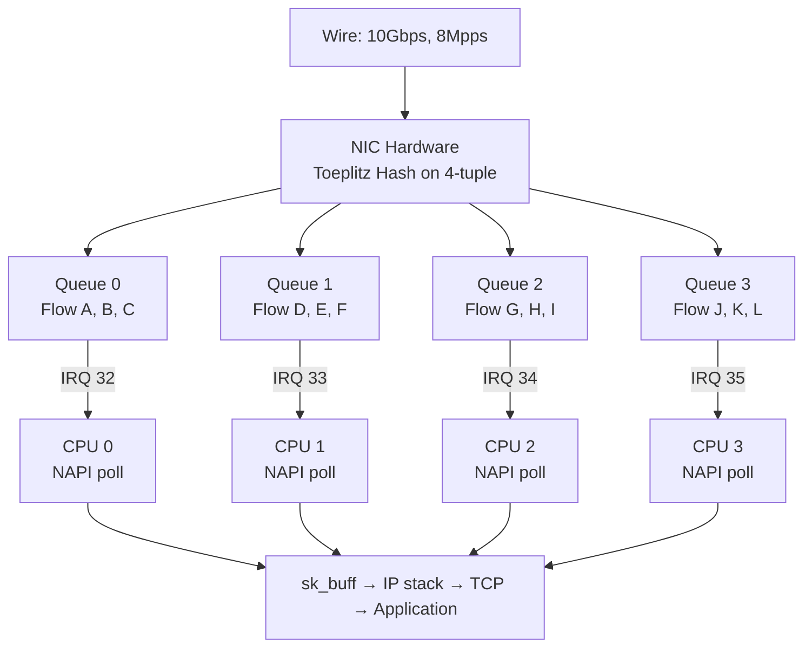
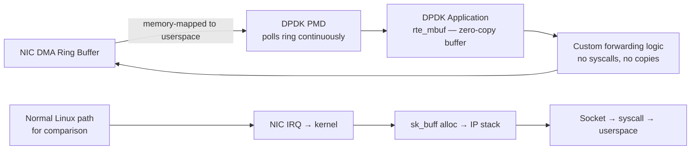
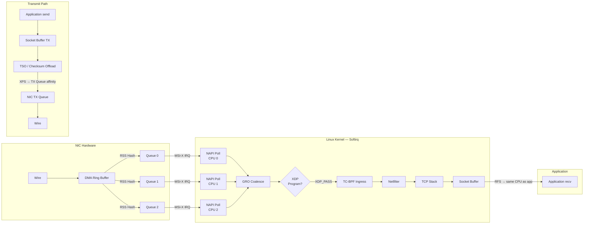

# Performance Engineering at Scale

## Table of Contents

- [Overview](#overview)
- [Hardware Offloads](#hardware-offloads)
  - [TSO: TCP Segmentation Offload](#tso-tcp-segmentation-offload)
  - [GRO: Generic Receive Offload](#gro-generic-receive-offload)
  - [LRO vs GRO: Do Not Use LRO](#lro-vs-gro-do-not-use-lro)
  - [Checksum Offload](#checksum-offload)
- [RSS: Receive Side Scaling](#rss-receive-side-scaling)
  - [RPS: Receive Packet Steering (Software RSS)](#rps-receive-packet-steering-software-rss)
  - [RFS: Receive Flow Steering](#rfs-receive-flow-steering)
  - [XPS: Transmit Packet Steering](#xps-transmit-packet-steering)
- [DPDK: Kernel Bypass](#dpdk-kernel-bypass)
- [Connection Scaling](#connection-scaling)
  - [Port Range and TIME_WAIT](#port-range-and-time_wait)
  - [SO_REUSEPORT](#so_reuseport)
  - [Accept Queue Tuning](#accept-queue-tuning)
  - [How Nginx Handles 100K Connections](#how-nginx-handles-100k-connections)
- [Packet Processing Pipeline](#packet-processing-pipeline)
- [Benchmarking](#benchmarking)
  - [Tool Reference](#tool-reference)
  - [Benchmarking Pitfalls](#benchmarking-pitfalls)
- [Real-World Production Scenario](#real-world-production-scenario)
  - [Nginx Proxy at 50K RPS Hitting Accept Queue Drops — Tuning Sequence](#nginx-proxy-at-50k-rps-hitting-accept-queue-drops-tuning-sequence)
- [Performance Benchmarks and Real Numbers](#performance-benchmarks-and-real-numbers)
- [Interview Questions](#interview-questions)
  - [Advanced / Staff Level](#advanced-staff-level)
  - [Principal Level](#principal-level)

---

## Overview

Network performance engineering at staff and principal level is the ability to reason about the entire path from wire to application — understanding where each nanosecond goes, which kernel mechanisms are the bottleneck, and which tuning knobs have second-order effects that will hurt you later. The difference between a senior engineer and a staff engineer here is not knowing more sysctl values — it is knowing the mechanical reason behind each value, being able to predict the failure mode when you change it, and designing systems that don't require heroic tuning in the first place.

---

## Hardware Offloads

Modern NICs offload significant CPU work. Understanding what each offload does and when it breaks is fundamental.

### TSO: TCP Segmentation Offload

Without TSO, the kernel segments every TCP write into MTU-sized packets (1460 bytes payload each) in software. TSO delegates this to the NIC: the kernel sends a "super-packet" up to 64KB (or more with GSO), and the NIC splits it into wire-sized segments during transmission.

**Throughput impact**: On a 10GbE link, TSO reduces per-packet CPU overhead by 30-50%. The kernel handles 1 large buffer descriptor instead of ~45 small ones.

```bash
# Check TSO status
ethtool -k eth0 | grep tcp-seg
# tx-tcp-segmentation: on
# tx-tcp-ecn-segmentation: on

# Disable TSO (for debugging — do not do this in production)
ethtool -K eth0 tso off
# Re-enable
ethtool -K eth0 tso on
```

**When TSO breaks things**: Packet capture tools (tcpdump, Wireshark) see the pre-TSO super-packets, which appear as MTU violations. This is normal and expected — the captures see the kernel's view, not the wire's view. If you are debugging MTU issues, disable TSO temporarily to see wire-accurate packet sizes.

### GRO: Generic Receive Offload

GRO is the receive-side counterpart of TSO. The NIC driver (in the NAPI poll function) coalesces multiple received TCP segments belonging to the same flow into a single large sk_buff before passing it up the stack. This reduces the number of times the kernel processes the full protocol stack per unit of data.

```
4 × 1500-byte TCP segments → GRO → 1 × 6000-byte sk_buff
4 stack traversals                  1 stack traversal
```

```bash
# Check GRO status
ethtool -k eth0 | grep generic-receive
# generic-receive-offload: on

# Verify GRO is working (packets should appear larger than MTU in sk_buff stats)
# GRO active: fewer, larger packets through the stack
cat /proc/net/dev  # shows lower pps than wire rate when GRO is working
```

### LRO vs GRO: Do Not Use LRO

LRO (Large Receive Offload) was GRO's predecessor. LRO is a hardware operation that aggregates packets before they reach the kernel, while GRO is a software operation in the driver. LRO **breaks IP forwarding** because it aggregates segments before the IP layer can make routing decisions — a forwarded super-packet cannot be split correctly. LRO also breaks packet boundary semantics for containers and VMs. Always use GRO; disable LRO if it appears enabled:

```bash
ethtool -k eth0 | grep large-receive
# large-receive-offload: off  <-- correct
ethtool -K eth0 lro off  # disable if on
```

### Checksum Offload

The NIC computes IP and TCP/UDP checksums on transmit and verifies them on receive. This saves ~1-2ns per byte at CPU clock speed for large packets.

```bash
ethtool -k eth0 | grep checksum
# rx-checksumming: on
# tx-checksumming: on
#   tx-checksum-ipv4: on
#   tx-checksum-tcp-segmentation: on

# WARNING: If you see checksum errors in tcpdump on locally-generated traffic,
# this is NORMAL. tcpdump captures before the NIC computes the checksum,
# so the checksum field shows 0x0000. Only investigate if remote hosts report errors.
```

---

## RSS: Receive Side Scaling

RSS distributes incoming packets across multiple NIC hardware queues using a hash of the 4-tuple (source IP, destination IP, source port, destination port). Each queue has its own MSI-X interrupt, pinned to a different CPU. This parallelizes the softirq processing that would otherwise bottleneck on a single core.



```bash
# Check current queue count (combined = RX+TX queues)
ethtool -l eth0
# Pre-set maximums:
#   Combined: 32
# Current hardware settings:
#   Combined: 8

# Set queues — typically match CPU count (or half for NUMA-aware configs)
ethtool -L eth0 combined 16

# View RSS indirection table (which hash values map to which queues)
ethtool -x eth0

# Redistribute evenly across all queues
ethtool -X eth0 equal 16

# View which IRQs map to which queues
grep eth0 /proc/interrupts

# Set IRQ affinity — pin each NIC IRQ to a NUMA-local CPU
# (automated by irqbalance, but irqbalance may not be NUMA-optimal)
echo "1" > /proc/irq/32/smp_affinity_list  # IRQ 32 → CPU 1
echo "2" > /proc/irq/33/smp_affinity_list  # IRQ 33 → CPU 2
```

### RPS: Receive Packet Steering (Software RSS)

RPS implements RSS in software for NICs with fewer hardware queues than CPUs. After the NIC interrupt handler, the kernel computes a flow hash and steers the sk_buff to another CPU's backlog queue via an inter-processor interrupt (IPI).

```bash
# Enable RPS — distribute to CPUs 0-7 (bitmask 0xff = binary 11111111)
echo "ff" > /sys/class/net/eth0/queues/rx-0/rps_cpus

# Enable RFS (Receive Flow Steering) — ensures packets are processed
# on the same CPU as the application thread handling that flow
# rps_sock_flow_entries: global flow table size
echo 32768 > /proc/sys/net/core/rps_sock_flow_entries
# Per-queue flow count
echo 4096 > /sys/class/net/eth0/queues/rx-0/rps_flow_cnt
```

**RPS vs RSS trade-off**: RSS processes packets on the CPU that owns the hardware queue — no IPI cost, but limited by hardware queue count. RPS adds one IPI per steered packet (~1-2μs), but can distribute to any CPU in the system. Always prefer RSS if the NIC has enough queues.

### RFS: Receive Flow Steering

RFS extends RPS by tracking which CPU is currently running the application that owns a given socket, then steering packets to that CPU. This eliminates the cache miss that occurs when packet data processed on CPU N must be copied to the application's cache on CPU M.

**When RFS is critical**: A web server with 8 worker threads on 8 CPUs benefits dramatically from RFS. Without it, the HTTP request data processed in softirq on CPU 0 must be transferred across NUMA to the worker on CPU 7. With RFS, the packet is steered to CPU 7 before softirq, and the worker processes data already in its L3 cache.

### XPS: Transmit Packet Steering

XPS maps outgoing flows to specific TX queues, ensuring the transmitting CPU's local TX queue is used. This reduces lock contention on multi-queue NICs and improves cache locality for the TX path.

```bash
# Set XPS — assign TX queue 0 to CPU 0 (bitmask: 1 = CPU 0)
echo "1" > /sys/class/net/eth0/queues/tx-0/xps_cpus
echo "2" > /sys/class/net/eth0/queues/tx-1/xps_cpus  # TX queue 1 → CPU 1
```

---

## DPDK: Kernel Bypass

DPDK (Data Plane Development Kit) bypasses the kernel entirely for packet processing. A DPDK application runs a **poll mode driver (PMD)** that directly polls the NIC's DMA ring buffer from userspace, with no interrupts, no system calls, and no sk_buff allocations.

**Performance**: 10-40M pps per core (wire rate on 10GbE or 100GbE), compared to ~2-4M pps per core with the kernel stack.

**Architecture**:



**Dedicated cores**: DPDK requires dedicating CPU cores exclusively to polling. A DPDK PMD thread that shares a core with OS tasks will lose packets during preemption. For a 10GbE NIC at line rate, reserve 2-4 cores solely for DPDK.

**Use cases**: Telecom vRAN/vEPC, OVS-DPDK for NFV, Suricata IDS at 40Gbps+, custom load balancers.

**Trade-offs**:
- Dedicated cores are wasted if traffic is bursty (the cores spin even at 0 pps)
- No kernel networking stack — you re-implement everything (ARP, routing, TCP if needed)
- DPDK applications are single-tenant (cannot share the NIC with the OS without Virtual Function I/O)
- Operational complexity: DPDK apps require hugepages, IOMMU configuration, and custom process management

---

## Connection Scaling

### Port Range and TIME_WAIT

Each outbound connection requires a unique 4-tuple (local IP, local port, remote IP, remote port). The ephemeral port range limits how many concurrent connections can be made to the same destination:

```bash
# Current range
sysctl net.ipv4.ip_local_port_range
# 32768 60999  (default: ~28K ports)

# Expand range — allows more concurrent outbound connections
sysctl -w net.ipv4.ip_local_port_range="1024 65535"
# Now ~64K ports available per destination IP

# Time_WAIT: after connection close, the local port stays reserved for 2*MSL (60s default)
# 10K connections/sec × 60s TIME_WAIT = 600K TIME_WAIT sockets needed
sysctl net.ipv4.tcp_max_tw_buckets
# Ensure this is >= expected TIME_WAIT count

# Allow reuse of TIME_WAIT ports for new outbound connections
sysctl -w net.ipv4.tcp_tw_reuse=1
# Safe for outbound connections (clients); requires tcp_timestamps=1 (PAWS protection)
```

### SO_REUSEPORT

Without `SO_REUSEPORT`, only one socket can bind to a given port. The accept queue for that single socket becomes a bottleneck under high connection rates. With `SO_REUSEPORT`, multiple sockets (typically one per thread/process) can bind to the same port. The kernel distributes incoming connections across all sockets using a flow hash, eliminating the accept queue lock:

```bash
# Verify SO_REUSEPORT is in use by nginx
ss -tlnp | grep :80
# Multiple sockets on :80, each owned by a different nginx worker process

# Check accept queue depth
ss -lnt | grep :80
# Recv-Q: current queue depth
# Send-Q: maximum queue size (listen() backlog)
```

### Accept Queue Tuning

```bash
# System-wide maximum accept queue depth per socket
sysctl net.core.somaxconn
# default: 4096 on modern kernels (was 128 on older)

# SYN backlog (half-open connections in SYN_RECV state)
sysctl net.ipv4.tcp_max_syn_backlog
# default: 1024-4096

# Application-level listen() backlog must also be set high
# In nginx: listen 80 backlog=65535;
# In Go: net.Listen() uses ListenConfig with SO_REUSEPORT
```

### How Nginx Handles 100K Connections

Nginx uses an event-driven model (epoll on Linux) to handle all connections with a small fixed number of worker processes (typically equal to CPU count). Each worker maintains its own epoll file descriptor that watches thousands of connections. When data arrives, epoll wakes the worker only for the file descriptors that are ready, avoiding the cost of iterating over all 100K connections.

Key tuning for nginx at 100K concurrent connections:

```nginx
worker_processes auto;          # One per CPU
worker_rlimit_nofile 200000;    # File descriptor limit per worker
events {
    worker_connections 50000;   # 50K per worker × 4 workers = 200K
    use epoll;
    multi_accept on;            # Accept all pending connections per event
}
```

Combined with:
```bash
sysctl -w net.core.somaxconn=65535
sysctl -w net.ipv4.tcp_max_syn_backlog=65535
ulimit -n 1000000  # system-wide file descriptor limit
```

---

## Packet Processing Pipeline



---

## Benchmarking

### Tool Reference

| Tool | Protocol | Measures | Use Case |
|------|----------|----------|----------|
| `iperf3 -c host -P 8` | TCP | Throughput (Gbps), retransmissions | NIC/network bandwidth baseline |
| `netperf -t TCP_RR` | TCP | Transactions/sec, latency per transaction | Request-response latency (critical for microservices) |
| `netperf -t TCP_STREAM` | TCP | Bulk throughput | Single-connection bandwidth |
| `sockperf ping-pong` | UDP/TCP | Microsecond latency (percentiles) | Financial trading, real-time latency |
| `wrk -t4 -c100 -d30s` | HTTP | RPS, p99 latency | Application-layer HTTP performance |
| `neper tcp_rr` | TCP | Kernel-level RR transactions | Kernel TCP performance (Google's tool) |
| `perf stat -e cycles,cache-misses` | N/A | CPU counters | Profile which kernel functions are bottlenecks |

### Benchmarking Pitfalls

```bash
# WRONG: single-stream iperf only uses one NIC queue
iperf3 -c 192.168.1.100

# CORRECT: multiple streams exercise all NIC queues (RSS)
iperf3 -c 192.168.1.100 -P 8  # 8 parallel streams

# WRONG: benchmarking with GRO/TSO enabled when measuring pps
# (offloads aggregate packets, making pps appear lower than wire rate)
# For pps benchmarks:
ethtool -K eth0 gro off tso off
iperf3 -c host -P 8 --length 64  # small packets for pps test
ethtool -K eth0 gro on tso on    # restore after

# Profile NIC at line rate
nstat -z | grep -E '(Retrans|Drop|Overflow)'
cat /proc/net/softnet_stat  # check column 3 (time_squeeze) for CPU bottleneck
```

---

## Real-World Production Scenario

### Nginx Proxy at 50K RPS Hitting Accept Queue Drops — Tuning Sequence

**Incident**: An nginx reverse proxy at 50K RPS starts dropping ~200 connections per second. `ss -lnt` shows `Recv-Q` at maximum depth on port 80. The accept queue is overflowing.

**Diagnosis**:
```bash
# Check accept queue overflow
ss -lnt | grep ':80'
# State   Recv-Q  Send-Q   Local Address:Port
# LISTEN  4096    4096       0.0.0.0:80     <-- Recv-Q = Send-Q means FULL

# Confirm with kernel counter
nstat -z | grep ListenOverflows
# TcpExtListenOverflows: 1247  <-- incrementing = connections dropped

# Check how many nginx workers are running and their queue usage
ss -lnp | grep nginx
# Multiple LISTEN sockets if SO_REUSEPORT is enabled (good)
# Single LISTEN socket = bottleneck

# Check nginx worker CPU usage
top -p $(pgrep nginx | tr '\n' ',')
```

**Tuning sequence**:

```bash
# Step 1: Increase system-wide accept queue maximum
sysctl -w net.core.somaxconn=65535
sysctl -w net.ipv4.tcp_max_syn_backlog=65535

# Step 2: Update nginx config to use the new limit
# /etc/nginx/nginx.conf
# listen 80 backlog=65535;
# worker_processes auto;
# worker_connections 20000;
nginx -s reload

# Step 3: Verify SO_REUSEPORT is enabled (one queue per worker)
ss -lntp | grep :80 | wc -l
# Should equal worker_processes count

# Step 4: Tune file descriptor limits
sysctl -w fs.file-max=2000000
echo "nginx soft nofile 200000" >> /etc/security/limits.conf
echo "nginx hard nofile 200000" >> /etc/security/limits.conf

# Step 5: Verify the fix
watch -n 1 'nstat -z | grep ListenOverflows'
# Should drop to 0

# Step 6: Check if now CPU-bound (next bottleneck)
perf top -p $(pgrep -d, nginx)
# If syscall overhead is high, consider io_uring for nginx (experimental)
```

**Real numbers after tuning**:
- Before: 200 drops/second at 50K RPS (0.4% drop rate)
- After: 0 drops/second at 80K RPS (headroom achieved by eliminating single accept queue bottleneck)

---

## Performance Benchmarks and Real Numbers

| Metric | Default | Optimally Tuned | Hardware |
|--------|---------|-----------------|----------|
| Max concurrent TCP connections | ~65K (port limit) | 1M+ (with ip_local_port_range tuning) | 128GB RAM server |
| Max connections/sec (nginx) | ~20K | 100K+ | 16-core server |
| NIC throughput (single queue) | 2-4 Gbps | 8-10 Gbps | 10GbE NIC |
| NIC throughput (RSS, 8 queues) | — | 38-40 Gbps | 40GbE NIC |
| Packet processing (kernel stack) | 2-4 Mpps | 8-14 Mpps | 16-core server |
| Packet processing (XDP/BPF) | — | 14-24 Mpps per core | 100GbE NIC |
| Packet processing (DPDK) | — | 10-40 Mpps per core | 100GbE + DPDK |
| TCP connection setup latency | 1-5ms | 0.1-0.3ms | LAN |
| HTTP request latency p99 (nginx) | 2-5ms | 0.5-1ms | 16-core, local |

---

## Interview Questions

### Advanced / Staff Level

**Q1: A high-throughput server shows 38Gbps on a 40GbE NIC but you need wire rate. `ethtool -S` shows no drops. What do you investigate next?**

First check `ethtool -l eth0` — if only 4 queues are active on a 16-core server, RSS is distributing load across only 4 CPUs. Increase to 8-16 queues. Then check `cat /proc/net/softnet_stat` for `time_squeeze` (column 3) — if non-zero, the NAPI budget is exhausted and packets are waiting in the ring buffer between poll cycles. Increase `net.core.netdev_budget=600` and `net.core.netdev_budget_usecs=8000`. Check `perf top` to identify which kernel function is the bottleneck — if it's `nf_conntrack_in`, conntrack is the ceiling; bypass with NOTRACK rules for high-volume flows. If it's `__inet_lookup_skb`, socket lookup is the bottleneck — verify SLAB/SLUB allocator is not under pressure with `slabtop`. Also check NUMA alignment: `cat /sys/class/net/eth0/device/numa_node` and ensure NIC interrupts are pinned to the same NUMA node's CPUs.

**Q2: Explain the interaction between BBR congestion control and the fq qdisc. Why does BBR require fq?**

BBR (Bottleneck Bandwidth and RTT) is a model-based congestion control algorithm that operates by estimating the bottleneck bandwidth and minimum RTT, then sending at the estimated rate rather than probing with loss (as CUBIC does). BBR relies on **pacing** — sending packets at a calculated rate rather than in bursts — to model queue occupancy correctly. Without pacing, BBR's rate estimate is inaccurate because a burst of packets inflates the RTT measurement. The `fq` (Fair Queuing) qdisc implements socket-level packet pacing: it maintains a per-flow token bucket and delays packets to enforce the rate that BBR requests via `SO_MAX_PACING_RATE`. Without `fq`, BBR packets are sent in bursts (limited only by the TSO segment size), the RTT measurement is polluted, and BBR oscillates between under- and over-utilization. The setup:

```bash
tc qdisc replace dev eth0 root fq
sysctl -w net.ipv4.tcp_congestion_control=bbr
```

**Q3: What is NUMA-aware NIC interrupt placement, and how much performance difference does it make?**

On multi-socket servers, memory access from CPU N to RAM attached to CPU M (remote NUMA node) costs 50-100ns more than local access (100-200 vs 50-100ns). NIC DMA buffers are allocated in specific NUMA nodes. If the NIC's PCIe slot is on NUMA node 0 but its interrupt is handled by a CPU on NUMA node 1, every sk_buff allocation and data access crosses the NUMA interconnect. The result is 10-30% throughput reduction and 20-40% higher latency. Check alignment with `cat /sys/class/net/eth0/device/numa_node`. Pin NIC interrupts to NUMA-local CPUs: if the NIC is on node 0 (CPUs 0-15), set `echo "0-15" > /proc/irq/$irq/smp_affinity_list` for each NIC IRQ. Use `irqbalance` with NUMA-aware options, or pin manually for dedicated throughput servers.

### Principal Level

**Q4: Design the networking stack configuration for a server that needs to handle both 1M concurrent long-lived WebSocket connections AND 50K new connection/sec HTTP traffic simultaneously. What are the conflicting requirements and how do you resolve them?**

The two workloads have conflicting resource requirements. Long-lived WebSocket connections (1M concurrent) require: large per-connection memory (socket buffers), sufficient file descriptors (`ulimit -n 2M+`), and `tcp_max_tw_buckets` that does not interfere with the large socket count. Short-lived HTTP connections at 50K/sec require: fast connection setup and teardown, port range management, TIME_WAIT handling, and high accept queue throughput.

The conflict: 1M WebSocket connections × 4KB default socket buffer = 4GB socket memory. At `tcp_rmem` max = 64MB, autotuning might try to scale buffers up, consuming memory needed for other sockets. Resolution: set `TCP_NOTSENT_LOWAT` on WebSocket sockets to limit send buffer growth without reducing max (WebSocket is bidirectional but low-bandwidth per connection). For the HTTP side, enable `SO_REUSEPORT` on the HTTP listener with one accept socket per CPU thread — this eliminates the accept queue as a bottleneck.

For TIME_WAIT at 50K/sec: 50K × 60s = 3M TIME_WAIT sockets needed simultaneously. Set `net.ipv4.tcp_max_tw_buckets=4000000` and `net.ipv4.tcp_tw_reuse=1`. The file descriptor count needed: 1M WebSocket + 3M TIME_WAIT (kernel-internal, not fd) + headroom = 1.5M file descriptors.

Port range: if the server is also the client (proxying to backends at 50K/sec), with a single backend IP you need 50K ports. With `ip_local_port_range="1024 65535"` that is 64K ports — sufficient. If you have multiple backend IPs, port exhaustion is not an issue (unique 4-tuple per IP).

NUMA strategy: dedicate NUMA node 0 to HTTP accept queues and WebSocket management threads; NUMA node 1 to WebSocket data processing threads. Pin the NIC to NUMA node 0. Use `numactl --membind=1` for WebSocket processing to keep WebSocket data in node 1's memory.
