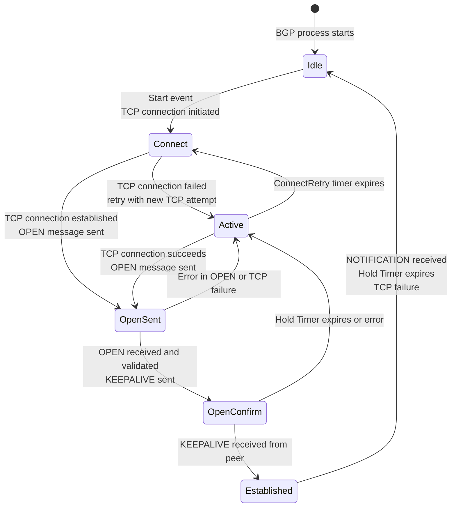
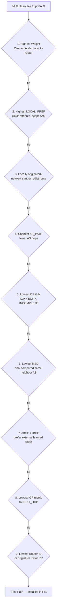
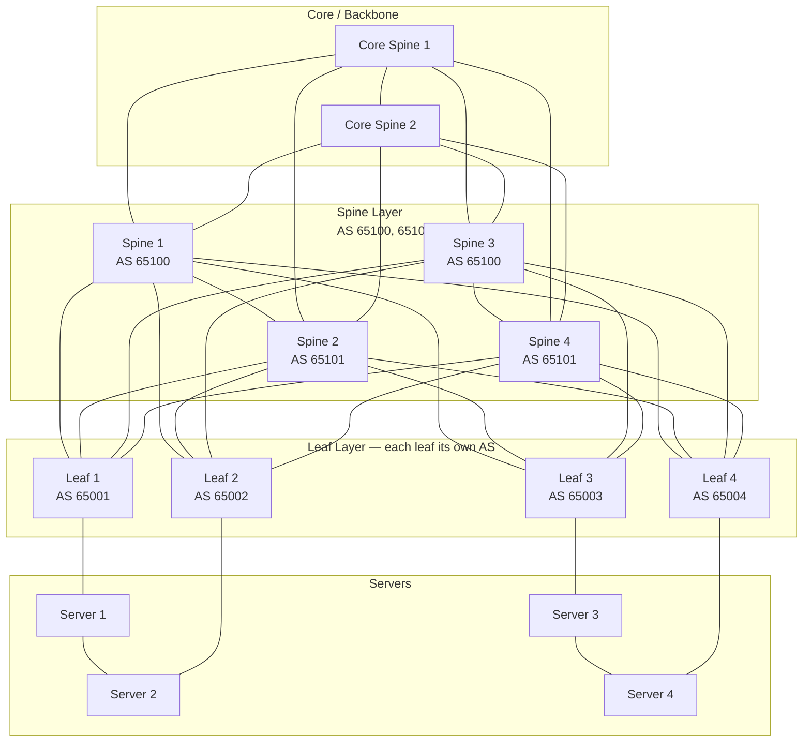

# BGP at Scale

## Overview

BGP (Border Gateway Protocol) is the routing protocol that holds the internet together and, increasingly, the fabric that holds large-scale datacenters together. At the staff and principal level, BGP is not just "how routing works" — it is the mechanism for datacenter fabric design (Clos networks, eBGP everywhere, 64-way ECMP), Kubernetes pod network advertisement (Calico BGP, MetalLB), and internet security (RPKI, route leak mitigation). Engineers who have debugged a BGP route leak in production, or designed a datacenter BGP fabric that survives spine failures, operate at a meaningfully different level from those who can only recite the 9-step path selection algorithm.

---

## BGP Finite State Machine

A BGP session progresses through six states. Understanding these states is essential for diagnosing connectivity issues.



**Idle**: No active TCP connection. The router waits for an administrative start event or an automatic retry timer.

**Connect**: A TCP connection attempt is in progress. If the TCP SYN/SYN-ACK/ACK completes, the session advances to OpenSent. If the TCP handshake fails (SYN timeout, RST received), the session moves to Active.

**Active**: The router is actively trying to establish a TCP connection (retrying). Unlike Connect (passive wait), Active means the router is initiating TCP connections on each ConnectRetry timer expiration.

**OpenSent**: TCP is established. The OPEN message has been sent. Waiting for the peer's OPEN.

**OpenConfirm**: OPEN messages have been exchanged and validated (BGP version match, ASN match, hold timer negotiation). Waiting for KEEPALIVE to confirm the session.

**Established**: The session is fully operational. Routes are exchanged via UPDATE messages. KEEPALIVE messages maintain the session (default: every 60s, hold timer 180s).

```bash
# FRRouting: check BGP session state
vtysh -c "show bgp summary"
# Output columns: Neighbor, V, AS, MsgRcvd, MsgSent, Up/Down, State/PfxRcd
# State/PfxRcd: "Established" = up, or FSM state name if not up

# Cisco IOS-XR equivalent
show bgp neighbors | include BGP state

# Check hold timer negotiation
vtysh -c "show bgp neighbors 192.168.1.1"
# Hold time is 180, keepalive interval is 60 seconds
```

---

## BGP Message Types

| Message | Purpose | Key Fields |
|---------|---------|------------|
| OPEN | Establish session parameters | Version (4), ASN, Hold Time, BGP ID, Optional Parameters |
| UPDATE | Advertise or withdraw routes | NLRI (prefixes to add), Withdrawn Routes, Path Attributes |
| NOTIFICATION | Signal an error, terminate session | Error Code, Error Subcode, Data |
| KEEPALIVE | Maintain session (no data) | 19-byte header only |
| ROUTE-REFRESH | Request re-advertisement of all routes | AFI/SAFI to refresh |

### UPDATE Message Structure

The UPDATE message carries both reachability (NLRI) and path attributes:

```
BGP UPDATE Message:
  Withdrawn Routes Length: 0 (or N bytes of withdrawn prefixes)
  Withdrawn Routes: <list of prefixes to remove>
  Total Path Attribute Length: <N bytes>
  Path Attributes:
    ORIGIN: IGP / EGP / INCOMPLETE
    AS_PATH: AS_SEQUENCE [64512, 64513, 65001]
    NEXT_HOP: 10.0.0.1
    MED: 100
    LOCAL_PREF: 200  (iBGP only)
    COMMUNITY: 65000:100
  NLRI: 10.0.0.0/8, 172.16.0.0/12  (prefixes being advertised)
```

---

## Path Attributes

### Standard Path Attributes

**ORIGIN** (type 1, well-known mandatory): Indicates how the prefix entered BGP.
- `IGP (i)`: Originated via `network` statement or redistribution from an IGP
- `EGP (e)`: Learned from older EGP protocol (rare)
- `INCOMPLETE (?)`: Redistributed from a source BGP does not fully understand

**AS_PATH** (type 2, well-known mandatory): List of ASes the route has transited. Used for loop detection (if local AS appears in path, discard) and path length comparison.

**NEXT_HOP** (type 3, well-known mandatory): IP address to use as the next hop toward the destination. In eBGP, this is typically the advertising router's interface IP. In iBGP, NEXT_HOP is preserved from the eBGP session — critical for route reflectors to carry the correct next hop across the AS.

**MED** (type 4, optional non-transitive): Multi-Exit Discriminator. Signals preferred entry point into an AS when multiple eBGP connections exist to the same neighbor. Lower MED = preferred. Compared only between routes from the same neighboring AS.

**LOCAL_PREF** (type 5, well-known discretionary, iBGP only): Indicates preferred exit from the local AS. Higher LOCAL_PREF = preferred. Propagated throughout the iBGP mesh but not to eBGP peers (stripped at eBGP boundary).

### Community Attributes

**Standard Community** (RFC 1997, 32-bit: `ASN:value`): Used for policy signaling. Examples:
- `65000:100` — tag routes for a specific customer
- `65000:NOPEER` — do not advertise to peers
- `NO_EXPORT (0xFFFFFF01)` — do not advertise outside AS
- `NO_ADVERTISE (0xFFFFFF02)` — do not advertise to any peer

**Extended Community** (64-bit): Used for MPLS VPNs (Route Target), traffic engineering, and more granular policy.

**Large Community** (RFC 8092, 96-bit: `ASN:value1:value2`): Overcomes the 32-bit limitation; allows ISPs with 4-byte ASNs to use meaningful community values.

---

## BGP Route Selection: 9-Step Algorithm

When multiple routes exist to the same prefix, BGP selects the best path in this order (first deciding criterion wins):



**Critical nuances**:
- LOCAL_PREF is the primary tool for **traffic engineering within an AS** (control which exit point traffic uses)
- AS_PATH prepending artificially increases AS_PATH length to make a route less preferred — used to steer inbound traffic away from a specific link
- MED is typically only compared between routes from the **same neighboring AS** (unless `bgp always-compare-med` is configured — dangerous, can cause routing loops)
- Weight is Cisco-proprietary and applies only to the local router — it does not propagate

---

## RPKI: Resource Public Key Infrastructure

RPKI creates a cryptographic chain of authority for IP address ownership and BGP origin authorization.

### Route Origin Authorization (ROA)

A ROA states: "ASN X is authorized to originate prefix P/N with maximum prefix length M."

```
ROA: AS15169 authorized to announce 8.8.0.0/16 with maxLength=24
  → 8.8.8.0/24 from AS15169: VALID
  → 8.8.8.0/24 from AS1234:  INVALID
  → 8.8.0.0/15 from AS15169: INVALID (more general than ROA prefix)
  → 8.8.0.0/16 from AS15169: VALID
```

### ROV: Route Origin Validation

Routers validate received BGP routes against the RPKI cache:

| State | Meaning |
|-------|---------|
| VALID | A ROA exists that matches this route's origin AS and prefix length |
| INVALID | A ROA exists for this prefix but the origin AS or prefix length does not match |
| NOT FOUND | No ROA exists for this prefix |

The standard policy:
- INVALID routes: **reject** (high confidence this is a hijack or misconfiguration)
- NOT FOUND: **accept** (pragmatic — ~40% of prefixes lack ROAs as of 2025)
- VALID: **accept and prefer** (can set higher LOCAL_PREF)

```bash
# FRRouting: configure RPKI with Routinator as the validator
rpki
  rpki cache routinator.example.com 3323 preference 1
!
# Apply RPKI filter in route-map
route-map BGP_IN permit 10
  match rpki valid
  set local-preference 200
route-map BGP_IN permit 20
  match rpki notfound
  set local-preference 100
route-map BGP_IN deny 30
  match rpki invalid
!

# Check RPKI validation state for a prefix
vtysh -c "show bgp ipv4 unicast 1.1.1.0/24"
# Should show "rpki state: valid" and origin AS 13335 (Cloudflare)
```

---

## BGP in Datacenter Clos Fabric

Modern hyperscale datacenters use BGP as the single routing protocol for their Clos (leaf-spine) fabrics, replacing OSPF/ISIS in the underlay.



### BGP Unnumbered

Traditional eBGP requires numbered interfaces (both sides must have IP addresses in the same subnet). BGP unnumbered (RFC 5549) uses IPv6 link-local addresses for peering, eliminating the need to allocate IPv4 subnets for every link in the fabric:

```bash
# FRRouting BGP unnumbered configuration on a leaf
router bgp 65001
  neighbor swp1 interface remote-as external   # eBGP to spine 1
  neighbor swp2 interface remote-as external   # eBGP to spine 2
  address-family ipv4 unicast
    neighbor swp1 activate
    neighbor swp2 activate
    network 10.0.1.0/24  # advertise server subnet
```

The leaf's loopback (`10.0.1.1/32`) is reachable via all spines simultaneously — this is 4-way ECMP at the spine layer. With 16 spine switches and 4 paths to each, individual servers have 64-way ECMP path diversity.

### 4-Byte ASNs

With 2-byte ASNs (1-65535), the datacenter private range (64512-65534) provides only ~1000 ASNs — insufficient for thousands of racks. 4-byte ASNs (RFC 6793) extend the range to 4,294,967,295. The private 4-byte range is 4200000000-4294967294. In a large datacenter:

```
Each rack (leaf): AS 4200000001 through AS 4200001000
Each spine plane: AS 4200001001 through AS 4200001010
```

---

## BGP in Kubernetes

### Calico BGP Mode

Calico in BGP mode assigns each Kubernetes node its own subnet and advertises that subnet via eBGP to the Top-of-Rack (TOR) switches:

```yaml
# BGPConfiguration: configure Calico's BGP AS and peering
apiVersion: projectcalico.org/v3
kind: BGPConfiguration
metadata:
  name: default
spec:
  logSeverityScreen: Info
  nodeToNodeMeshEnabled: false  # disable full mesh for large clusters
  asNumber: 65001               # the entire Kubernetes cluster's ASN

---
# BGPPeer: peer with TOR switches
apiVersion: projectcalico.org/v3
kind: BGPPeer
metadata:
  name: tor-switch-1
spec:
  peerIP: 192.168.0.1
  asNumber: 65100   # TOR switch ASN
```

With Calico BGP mode, pod IPs are directly routable from the physical network — no overlay (VXLAN/IPIP) is needed. Pods on `10.244.1.0/24` (node 1) are reachable from outside the cluster because the TOR switch learns the route via BGP.

### MetalLB BGP Mode

MetalLB provides LoadBalancer IP allocation for bare-metal Kubernetes clusters. In BGP mode, MetalLB peers with network routers and advertises `LoadBalancer` service IPs via BGP:

```yaml
apiVersion: metallb.io/v1beta2
kind: BGPPeer
metadata:
  name: router
  namespace: metallb-system
spec:
  myASN: 65001
  peerASN: 65100
  peerAddress: 192.168.0.1
---
apiVersion: metallb.io/v1beta1
kind: IPAddressPool
metadata:
  name: services-pool
  namespace: metallb-system
spec:
  addresses:
    - 203.0.113.0/24  # public IP range for services
```

MetalLB advertises `203.0.113.x/32` for each Service with a LoadBalancer IP. With ECMP in the router, multiple nodes can advertise the same /32, providing load distribution and failover.

---

## BFD: Bidirectional Forwarding Detection

BGP's default failure detection relies on the Hold Timer (180s default, 90s with aggressive settings). BFD provides sub-second failure detection (configurable down to 50ms) by running a lightweight hello protocol at the IP layer:

```bash
# FRRouting: enable BFD for a BGP neighbor
router bgp 65001
  neighbor 192.168.1.2 bfd
  neighbor 192.168.1.2 bfd profile fast-convergence

bfd
  profile fast-convergence
    receive-interval 100   # 100ms receive interval
    transmit-interval 100  # 100ms transmit interval
    detect-multiplier 3    # declare failure after 3 missed hellos = 300ms
```

With BFD, a link failure is detected in 300ms versus BGP's 90-second minimum. This is critical for maintaining low-latency failover in the datacenter fabric.

**BFD hardware offload**: Some NIC and ASIC vendors implement BFD in hardware, reducing the detection interval to 10ms without CPU overhead.

---

## Route Leak Analysis

### 2019 Cloudflare Route Leak (Verizon/Allegheny Technologies)

A small ISP (Allegheny Technologies, AS33154) accidentally accepted BGP routes from one of its customers (a network equipment company) and re-advertised those routes — including ~200 routes to major internet services (Cloudflare, AWS, Facebook) — to its transit provider Verizon (AS701). Verizon had no max-prefix limit and accepted all 200 routes, propagating them across the internet.

**What made this worse**: The route leak included more-specific prefixes (/24s) derived from less-specific announcements (/20s, /16s). More-specific routes always win BGP route selection. Cloudflare's `1.1.1.1/32` service was suddenly reachable via AS33154 instead of directly via AS13335, sending millions of users through an unexpected path.

**Duration**: ~2.5 hours (resolution required Verizon to manually filter the session).

**Mitigations**:
1. **RPKI ROV**: ROA for `1.1.1.0/24` as AS13335. Any router doing ROV would see AS33154 announcing `1.1.1.0/24` as INVALID and reject it.
2. **max-prefix**: Verizon accepting 200 sudden new routes from AS33154 should have triggered a max-prefix alarm.
3. **IRR filtering**: Route registry filtering would have detected that AS33154 had no authorization to announce Cloudflare's prefixes.

### 2010 China Telecom Prefix Hijack

China Telecom (AS23724) originated ~40,000 prefixes including US government and military IP blocks. Traffic was briefly routed through China Telecom before being returned to the correct destinations. The event lasted 18 minutes and was later analyzed as a routing accident rather than malicious hijack.

**Mitigation**: RPKI ROAs for the affected prefixes would have caused these routes to be classified as INVALID (wrong origin AS) and rejected by RPKI-validating routers.

---

## Real-World Production Scenario

### BGP Route Leak Causing Traffic Through Unexpected ASN

**Incident**: Your organization (AS64512) peers with two upstream providers: AS65000 (primary) and AS65001 (backup). A customer of AS65001 (AS65002, a small ISP) starts announcing your prefixes after a misconfiguration. Traffic to your services starts flowing through AS65002 → AS65001 → AS64512 instead of directly to AS64512. You notice the issue via latency increase (200ms → 450ms on affected prefixes) and an alert from a BGP monitoring service.

**Detection**:
```bash
# Check current BGP paths for your prefix from external vantage points
# Using RIPE RIS Looking Glass API
curl -s "https://stat.ripe.net/data/looking-glass/data.json?resource=203.0.113.0/24" | \
  jq '.data.rrcs[].peers[].as_path'
# Should show: 64512
# But now shows: 65002 65001 64512
# The unexpected AS65002 in the path is the leak indicator

# Check from your own router what paths you're receiving
vtysh -c "show bgp ipv4 unicast 203.0.113.0/24"
# Check if the leaked path is being accepted by your own routers
# (it should NOT be — your AS appears in the path, so BGP loop detection should reject)

# Check BGPStream for external visibility
bgpstream --filter "prefix exact 203.0.113.0/24" --start $(date -u -d '2 hours ago' +%s) --end $(date -u +%s)
```

**Immediate mitigation**:
```bash
# 1. Contact AS65001 NOC (use PeeringDB for contact)
# https://www.peeringdb.com/asn/65001 → NOC email/phone

# 2. While waiting, tighten your own announcements with RPKI
# If not already done, create ROA for your prefix
# (This won't help immediately if upstreams aren't doing ROV, but establishes ground truth)

# 3. Announce more-specific prefixes if possible
# More-specific /25 routes will win over the leaked /24 from AS65002
# ONLY use this if you can aggregate after the incident
vtysh << EOF
conf t
router bgp 64512
  address-family ipv4 unicast
    network 203.0.113.0/25
    network 203.0.113.128/25
EOF
```

**Prevention**:
```bash
# On your BGP session with AS65001, set max-prefix limit
# FRRouting:
router bgp 64512
  neighbor 192.0.2.1 maximum-prefix 5000 90   # alert at 90%, hard limit at 5000
  neighbor 192.0.2.1 maximum-prefix-out 100   # you should only send ~100 prefixes

# AS-path filter: reject paths where your own ASN appears (loop detection normally handles this,
# but belt-and-suspenders for complex route reflection scenarios)
ip as-path access-list 1 deny _64512_
route-map UPSTREAM_IN deny 10
  match as-path 1
route-map UPSTREAM_IN permit 20

# RPKI ROV on all peering sessions
route-map UPSTREAM_IN deny 5
  match rpki invalid
```

---

## Performance Benchmarks

| Metric | Value | Notes |
|--------|-------|-------|
| BGP table size (global internet) | ~950,000 prefixes | As of 2025 |
| BGP convergence time (without BFD) | 90-180 seconds | Hold timer expiration |
| BGP convergence time (with BFD, 300ms) | 300ms + propagation | BFD detects failure, BGP converges |
| ECMP paths (datacenter fabric) | 64-way | Modern hyperscale with 4-byte ASNs |
| Route reflector scale | 100K+ peers | Juniper, Cisco tested at hyperscale |
| RPKI validation overhead | < 1ms per prefix | Routinator/Fort validator query |
| BGP UPDATE processing | ~50K prefixes/second | Modern router ASIC |

---

## Debugging Guide

```bash
# FRRouting comprehensive debugging

# Session status
vtysh -c "show bgp summary"

# Detailed neighbor info (timers, capabilities, hold time)
vtysh -c "show bgp neighbors 192.168.1.1"

# Route details including path attributes
vtysh -c "show bgp ipv4 unicast 10.0.0.0/8"

# All routes from a specific neighbor
vtysh -c "show bgp ipv4 unicast neighbors 192.168.1.1 routes"

# Routes advertised to a neighbor
vtysh -c "show bgp ipv4 unicast neighbors 192.168.1.1 advertised-routes"

# BGP RIB (all paths, including non-best)
vtysh -c "show bgp ipv4 unicast" | head -100

# Enable BGP debug logging (verbose — use on low-traffic sessions only)
vtysh -c "debug bgp updates"
vtysh -c "debug bgp neighbor-events"
# View in /var/log/frr/bgpd.log

# Check RPKI validation status
vtysh -c "show rpki prefix-table"
vtysh -c "show rpki cache-connection"

# Check BFD session status
vtysh -c "show bfd peers"
# Shows: peer IP, state (Up/Down), last diagnostic, tx/rx intervals

# ECMP path verification
ip route show 10.0.0.0/8
# Should show multiple via entries for ECMP paths

# BGP next-hop reachability (critical for iBGP)
vtysh -c "show bgp ipv4 unicast 10.0.0.0/8"
# Look for "Next hop reachable?" — if no, the iBGP route won't be installed
```

---

## Interview Questions

### Advanced / Staff Level

**Q1: Explain why an iBGP session requires a full mesh (or route reflectors) while eBGP does not.**

BGP's loop prevention relies on AS_PATH: a router discards routes where its own AS appears in the AS_PATH. For eBGP, every AS adds its ASN to AS_PATH when advertising to the next AS, so loops are detected. For iBGP (between routers within the same AS), the AS_PATH does NOT get the local ASN added during propagation. This means a route learned from an iBGP peer cannot be re-advertised to another iBGP peer (BGP split-horizon rule for iBGP) — if router A advertises a route to B over iBGP, B will not forward it to C over iBGP. Without a full mesh (or route reflectors), C may never learn the route. Route reflectors designate one router as a reflection point: it accepts routes from clients and re-advertises to all other clients, bypassing the split-horizon rule. Loop prevention for route reflectors uses ORIGINATOR_ID and CLUSTER_LIST attributes instead of AS_PATH.

**Q2: What is the difference between `LOCAL_PREF` and `MED`, and how would you use each for traffic engineering?**

LOCAL_PREF is an iBGP attribute that controls outbound traffic from your AS. It is set when a route enters your AS from an eBGP peer and is propagated throughout your entire AS via iBGP. Higher LOCAL_PREF wins. You set LOCAL_PREF to control which exit point your traffic uses: set LOCAL_PREF=200 on routes learned from your primary upstream and LOCAL_PREF=100 on routes from your backup upstream — all traffic exits via the primary. MED controls inbound traffic from a neighboring AS. You set MED on routes you advertise to your peers to indicate your preferred entry point. Lower MED wins, but only between routes from the same neighboring AS. If you have two connections to Verizon (AS701), set MED=100 on the primary and MED=200 on the backup — Verizon will prefer to send traffic through the primary. Note: MED does not propagate beyond the directly peering AS (non-transitive attribute).

**Q3: How does BGP handle the case where two routes to the same prefix have equal LOCAL_PREF, equal AS_PATH length, and equal everything through step 7 — but different NEXT_HOPs with different IGP metrics?**

Step 8 of the BGP path selection algorithm compares the IGP metric to reach the NEXT_HOP. If router A has IGP metric 5 to reach NEXT_HOP-1 and IGP metric 20 to reach NEXT_HOP-2, it will prefer the route via NEXT_HOP-1. This is "hot potato routing" — each router in the AS exits to the closest egress point. Hot potato minimizes the distance the packet travels within your network before exiting. The alternative, "cold potato routing," would carry the packet to the preferred egress regardless of IGP metric — useful when you have SLAs with a specific downstream or want consistent exit policies.

### Principal Level

**Q4: Design the BGP architecture for a 1,000-node Kubernetes cluster spanning two datacenters, where pod-to-pod communication must be directly routable (no overlay), services must be externally addressable via BGP, and a complete spine failure in one datacenter must not affect pod connectivity from the other datacenter within 500ms.**

Architecture decisions:

**Pod routing**: Calico in BGP mode, with each node advertising its `/26` pod subnet. Use private 4-byte ASNs per node (AS 4200000001 through AS 4200001000). Nodes peer with their ToR (Top-of-Rack) switch only — no node-to-node BGP peering. Each ToR aggregates all `/26` subnets from its rack into a `/22` and advertises that to the spine layer.

**Failure detection**: BFD on all BGP sessions, 100ms interval × 3 = 300ms detection. When a spine fails, BFD detects it in 300ms, BGP withdraws routes, and ECMP reconverges. The remaining 200ms budget covers BGP UPDATE propagation and FIB updates across ~50 switches.

**Multi-datacenter**: Each datacenter has its own spine plane. Cross-datacenter links connect the two spine planes via eBGP with a separate ASN for each DC. Pod subnets are aggregated at the DC spine level before being advertised cross-DC, reducing the number of routes in the cross-DC BGP sessions. A `/16` per DC (`10.0.0.0/16` for DC1, `10.1.0.0/16` for DC2) covers the pod address space — only 2 routes cross the DC link versus 1000+ per-node prefixes.

**Service LoadBalancer IPs**: MetalLB in BGP mode, advertising `/32` service IPs from multiple nodes simultaneously. The upstream router uses ECMP to distribute inbound traffic across all nodes advertising the same service IP.

**RPKI**: All public-facing prefixes have ROAs. Internal RFC 1918 prefixes use prefix-list filtering at the DC border (no RPKI needed for private space — no ROA exists).

**Graceful shutdown**: During planned spine maintenance, use `graceful-shutdown` BGP community (RFC 8326) to set LOCAL_PREF=0 on all routes through the spine being taken down, allowing traffic to drain before the maintenance window.
