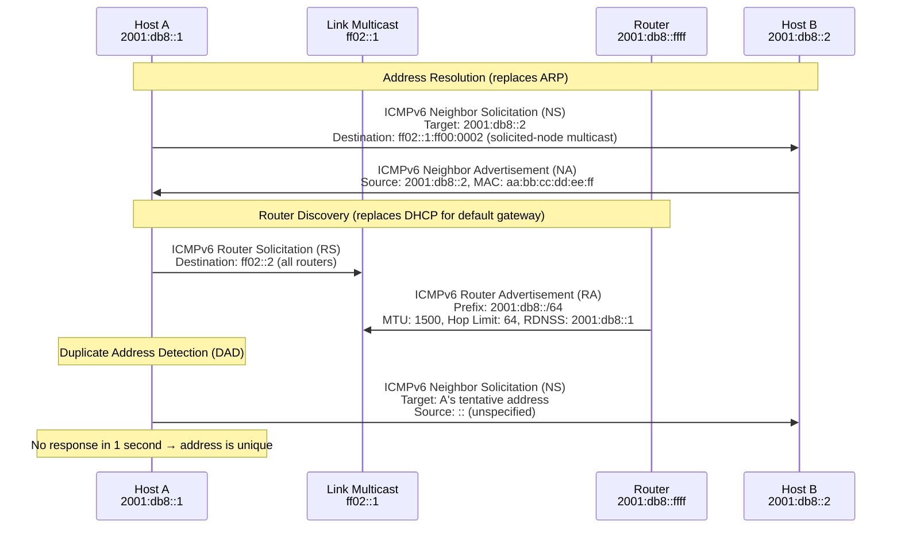
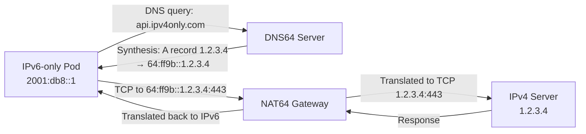
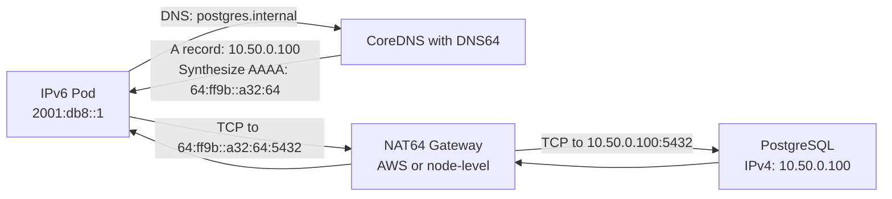

# IPv6 in Production

## Table of Contents

- [Overview](#overview)
- [Address Structure and Notation](#address-structure-and-notation)
  - [Format](#format)
  - [Prefix Notation](#prefix-notation)
- [Address Types](#address-types)
  - [Well-Known Multicast Addresses](#well-known-multicast-addresses)
- [NDP: Neighbor Discovery Protocol](#ndp-neighbor-discovery-protocol)
  - [NS/NA: Neighbor Solicitation / Advertisement](#nsna-neighbor-solicitation-advertisement)
  - [RS/RA: Router Solicitation / Advertisement](#rsra-router-solicitation-advertisement)
  - [DAD: Duplicate Address Detection](#dad-duplicate-address-detection)
- [SLAAC vs DHCPv6](#slaac-vs-dhcpv6)
  - [SLAAC: Stateless Address Autoconfiguration](#slaac-stateless-address-autoconfiguration)
  - [DHCPv6: Stateful Address Management](#dhcpv6-stateful-address-management)
- [Dual-Stack](#dual-stack)
  - [Happy Eyeballs (RFC 8305)](#happy-eyeballs-rfc-8305)
- [IPv6 in AWS](#ipv6-in-aws)
  - [Dual-Stack VPC Configuration](#dual-stack-vpc-configuration)
  - [EKS IPv6-Only Pods](#eks-ipv6-only-pods)
- [Transition Mechanisms](#transition-mechanisms)
  - [NAT64 + DNS64](#nat64-dns64)
  - [464XLAT (Mobile Networks)](#464xlat-mobile-networks)
  - [6in4 and 6rd Tunneling](#6in4-and-6rd-tunneling)
- [Security Considerations](#security-considerations)
  - [Neighbor Cache Exhaustion](#neighbor-cache-exhaustion)
  - [ICMPv6 Filtering Mistakes](#icmpv6-filtering-mistakes)
  - [Extension Header Abuse](#extension-header-abuse)
- [Common Mistakes](#common-mistakes)
- [Real-World Production Scenario](#real-world-production-scenario)
  - [IPv6-Only K8s Cluster Connecting to IPv4 Database](#ipv6-only-k8s-cluster-connecting-to-ipv4-database)
- [Performance Benchmarks](#performance-benchmarks)
- [Debugging Guide](#debugging-guide)
- [Interview Questions](#interview-questions)
  - [Advanced / Staff Level](#advanced-staff-level)
  - [Principal Level](#principal-level)

---

## Overview

IPv6 is no longer optional. AWS, GCP, and Azure all offer IPv6-only and dual-stack configurations. Apple mandated IPv6 compatibility for App Store submissions in 2016. Mobile networks globally default to IPv6 (T-Mobile USA runs 100% IPv6 natively). At the staff and principal level, IPv6 proficiency means understanding the failure modes that are invisible to engineers who have only worked in IPv4 environments: SLAAC breaking IP-based access control, neighbor cache exhaustion attacks unique to /64 subnets, ICMPv6 filtering mistakes that silently break path MTU discovery, and the Happy Eyeballs algorithm's implications for latency-sensitive applications. Engineers who can design a dual-stack production cluster and configure NAT64/DNS64 for an IPv6-only Kubernetes deployment are significantly more deployable.

---

## Address Structure and Notation

### Format

An IPv6 address is 128 bits, written as eight 16-bit groups in hexadecimal, separated by colons:

```
2001:0db8:85a3:0000:0000:8a2e:0370:7334
```

Compression rules:
1. **Leading zeros within a group** can be omitted: `0db8` → `db8`
2. **One sequence of consecutive all-zero groups** can be replaced with `::` (used at most once per address)

```
2001:0db8:0000:0000:0000:0000:0000:0001
→ 2001:db8::1   (most compact form)

fe80:0000:0000:0000:d40a:4ff:feb1:2b2c
→ fe80::d40a:4ff:feb1:2b2c
```

### Prefix Notation

Same CIDR notation as IPv4: `2001:db8::/32` means the first 32 bits are the prefix.

```
2001:db8::/32   — a /32 allocation (typical for a large org)
2001:db8:1::/48 — a /48 site allocation
2001:db8:1:1::/64 — a /64 subnet (the standard link subnet size)
```

The /64 boundary is significant: SLAAC and EUI-64 host address generation require exactly /64 subnets.

---

## Address Types

| Type | Prefix | Scope | Notes |
|------|--------|-------|-------|
| Global Unicast | `2000::/3` | Internet-routable | Equivalent to public IPv4 |
| Link-Local | `fe80::/10` | Single link only | Auto-configured on every interface; not routable beyond the link |
| Unique Local | `fc00::/7` (used: `fd00::/8`) | Organization-internal | Equivalent to RFC 1918; `fd` prefix is randomly assigned |
| Multicast | `ff00::/8` | Variable (scope field) | Replaces broadcast; many well-known groups |
| Loopback | `::1/128` | Host-local | Equivalent to 127.0.0.1 |
| Unspecified | `::/128` | N/A | Equivalent to 0.0.0.0; used before address assignment |

### Well-Known Multicast Addresses

| Address | Group |
|---------|-------|
| `ff02::1` | All nodes on the link |
| `ff02::2` | All routers on the link |
| `ff02::1:ff00:0/104` | Solicited-node multicast (used in NDP) |
| `ff05::1:3` | All DHCPv6 servers |

---

## NDP: Neighbor Discovery Protocol

NDP (RFC 4861) replaces ARP completely. It uses ICMPv6 messages for address resolution, router discovery, and duplicate address detection.



### NS/NA: Neighbor Solicitation / Advertisement

Used for address resolution (ARP equivalent). Unlike ARP (Layer 2 broadcast), NS is sent to a **solicited-node multicast** address derived from the target's last 24 bits: `ff02::1:ffXX:XXXX`. This ensures only hosts whose address ends in the same 24 bits receive the solicitation — dramatically less disruptive than broadcast in large subnets.

### RS/RA: Router Solicitation / Advertisement

Hosts send RS to `ff02::2` (all routers) on boot or link up. Routers respond with RA containing:
- Prefix(es) for SLAAC address generation
- MTU (replaces PMTUD for link MTU configuration)
- Default gateway (the router's link-local address)
- RDNSS option (DNS server address, RFC 8106)
- Managed/Other flags (whether to use DHCPv6)

### DAD: Duplicate Address Detection

Before using a newly configured address, a host sends a NS with the target set to the new address and source set to `::` (unspecified). If any host responds with a NA, the address is a duplicate and cannot be used. DAD is required for both SLAAC and manually configured addresses.

---

## SLAAC vs DHCPv6

### SLAAC: Stateless Address Autoconfiguration

SLAAC (RFC 4862) allows hosts to configure IPv6 addresses without a DHCP server:

1. Host receives a RA containing `2001:db8:1::/64` prefix
2. Host generates a 64-bit host portion (Interface ID):
   - **EUI-64**: derived from MAC address (e.g., MAC `aa:bb:cc:dd:ee:ff` → IID `a8:bb:cc:ff:fe:dd:ee:ff`), historically common but privacy-concerning
   - **Privacy Extensions (RFC 4941)**: random IID, rotated periodically — default on most modern OSes
3. Full address: `2001:db8:1::<random_64_bits>/64`
4. Run DAD to verify uniqueness

SLAAC inherently cannot provide DNS server addresses via the mechanism itself — the RA must include the **RDNSS option** (RFC 8106). Without RDNSS, hosts using SLAAC have no DNS configuration.

### DHCPv6: Stateful Address Management

DHCPv6 (RFC 8415) provides full stateful address management, DNS, domain search list, and other options. Modes:

- **Managed (M flag=1 in RA)**: Get address from DHCPv6 server
- **Other (O flag=1 in RA)**: Get address via SLAAC, but use DHCPv6 for other options (DNS, NTP)
- **RDNSS in RA (no DHCPv6 needed)**: Modern recommended approach — SLAAC for address, RA for DNS

```bash
# Check RA received and resulting address configuration
ip -6 addr show eth0
# inet6 2001:db8:1::a1b2:c3d4:e5f6:7890/64 scope global dynamic  <-- SLAAC (privacy ext)
# inet6 fe80::1/64 scope link  <-- link-local (always present)

# Check default gateway from RA
ip -6 route show
# default via fe80::1 dev eth0 proto ra metric 1024  <-- learned from RA

# Check DNS from RDNSS in RA (if configured)
resolvectl status
# DNS Servers: 2001:db8::53
```

---

## Dual-Stack

In dual-stack mode, every host has both an IPv4 address and an IPv6 address. DNS returns both A and AAAA records.

### Happy Eyeballs (RFC 8305)

When a client resolves a dual-stack host and gets both A and AAAA records, it uses the Happy Eyeballs algorithm to connect optimally:

```mermaid
flowchart TD
    A[DNS query for api.example.com] --> B[DNS returns AAAA: 2001:db8::1<br/>AND A: 203.0.113.1]
    B --> C[Attempt IPv6 connection<br/>to 2001:db8::1]
    C --> D{IPv6 succeeds<br/>within 250ms?}
    D -->|Yes| E[Use IPv6 connection<br/>Cancel IPv4 attempt]
    D -->|No — timeout or error| F[Start IPv4 connection<br/>to 203.0.113.1 in parallel]
    F --> G{Which connects first?}
    G -->|IPv4| H[Use IPv4 connection<br/>Cancel IPv6 attempt]
    G -->|IPv6 (late)| I[Use IPv6 connection<br/>Cancel IPv4 attempt]
```

**RFC 8305 specifics**:
- AAAA queries have a short head start (if returned first, try IPv6 immediately)
- If AAAA and A returned simultaneously, start IPv6 first
- After 250ms, if IPv6 hasn't connected, start IPv4 in parallel
- Use whichever connects first
- Client remembers which protocol succeeded and can prefer it for subsequent connections (Happy Eyeballs v2)

**Impact on latency-sensitive applications**: Happy Eyeballs adds up to 250ms to IPv4-only response times if the IPv6 attempt fails slowly (does not RST quickly). A firewall that silently drops IPv6 (rather than RST) causes the full 250ms timeout before IPv4 fallback. Always configure firewalls to RST or ICMP-unreachable on rejected IPv6 connections.

---

## IPv6 in AWS

### Dual-Stack VPC Configuration

```bash
# AWS CLI: create a dual-stack VPC
aws ec2 create-vpc \
  --cidr-block 10.0.0.0/16 \
  --amazon-provided-ipv6-cidr-block

# AWS assigns a /56 IPv6 prefix to the VPC (e.g., 2600:1f18:xxxx:xx00::/56)
# Each subnet gets a /64

# Create a dual-stack subnet
aws ec2 create-subnet \
  --vpc-id vpc-xxxx \
  --cidr-block 10.0.1.0/24 \
  --ipv6-cidr-block 2600:1f18:xxxx:xx01::/64

# Launch an EC2 instance with both IPv4 and IPv6
aws ec2 run-instances \
  --image-id ami-xxxx \
  --instance-type t3.medium \
  --ipv6-address-count 1
```

**AWS IPv6 architecture**:
- VPCs: `/56` prefix per VPC
- Subnets: `/64` per subnet (AWS assigns, not configurable size)
- Internet Gateway: handles both IPv4 and IPv6 routing
- Security Groups: separate rules for IPv4 (CIDR) and IPv6 (`::/0`)
- NAT Gateway: IPv4 only — use **Egress-Only Internet Gateway** for IPv6 outbound

### EKS IPv6-Only Pods

EKS supports IPv6-only pod networking where pods receive only IPv6 addresses. The VPC CNI plugin assigns a `/128` address from the subnet's `/64` to each pod:

```bash
# Enable IPv6 in EKS cluster
aws eks create-cluster \
  --name my-cluster \
  --kubernetes-network-config ipFamily=ipv6

# Verify pod addresses
kubectl get pods -o wide
# All pod IPs will be IPv6 addresses from the VPC subnet

# IPv4 connectivity via NAT64/DNS64 (see below)
```

---

## Transition Mechanisms

### NAT64 + DNS64

NAT64 allows IPv6-only clients to reach IPv4-only servers by translating IPv6 packets to IPv4 at a gateway.



**DNS64**: The DNS64 server intercepts AAAA queries. If the hostname has no AAAA record, DNS64 synthesizes an AAAA address by embedding the IPv4 address into a well-known prefix (`64:ff9b::/96`). The synthesized address `64:ff9b::1.2.3.4` is routed to the NAT64 gateway.

**NAT64**: The gateway maintains a translation table mapping (IPv6 source, IPv6 destination) → (IPv4 source from NAT pool, IPv4 destination). Stateful NAT64 is defined in RFC 6146.

```bash
# Configure DNS64 in CoreDNS (for IPv6-only K8s cluster)
# /etc/coredns/Corefile
.:53 {
    dns64 {
        prefix 64:ff9b::/96
        # When A record found but no AAAA, synthesize AAAA from A
    }
    forward . 8.8.8.8 8.8.4.4  # upstream resolvers
    cache 30
}

# Verify DNS64 is synthesizing records
dig AAAA ipv4only.arpa @<coredns-ip>
# Should return 64:ff9b::c000:0264 for 192.0.2.100
```

### 464XLAT (Mobile Networks)

464XLAT is used extensively in mobile networks where the PLMN (Public Land Mobile Network) is IPv6-only but customer devices need IPv4 for legacy apps. A CLAT (Customer-side translator) on the device converts IPv4 packets to IPv6, and a PLAT (Provider-side translator, which is a NAT64) converts back to IPv4 for IPv4-only destinations.

### 6in4 and 6rd Tunneling

Used for legacy IPv6 deployment when native IPv6 is unavailable. IPv6 packets are encapsulated in IPv4 for transport:

```bash
# 6in4 tunnel (manual)
ip tunnel add sit1 mode sit remote 192.0.2.1 local 203.0.113.1
ip link set sit1 up
ip -6 addr add 2001:db8::1/64 dev sit1
ip -6 route add ::/0 via ::192.0.2.1 dev sit1
```

**6rd (IPv6 Rapid Deployment)**: An ISP-managed form of 6in4 where the IPv6 prefix is algorithmically derived from the CPE's IPv4 address, allowing customer-premise equipment to automatically configure IPv6 tunnels.

---

## Security Considerations

### Neighbor Cache Exhaustion

IPv6 /64 subnets contain 2^64 addresses. An attacker can scan all addresses in a /64, causing routers to create neighbor cache entries for ~18 quintillion non-existent hosts. Each NS (Neighbor Solicitation) generates a cache entry in `INCOMPLETE` state while waiting for a response. This exhausts router memory.

**Mitigation**:
```bash
# Limit neighbor cache size on Linux (applies to both host and router roles)
sysctl -w net.ipv6.neigh.eth0.gc_thresh1=1024   # no GC below this
sysctl -w net.ipv6.neigh.eth0.gc_thresh2=2048   # GC when cache reaches this
sysctl -w net.ipv6.neigh.eth0.gc_thresh3=4096   # hard limit

# Rate-limit NS processing (for routers/gateways)
sysctl -w net.ipv6.neigh.eth0.unres_qlen=3  # max queued packets per unresolved neighbor

# Use /128 allocations for servers instead of /64 where possible
# This eliminates the large-scale scanning problem
```

### ICMPv6 Filtering Mistakes

ICMPv6 is **essential** for IPv6 operation — unlike ICMPv4, which can be largely blocked. Filtering the wrong ICMPv6 types breaks IPv6 silently:

| ICMPv6 Type | Do NOT Block | Reason |
|-------------|-------------|--------|
| Type 1 — Destination Unreachable | Never | Required for connection error handling |
| Type 2 — Packet Too Big | Never | Required for PMTUD — silently breaks large transfers |
| Type 133 — Router Solicitation | Allow outbound | Hosts need to discover routers |
| Type 134 — Router Advertisement | Allow inbound | Required for SLAAC and default gateway |
| Type 135 — Neighbor Solicitation | Allow both | Required for ARP equivalent |
| Type 136 — Neighbor Advertisement | Allow both | Required for ARP equivalent |

**Minimum ICMPv6 policy (RFC 4890)**:
```bash
# iptables (ip6tables) minimum required ICMPv6 rules
ip6tables -A INPUT -p icmpv6 --icmpv6-type destination-unreachable -j ACCEPT
ip6tables -A INPUT -p icmpv6 --icmpv6-type packet-too-big -j ACCEPT  # CRITICAL
ip6tables -A INPUT -p icmpv6 --icmpv6-type time-exceeded -j ACCEPT
ip6tables -A INPUT -p icmpv6 --icmpv6-type parameter-problem -j ACCEPT
ip6tables -A INPUT -p icmpv6 --icmpv6-type router-advertisement -j ACCEPT
ip6tables -A INPUT -p icmpv6 --icmpv6-type neighbor-solicitation -j ACCEPT
ip6tables -A INPUT -p icmpv6 --icmpv6-type neighbor-advertisement -j ACCEPT
# DO NOT add: ip6tables -A INPUT -p icmpv6 -j DROP
```

### Extension Header Abuse

IPv6 supports extension headers chained between the IPv6 header and the upper-layer protocol. Attackers abuse these:
- **Fragment header**: Send fragmented packets to evade firewalls (fragments may not contain TCP/UDP port information)
- **Routing header type 0 (RH0)**: Deprecated due to amplification attacks — allows source routing that bounces traffic between multiple nodes
- **Hop-by-hop options**: Processed by every router on the path — can cause CPU exhaustion

```bash
# Drop routing extension headers (especially deprecated RH0)
ip6tables -A INPUT -m ipv6header --header rh -j DROP

# Drop fragment headers with offset=0 (fragmented first packet — evades port-based rules)
ip6tables -A INPUT -m frag --fragfirst -j DROP
```

---

## Common Mistakes

**Assuming no NAT = no security boundary**: IPv6 end-to-end addressing means every pod, VM, and server has a globally routable address. Firewalls are not optional — they are more critical. The false sense of security from "we're behind NAT" does not apply to IPv6.

**Forgetting IPv6 firewall rules**: Adding an IPv4 rule (`iptables -A INPUT -p tcp --dport 22 -j ACCEPT`) without the IPv6 equivalent (`ip6tables -A INPUT -p tcp --dport 22 -j ACCEPT`) leaves SSH open or blocked asymmetrically. Always audit both rule sets together. Use `nftables` for unified IPv4/IPv6 management:

```bash
# nftables: single ruleset for both IPv4 and IPv6
nft add table inet filter
nft add chain inet filter input { type filter hook input priority 0 \; policy drop \; }
nft add rule inet filter input tcp dport 22 accept
# This single rule applies to both IPv4 and IPv6 (inet = both)
```

**SLAAC breaking IP-based access control**: If your access control is based on source IP address (API key authentication by IP, firewall rules by IP range), SLAAC with privacy extensions generates new source IPs periodically (every few hours to days). A rule allowing `2001:db8::1234:5678:abcd:ef01` will silently break when the client's privacy extension generates a new address. Use identity-based authentication (mTLS, JWT) rather than IP-based for IPv6 environments.

**Not advertising RDNSS in Router Advertisements**: Hosts using SLAAC will configure an IPv6 address but have no DNS resolver. Modern clients handle this via DHCPv6-PD or RDNSS-in-RA, but the RA must be configured:

```bash
# Linux radvd: advertise RDNSS in RA
# /etc/radvd.conf
interface eth0 {
    AdvSendAdvert on;
    prefix 2001:db8:1::/64 { AdvOnLink on; AdvAutonomous on; };
    RDNSS 2001:db8::53 { AdvRDNSSLifetime 3600; };
};
```

---

## Real-World Production Scenario

### IPv6-Only K8s Cluster Connecting to IPv4 Database

**Context**: An EKS cluster is configured with IPv6-only pods (all pod IPs are IPv6 addresses from the VPC). A legacy PostgreSQL database runs on an IPv4-only host (`10.50.0.100`). Pods cannot directly connect to IPv4 addresses.

**Solution**: NAT64/DNS64 in the cluster DNS + AWS NAT64 gateway.



**Step-by-step configuration**:

```bash
# Step 1: Verify the database's IPv4 address
# 10.50.0.100 converts to hex: 0x0a320064
# 64:ff9b:: + 0a32:0064 = 64:ff9b::a32:64

# Step 2: Configure CoreDNS with DNS64
kubectl edit configmap coredns -n kube-system
# Add dns64 plugin to Corefile:
# .:53 {
#     dns64 {
#         prefix 64:ff9b::/96
#     }
#     forward . /etc/resolv.conf
#     cache 30
#     loop
#     reload
# }

# Step 3: Configure NAT64 gateway
# Option A: Use AWS NAT64 (available in AWS-managed VPCs)
# Create a NAT64 gateway in a public subnet
# Add route: 64:ff9b::/96 → NAT64 gateway in all route tables

# Option B: Self-managed NAT64 using Tayga on a Linux node
# tayga.conf:
# tun-device nat64
# ipv4-addr 192.168.255.1
# prefix 64:ff9b::/96
# dynamic-pool 192.168.255.0/24

# Step 4: Test DNS64 synthesis
kubectl exec -it test-pod -- nslookup postgres.internal
# Should return IPv6 64:ff9b::a32:64 (synthesized from A record 10.50.0.100)

# Step 5: Test TCP connectivity
kubectl exec -it test-pod -- nc -z 64:ff9b::a32:64 5432
# Connection should succeed (translated through NAT64)

# Step 6: Configure the application database URL
# PostgreSQL connection string uses the synthesized IPv6 address:
# PGHOST=64:ff9b::a32:64
# OR: use the DNS name and let DNS64 resolve it automatically
# PGHOST=postgres.internal  (DNS64 returns the translated AAAA record)
```

**Production considerations**:
- NAT64 state table size: each active TCP connection uses one NAT entry. Size the NAT64 gateway for your peak connection count.
- Connection pooling: use PgBouncer between pods and the NAT64 gateway to reduce NAT table churn.
- Monitoring: NAT64 translation errors appear as TCP connection timeouts. Track NAT table utilization and NAT64 gateway CPU.
- Avoid 64:ff9b::/96 for private IPv4 ranges: some clients may not accept synthesized AAAA records for RFC 1918 addresses. Use a private NAT64 prefix (e.g., `fd00:64:ff9b::/96`) instead.

---

## Performance Benchmarks

| Metric | IPv4 | IPv6 | Notes |
|--------|------|------|-------|
| Header size | 20 bytes | 40 bytes | IPv6 header is larger but fixed (no checksum, no fragmentation at intermediate routers) |
| Routing table lookup | Slightly faster (smaller table) | Comparable (hardware assist) | Modern ASICs handle both at line rate |
| Connection setup (Happy Eyeballs) | Immediate | Up to 250ms delay | Only when IPv6 fails silently |
| NAT64 overhead | — | ~1-5% throughput | Per-packet header translation |
| DNS64 overhead | — | < 1ms | Synthesized responses are cached |
| NDP vs ARP | N/A | Comparable | NDP multicast vs ARP broadcast; NDP scales better on large subnets |

---

## Debugging Guide

```bash
# Check IPv6 addresses on an interface
ip -6 addr show eth0

# Check IPv6 routing table
ip -6 route show

# Check neighbor cache (equivalent of ARP cache)
ip -6 neigh show
# 2001:db8::2 dev eth0 lladdr aa:bb:cc:dd:ee:ff REACHABLE

# Check Router Advertisements being received
rdisc6 eth0  # show RA details
# Or: tcpdump -ni eth0 'icmp6 and (ip6[40] == 134)'  # type 134 = RA

# Trace IPv6 path
traceroute6 2001:4860:4860::8888  # Google's IPv6 DNS

# Test PMTUD (IPv6 has no DF bit — PMTUD uses ICMPv6 Packet Too Big)
ping6 -M do -s 1452 2001:db8::1  # 1452 + 40 (IPv6 header) = 1492 (typical for PPPoE)

# Check ICMPv6 statistics
nstat -z | grep Icmp6

# DNS64 testing: check for synthesized AAAA records
dig AAAA ipv4-only-host.internal @<coredns-ip>
# Should return 64:ff9b::... if DNS64 is configured

# IPv6 firewall rules
ip6tables -L -n -v

# Monitor NDP traffic (neighbor discovery)
tcpdump -ni eth0 icmp6

# Check if SLAAC privacy extensions are active
ip -6 addr show | grep "temporary"
# inet6 2001:db8::xxxx:xxxx:xxxx:xxxx/64 scope global temporary dynamic
# "temporary" = privacy extension address

# Verify DHCPv6 client status
systemctl status dhcpcd  # or dhcp6c, NetworkManager

# Check IPv6 forwarding (must be enabled for routers)
sysctl net.ipv6.conf.all.forwarding

# Inspect neighbor cache statistics (for exhaustion detection)
ip -6 neigh show | wc -l
cat /proc/sys/net/ipv6/neigh/eth0/gc_thresh3  # current hard limit
```

---

## Interview Questions

### Advanced / Staff Level

**Q1: Explain why IPv6 requires ICMPv6 Packet Too Big messages to never be filtered, and what breaks if they are blocked.**

IPv6 does not allow fragmentation at intermediate routers (only the source can fragment, and only with a Fragment extension header). Path MTU Discovery (PMTUD) is therefore mandatory for IPv6. The mechanism: when a router receives an IPv6 packet that exceeds its outgoing interface MTU, it drops the packet and sends an ICMPv6 Type 2 (Packet Too Big) message to the source, indicating the MTU that caused the drop. The source reduces its MSS and retransmits. If ICMPv6 Type 2 is blocked by a firewall, the source never learns the path MTU, continues sending large packets, they are silently dropped, and the connection appears to hang. This manifests as: small requests succeed (SYN/SYN-ACK/ACK are small), but bulk data transfers stall after the first full-size segment. The fix is to allow ICMPv6 Type 2 through all firewalls on the path. Alternatively, configure MSS clamping at network boundaries (but this only helps for TCP — other protocols like UDP-based QUIC still need PMTUD to work).

**Q2: What is the difference between EUI-64 and privacy extensions for SLAAC address generation, and what are the security implications of each?**

EUI-64 derives the 64-bit Interface Identifier from the hardware MAC address: the first 3 bytes of the MAC, the value `ff:fe`, and the last 3 bytes, with the Universal/Local bit flipped. This produces a stable, globally unique address that encodes the hardware manufacturer (via the OUI in the first 3 bytes). The security implication: EUI-64 enables **device tracking** across networks. If your laptop's MAC produces `2001:db8::a8bb:ccff:fedd:eeff` at work and `2002::/64::a8bb:ccff:fedd:eeff` at home, both addresses expose the same host identifier. Privacy extensions (RFC 4941) generate a random 64-bit Interface Identifier that rotates every few hours to days. The random address is unpredictable and does not encode the hardware. The operational implication: firewall rules or access control lists based on specific IPv6 addresses break when the privacy extension rotates the address. Use stable-privacy (RFC 7217 — hash-based, stable per network but different between networks) as a compromise for servers that need stable addresses with some privacy.

**Q3: How does Happy Eyeballs (RFC 8305) interact with a firewall that silently drops IPv6 traffic? What is the user-visible latency impact?**

When a dual-stack client resolves a hostname, it gets both AAAA and A records. Happy Eyeballs initiates an IPv6 TCP connection first. If the firewall silently drops IPv6 packets (SYN goes in, never comes out), the IPv6 connection attempt waits until its timeout — typically the connection timer expires after 250ms by Happy Eyeballs design, then the IPv4 attempt is initiated. The user sees: all connections to this destination take at least 250ms longer than they would if IPv6 were not attempted. This is invisible to the application but shows up as elevated p99 latency. Detection: the application itself may not report errors (Happy Eyeballs makes the fallback transparent), but monitoring will show that 100% of connections to that service use IPv4 despite the client supporting IPv6. Fix the firewall to send ICMPv6 Destination Unreachable (Type 1) instead of silently dropping — this lets Happy Eyeballs fail fast (< 1ms) instead of waiting 250ms.

### Principal Level

**Q4: Design the IPv6 address plan and transition strategy for a large organization running 10,000 containers across 200 Kubernetes nodes, with 500 external services that are IPv4-only, and a requirement that all new external endpoints be IPv6-capable within 6 months.**

**Address plan**:
- Request a `/44` allocation from your RIR (ARIN/RIPE) or ISP: `2001:db8::/44`
- DC subnets: `2001:db8:0000::/48` for DC1, `2001:db8:0100::/48` for DC2
- Kubernetes clusters: each cluster gets a `/52`, each node gets a `/56`, each pod gets a `/128` assigned from its node's `/56`
- Services (LoadBalancer IPs): `2001:db8:ff00::/64` for externally announced service VIPs
- Management: `2001:db8:fe00::/56` for infrastructure management IPs

**Transition for IPv4-only services (500 services)**:
- Phase 1 (month 1-2): Deploy NAT64+DNS64 in the Kubernetes cluster for pod-to-IPv4 connectivity. All 10,000 pods can immediately reach IPv4 services.
- Phase 2 (month 3-4): Add AAAA records for internal services one team at a time. Use dual-stack first (add AAAA while keeping A records). Update load balancer configs (AWS ALB, nginx) to bind to both IPv4 and IPv6.
- Phase 3 (month 5-6): For external endpoints, add AAAA to DNS, verify Happy Eyeballs works (use test clients from IPv6-only networks), then announce /32 service VIPs via BGP to upstream providers.

**Key risks**:
- IPv6 firewall rules: every IPv4 security group/NACL must have a corresponding IPv6 rule. Automate this via Terraform or CloudFormation with dual-stack security group resources.
- Certificate SANs: existing TLS certificates may not include IPv6 addresses (usually not needed since SNI is used for virtual hosting, but bare-IP connections need cert SANs updated).
- Monitoring coverage: ensure all monitoring agents, APM tools, and log shippers support IPv6 source/destination addresses in their data schemas.
- Load balancer health checks: ALBs, nginx upstreams, and custom health checkers must be configured to probe the IPv6 address, not just IPv4.

**Success metric**: After 6 months, `dig AAAA external-service.company.com` returns a valid AAAA record for all 500 services, and connection success rate via IPv6 is > 99.9%.
